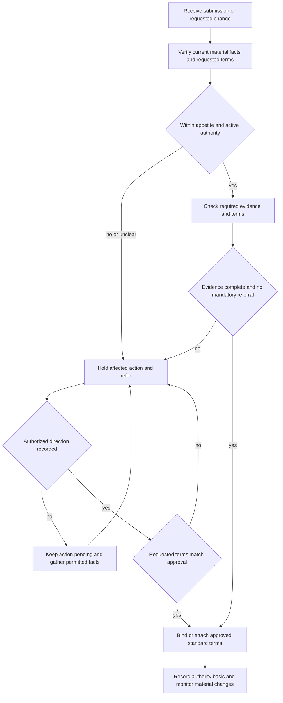

# Binding Authority and Exceptions

## Scope and governing boundary

This is **internal underwriting guidance** for binding, changing, or attaching terms. It answers whether the handler may act within active delegated authority, what evidence must support the action, when the action must stop for referral, and how an exception is recorded. It is not a policy contract, coverage grant, coverage limitation, or substitute for the underwriting manual, issued policy package, endorsement, state requirement, or law. [Binding Authority and Exceptions H.0.1–H.0.6](repo://guidelines/authority/binding-authority.md#L13-L25) [Manual Rules 100.A–100.E](repo://manuals/underwriting/manual.md#L13-L43)

**Authority cannot alter coverage.** Use the governing policy edition, Declarations, attached endorsements, applicable state form, and law to determine contractual rights, duties, limits, exclusions, and settlement. An internal approval, referral outcome, roof review, deductible instruction, or exception may constrain whether the carrier binds or attaches a term; it cannot create, remove, waive, expand, or reinterpret coverage. The HO-3 form makes coverage dependent on the policy terms and says coverage is determined from the facts, policy terms, and applicable law. [HO-3 2024-03 AGR.1–AGR.3 and AGR.9–AGR.12](repo://forms/HO/MS/HO-3/2024-03.md#L13-L37) [Guidance Versus Contract Language L.1.1–L.1.5 and L.2.7–L.2.12](repo://training/guidance-versus-contract.md#L13-L23) [repo://training/guidance-versus-contract.md#L73-L83)

Do not describe an internal threshold as a policy limit, an underwriting referral as an exclusion, an exception as an endorsement, or a binding decision as a promise of payment. If guidance and the contract appear to differ, use the contract for the coverage position and escalate the internal-control question through the appropriate underwriting process. [Manual Rule 100.D](repo://manuals/underwriting/manual.md#L33-L37)

## Authority decision flow

*This flow shows the internal underwriting authority lifecycle; it does not decide coverage, change a policy, or replace state-law review.*

The control is conservative: evaluate the risk as presented, obtain complete information, compare the exposure with active delegation, stop the affected action when authority or facts are unclear, obtain express direction, and act only within the recorded approval. A tentative indication may be withdrawn when later information changes the assessment. Missing information, silence, informal discussion, and incomplete responses are not approval. [Binding Authority and Exceptions H.0.3–H.0.5 and H.0.12–H.0.22](repo://guidelines/authority/binding-authority.md#L19-L57) [Manual Rules 300.X–300.Z](repo://manuals/underwriting/manual.md#L4131-L4147)

## Delegated ceilings and non-bypass rules

The guideline and Manual state separate Coverage A ceilings:

- A line underwriter may bind a requested limit **up to and including $800,000**.
- A senior underwriter may bind a requested limit **up to and including $1,500,000**.
- A request above the applicable delegation must be referred **before a binder is issued**. Record the requested limit, authority level, and disposition. These are authority ceilings, not an acceptance decision and not policy limits. [Binding Authority and Exceptions H.7.1–H.7.3 and H.7.15](repo://guidelines/authority/binding-authority.md#L599-L605) [repo://guidelines/authority/binding-authority.md#L627-L631) [Manual Rules 300.A–300.D](repo://manuals/underwriting/manual.md#L3991-L4015)

Apply the ceiling to the actual requested exposure. Do not divide Coverage A among related locations, schedules, or submissions; sequence or structure a transaction to bypass review; offset it with a reduction in another coverage; bind an unsupported estimate; or increase Coverage A after a binder without approval. Resolve conflicting amounts across the application, valuation, quote, and binder, and bind only the amount in the approved submission. [Binding Authority and Exceptions H.7.4–H.7.19](repo://guidelines/authority/binding-authority.md#L607-L637) [Manual Rules 100.F and 300.BC](repo://manuals/underwriting/manual.md#L45-L49) [repo://manuals/underwriting/manual.md#L4317-L4321)

A limit within a ceiling still requires active delegation and a match among the named insured, covered property, classification, valuation, conditions, and requested terms. Unusual complexity, incomplete property description, a material classification change, unusual valuation, or a concern outside standard practice can require referral even when the dollar amount is in range. [Binding Authority and Exceptions H.7.20–H.7.48](repo://guidelines/authority/binding-authority.md#L639-L695) [Manual Rules 300.C–300.D, 300.Q, and 300.W](repo://manuals/underwriting/manual.md#L4005-L4015) [repo://manuals/underwriting/manual.md#L4089-L4093) [repo://manuals/underwriting/manual.md#L4125-L4129)

## Evidence gates before binding or attachment

Treat the following as gates, not optional file decoration:

1. **Identity and interest:** confirm the legal named insured, insurable interest, ownership or tenancy, location, territory, occupancy, and use. Conflicting identity, ownership, location, or occupancy information requires resolution or referral. [Binding Authority and Exceptions H.1.1–H.1.10 and H.1.17–H.1.19](repo://guidelines/authority/binding-authority.md#L61-L97) [Manual Rules 300.E–300.K](repo://manuals/underwriting/manual.md#L4017-L4057)
2. **Current risk facts:** verify construction, property condition, protective features, prior losses, known incidents, valuation, requested coverage, deductible, premium, payment handling, material rating information, and required notices. Use current and reliable sources; do not assume a favorable condition that is not supported. [Binding Authority and Exceptions H.1.11–H.1.46](repo://guidelines/authority/binding-authority.md#L81-L151) [Manual Rules 300.F, 300.L–300.T, and 300.AC](repo://manuals/underwriting/manual.md#L4023-L4111) [repo://manuals/underwriting/manual.md#L4161-L4165)
3. **Authority and transaction controls:** confirm delegated authority is active, use approved carrier systems and access channels, confirm effective date and expiration, do not backdate, and do not bind while payment or premium handling is unresolved. [Manual Rules 300.AA–300.AG](repo://manuals/underwriting/manual.md#L4149-L4189)
4. **Attachment-specific evidence:** a material endorsement, altered exclusion or limitation, revised wording, manuscript term, or special condition is not routine discretion. Confirm eligibility, current facts, named insured, location, insured property, required information, and wording before attachment; do not use an endorsement to cure an ineligible risk. [Manual Rules 300.U–300.V](repo://manuals/underwriting/manual.md#L4113-L4123) [Manual Rules 400.A–400.G](repo://manuals/underwriting/manual.md#L5089-L5131)
5. **Evidence currency:** when an inspection supports an endorsement attachment, treat the report as valid for **6 months** and obtain current information when it is older; compare inspection observations with submitted facts and review photographs for relevance and clarity. [Manual Rules 400.AN–400.AP](repo://manuals/underwriting/manual.md#L5325-L5341)

Do not represent an endorsement as operative from a title, schedule, system availability, underwriting note, or conversation alone. The complete issued package and actual wording control the contract question; the manual controls whether the carrier may attach the form. [Attaching Endorsements Correctly L.2.1–L.2.11](repo://training/attaching-endorsements.md#L61-L103) [Manual Rules 400.A–400.G](repo://manuals/underwriting/manual.md#L5089-L5131)

## Guideline-specific referral gates

Refer before binding or changing terms when the risk is outside appetite, a material fact is incomplete or conflicting, a hazard is unsupported, a requested term is unavailable, or the condition exceeds the handler's delegation. Evaluate the risk as presented; do not assume later information will establish eligibility or turn a producer statement into approval. [Binding Authority and Exceptions H.0.4–H.0.5 and H.0.12–H.0.18](repo://guidelines/authority/binding-authority.md#L21-L49) [Binding Authority and Exceptions H.1.1–H.1.46](repo://guidelines/authority/binding-authority.md#L61-L151)

### Roof age and condition

Use clear exterior photographs when they show the covering, edges, penetrations, and drainage features. Refer when evidence is unavailable, unclear, obstructed, or inconsistent; materials are missing, lifted, curled, cracked, broken, displaced, incompatible, or improperly installed; damage is active, widespread, storm-related, or repeatedly patched; drainage or flashing is compromised; interior staining or moisture suggests unresolved leakage; or the roof line shows sagging, bowing, settlement, deformation, or deck movement. [Binding Authority and Exceptions H.2.1–H.2.30](repo://guidelines/authority/binding-authority.md#L155-L215)

A stated repair is not proof of a sound roof. Record the observed condition and obtain evidence of the scope, quality, and completion of professional corrective work. Refer conflicting application, photograph, inspection, repair, or loss-history information; a roof near the end of useful condition; a condition that may require a limitation or modified settlement treatment; or known active leakage without a confirmed authorized exception. [Binding Authority and Exceptions H.2.31–H.2.60](repo://guidelines/authority/binding-authority.md#L217-L275)

### Wind and hail

Obtain a wind mitigation inspection **before binding Coverage A above $1,000,000**. Review legibility, property identification, construction findings, and the match to the insured building. Refer conflicting inspection and application or photograph evidence, visible deterioration, unrepaired storm damage, unsecured exterior features, unidentified roof material or opening protection, unusual construction or occupancy, unusual wind-driven-rain exposure, or a request to remove wind or hail coverage. [Binding Authority and Exceptions H.3.1–H.3.8 and H.3.24–H.3.30](repo://guidelines/authority/binding-authority.md#L277-L293) [repo://guidelines/authority/binding-authority.md#L325-L337)

Use the applicable approved wind, hail, and named-storm deductible terms. Refer a request outside the approved deductible ceiling, document every deductible exception, and do not alter a deductible after binding without supporting documentation and approval. Do not apply a named-storm deductible merely because wind was reported in the area. Suspend binding while required wind information is outstanding; resume only after it is evaluated or an authorized exception is recorded. [Binding Authority and Exceptions H.3.9–H.3.23 and H.3.31–H.3.37](repo://guidelines/authority/binding-authority.md#L295-L323) [repo://guidelines/authority/binding-authority.md#L339-L351)

### Water backup

Treat water backup as a cause-specific underwriting and attachment question. Establish the drainage, sewer, and sump arrangement; distinguish backup through a drain, sewer, or sump from surface water, floodwater, rising groundwater, or water entering through an external opening; review prior intrusion, overflow, discharge, equipment condition, maintenance, and repairs; and obtain repair evidence when recurrence or an unresolved condition is indicated. Confirm that the applicable endorsement is actually attached before representing that endorsement-based coverage may apply. [Binding Authority and Exceptions H.4.1–H.4.18](repo://guidelines/authority/binding-authority.md#L353-L389) [Manual Rules 400.M–400.O](repo://manuals/underwriting/manual.md#L5163-L5179)

Do not characterize all lower-area water as backup, combine causes without identifying the damage attributable to each, or promise payment before cause, coverage, and damage are evaluated. Preserve point-of-entry information, affected areas, photographs, equipment and service records, invoices, repair proposals, and damaged-property descriptions when relevant. The HO-3 base form separately excludes flood or surface water and sewer, drain, or sump backup unless the applicable endorsement is attached; that is a contract boundary, not an underwriting limit. [Binding Authority and Exceptions H.4.19–H.4.38](repo://guidelines/authority/binding-authority.md#L391-L429) [HO-3 2024-03 X.7–X.10](repo://forms/HO/MS/HO-3/2024-03.md#L591-L601)

### Prior losses and changed information

Obtain complete prior-loss information before binding or changing coverage. Treat reported, paid, denied, open, disputed, unpaid, and known-circumstance matters as potentially relevant. Identify cause, affected property or operation, current status, repairs or remediation, recurrence concerns, and the source of material information that differs from the applicant's account. Refer unresolved hazards, repeated water or moisture loss, uncertain fire or combustion cause, recurring theft or malicious damage, liability allegations, structural or maintenance concerns, unexplained losses, suspected concealment or fraud, incomplete corrective action, or absent prevention measures. [Binding Authority and Exceptions H.5.1–H.5.24](repo://guidelines/authority/binding-authority.md#L431-L479)

Do not minimize, omit, or recategorize a loss to fit authority; treat lack of payment as irrelevant to whether the underlying condition may matter; bind while a required referral is pending; or issue, reinstate, or amend coverage to avoid a newly discovered loss referral. Re-elevate information received after an indication, quote, application, or binding when it materially changes the risk. [Binding Authority and Exceptions H.5.25–H.5.42](repo://guidelines/authority/binding-authority.md#L481-L515) [Manual Rules 300.BG–300.BI](repo://manuals/underwriting/manual.md#L4341-L4357)

## Manual referral, no-clearance, and appendix paths

The Personal Lines Underwriting Manual has controls related to, but distinct from, this guideline. Apply the source relevant to the decision and escalate an unresolved conflict; do not merge thresholds or outcomes.

- **Rule 310 — mandatory referral and hold:** refer a reported loss **at or above $100,000**, open or disputed claims, bodily-injury or property-damage allegations, litigation or demands, adverse prior underwriting action, inconsistent or unverifiable information, unusual ownership or use, vacancy, renovation, structural or roof damage, recurring water intrusion, unsafe systems, animals and recreational hazards, unusual vehicle or rental activity, fraud indicators, adverse inspection findings, unverified protections, unusual construction, and other material hazards listed in the rule. Hold the relevant binding, renewal, or issuance action pending disposition. [Manual Rules 310.A–310.P](repo://manuals/underwriting/manual.md#L4413-L4509) [repo://manuals/underwriting/manual.md#L4511-L4761)
- **Rule 320 — no-clearance outcome:** decline a known condition that materially increases expected loss and cannot be corrected before binding. Listed outcomes include unresolved structural, foundation, roof, water, plumbing, electrical, heating, fire, mold, premises, occupancy, ownership, prior-loss, information, environmental, access, protection, valuation, commercial-use, and professional-repair conditions. An unlisted condition that cannot be cleared before binding is referred under Rule 320.54; it is not silently accepted as a local exception. [Manual Rules 320.1–320.54](repo://manuals/underwriting/manual.md#L4763-L5087)
- **Rule 900 — separate appendix positions:** refer a reported loss **exceeding $25,000** to claims authority; route new business Coverage A **above $1,500,000** to senior underwriting; obtain **3 years** of loss history before eligibility; send roof age **at or beyond 25 years** to declination processing absent an authorized exception; and refer requested water backup **above $25,000**. The appendix also lists discrepancies, unrepaired damage, vacancy, business or rental activity, valuation conflict, deferred maintenance, structural indicators, unclear losses, unsupported protection, adverse inspection recommendations, requested exceptions, material post-bind changes, and files that do not support a clear eligibility decision. It is an appendix control and does not replace Rules 300–320. [Manual Rules 900.A–900.E](repo://manuals/underwriting/manual.md#L9865-L9895) [repo://manuals/underwriting/manual.md#L9897-L10093)

These positions have different owners and outcomes. Rule 900's reported-loss threshold is a claims-authority position, not a replacement for Rule 310's underwriting referral threshold. Rule 320's listed conditions are no-clearance declines, not ordinary referrals. Likewise, the Manual's numeric positions are not silently imported into the Binding Authority and Exceptions guideline. The guideline's water-backup and prior-loss sections specify cause, evidence, and unresolved-condition review rather than a numeric water-backup limit or claim-count threshold. [Binding Authority and Exceptions H.4.1–H.4.18](repo://guidelines/authority/binding-authority.md#L353-L389) [Binding Authority and Exceptions H.5.1–H.5.12](repo://guidelines/authority/binding-authority.md#L431-L455)

## Exceptions and approved direction

An exception is not a local workaround. The request must state the condition or proposed departure, risk concern, decision requested, and supporting evidence. Only the authorized reviewer may accept responsibility for an exception beyond the handler's authority. Communicate the direction in a verifiable way, record it before binding, apply it consistently to comparable risks, and bind only the approved amount, standard terms, conditions, property, insured, classification, and material facts. [Binding Authority and Exceptions H.0.12–H.0.22](repo://guidelines/authority/binding-authority.md#L37-L57) [Binding Authority and Exceptions H.7.26–H.7.32](repo://guidelines/authority/binding-authority.md#L649-L663) [Manual Rules 300.M–300.N and 300.X–300.Y](repo://manuals/underwriting/manual.md#L87-L97) [repo://manuals/underwriting/manual.md#L4131-L4141)

A pending referral is not approval. Silence, informal discussion, a producer assurance, or undocumented verbal direction cannot authorize a departure. If the requested terms or material facts change after approval, stop and obtain renewed direction. An exception for one risk is not authority for another risk. [Binding Authority and Exceptions H.7.18 and H.7.37–H.7.48](repo://guidelines/authority/binding-authority.md#L633-L695) [Manual Rules 300.X–300.Z and 300.BN](repo://manuals/underwriting/manual.md#L4131-L4147) [repo://manuals/underwriting/manual.md#L4383-L4387)

An exception may constrain whether the carrier binds or attaches a term; it cannot change issued policy wording. Do not remove a required underwriting condition, use manuscript wording, alter valuation or settlement wording, or make a retroactive attachment to avoid referral. [Binding Authority and Exceptions H.7.26–H.7.32](repo://guidelines/authority/binding-authority.md#L649-L663) [Manual Rules 100.D and 400.G](repo://manuals/underwriting/manual.md#L33-L37) [repo://manuals/underwriting/manual.md#L5121-L5131) [repo://manuals/underwriting/manual.md#L5253-L5257)

## Time controls and lifecycle

- Complete the authority and evidence review **before binding**; do not issue a binder while a required referral or material fact is unresolved. [Manual Rules 100.E and 300.BR](repo://manuals/underwriting/manual.md#L39-L43) [repo://manuals/underwriting/manual.md#L4407-L4411)
- Obtain the wind mitigation inspection **before binding Coverage A above $1,000,000**. [Binding Authority and Exceptions H.3.2](repo://guidelines/authority/binding-authority.md#L279-L283)
- Treat an inspection report used for endorsement attachment as current for **6 months** only; obtain an updated report after that period. [Manual Rule 400.AN](repo://manuals/underwriting/manual.md#L5325-L5329)
- **Suspend binding for storm-exposed risks when forecast landfall is within 48 hours.** Record the forecast and suspension; do not treat a later weather outcome as permission to bypass the hold. [Manual Rule 320.39](repo://manuals/underwriting/manual.md#L4993-L4997)
- Obtain **3 years of loss history** before completing the eligibility decision under Rule 900.C. This is a Manual evidence requirement, not a coverage period or a claim-count rule. [Manual Rule 900.C](repo://manuals/underwriting/manual.md#L9879-L9883)
- Match endorsement effective dates to the transaction and do not use an endorsement retroactively to address a known loss circumstance. [Manual Rule 400.AB](repo://manuals/underwriting/manual.md#L5253-L5257)
- Reassess authority when material information changes before issuance and route material post-bind changes through the underwriting process. [Manual Rules 300.BG–300.BI](repo://manuals/underwriting/manual.md#L4341-L4357) [Manual Rule 900.AK](repo://manuals/underwriting/manual.md#L10083-L10087)

## Exception, referral, and binding file controls

A usable account record must let another reviewer reconstruct the decision. Preserve the authority level and active status, requested Coverage A and valuation basis, material facts, evidence and sources reviewed, conditions, endorsement or requested change, referral reason and trigger, information supplied for review, approval or exception, authorized reviewer, exact approved terms, communications, follow-up, and final disposition. Rule 300 separately requires material facts, authority, and disposition; the guideline requires the authority basis, submission materials, referral or exception reason, and information supplied for review. [Binding Authority and Exceptions H.0.12–H.0.17](repo://guidelines/authority/binding-authority.md#L37-L47) [Binding Authority and Exceptions H.2.55–H.2.60](repo://guidelines/authority/binding-authority.md#L265-L275) [Binding Authority and Exceptions H.3.23 and H.3.35–H.3.37](repo://guidelines/authority/binding-authority.md#L321-L351) [Binding Authority and Exceptions H.5.13–H.5.17 and H.5.39–H.5.41](repo://guidelines/authority/binding-authority.md#L457-L465) [Manual Rules 300.BL–300.BR](repo://manuals/underwriting/manual.md#L4371-L4411)

Before confirming the action, check:

- **Ceiling bypass:** the exposure was split, sequenced, offset, or represented as bound before approval. Recombine the exposure, apply the actual requested Coverage A, and refer. [Binding Authority and Exceptions H.7.1–H.7.8](repo://guidelines/authority/binding-authority.md#L599-L615) [Manual Rules 100.F and 300.BC](repo://manuals/underwriting/manual.md#L45-L49) [repo://manuals/underwriting/manual.md#L4317-L4321)
- **Unsupported exception:** silence, informal conversation, producer assurance, or a missing file note is being treated as approval. Hold the action and obtain recorded authorized direction. [Binding Authority and Exceptions H.0.16–H.0.18](repo://guidelines/authority/binding-authority.md#L45-L49) [Manual Rules 300.X–300.Z](repo://manuals/underwriting/manual.md#L4131-L4147)
- **Stale or conflicting evidence:** valuation, roof, inspection, occupancy, loss, or requested terms no longer match the property or other records. Reassess and re-refer before binding. [Binding Authority and Exceptions H.1.17–H.1.18 and H.1.46](repo://guidelines/authority/binding-authority.md#L93-L95) [repo://guidelines/authority/binding-authority.md#L147-L151) [Manual Rules 300.BD–300.BG](repo://manuals/underwriting/manual.md#L4323-L4345)
- **Attachment workaround:** an endorsement or special wording is being used to cure an ineligible risk or avoid review. Stop, verify the risk and wording, and obtain the required authority. [Manual Rules 400.A–400.G](repo://manuals/underwriting/manual.md#L5089-L5131)
- **Contract substitution:** an internal ceiling, roof review, deductible instruction, referral, or exception is being described as a coverage limit, exclusion, settlement rule, or endorsement. Return to the issued policy package for the coverage analysis. [HO-3 2024-03 AGR.1–AGR.3 and AGR.9–AGR.12](repo://forms/HO/MS/HO-3/2024-03.md#L13-L37) [Manual Rule 100.D](repo://manuals/underwriting/manual.md#L33-L37)

## Related reading

- [Editions, Endorsements, and State Attachments](/openwiki/policy-assembly/editions-and-state-attachments.md) for the governing contract package and state attachments.
- [Underwriting Referral and Authority Guidance](/openwiki/underwriting/guidelines/referral-authority.md) for the broader referral lifecycle.
- [Manual Binding Authority, Referrals, and Unclearable Conditions](/openwiki/underwriting/manual/authority-referrals-and-clearance.md) for Rules 300, 310, 320, and 900.
- [Manual Eligibility by Product Line](/openwiki/underwriting/manual/eligibility-and-product-lines.md) for product eligibility before applying authority ceilings.
lings.
al-authority.md) for the broader referral lifecycle.
- [Manual Binding Authority, Referrals, and Unclearable Conditions](/openwiki/underwriting/manual/authority-referrals-and-clearance.md) for Rules 300, 310, 320, and 900.
- [Manual Eligibility by Product Line](/openwiki/underwriting/manual/eligibility-and-product-lines.md) for product eligibility before applying authority ceilings.
