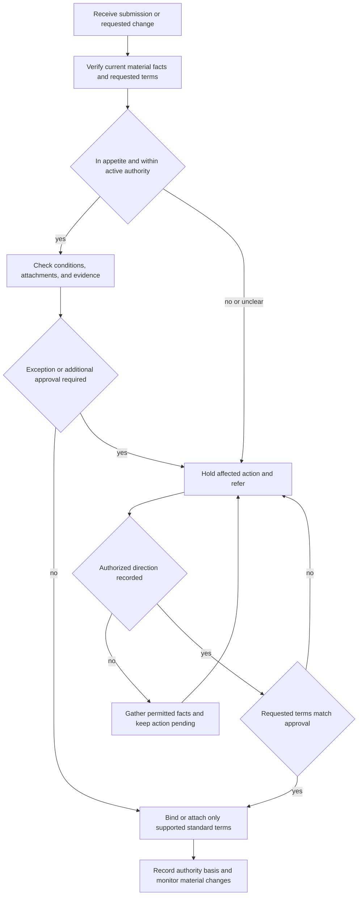

# Binding Authority and Exceptions

## Scope and governing boundary

This is **underwriting guidance** for internal binding and attachment decisions. It answers whether the handler may act within delegated authority, what information must support the action, when the action must stop for referral, and how an exception is recorded. It is not part of a policy contract, is not a coverage grant or limitation, and does not replace the applicable underwriting manual, issued policy package, endorsement, or law. [Binding Authority and Exceptions H.0.1–H.0.6](repo://guidelines/authority/binding-authority.md#L13-L25) [Manual Rules 100.A–100.E](repo://manuals/underwriting/manual.md#L13-L43)

**Authority cannot alter coverage.** Use the governing policy edition, Declarations, attached endorsements, applicable state form, and law to determine contractual rights, duties, limits, exclusions, and settlement. An internal approval, referral outcome, roof review, deductible instruction, or exception may constrain whether the carrier binds or attaches a term; it cannot expand, remove, or reinterpret coverage. The HO-3 form, for example, says coverage applies only as stated in the policy and that coverage is determined from the facts, policy terms, and applicable law. [HO-3 2024-03 AGR.1–AGR.3 and AGR.9–AGR.12](repo://forms/HO/MS/HO-3/2024-03.md#L13-L37) [Guidance Versus Contract Language L.1.1–L.1.5](repo://training/guidance-versus-contract.md#L13-L23)

Do not describe an internal threshold as a policy limit, an underwriting referral as an exclusion, an exception as a coverage endorsement, or a binding decision as a promise of payment. If guidance and the contract appear to differ, use the contract for the coverage position and escalate the internal-control question through the appropriate underwriting process. [Guidance Versus Contract Language L.2.7–L.2.12](repo://training/guidance-versus-contract.md#L73-L83) [Manual Rule 100.D](repo://manuals/underwriting/manual.md#L33-L37)

## Authority decision flow

*This flow shows the internal underwriting authority lifecycle; it does not decide coverage, change a policy, or replace state-law review.*

The control is deliberately conservative: evaluate the risk as presented, obtain complete information, compare the exposure with active delegation, stop the affected action when authority or facts are unclear, obtain express direction, and act only within the recorded approval. A tentative indication may be withdrawn when later information changes the assessment. Missing information, silence, informal discussion, and incomplete responses are not approval. [Binding Authority and Exceptions H.0.3–H.0.5 and H.0.12–H.0.22](repo://guidelines/authority/binding-authority.md#L19-L57) [Manual Rules 300.X–300.Z](repo://manuals/underwriting/manual.md#L4131-L4147)

## Delegated Coverage A authority

The guideline and Manual state these Coverage A ceilings:

- A line underwriter may bind a requested limit **up to and including $800,000**.
- A senior underwriter may bind a requested limit **up to and including $1,500,000**.
- A request above the applicable delegated authority must be referred **before a binder is issued**. Record the requested limit and the authority used. [Binding Authority and Exceptions H.7.1–H.7.3](repo://guidelines/authority/binding-authority.md#L599-L605) [Manual Rules 300.A–300.D](repo://manuals/underwriting/manual.md#L3991-L4015)

These are ceilings, not a complete acceptance decision. Do not divide the requested Coverage A among related locations, schedules, or submissions; offset it with a reduction in another coverage; bind an unsupported estimate; or increase Coverage A after a binder without appropriate approval. Resolve conflicting amounts across the application, valuation, quote, and binder, and bind only the amount in the approved submission. [Binding Authority and Exceptions H.7.4–H.7.19](repo://guidelines/authority/binding-authority.md#L607-L637)

A limit within the ceiling still requires the risk to be within active delegation and the named insured, covered property, classification, valuation, conditions, and terms to match the submission reviewed. Unusual complexity, incomplete property description, a material classification change, or a concern not addressed by standard practice can require referral even when the dollar amount is in range. [Binding Authority and Exceptions H.7.20–H.7.48](repo://guidelines/authority/binding-authority.md#L639-L695) [Manual Rules 300.C–300.D and 300.W](repo://manuals/underwriting/manual.md#L4005-L4015) [repo://manuals/underwriting/manual.md#L4125-L4129)

## Pre-bind and attachment controls

Before binding, confirm the effective date, identity, insurable interest, occupancy or use, location and territory, property condition, construction, protective features, prior losses, valuation, requested coverage, limits, deductible, premium, payment handling, required notices, expiration, and material rating information. Use current and reliable evidence, confirm delegated authority is active, and process the transaction through approved carrier systems and access channels. Do not backdate coverage or bind while material facts remain unresolved. [Manual Rules 300.E–300.T](repo://manuals/underwriting/manual.md#L4017-L4111) [Manual Rules 300.AA–300.AG](repo://manuals/underwriting/manual.md#L4149-L4189)

A material endorsement, altered exclusion or limitation, revised wording, manuscript term, or special condition is not routine binding discretion. Refer it for the required authority. Attach an endorsement only when the risk facts support it, the risk is eligible, the endorsement matches the named insured, location, and insured property, the request reflects the current condition, required information is available, and the wording matches the intended coverage. Do not use an endorsement to cure an ineligible risk. [Manual Rules 300.U–300.V](repo://manuals/underwriting/manual.md#L4113-L4123) [Manual Rule 400.A–400.G](repo://manuals/underwriting/manual.md#L5089-L5131)

For water-related or weather-related attachments, review the relevant water sources, drainage, plumbing, roof condition, and protection features before attachment. Repeated drainage concerns, active leakage, unresolved roof deterioration, incomplete or conflicting evidence, or a request outside normal practice requires referral rather than a workaround. [Manual Rules 400.K–400.P](repo://manuals/underwriting/manual.md#L5151-L5185)

## Referral triggers in the Binding Authority and Exceptions guideline

Refer before binding when a material deviation from appetite, material hazard, incomplete or conflicting fact, unsupported term, or condition beyond the handler's delegation prevents a reliable decision. Evaluate the risk as presented; do not assume missing information will later establish eligibility, remove a required condition to stay within a ceiling, or turn a producer statement into approval. [Binding Authority and Exceptions H.0.4–H.0.5 and H.0.12–H.0.18](repo://guidelines/authority/binding-authority.md#L21-L49) [Binding Authority and Exceptions H.1.1–H.1.46](repo://guidelines/authority/binding-authority.md#L61-L151)

### Roof age and condition

The guideline requires a roof review as part of the overall authority decision, not as a contract settlement rule. Use clear exterior photographs when they show the covering, edges, penetrations, and drainage features. Refer when evidence is unavailable, unclear, obstructed, or inconsistent; materials are missing, lifted, curled, cracked, broken, displaced, incompatible, or improperly installed; damage is active, widespread, storm-related, or repeatedly patched; drainage or flashing is compromised; interior staining or moisture suggests unresolved leakage; or the roof line shows sagging, bowing, settlement, deformation, or deck movement. [Binding Authority and Exceptions H.2.1–H.2.30](repo://guidelines/authority/binding-authority.md#L155-L215)

A stated repair is not proof of a sound roof. Record the observed condition and obtain evidence of the scope, quality, and completion of professional corrective work. Refer conflicting application, photograph, inspection, repair, or loss-history information; a roof near the end of useful condition; a condition that may require a limitation or modified settlement treatment; or known active leakage without a confirmed authorized exception. [Binding Authority and Exceptions H.2.31–H.2.60](repo://guidelines/authority/binding-authority.md#L217-L275)

### Wind and hail

Obtain a wind mitigation inspection **before binding Coverage A above $1,000,000**. Review its legibility, property identification, construction findings, and match to the insured location and building. Refer conflicting inspection and application or photograph evidence, visible roof deterioration, unrepaired storm damage, unsecured exterior features, unidentified roof material or opening protection, unusual construction or occupancy, unusual wind-driven-rain exposure, or a request to remove wind or hail coverage. [Binding Authority and Exceptions H.3.1–H.3.8 and H.3.24–H.3.30](repo://guidelines/authority/binding-authority.md#L277-L293) [repo://guidelines/authority/binding-authority.md#L325-L337)

Use the applicable approved wind, hail, and named-storm deductible terms. Refer a request outside the approved deductible ceiling, document every deductible exception, and do not alter a deductible after binding without supporting documentation and required approval. Do not apply a named-storm deductible merely because wind was reported in the area. Suspend binding while required wind information is outstanding; resume only after the information is evaluated or an authorized exception is recorded. [Binding Authority and Exceptions H.3.9–H.3.23 and H.3.31–H.3.37](repo://guidelines/authority/binding-authority.md#L295-L323) [repo://guidelines/authority/binding-authority.md#L339-L351)

### Water backup

Treat water backup as a cause-specific underwriting and attachment question. Establish the drainage, sewer, and sump arrangement; distinguish backup through a drain, sewer, or sump from surface water, floodwater, rising groundwater, or water entering through an external opening; review prior intrusion, overflow, discharge, equipment condition, maintenance, and repairs; and obtain additional information or repair evidence when recurrence or an unresolved condition is indicated. Confirm that the applicable endorsement is actually attached before representing that endorsement-based coverage may apply. [Binding Authority and Exceptions H.4.1–H.4.18](repo://guidelines/authority/binding-authority.md#L353-L389) [Manual Rule 400.M–400.O](repo://manuals/underwriting/manual.md#L5163-L5179)

Do not characterize all lower-area water as backup, combine causes without identifying the damage attributable to each, or promise payment before cause, coverage, and damage are evaluated. Preserve point-of-entry information, affected areas, photographs, equipment and service records, invoices, repair proposals, and damaged-property descriptions when relevant. These controls do not create, remove, or broaden water coverage. [Binding Authority and Exceptions H.4.19–H.4.38](repo://guidelines/authority/binding-authority.md#L391-L429) [HO-3 2024-03 X.7–X.10](repo://forms/HO/MS/HO-3/2024-03.md#L681-L691)

### Prior losses and changed information

Obtain complete prior-loss information before binding or changing coverage. Treat reported, paid, denied, open, disputed, unpaid, and known-circumstance matters as potentially relevant. Identify the cause, affected property or operation, current status, repairs or remediation, recurrence concerns, and source of material information that differs from the applicant's account. Refer unresolved hazards, repeated water or moisture loss, uncertain fire or combustion cause, recurring theft or malicious damage, liability allegations, structural or maintenance concerns, unexplained losses, suspected concealment or fraud, incomplete corrective action, or absent or insufficient prevention measures. [Binding Authority and Exceptions H.5.1–H.5.24](repo://guidelines/authority/binding-authority.md#L431-L479)

Do not minimize, omit, or recategorize a loss to fit authority; treat lack of payment as irrelevant to whether the underlying condition may matter; bind while a required referral is pending; or issue, reinstate, or amend coverage to avoid a newly discovered loss referral. Re-elevate information received after an indication, quote, application, or binding when it materially changes the risk. [Binding Authority and Exceptions H.5.25–H.5.42](repo://guidelines/authority/binding-authority.md#L481-L515)

## Exceptions and approved direction

An exception is not a local workaround. The request must state the condition or proposed departure, risk concern, decision requested, and supporting evidence. Only the authorized reviewer may accept responsibility for an exception beyond the handler's authority. Communicate the direction in a verifiable way, record it before binding, apply it consistently to comparable risks, and bind only the approved amount, standard terms, conditions, property, insured, classification, and material facts. [Binding Authority and Exceptions H.0.12–H.0.22](repo://guidelines/authority/binding-authority.md#L37-L57) [Binding Authority and Exceptions H.7.26–H.7.32](repo://guidelines/authority/binding-authority.md#L649-L663)

A pending referral is not approval. Silence, informal discussion, a producer assurance, or undocumented verbal direction cannot authorize a departure. If the requested terms or material facts change after approval, stop and obtain renewed direction. An exception for one risk is not authority for another risk. [Binding Authority and Exceptions H.7.18 and H.7.37–H.7.48](repo://guidelines/authority/binding-authority.md#L633-L695) [Manual Rules 300.X–300.Y and 300.BN](repo://manuals/underwriting/manual.md#L4131-L4141) [repo://manuals/underwriting/manual.md#L4383-L4387)

An exception may constrain whether the carrier binds or attaches a term; it cannot change the issued policy wording. Do not remove a required underwriting condition, use manuscript wording, or alter valuation or settlement wording to avoid referral. [Binding Authority and Exceptions H.7.26–H.7.32](repo://guidelines/authority/binding-authority.md#L649-L663) [Manual Rules 100.D and 400.G](repo://manuals/underwriting/manual.md#L33-L37) [repo://manuals/underwriting/manual.md#L5121-L5131)

## Separate Manual referral and no-clearance paths

The Personal Lines Underwriting Manual has controls related to, but distinct from, this guideline. Apply the source relevant to the decision and escalate an unresolved conflict; do not merge thresholds or outcomes:

- **Rule 310 — mandatory referral:** among its listed triggers, it requires referral and a hold for a reported loss **at or above $100,000**, open or disputed claims, liability allegations, litigation or demands, adverse prior underwriting action, inconsistent or unverifiable information, unusual ownership, business or commercial activity, vacancy or unoccupancy, renovation, structural or roof damage, recurring water intrusion, unsafe systems, animals and recreational hazards, unusual vehicle or rental activity, fraud indicators, adverse inspection findings, unverified protections, unusual construction, and other material hazards. [Manual Rules 310.A–310.P](repo://manuals/underwriting/manual.md#L4413-L4509) [repo://manuals/underwriting/manual.md#L4511-L4761)
- **Rule 320 — conditions that cannot be cleared:** decline a known condition that materially increases expected loss and cannot be corrected before binding. Listed outcomes include unresolved structural, foundation, roof, water, plumbing, electrical, heating, fire, mold, premises, occupancy, ownership, prior-loss, information, environmental, access, protection, valuation, commercial-use, and professional-repair conditions. An unlisted condition that cannot be cleared before binding is referred under Rule 320.54. [Manual Rules 320.1–320.54](repo://manuals/underwriting/manual.md#L4763-L5087)
- **Rule 900 — appendix positions:** its separate operational positions include referral of a reported loss **exceeding $25,000** to claims authority, new business Coverage A **above $1,500,000** to senior underwriting, **3 years** of loss history before eligibility, roof age **at or beyond 25 years** for declination processing, and requested water backup **above $25,000**. It also lists nonnumeric triggers such as material discrepancies, unrepaired damage, vacancy, business or rental activity, valuation conflict, deferred maintenance, structural indicators, unclear losses, unsupported protection, adverse inspection recommendations, requested exceptions, material post-bind changes, and files that do not support a clear eligibility decision. [Manual Rule 900.A–900.E](repo://manuals/underwriting/manual.md#L9865-L9895) [repo://manuals/underwriting/manual.md#L9897-L10093)

The Rule 900 reported-loss threshold is a claims-authority position, not a replacement for Rule 310's underwriting referral threshold. Likewise, the Manual's numeric positions are not silently imported into the Binding Authority and Exceptions guideline. The binding guideline's water-backup and prior-loss sections specify cause, evidence, and unresolved-condition review rather than a numeric water-backup limit or claim-count threshold. [Binding Authority and Exceptions H.4.1–H.4.18](repo://guidelines/authority/binding-authority.md#L353-L389) [Binding Authority and Exceptions H.5.1–H.5.12](repo://guidelines/authority/binding-authority.md#L431-L455)

The separate referral matrix has its own positions, including water-backup requests above **$25,000** and **2 paid property claims** in the preceding **3 years**. Preserve those as Matrix positions; do not present them as thresholds from this guideline. [Underwriting Referral and Authority Matrix H.4.1–H.4.4](repo://guidelines/authority/referral-matrix.md#L395-L409) [Matrix H.5.1–H.5.8](repo://guidelines/authority/referral-matrix.md#L499-L515)

## File controls and final checks

A usable account record must let another reviewer reconstruct the decision. Preserve the authority level and active status, requested Coverage A and valuation basis, material facts, evidence and sources reviewed, conditions, endorsement or requested change, referral reason, information supplied for review, approval or exception, authorized reviewer, exact approved terms, communications, follow-up, and final disposition. The guideline requires the authority basis, submission materials, referral or exception reason, and information supplied for review to be documented; Manual Rule 300 requires the binding record to include material facts, authority, and disposition. [Binding Authority and Exceptions H.0.12–H.0.17](repo://guidelines/authority/binding-authority.md#L37-L47) [Binding Authority and Exceptions H.2.55–H.2.60](repo://guidelines/authority/binding-authority.md#L265-L275) [Binding Authority and Exceptions H.3.23 and H.3.35–H.3.37](repo://guidelines/authority/binding-authority.md#L321-L351) [Binding Authority and Exceptions H.5.13–H.5.17 and H.5.39–H.5.41](repo://guidelines/authority/binding-authority.md#L457-L465) [Manual Rules 300.BL–300.BR](repo://manuals/underwriting/manual.md#L4371-L4411)

Before confirming the action, check:

- **Ceiling bypass:** the exposure was split, sequenced, offset, or represented as bound before approval. Recombine the exposure, apply the actual requested Coverage A, and refer. [Binding Authority and Exceptions H.7.1–H.7.8](repo://guidelines/authority/binding-authority.md#L599-L615) [Manual Rules 100.C and 100.F](repo://manuals/underwriting/manual.md#L27-L49)
- **Unsupported exception:** silence, informal conversation, producer assurance, or a missing file note is being treated as approval. Hold the action and obtain recorded authorized direction. [Binding Authority and Exceptions H.0.16–H.0.18](repo://guidelines/authority/binding-authority.md#L45-L49) [Manual Rules 300.X–300.Z](repo://manuals/underwriting/manual.md#L4131-L4147)
- **Stale or conflicting evidence:** valuation, roof, inspection, occupancy, loss, or requested terms no longer match the property or other records. Reassess and re-refer before binding. [Binding Authority and Exceptions H.1.17–H.1.18 and H.1.46](repo://guidelines/authority/binding-authority.md#L93-L95) [repo://guidelines/authority/binding-authority.md#L147-L151) [Manual Rules 300.BD–300.BG](repo://manuals/underwriting/manual.md#L4323-L4345)
- **Attachment workaround:** an endorsement or special wording is being used to cure an ineligible risk or avoid review. Stop, verify the risk and wording, and obtain the required authority. [Manual Rules 400.A–400.G](repo://manuals/underwriting/manual.md#L5089-L5131)
- **Contract substitution:** an internal ceiling, roof review, deductible instruction, referral, or exception is being described as a coverage limit, exclusion, settlement rule, or endorsement. Return to the issued policy package for the coverage analysis. [HO-3 2024-03 AGR.1–AGR.3 and AGR.9–AGR.12](repo://forms/HO/MS/HO-3/2024-03.md#L13-L37) [Manual Rule 100.D](repo://manuals/underwriting/manual.md#L33-L37)

## Related reading

- [Editions, Endorsements, and State Attachments](/openwiki/policy-assembly/editions-and-state-attachments.md) for the governing contract package and state attachments.
- [Underwriting Referral and Authority Guidance](/openwiki/underwriting/guidelines/referral-authority.md) for the broader referral lifecycle.
- [Manual Binding Authority, Referrals, and Unclearable Conditions](/openwiki/underwriting/manual/authority-referrals-and-clearance.md) for Rules 300, 310, 320, and 900.
- [Manual Eligibility by Product Line](/openwiki/underwriting/manual/eligibility-and-product-lines.md) for product eligibility before applying authority ceilings.
