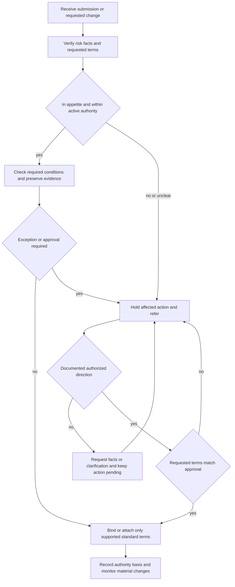

# Binding Authority Guidance

## Scope and governing boundary

This page summarizes **Binding Authority and Exceptions**, a separate internal underwriting guideline. It governs internal authority for binding and attachment decisions: it constrains when a handler may bind, attach, change, or confirm terms and when a matter must be referred. It does **not** establish eligibility by itself, decide contract coverage, modify the policy contract, or replace state law. The guideline is not part of any policy contract, and policy obligations arise from the applicable policy language. [Binding Authority and Exceptions H.0.1–H.0.6](repo://guidelines/authority/binding-authority.md#L13-L25)

Use the applicable form, declarations, attached endorsements, state amendatory forms, and law for the contractual position. For example, HO-3 2024-03 limits theft loss of jewelry, watches, and precious stones to **$2,000** under Coverage C, excludes sewer, drain, and sump backup unless the relevant endorsement is attached, and sets the Section I deductible minimum at **$1,000**. Those are contract provisions; this guideline only constrains whether the risk may be bound or an attachment may be made and how the authority decision is recorded. [HO-3 2024-03 C.9–C.12](repo://forms/HO/MS/HO-3/2024-03.md#L236-L245) [HO-3 2024-03 X.7–X.10](repo://forms/HO/MS/HO-3/2024-03.md#L681-L691) [HO-3 2024-03 S.29–S.34](repo://forms/HO/MS/HO-3/2024-03.md#L859-L867) [Binding Authority and Exceptions H.0.6 and H.0.47](repo://guidelines/authority/binding-authority.md#L23-L25) [repo://guidelines/authority/binding-authority.md#L149-L153)

This is therefore an **internal control**, not a contract modification. Do not describe an approval, exception, referral, or binding condition as expanding or restricting coverage. The HO-3 roof settlement provision, for example, remains a policy term; an underwriting review of roof age or condition does not rewrite that settlement rule. [HO-3 2024-03 A.19–A.22](repo://forms/HO/MS/HO-3/2024-03.md#L135-L143) [Binding Authority and Exceptions H.0.20–H.0.22](repo://guidelines/authority/binding-authority.md#L53-L57)

## Control flow

*This flow shows the internal authority lifecycle; it does not determine coverage, eligibility by itself, or state-law compliance.* [Binding Authority and Exceptions H.0.3–H.0.6 and H.0.12–H.0.22](repo://guidelines/authority/binding-authority.md#L19-L57)

The lifecycle is deliberately conservative: obtain complete information, compare the requested exposure with active delegation, stop the affected action when authority or facts are unclear, obtain express direction, and bind only what was approved. A tentative indication can be withdrawn when later information changes the assessment; silence, informal discussion, or an incomplete response is not approval. [Binding Authority and Exceptions H.0.5, H.0.14–H.0.18, H.0.21–H.0.22](repo://guidelines/authority/binding-authority.md#L23-L25) [repo://guidelines/authority/binding-authority.md#L41-L57)

## Delegated ceilings and required approvals

### Coverage A ceilings

- A line underwriter may bind **Coverage A up to and including $800,000**.
- A senior underwriter may bind **Coverage A up to and including $1,500,000**.
- A request above the handler's delegated limit must be referred **before a binder is issued**. The actual requested exposure controls; do not divide the limit across related locations, schedules, or submissions, and do not use a reduction in another coverage to justify exceeding Coverage A authority. [Binding Authority and Exceptions H.7.1–H.7.8](repo://guidelines/authority/binding-authority.md#L599-L615)

The limit must be coherent and supported. Refer an unclear or conflicting Coverage A amount, do not bind an unsupported estimate, reconcile the application, valuation, quote, and binder, and obtain approval before increasing Coverage A after a binder has been issued. [Binding Authority and Exceptions H.7.5–H.7.13 and H.7.19–H.7.25](repo://guidelines/authority/binding-authority.md#L609-L649)

The ceiling is not the whole authority test. The risk must also be within the underwriter's active delegation, and the named insured, covered property, classification, valuation, conditions, and terms must match the submission reviewed. An apparently in-limit amount does not authorize an unusual or unresolved exposure. [Binding Authority and Exceptions H.1.1–H.1.6 and H.1.21–H.1.28](repo://guidelines/authority/binding-authority.md#L61-L115) [Binding Authority and Exceptions H.7.20–H.7.26 and H.7.37–H.7.40](repo://guidelines/authority/binding-authority.md#L637-L679)

### Terms and system controls

Before binding, confirm the effective date, identity, insurable interest, territory, occupancy or use, physical condition, protective features, prior losses, limits, deductible, premium basis, payment handling, required notices, and available endorsements. Use approved carrier systems and access channels, confirm that delegated authority is active, and do not backdate coverage or rely on verbal authority without a clear record. [Binding Authority and Exceptions H.1.2–H.1.5, H.1.9–H.1.17, H.1.19–H.1.22, H.1.24–H.1.34](repo://guidelines/authority/binding-authority.md#L63-L127) [Binding Authority and Exceptions H.1.44–H.1.46](repo://guidelines/authority/binding-authority.md#L147-L151) [Personal Lines Underwriting Manual Rule 300.E–300.G and 300.X–300.AD](repo://manuals/underwriting/manual.md#L4017-L4045) [repo://manuals/underwriting/manual.md#L4131-L4171)

A material endorsement, altered exclusion or limitation, required wording change, manuscript term, or special condition is not routine binding discretion. Refer it for the required authority; attach only an approved endorsement that matches the disclosed exposure and the named insured and property. This internal control constrains attachment and does not modify the contract language itself. [Binding Authority and Exceptions H.1.23–H.1.26](repo://guidelines/authority/binding-authority.md#L105-L111) [Binding Authority and Exceptions H.7.27–H.7.32](repo://guidelines/authority/binding-authority.md#L651-L663) [Personal Lines Underwriting Manual Rule 300.U–300.V](repo://manuals/underwriting/manual.md#L4113-L4123)

## Referral triggers and evidence

### General trigger

Refer before binding when a material deviation from appetite, a material hazard, an incomplete or conflicting fact, or a condition requiring authority beyond the handler's delegation prevents a reliable decision. Do not assume that missing information will later confirm eligibility, remove a required condition to stay within a ceiling, or rely on a producer statement as approval. [Binding Authority and Exceptions H.0.4–H.0.5 and H.0.12–H.0.16](repo://guidelines/authority/binding-authority.md#L21-L45) [Binding Authority and Exceptions H.1.17, H.1.35–H.1.36, and H.1.44](repo://guidelines/authority/binding-authority.md#L93-L97) [repo://guidelines/authority/binding-authority.md#L129-L147)

The risk must be evaluated as presented. Core evidence includes the legal name and insured interest, location and territory, operations or occupancy, construction and condition, protective features and utilities, prior losses and known circumstances, valuation, requested limits and deductible, premium and payment basis, producer and jurisdiction authority, required notices, and any inspection or repair evidence. [Binding Authority and Exceptions H.1.1–H.1.22 and H.1.27–H.1.43](repo://guidelines/authority/binding-authority.md#L61-L145)

### Roof age and condition

The guideline requires a roof review as part of overall eligibility and authority, but it does not create a contract settlement rule. Use clear exterior photographs when they show the covering, edges, penetrations, and drainage features. Refer when photographs are unavailable, unclear, obstructed, or inconsistent; materials are missing, lifted, curled, cracked, broken, displaced, incompatible, or improperly installed; damage is active, widespread, storm-related, or repeatedly patched; drainage or flashing is compromised; interior staining or moisture suggests unresolved leakage; or the roof line shows sagging, bowing, settlement, deformation, or deck movement. [Binding Authority and Exceptions H.2.1–H.2.17](repo://guidelines/authority/binding-authority.md#L155-L189) [repo://guidelines/authority/binding-authority.md#L191-L213)

A stated repair is not proof of a sound roof. Record the observed condition and obtain evidence of the scope, quality, and completion of professional corrective work. Refer when material roof information conflicts across the application, photographs, inspection, repairs, or loss history; when the roof is near the end of useful condition; or when the facts may require a limitation, modified settlement treatment, or exception. Do not bind known active leakage without a confirmed authorized exception. [Binding Authority and Exceptions H.2.31–H.2.40 and H.2.43–H.2.48](repo://guidelines/authority/binding-authority.md#L217-L251) [Binding Authority and Exceptions H.2.52–H.2.60](repo://guidelines/authority/binding-authority.md#L259-L275)

### Wind and hail

Obtain a wind mitigation inspection **before binding Coverage A above $1,000,000**. Review legibility, property identification, construction findings, and whether the inspection matches the insured location and building. Refer conflicting inspection and application or photograph evidence, visible roof deterioration, unrepaired storm damage, unsecured exterior features, unidentifiable roof material or opening protection, unusual construction or occupancy, unusual wind-driven-rain exposure, or a request to remove wind or hail coverage. [Binding Authority and Exceptions H.3.1–H.3.8](repo://guidelines/authority/binding-authority.md#L277-L293) [repo://guidelines/authority/binding-authority.md#L325-L347)

Use the approved wind or named-storm deductible terms; refer a deductible request outside the approved ceiling and document every deductible exception. Do not alter a deductible after binding without supporting documentation and required approval, and do not apply a named-storm deductible merely because wind was reported in the area. Preserve weather reports, photographs, inspections, and correspondence, and suspend binding until required wind and hail information is received or an authorized exception is recorded. [Binding Authority and Exceptions H.3.9–H.3.23](repo://guidelines/authority/binding-authority.md#L293-L323) [repo://guidelines/authority/binding-authority.md#L347-L351)

### Water backup

The guideline treats water backup as a cause-specific authority question. Establish the drainage, sewer, and sump arrangement; distinguish backup through a drain, sewer, or sump from surface water, floodwater, or rising groundwater; review prior intrusion, overflow, discharge, and repairs; and obtain additional information or repair evidence when recurrence or an unresolved condition is indicated. Confirm the applicable endorsement is actually attached before representing that endorsement-based coverage may apply. [Binding Authority and Exceptions H.4.1–H.4.18](repo://guidelines/authority/binding-authority.md#L353-L389)

Do not characterize all lower-area water damage as backup, combine causes without identifying the damage attributable to each, or promise payment before cause, coverage, and damage are evaluated. Preserve point-of-entry information, photographs, equipment condition, service records, invoices, repair proposals, and damaged-property descriptions when relevant. [Binding Authority and Exceptions H.4.19–H.4.38](repo://guidelines/authority/binding-authority.md#L391-L429)

### Prior losses and changed information

Obtain complete prior-loss information before binding or changing coverage. Treat reported, paid, denied, open, disputed, unpaid, and known-circumstance matters as potentially relevant; identify the cause, affected property or operation, current status, repairs or remediation, recurrence concerns, and source of any material information that differs from the applicant's account. Refer unresolved hazards, repeated water or moisture loss, uncertain fire or combustion cause, potentially recurring theft or malicious damage, liability allegations, structural or maintenance concerns, unexplained losses, suspected concealment or fraud, incomplete corrective action, or absent or insufficient prevention measures. [Binding Authority and Exceptions H.5.1–H.5.12](repo://guidelines/authority/binding-authority.md#L431-L455) [Binding Authority and Exceptions H.5.18–H.5.24 and H.5.26–H.5.36](repo://guidelines/authority/binding-authority.md#L467-L503)

Do not minimize or omit a loss to fit authority, treat nonpayment as proof that no loss occurred, bind while a required referral is pending, or issue, reinstate, or amend coverage to avoid a newly discovered loss referral. Re-elevate information received after an indication, quote, application, or binding when it materially changes the risk. [Binding Authority and Exceptions H.5.13–H.5.17 and H.5.25–H.5.32](repo://guidelines/authority/binding-authority.md#L457-L495)

## Exceptions and approval lifecycle

An exception is not a local workaround. State the condition or requested departure, the risk concern, the decision requested, and the evidence supporting the request. Only the authorized reviewer may accept responsibility for an exception beyond the handler's authority. A required condition may be waived only with documented authority; an approved exception must be communicated in a verifiable way, recorded before binding, and applied consistently to comparable risks. [Binding Authority and Exceptions H.0.12–H.0.19 and H.0.21–H.0.22](repo://guidelines/authority/binding-authority.md#L37-L57) [Binding Authority and Exceptions H.1.23–H.1.26 and H.1.44–H.1.46](repo://guidelines/authority/binding-authority.md#L105-L111) [repo://guidelines/authority/binding-authority.md#L147-L151)

For Coverage A, do not remove a required underwriting condition, use manuscript wording, alter valuation or settlement wording, or rely on a producer assurance to avoid referral. A referred risk may bind only the approved Coverage A amount, standard terms, and stated conditions. Any change to the amount, terms, conditions, property, insured, classification, or material facts requires renewed review. [Binding Authority and Exceptions H.7.26–H.7.32 and H.7.37–H.7.48](repo://guidelines/authority/binding-authority.md#L649-L695)

The underwriting manual has related but distinct controls. Manual Rule 300 repeats the $800,000 line and $1,500,000 senior ceilings and adds its own pre-bind, active-authority, referral, and record requirements; Manual Rules 310, 320, and 900 provide broader mandatory-referral, no-clearance, and appendix positions. Use those manual rules for their own scope rather than silently treating every manual trigger as a Binding Authority and Exceptions threshold. [Personal Lines Underwriting Manual Rule 300.A–300.D](repo://manuals/underwriting/manual.md#L3991-L4015) [Personal Lines Underwriting Manual Rule 300.L–300.W](repo://manuals/underwriting/manual.md#L4059-L4129) [Manual Binding Authority, Referrals, and Unclearable Conditions](repo://openwiki/underwriting/manual/authority-referrals-and-clearance.md#L61-L132)

## File controls and failure checks

A binding or exception file must allow another reviewer to reconstruct the decision. Retain the underwriting information supporting the binding, the requested Coverage A amount, valuation basis, authority level and active status, evidence reviewed, material conditions, referral reason, exception or approval, authorized reviewer, approved terms, required follow-up, communications, and final disposition. The binding guideline requires the authority basis and submission materials to be preserved, and requires each referral or exception reason and information supplied for review to be documented. [Binding Authority and Exceptions H.0.12–H.0.17](repo://guidelines/authority/binding-authority.md#L37-L47) [Binding Authority and Exceptions H.2.55–H.2.60](repo://guidelines/authority/binding-authority.md#L265-L275) [Binding Authority and Exceptions H.3.23 and H.3.35–H.3.37](repo://guidelines/authority/binding-authority.md#L321-L351) [Binding Authority and Exceptions H.4.8 and H.4.20–H.4.21](repo://guidelines/authority/binding-authority.md#L367-L395) [Binding Authority and Exceptions H.4.30 and H.4.37](repo://guidelines/authority/binding-authority.md#L411-L429) [Binding Authority and Exceptions H.5.13–H.5.17](repo://guidelines/authority/binding-authority.md#L457-L465) [Binding Authority and Exceptions H.5.39–H.5.41](repo://guidelines/authority/binding-authority.md#L509-L515)

The manual's file-control language is complementary, not a replacement for this guideline: it requires a clear operational decision, referral reason and trigger, information supplied, conditions, resulting direction, and follow-up completion to be recorded. [Personal Lines Underwriting Manual Rule 610.F–610.I](repo://manuals/underwriting/manual.md#L8835-L8857)

Use these checks before finalizing an action:

- **Ceiling bypass:** the limit is split, sequenced, reduced in another coverage, or represented as bound before approval. Recombine the exposure, apply the actual requested Coverage A, and refer. [Binding Authority and Exceptions H.7.1–H.7.8 and H.7.43–H.7.48](repo://guidelines/authority/binding-authority.md#L599-L615) [repo://guidelines/authority/binding-authority.md#L685-L695)
- **Unsupported exception:** a producer assurance, informal conversation, silence, or missing file note is treated as approval. Stop the action and obtain recorded authorized direction. [Binding Authority and Exceptions H.0.16–H.0.18](repo://guidelines/authority/binding-authority.md#L45-L49) [Binding Authority and Exceptions H.7.18](repo://guidelines/authority/binding-authority.md#L635-L635) [Binding Authority and Exceptions H.7.42](repo://guidelines/authority/binding-authority.md#L681-L683) [Binding Authority and Exceptions H.7.46](repo://guidelines/authority/binding-authority.md#L691-L691)
- **Stale or conflicting evidence:** the valuation, roof, inspection, occupancy, loss, or Coverage A amount no longer matches the property or other records. Reassess and re-refer before binding. [Binding Authority and Exceptions H.1.17–H.1.18 and H.1.46](repo://guidelines/authority/binding-authority.md#L93-L95) [Binding Authority and Exceptions H.2.35–H.2.40 and H.7.9–H.7.12](repo://guidelines/authority/binding-authority.md#L225-L235) [repo://guidelines/authority/binding-authority.md#L617-L623)
- **Contract substitution:** an internal ceiling, roof review, deductible instruction, or water-backup referral is described as a coverage limit, exclusion, or endorsement. Return to the applicable policy form and attached contract documents. [Binding Authority and Exceptions H.0.2, H.0.6, and H.0.47](repo://guidelines/authority/binding-authority.md#L15-L25) [repo://guidelines/authority/binding-authority.md#L149-L153) [HO-3 2024-03 AGR.1–AGR.3 and AGR.12](repo://forms/HO/MS/HO-3/2024-03.md#L13-L19) [repo://forms/HO/MS/HO-3/2024-03.md#L35-L37)

## Keep the internal sources separate

- **Binding Authority and Exceptions:** internal authority ceilings, approval conditions, evidence expectations, exception handling, and file controls summarized here. It constrains binding and attachment decisions; it is not eligibility by itself, a contract, or state law. [Binding Authority and Exceptions H.0.1–H.0.6](repo://guidelines/authority/binding-authority.md#L13-L25)
- **Referral Matrix:** a separate internal routing source for underwriting and claims referrals. It contains its own positions, including a water-backup referral above **$25,000** and a **two paid property claims in the preceding three years** trigger. Preserve those as Matrix positions; do not present them as numeric thresholds from the Binding Authority and Exceptions guideline, whose water-backup and prior-loss sections instead specify cause, evidence, and unresolved-condition review. [Underwriting Referral and Authority Matrix H.0.1–H.0.11](repo://guidelines/authority/referral-matrix.md#L13-L35) [Matrix H.4.1–H.4.4](repo://guidelines/authority/referral-matrix.md#L395-L409) [Matrix H.5.1–H.5.8](repo://guidelines/authority/referral-matrix.md#L501-L515) [Binding Authority and Exceptions H.4.1–H.4.8](repo://guidelines/authority/binding-authority.md#L353-L369) [Binding Authority and Exceptions H.5.1–H.5.12](repo://guidelines/authority/binding-authority.md#L431-L455)
- **Personal Lines Underwriting Manual:** broader internal operating rules for eligibility, mandatory referrals, no-clearance outcomes, and records. Its Rule 300 ceilings happen to align with H.7, but its Rule 310, 320, and 900 positions remain separate manual controls. Apply the source relevant to the decision and escalate an unresolved conflict; do not merge thresholds or outcomes. [Personal Lines Underwriting Manual Rule 300.A–300.B](repo://manuals/underwriting/manual.md#L3991-L4003) [Manual Binding Authority, Referrals, and Unclearable Conditions](repo://openwiki/underwriting/manual/authority-referrals-and-clearance.md#L61-L132)
- **Policy contract and state law:** the applicable form edition, declarations, attached endorsements, state amendatory wording, and applicable law determine coverage, notices, deductibles, settlement, and payment. Internal authority can constrain whether the carrier may bind or attach; it cannot grant, remove, or reinterpret coverage. [HO-3 2024-03 AGR.1–AGR.3 and AGR.9–AGR.12](repo://forms/HO/MS/HO-3/2024-03.md#L13-L37) [Binding Authority and Exceptions H.0.2, H.0.6, and H.0.47](repo://guidelines/authority/binding-authority.md#L15-L25) [repo://guidelines/authority/binding-authority.md#L149-L153)
