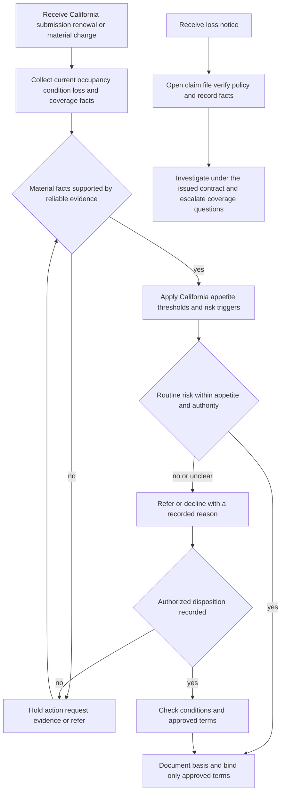

# California Appetite

## Status and boundary

This page is **internal carrier underwriting guidance**. It is not a policy term, a state-law summary, a coverage interpretation, or a claims coverage position. It helps the carrier decide whether a California homeowners risk fits the intended appetite, what evidence is needed, when to hold or refer, and who may act. Do not use it to expand, restrict, waive, or interpret contract coverage. The issued policy, declarations, applicable California form, endorsements, and controlling requirements govern coverage and payment. [Guide H.0.1–H.0.6](repo://guidelines/appetite/ca-homeowners.md#L14-L40) [Manual Rule 100.B–100.E](repo://manuals/underwriting/manual.md#L21-L43)

A risk can be acceptable for underwriting while a particular loss is uncovered, and a referral is not a declination, approval, coverage grant, or settlement position. Keep the underwriting record and the claim record distinct. If a coverage question arises, identify the form and endorsement actually issued and route the question to the appropriate coverage or claims authority. [Guide H.0.11–H.0.16](repo://guidelines/appetite/ca-homeowners.md#L59-L88) [Guide H.7.34](repo://guidelines/appetite/ca-homeowners.md#L1459-L1461)

## Control flow

*This diagram shows the underwriting gate and the claims handoff; it does not decide coverage.*

## Baseline California appetite

The routine California homeowners profile is a residential dwelling with complete and credible information, customary construction, sound condition, maintained systems, reliable emergency access, and disclosed ownership and occupancy. The Guide permits consideration of primary residences, disclosed seasonal residences, newly purchased dwellings when maintenance responsibility transfers at closing, trusts with clear interests, and estates where the applicant has authority to insure. These are eligibility considerations, not coverage grants. [Guide H.1.1–H.1.11](repo://guidelines/appetite/ca-homeowners.md#L92-L136)

The principal numeric appetite controls are:

| Control | California internal position | Operational result |
|---|---:|---|
| Coverage A floor | **$300,000** | Do not bind below the floor. |
| Coverage A appetite ceiling | **$2,000,000** | Do not treat a request above the ceiling as routine appetite. Refer or decline under current authority. |
| Protection class | **7 or better** | A class above 7 is outside the stated routine position and requires referral or decline under current direction. |
| Line authority | **$1,000,000** | The Guide permits line binding only through this amount; requests above it require referral even when still inside the $2,000,000 appetite ceiling. |

The Coverage A and protection-class positions are in H.1.2–H.1.4; the line-authority position is in H.7.1–H.7.3. Do not reduce a stated Coverage A limit merely to fit authority, and do not confuse a state appetite ceiling with delegated authority. [Guide H.1.2–H.1.4](repo://guidelines/appetite/ca-homeowners.md#L96-L106) [Guide H.7.1–H.7.6](repo://guidelines/appetite/ca-homeowners.md#L1320-L1344)

Before binding, verify occupancy, ownership, location, valuation, construction, protection class, condition, requested coverages, and applicable authority. Refer or decline when information is missing, inconsistent, materially adverse, or cannot be verified. Known unrepaired safety or weather-resistance damage, material code or permit concerns, commercial or manufacturing activity, undisclosed rental or lodging use, unlawful activity, and deliberate loss or misrepresentation are not routine risks. [Guide H.1.35–H.1.49](repo://guidelines/appetite/ca-homeowners.md#L235-L298) [Manual California Rule 520.E–520.P](repo://manuals/underwriting/manual.md#L6603-L6673)

### California state-exception screens

The state-exception review adds California-specific holds beyond the routine Coverage A and protection-class test. Verify the California address and complete exterior condition when the available information is insufficient; refer unrepaired roof or fire damage, open water or liability claims, pending construction or major renovation, unsafe or deteriorated electrical, plumbing, heating, or roofing systems, foundation, slope, retaining-wall, soil, drainage, or erosion concerns, and nontraditional or changing occupancy. [Manual California Rule 520.D–520.S](repo://manuals/underwriting/manual.md#L6597-L6691)

Also review wildfire vegetation and access, business use, vacancy or seasonal maintenance, pools and other recreational or animal hazards, protective safeguards, unusual construction, adjacent property hazards, and mitigation claims. Do not credit a safeguard or mitigation measure without reliable evidence of completion and condition; do not bind a materially changed risk after quote without reassessing eligibility. [Manual California Rule 520.T–520.AQ](repo://manuals/underwriting/manual.md#L6693-L6835) [Manual California Rule 520.AR–520.AT](repo://manuals/underwriting/manual.md#L6837-L6853)

When replacement-cost settlement is requested, the California state exception requires an insured-to-value review supporting **100%**; unsupported or unreconciled replacement-cost estimates require referral. This is an underwriting valuation control, not a claim payment rule. [Manual California Rule 520.B–520.C](repo://manuals/underwriting/manual.md#L6585-L6595) [HO 01 04 T.18–T.19](repo://forms/HO/CA/HO-01-04/2021-06.md#L723-L729)

## Roof controls

### Age and condition gate

- Obtain an acceptable roof inspection **before binding when roof age is 20 years or greater**. The report must identify the covering, visible condition, and material defects; review photographs with it when available. [Guide H.2.1–H.2.3](repo://guidelines/appetite/ca-homeowners.md#L306-L317)
- Decline an actively leaking roof unless documented repairs are complete before binding. Do not bind incomplete roof work unless underwriting has approved the risk after reviewing the scope and expected completion. [Guide H.2.4–H.2.5](repo://guidelines/appetite/ca-homeowners.md#L319-L327)
- Refer missing, lifted, broken, curled, cracked, split, granule-loss, sagging, ponding, deteriorated, or otherwise weather-vulnerable roofing; damaged flashing, penetrations, sealant, vents, chimneys, skylights, solar attachments, and roof-mounted equipment; recurring patchwork; obscured surfaces; interior moisture evidence; and inaccessible areas. [Guide H.2.6–H.2.21](repo://guidelines/appetite/ca-homeowners.md#L329-L404) [Guide H.2.27–H.2.40](repo://guidelines/appetite/ca-homeowners.md#L431-L498)
- Do not treat a replacement estimate, a homeowner statement, aerial imagery alone, or an intention to repair as proof of acceptable present condition. A contractor statement is useful only when it identifies the observed condition and recommended or completed work; repair evidence must identify the affected area and completed work. [Guide H.2.9–H.2.13](repo://guidelines/appetite/ca-homeowners.md#L341-L364) [Guide H.2.22–H.2.24](repo://guidelines/appetite/ca-homeowners.md#L406-L419) [Guide H.2.36–H.2.38](repo://guidelines/appetite/ca-homeowners.md#L476-L489)

Confirm that the inspection covers every roof serving the dwelling and covered appurtenant structures. Record the material, age source, inspection, photographs, repair evidence, referral or exception, and final decision. [Guide H.2.25–H.2.26 and H.2.31–H.2.42](repo://guidelines/appetite/ca-homeowners.md#L421-L454) [Guide H.2.41–H.2.42](repo://guidelines/appetite/ca-homeowners.md#L500-L510)

### Contract boundary for roof discussions

Roof eligibility is not roof-claim coverage. Do not turn the Guide’s roof-age, condition, ACV, or “eighty percent condition” language into a contract exclusion or a minimum claim payment rule. When a claim involves a California form or endorsement, return to the issued wording. HO 01 04, for example, states that it changes the insurance provided, controls only as written, and leaves unchanged provisions applicable to the loss operating together. [Guide H.2.32–H.2.34](repo://guidelines/appetite/ca-homeowners.md#L456-L469) [HO 01 04 T.0](repo://forms/HO/CA/HO-01-04/2021-06.md#L13-L29)

## Wind and hail controls

For underwriting, accept wind and hail exposure only when the dwelling and detached structures present an acceptable maintenance condition. Review the roof first, verify stated mitigation features rather than crediting application narrative alone, and refer extensive tree overhang, unsecured sheds or fences, deteriorated carports, vulnerable exterior equipment, unresolved prior storm damage, and recurring wind or hail losses. [Guide H.3.1–H.3.16](repo://guidelines/appetite/ca-homeowners.md#L514-L583)

Obtain a **wind mitigation inspection when Coverage A exceeds $1,000,000**. The inspection must identify the dwelling and relevant protective features. A stated feature is not verified until supported by credible evidence; photographs are appropriate when roof, siding, fencing, or exterior attachment concerns exist. [Guide H.3.3–H.3.8](repo://guidelines/appetite/ca-homeowners.md#L522-L547)

The selected wind or named-storm deductible must remain within approved underwriting parameters. Explain and document the selected deductible before binding; do not reduce, exceed, or otherwise alter the approved option without authority. For a reported loss, preserve weather information, photographs, estimates, inspection notes, and the location and apparent cause of each claimed opening. A weather event near the property does not by itself establish covered damage. [Guide H.3.17–H.3.30](repo://guidelines/appetite/ca-homeowners.md#L585-L644) [HO 01 04 T.1–T.7](repo://forms/HO/CA/HO-01-04/2021-06.md#L59-L75)

The last point is a claims boundary: the California form determines whether wind or hail caused covered direct physical loss and how its deductible applies. The appetite guidance only controls risk selection, evidence, referral, and authority.

## Water, drainage, and backup controls

Start with the physical water path and the property’s drainage arrangement. Obtain the sewer, septic, sump, discharge, below-grade, and prior-loss information needed to distinguish sewer, drain, or sump backup from envelope openings, surface water, flood, seepage, groundwater, and maintenance conditions. [Guide H.4.1–H.4.8](repo://guidelines/appetite/ca-homeowners.md#L729-L761)

Use these controls before offering or binding related protection:

- Refer recurring drain obstruction, sewage discharge, sump malfunction, sewage odor, persistent slow drains, wastewater staining, unusual or improvised piping, and unverified discharge connections. [Guide H.4.4–H.4.7 and H.4.26](repo://guidelines/appetite/ca-homeowners.md#L744-L761) [Guide H.4.25–H.4.28](repo://guidelines/appetite/ca-homeowners.md#L849-L866)
- Identify finished below-grade areas and susceptible flooring, walls, and contents. Where drainage conditions warrant a backwater valve, verify that it is present, maintained, and operable; do not rely on an applicant’s description without support. [Guide H.4.8–H.4.12](repo://guidelines/appetite/ca-homeowners.md#L763-L787)
- Review the requested backup and sump-overflow limit against the susceptible property and apply the approved deductible. The limit and deductible are underwriting review items here, not automatic contract terms. [Guide H.4.13–H.4.18](repo://guidelines/appetite/ca-homeowners.md#L789-L816)
- A single prior event may be considered when its cause is credible and corrective work is documented. Refer incomplete, disputed, unsupported, recurring, or unclear repairs; retain source, affected area, mitigation, and completion evidence. [Guide H.4.19–H.4.28](repo://guidelines/appetite/ca-homeowners.md#L818-L866)

The Guide directs internal handling to report a claimed water-backup loss within **60 days**. Treat that as carrier procedure, not as a universal contract deadline: verify the issued policy and endorsement before communicating a coverage or notice position. The HO 01 04 claim section separately requires prompt notice and gives its own claim-process terms. [Guide H.4.29–H.4.40](repo://guidelines/appetite/ca-homeowners.md#L868-L925) [HO 01 04 T.5.1–T.5.6](repo://forms/HO/CA/HO-01-04/2021-06.md#L471-L483)

## Prior losses and referral

Review available loss history before offering terms or confirming eligibility. The California Guide directs review of the preceding **five years** and requires referral when the count of **paid property claims reaches two**. Count paid losses for dwelling, other structures, personal property, loss of use, and related property coverages; do not count an inquiry, an unpaid report, or a withdrawn notice as a paid property claim unless the record confirms payment. [Guide H.5.1–H.5.7](repo://guidelines/appetite/ca-homeowners.md#L930-L962)

Review the cause and current condition for every reported loss, not just claims that reach the numeric trigger. For water losses, capture source, affected areas, repairs, and mitigation; for fire, capture ignition source, extent, repair status, and changed risk; for theft or vandalism, evaluate vacancy, security, access, and neighborhood indicators; for wildfire, evaluate current vegetation, access, construction, and protection conditions. [Guide H.5.7–H.5.20](repo://guidelines/appetite/ca-homeowners.md#L959-L1025)

Do not bind a referred risk until underwriting records an approval or other disposition. A referral package should include loss date, cause, payment status, damaged property, repair status, applicant explanation, photographs or inspection findings, invoices or receipts, mitigation evidence, discrepancies, and any open claim, dispute, recovery, permit, or code issue. Do not alter loss descriptions to avoid referral. [Guide H.5.21–H.5.32](repo://guidelines/appetite/ca-homeowners.md#L1027-L1083) [Guide H.5.38–H.5.42](repo://guidelines/appetite/ca-homeowners.md#L1110-L1131)

## Claims-handling handoff

The Guide’s claims section is an internal operating procedure, not a coverage position. On notice of a potentially covered loss:

1. Open the claim file promptly and record the reported cause, location, date of discovery, affected property, and initial description.
2. Verify the named insured, risk address, policy status, applicable coverages, declarations, and attached endorsements before giving coverage direction.
3. Track the acknowledgment deadline, provide a responsible contact, and communicate in plain language. Advise reasonable protection of property, preservation of damaged property when practical, and retention of repair records.
4. Start reasonable mitigation within **7 days after discovery** under the Guide’s internal control; distinguish emergency protection from permanent repair and do not promise payment before coverage and damage review.
5. Request only relevant evidence, arrange qualified inspection when needed, establish chronology and cause, separate resulting damage from the source condition, and refer suspected misrepresentation or complex liability matters.
6. Diary outstanding documents, inspections, estimates, communications, and decisions. Close only after recording payment, denial, withdrawal, settlement, or another final disposition.

Before authorizing payment, review cause, scope, estimate support, valuation, deductible, limits, and any replacement-cost conditions; distinguish resulting damage from the condition that caused it. Request a proof of loss when the policy or claim facts require one, evaluate additional living expense only after a covered loss makes the residence unfit, preserve recovery rights, and route injury, third-party damage, defense, or liability matters to the appropriate handler. Written decisions must identify the facts and policy language relied upon, explain partial limitations separately, and must not delay an established undisputed amount while an unrelated dispute remains open. [Guide H.6.15–H.6.18](repo://guidelines/appetite/ca-homeowners.md#L1200-L1217) [Guide H.6.22–H.6.35](repo://guidelines/appetite/ca-homeowners.md#L1235-L1297) [Guide H.6.36–H.6.39](repo://guidelines/appetite/ca-homeowners.md#L1299-L1316)

These steps are drawn from the Guide’s intake, mitigation, investigation, authority, communication, and closure controls. They do not establish that a loss is covered or that an expense is payable. [Guide H.6.1–H.6.18](repo://guidelines/appetite/ca-homeowners.md#L1135-L1217) [Guide H.6.19–H.6.39](repo://guidelines/appetite/ca-homeowners.md#L1219-L1316)

If HO 01 04 is attached, its contract wording separately states acknowledgment within **15 days**, a decision within **40 business days** after requested items are received or a written explanation if a decision cannot be made, and payment of an accepted claim within **30 business days**. Those are form terms, not appetite thresholds; confirm the applicable issued form and law before communicating them. [HO 01 04 T.5.5](repo://forms/HO/CA/HO-01-04/2021-06.md#L479-L483) [HO 01 04 T.5.29–T.5.38](repo://forms/HO/CA/HO-01-04/2021-06.md#L529-L547)

## California earthquake-offer handoff

The CDI bulletins govern a separate transaction-control process, not this appetite. When the applicable offer obligation is triggered, keep the earthquake offer distinct from the underlying homeowners policy and preserve the offer, response, and filing records. The current source position is CDI-2022-03 for applicable offers on or after **2022-03-14**; CDI-2014-06 is superseded for later transactions but remains relevant to policies written under its position. [CDI-2022-03 B.1.6–B.1.8 and B.1.21](repo://bulletins/CA/cdi-2022-03-earthquake-offer.md#L25-L29) [CDI-2014-06 supersession](repo://bulletins/CA/cdi-2014-06-earthquake-offer.md#L1-L9)

For the 2022-03 process, the offer is written, or electronic with consent, must identify the insurer and related policy, disclose material terms and underwriting conditions, state a **15% seismic deductible**, and obtain affirmative acceptance before issuing the separate earthquake coverage. Silence is not acceptance; acceptance and declination must be confirmed and retained. [CDI-2022-03 B.2.1–B.2.29](repo://bulletins/CA/cdi-2022-03-earthquake-offer.md#L59-L117)

The offer must arrive early enough to give a meaningful opportunity to consider it, not after the related policy transaction. A request for information is not a declination, and the file must preserve the delivery method, response, eligibility basis when applicable, issued documents, and filed-material version. Treat system, producer, vendor, and translated-material changes as controlled offer-process changes; the carrier remains responsible for the result. [CDI-2022-03 B.3.9–B.3.14 and B.3.22–B.3.27](repo://bulletins/CA/cdi-2022-03-earthquake-offer.md#L389-L469) [CDI-2022-03 B.2.38–B.2.47](repo://bulletins/CA/cdi-2022-03-earthquake-offer.md#L262-L301) [CDI-2022-03 B.5.1–B.5.16](repo://bulletins/CA/cdi-2022-03-earthquake-offer.md#L639-L704)

Do not import the bulletin’s offer terms into the homeowners appetite or describe the offer as coverage. Before discussing an earthquake claim or deductible, identify the issued California endorsement and declarations. HO 01 04 separately changes insurance for California property only to the extent its wording applies, and its contract language states a 15% earthquake deductible based on applicable covered property value, while CDI-2022-03 describes the offer disclosure as 15% of applicable covered loss. Reconcile the issued contract, declarations, and filed offer; do not silently substitute one basis for the other. [HO 01 04 T.0](repo://forms/HO/CA/HO-01-04/2021-06.md#L13-L29) [HO 01 04 T.8](repo://forms/HO/CA/HO-01-04/2021-06.md#L689-L709) [CDI-2022-03 B.2.7–B.2.11](repo://bulletins/CA/cdi-2022-03-earthquake-offer.md#L134-L151)

Before attaching earthquake-related coverage, confirm that the attachment reflects the California location and construction characteristics and record the quake-deductible review. Do not alter, waive, or negotiate that deductible without authorized direction. [Manual Rule 400.AH](repo://manuals/underwriting/manual.md#L5289-L5293) [Manual California Rule 520.AB](repo://manuals/underwriting/manual.md#L6741-L6745)

## Authority, referral, and change control

Apply eligibility before authority. The California Guide’s state-specific position permits line binding through **$1,000,000** Coverage A; above that amount, refer. A risk inside that line can still require referral for roof, wind, water, losses, unusual occupancy or construction, conflicting information, or any exception. A request above the **$2,000,000** appetite ceiling is not made acceptable by a higher authority. [Guide H.7.1–H.7.10](repo://guidelines/appetite/ca-homeowners.md#L1320-L1360)

The authority path is:

- Obtain clarification rather than treating missing information as favorable.
- Refer exceptions, unusual occupancy, construction, or loss concerns; evaluate related property interests and coverage requests together rather than dividing them to avoid referral.
- Consider all material information known at binding. If facts change before issuance, refer again or withdraw unissued terms when the risk moves outside authority.
- Obtain recorded approval before representing a referred risk as accepted. Communicate referral status accurately; an indication, producer expectation, or informal direction is not approval.
- Bind only after required conditions are confirmed and only within the approved terms. Escalate uncertainty before binding. [Guide H.7.11–H.7.34](repo://guidelines/appetite/ca-homeowners.md#L1362-L1461)

The general manual also requires active delegated authority, sufficient risk information, no authority bypass, recorded approval, and no reliance on verbal approval. If a generic manual limit or informal instruction conflicts with the California-specific Guide or the current delegated-authority record, stop and escalate rather than choosing the more favorable limit. [Manual Rule 300.A–300.F](repo://manuals/underwriting/manual.md#L3991-L4027) [Manual Rule 300.X–300.AD](repo://manuals/underwriting/manual.md#L4131-L4165) [Manual California Rule 520.AR–520.AT](repo://manuals/underwriting/manual.md#L6837-L6853)

## Evidence and file standard

For every material California decision, retain:

- the fact, source, receipt or inspection date, and verification status;
- occupancy, ownership, location, construction, protection class, valuation, roof, water, wind, and loss information relied upon;
- photographs, inspections, contractor statements, invoices, permits, repair and mitigation evidence where relevant;
- the trigger, requested action, authority level, referral reason, approval, conditions, communications, and final disposition; and
- reassessment evidence when a condition changes or a required corrective action is completed.

Record adverse information even when the risk is accepted, distinguish reported from verified facts, and do not close a requirement based only on an unsupported representation. [Manual Rule 610.A–610.I](repo://manuals/underwriting/manual.md#L8805-L8857) [Manual Rule 610.N–610.Y](repo://manuals/underwriting/manual.md#L8883-L8953) [Manual Rule 610.AG–610.AI](repo://manuals/underwriting/manual.md#L8997-L9013)

### Failure checks

- **Coverage substitution:** an appetite rule is described as a policy exclusion, deductible, claim payment rule, or coverage grant. Return to the issued form and endorsement.
- **Threshold-only acceptance:** Coverage A fits the range but roof, water, occupancy, loss history, valuation, or authority remains unresolved. Apply the complete control set.
- **Binding on intent:** planned roof, plumbing, mitigation, or repair work is treated as completed. Obtain completion evidence and reassess.
- **Authority bypass:** a request is split, reduced, sequenced, backdated, or accepted on verbal or informal approval. Hold and obtain recorded authority.
- **Claim overstatement:** the Guide’s seven-day mitigation or sixty-day water-backup instruction is communicated as a universal coverage deadline, or claim handling is treated as proof of coverage. Verify the issued contract and route the coverage question.
- **Stale or conflicting evidence:** an old inspection, application statement, photograph, loss record, or contractor opinion is accepted without reconciliation. Refer or resolve before final action. [Guide H.1.36–H.1.50](repo://guidelines/appetite/ca-homeowners.md#L239-L302) [Manual Rule 610.E](repo://manuals/underwriting/manual.md#L8829-L8833) [Manual Rule 610.AL–610.AM](repo://manuals/underwriting/manual.md#L9027-L9037)

## Related pages

- [California State Overlay](/openwiki/state-overlays/california.md) — earthquake offer, California form, and state-transaction handoffs.
- [Earthquake coverage and offer requirements](/openwiki/coverage/perils/earthquake.md) — contract and offer analysis, separate from appetite.
- [Underwriting referral and authority guidance](/openwiki/underwriting/guidelines/referral-authority.md) — general referral lifecycle and authority controls.
- [Manual eligibility by product line](/openwiki/underwriting/manual/eligibility-and-product-lines.md) — product-line entry criteria.
- [Manual property, roof, and water risk controls](/openwiki/underwriting/manual/property-and-water-risk.md) — broader manual controls and evidence handling.
