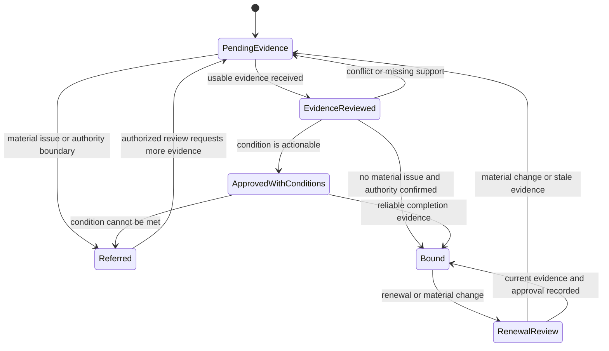
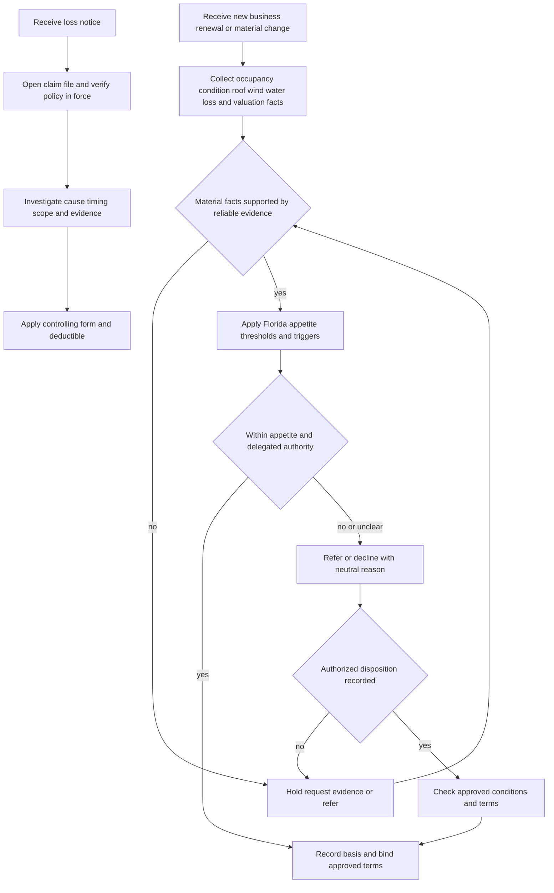

# Florida Appetite

## Scope and authority boundary

This page is **internal carrier underwriting guidance**. It controls risk selection, evidence collection, referral, file documentation, and delegated authority; it is not a policy term, coverage grant, claim determination, or substitute for the Florida overlay. The issued policy, declarations, applicable endorsement, controlling law, and OIR requirements govern coverage, notices, and claim payment. A risk can be acceptable to underwriting while a particular loss is not covered, and a referral is not a declination or approval. [Florida guide H.0.4–H.0.7](repo://guidelines/appetite/fl-homeowners.md#L28-L45) [Florida guide H.0.17–H.0.22](repo://guidelines/appetite/fl-homeowners.md#L91-L115) [Manual Rule 500.AX](repo://manuals/underwriting/manual.md#L6219-L6225)

Use the form actually attached to the policy and the policy effective date when answering a coverage, deductible, settlement, notice, or claim question. Keep the **HO line** and **DP line** separate: the HO 01 09 2023-07 and DP 01 09 2021-03 provisions below are contractual examples, not appetite rules. An internal note cannot change either form. [HO 01 09 2023-07, endorsement status and scope](repo://forms/HO/FL/HO-01-09/2023-07.md#L53-L55) [DP 01 09 2021-03, endorsement status and scope](repo://forms/DP/FL/DP-01-09/2021-03.md#L45-L57)

## Evidence, inspection, and file lifecycle

The Florida workflow has an evidence gate before an appetite decision. Manual Rule 600 requires an inspection when underwriting information is incomplete, inconsistent, or unreliable, and prohibits binding until the issue is resolved or an authorized exception is recorded. The Florida roof trigger is separate and stricter in application: require a roof survey before binding at **15 years**, with enough evidence to identify condition, materials, installation quality, and visible deterioration. [Manual Rule 600.A](repo://manuals/underwriting/manual.md#L8501-L8507) [Manual Rule 600.B](repo://manuals/underwriting/manual.md#L8509-L8513)

Use evidence that is property-specific, usable, and attributable. Manual Rule 600 requires a reliable source with sufficient authority and relevant expertise and rejects altered, incomplete, or unverifiable inspection material. Rule 610 requires the file to record the source, receipt and verification dates, material discrepancies and their resolution, operational decision status, referral reason, conditions, eligibility findings, and authority used. An applicant or representative statement remains attributed and unverified until supported; do not turn a favorable assumption into a verified fact. [Manual Rule 600.AP](repo://manuals/underwriting/manual.md#L8749-L8753) [Manual Rule 610.A–610.I](repo://manuals/underwriting/manual.md#L8803-L8857) [Manual Rule 610.Y and 610.AN](repo://manuals/underwriting/manual.md#L8949-L8959) [Manual Rule 610.AN](repo://manuals/underwriting/manual.md#L9039-L9043)

A material finding is not cleared by a verbal assurance. Require reliable completion evidence, refer a hazard outside delegated authority, and close the inspection record only when each material finding is resolved, referred, or accepted within authority. These are internal evidence and lifecycle controls; they do not prescribe a repair method or decide coverage. [Manual Rule 600.AQ–600.AX](repo://manuals/underwriting/manual.md#L8755-L8801)

*This lifecycle shows the internal evidence and authority states; it does not determine coverage or guarantee renewal.*

### Control flow

*This flow separates pre-bind risk selection from post-loss claim investigation and settlement.*

## Florida appetite gates

### Coverage A and authority

The Florida homeowners guide permits Coverage A from **$200,000 through $900,000**. The line underwriter may bind through **$600,000**; a senior underwriter may bind through **$900,000**. Do not write above $900,000, and do not use split risks, valuation changes, or coverage structures to evade a referral. Use the completed, supportable replacement-cost estimate when testing both appetite and authority. [Florida guide H.1.1–H.1.2](repo://guidelines/appetite/fl-homeowners.md#L119-L127) [Manual Rule 500.I–500.M](repo://manuals/underwriting/manual.md#L5891-L5929) [Florida guide H.7.1–H.7.7](repo://guidelines/appetite/fl-homeowners.md#L1360-L1390)

The general Manual Rule 300 limits are not a replacement for the more specific Florida Rule 500 limits. When authority instructions conflict, stop the transaction and escalate before quoting, binding, changing, reinstating, or making a verbal commitment. Record the underwriter, approval, limit, conditions, and evidence used. [Manual Rule 300.A–300.D](repo://manuals/underwriting/manual.md#L3991-L4015) [Manual Rule 500.L–500.M](repo://manuals/underwriting/manual.md#L5915-L5929) [Florida guide H.7.8–H.7.16](repo://guidelines/appetite/fl-homeowners.md#L1392-L1430)

### Roof age and condition

Apply three different roof-age concepts without substituting one for another:

| Function | Florida internal control | Authority that controls |
|---|---|---|
| Pre-bind eligibility | Obtain a roof inspection at **15 years or older**; do not bind at **20 years or older**. | Internal Florida appetite and Rule 500 |
| Regulatory roof practice | At **15 years**, obtain and disclose the inspection requirement; consider credible age, repair, replacement, material, and condition evidence. Roof age alone is not a condition finding. | OIR-2023-04 |
| Contractual settlement | The cited HO and DP forms use an actual-cash-value roof schedule at **10 years or older**, subject to the form's wording. | The form attached to the policy |

The internal 15/20 eligibility controls are not a coverage denial, and the contractual 10-year schedule is not an automatic underwriting decline. [Florida guide H.2.1–H.2.7](repo://guidelines/appetite/fl-homeowners.md#L406-L432) [Manual Rule 500.C–500.G](repo://manuals/underwriting/manual.md#L5843-L5881) [OIR-2023-04 B.2.5–B.2.10](repo://bulletins/FL/oir-2023-04-roof-age-nonrenewal.md#L67-L79) [HO 01 09 2023-07](repo://forms/HO/FL/HO-01-09/2023-07.md#L629-L633) [DP 01 09 2021-03](repo://forms/DP/FL/DP-01-09/2021-03.md#L1148-L1162)

Obtain roof age from installation or replacement records, contractor documentation, permits, or an inspection report. Review the primary surface and attached roof areas, material, drainage, flashing, penetrations, patching, staining, sagging, missing material, vegetation, and water-entry indicators. Refer when evidence conflicts, is property-mismatched, is solely an unsupported applicant statement, or leaves visible deterioration, leakage, temporary covering, prior damage, or repair quality unresolved. Preserve the inspection, photographs, source, date, and disposition. [Florida guide H.2.2–H.2.10](repo://guidelines/appetite/fl-homeowners.md#L411-L454) [Florida guide H.2.13–H.2.23](repo://guidelines/appetite/fl-homeowners.md#L464-L513) [Manual Rule 500.E–500.G](repo://manuals/underwriting/manual.md#L5859-L5881)

For a roof-age adverse action, use the current OIR standard rather than the superseded OIR-2019-11 standard. OIR-2023-04 requires reliable and relevant age information, consideration of credible replacement or repair evidence, a meaningful opportunity to submit information, and a specific written reason. Before binding a 15-year roof, disclose that inspection may affect eligibility, terms, premium, or the decision not to offer coverage. [OIR-2023-04 B.1](repo://bulletins/FL/oir-2023-04-roof-age-nonrenewal.md#L13-L43) [OIR-2023-04 B.2.2–B.2.7](repo://bulletins/FL/oir-2023-04-roof-age-nonrenewal.md#L61-L73) [OIR-2023-04 B.3.2–B.3.10](repo://bulletins/FL/oir-2023-04-roof-age-nonrenewal.md#L163-L181) OIR-2019-11 is marked superseded for policies effective on or after 2023-04-11; do not use its 15-year settlement rule in place of the current form or bulletin. [OIR-2019-11 supersession and B.2.3](repo://bulletins/FL/oir-2019-11-roof-age.md#L8-L9) [OIR-2019-11 B.2.3](repo://bulletins/FL/oir-2019-11-roof-age.md#L47-L55)

For a 15-year roof, the OIR disclosure must precede premium payment or acceptance, identify who arranges and pays for the inspection, and give the applicant a reasonable opportunity to submit a qualified inspector's report. An inspection is not a guarantee of eligibility. If binding is adverse, communicate the principal roof-related reason in writing and record how submitted information was considered. [OIR-2023-04 B.3.2–B.3.10](repo://bulletins/FL/oir-2023-04-roof-age-nonrenewal.md#L163-L181) [OIR-2023-04 B.3.13–B.3.15](repo://bulletins/FL/oir-2023-04-roof-age-nonrenewal.md#L187-L191)

### Wind and hail

Require a wind-mitigation inspection when Coverage A exceeds **$500,000**. Accept a mitigation credit only when the report is complete, legible, property-specific, and supports each credited feature; do not rely on an applicant statement, listing, temporary panel, or unverified shutter claim. Refer conflicting roof, opening-protection, geometry, connection, construction, or repair information. [Florida guide H.3.1–H.3.14](repo://guidelines/appetite/fl-homeowners.md#L603-L658)

Treat deductible rules as three separate layers:

1. **Internal selection:** use the approved Florida deductible handling and record the selection; do not change it after a reported loss or known storm condition without authority. [Florida guide H.3.15–H.3.22](repo://guidelines/appetite/fl-homeowners.md#L660-L689) [Manual Rule 500.AC](repo://manuals/underwriting/manual.md#L6051-L6057)
2. **OIR disclosure:** a hurricane-deductible disclosure must identify the trigger, calculation basis, relationship to other deductibles, and the selected percentage. OIR-2022-01 requires the named-storm deductible disclosure to state at least **2%** and the hurricane deductible disclosure to state no more than **10%**; it does not set a generic Section I deductible minimum. [OIR-2022-01 B.1.12–B.1.18](repo://bulletins/FL/oir-2022-01-hurricane-deductible.md#L37-L49) [OIR-2022-01 B.2.2–B.2.10](repo://bulletins/FL/oir-2022-01-hurricane-deductible.md#L61-L79)
3. **Contract adjustment:** apply the wind or named-storm deductible under the form in force at the loss. A disclosure does not amend the policy. [OIR-2022-01 B.1.12 and B.1.18](repo://bulletins/FL/oir-2022-01-hurricane-deductible.md#L37-L49) [HO 01 09 2023-07 windstorm deductible](repo://forms/HO/FL/HO-01-09/2023-07.md#L57-L91) [DP 01 09 2021-03 windstorm deductible](repo://forms/DP/FL/DP-01-09/2021-03.md#L95-L115)

Do not infer that the HO endorsement's **15% windstorm-and-hail ceiling** is the OIR hurricane-deductible disclosure ceiling, or that OIR's **10% hurricane maximum** caps every contractual windstorm-and-hail deductible. The DP endorsement states a **2%–10%** windstorm-and-hail range, while the HO endorsement states **2%–15%**; identify whether the policy term is a windstorm-and-hail or hurricane/named-storm deductible, then escalate any conflict between the form, filed operation, and current requirement. [HO 01 09 2023-07](repo://forms/HO/FL/HO-01-09/2023-07.md#L57-L77) [DP 01 09 2021-03](repo://forms/DP/FL/DP-01-09/2021-03.md#L95-L115) [OIR-2022-01 B.2.6–B.2.8](repo://bulletins/FL/oir-2022-01-hurricane-deductible.md#L69-L75)

When a hurricane deductible is offered, selected, changed, or renewed, deliver the clear disclosure before binding or renewal and before premium or final electronic acceptance. If the application requires selection or acceptance, retain the acknowledgment and disclosure version; provide a revised disclosure before a deductible change takes effect. The bulletin also requires at least **45 days** before an increase in a windstorm deductible takes effect. These are disclosure and operations controls, not authority to apply a deductible unsupported by the attached policy. [OIR-2022-01 B.2.1–B.2.20](repo://bulletins/FL/oir-2022-01-hurricane-deductible.md#L59-L101) [OIR-2022-01 B.3.1–B.3.18](repo://bulletins/FL/oir-2022-01-hurricane-deductible.md#L165-L203)

### Water exposure and backup

Water underwriting is source-driven. Distinguish interior sewer, drain, or sump backup from surface water, flood, storm surge, tidal water, exterior entry, repeated seepage, leakage, and maintenance conditions. Obtain the source, location, duration, repair status, remediation evidence, and any drainage or backwater-device information. Refer repeated discharge, unresolved source, temporary or cosmetic repair, neglected drains, damaged plumbing, or an inoperative protective device; refer a requested water-backup limit above **$10,000**. [Florida guide H.4.1–H.4.18](repo://guidelines/appetite/fl-homeowners.md#L747-L825) [Florida guide H.4.20–H.4.29](repo://guidelines/appetite/fl-homeowners.md#L831-L871) [Manual Rule 500.P and 500.Q](repo://manuals/underwriting/manual.md#L5947-L5961)

Do not promise that water-backup coverage insures flood or converts faulty workmanship, defective design, seepage, or maintenance loss into covered loss. The policy endorsement, if selected, controls. [Florida guide H.4.30–H.4.54](repo://guidelines/appetite/fl-homeowners.md#L873-L983) [HO 01 09 2023-07 water exclusions](repo://forms/HO/FL/HO-01-09/2023-07.md#L635-L649) [DP 01 09 2021-03 water provisions](repo://forms/DP/FL/DP-01-09/2021-03.md#L1228-L1249)

### Prior losses and referral

Before binding, review available loss information for the preceding **five years**. Refer when there are **two paid property claims**, an unresolved or unclear cause, incomplete repair or mitigation, repeated damage to the same feature or from the same cause, unclear roof or water repair, open damage, or a material discrepancy between applicant disclosure, reports, inspection, and current condition. Record source, review date, cause, damaged property, repair status, disposition, and the neutral referral reason. [Florida guide H.5.1–H.5.12](repo://guidelines/appetite/fl-homeowners.md#L987-L1038) [Florida guide H.5.19–H.5.23](repo://guidelines/appetite/fl-homeowners.md#L1068-L1089) [Florida guide H.5.35–H.5.43](repo://guidelines/appetite/fl-homeowners.md#L1141-L1178)

The general Manual Rule 240 describes a three-year claim review and the same two-paid-claim referral, while the Florida homeowners guide specifies five years. For this Florida homeowners workflow, use the more specific five-year guide control; do not shorten it to the general manual baseline. [Manual Rule 240.A–240.D](repo://manuals/underwriting/manual.md#L3321-L3345) State-specific controls and the Florida guide also require review of water, wind, hail, roof, weather, fire, liability, occupancy, and remediation patterns, not merely the number of paid claims. [Manual Rule 240.E–240.H and 240.M–240.N](repo://manuals/underwriting/manual.md#L3347-L3369) [Manual Rule 240.AQ–240.AX](repo://manuals/underwriting/manual.md#L3575-L3621)

### Renewal-specific controls

Renewal is a fresh underwriting action, not an automatic carry-forward of the bind decision. Manual Rule 700 requires review of changes in eligibility, exposure, valuation, occupancy, and loss potential; review of current-term loss activity; referral of a renewal risk with **two paid property claims**; and resolution of material roof, exterior, water, inspection, or missing-information concerns before finalizing terms. [Manual Rule 700.A–700.F](repo://manuals/underwriting/manual.md#L9131-L9165) [Manual Rule 700.N–700.W](repo://manuals/underwriting/manual.md#L9209-L9267)

For a renewal, Rule 700 states that an inspection report remains valid for **12 months** and must be refreshed when it is older or conditions may have changed. This renewal-specific period is distinct from the generic Rule 610.AA text that says “valid for 18 from its completion” without a unit. Record the completion date and current status; if the missing unit changes whether evidence may be used, escalate the unclear Manual direction rather than inventing days or months. [Manual Rule 700.Q–700.S](repo://manuals/underwriting/manual.md#L9227-L9243) [Manual Rule 610.AA](repo://manuals/underwriting/manual.md#L8961-L8965) [Manual Rule 100.P](repo://manuals/underwriting/manual.md#L105-L109)

A renewal or roof-related adverse action must use the completed review, not an anticipated correction or an old approval. Before releasing terms, confirm current conditions, approval authority, restrictions, and any required notice workflow. [Manual Rule 700.AT–700.BI](repo://manuals/underwriting/manual.md#L9401-L9491) [Florida guide H.7.30–H.7.36](repo://guidelines/appetite/fl-homeowners.md#L1490-L1520)

## Claims handoff and separation from underwriting

The internal claim workflow opens the loss file on notice, preserves the report source, verifies insured and location, confirms the reported cause, records contacts and authority, explains reasonable mitigation, requests available photographs and invoices, arranges inspection when indicated, preserves evidence, and avoids promising coverage or repair scope before investigation. The Florida guide requires reasonable mitigation to begin within **seven days** after discovery; the contract still controls the insured's actual duties. [Florida guide H.6.1–H.6.12](repo://guidelines/appetite/fl-homeowners.md#L1182-L1234)

Claims must identify competing causes, obtain weather, maintenance, repair, and prior-loss information, document wear, deterioration, seepage, faulty workmanship, and maintenance conditions, separate covered from excluded or preexisting damage, apply the applicable deductible after the covered amount is determined, and record the form provision supporting the decision. Do not close while a material information request remains unresolved; reopen when credible new information may affect coverage, valuation, or payment. [Florida guide H.6.13–H.6.26](repo://guidelines/appetite/fl-homeowners.md#L1236-L1300) [Florida guide H.6.30–H.6.39](repo://guidelines/appetite/fl-homeowners.md#L1314-L1356)

A prior roof-age, inspection, nonrenewal, or underwriting referral is evidence to review—not a claim outcome. OIR-2023-04 requires a reasonable loss investigation and states that roof age alone cannot deny, limit, or delay a claim; claim determination and underwriting determination must remain distinct. [OIR-2023-04 B.4.2–B.4.11](repo://bulletins/FL/oir-2023-04-roof-age-nonrenewal.md#L239-L261) Preserve the underwriting record, but decide the loss under the policy and endorsement in force when the loss occurred. [HO 01 09 2023-07 claim timing and investigation](repo://forms/HO/FL/HO-01-09/2023-07.md#L405-L439) [DP 01 09 2021-03 claim investigation and decision](repo://forms/DP/FL/DP-01-09/2021-03.md#L770-L898)

## HO and DP contractual controls must remain distinct

These are form controls, not carrier appetite thresholds. Always retrieve the form edition and endorsements actually issued before communicating terms.

| Contract control | HO 01 09 Florida 2023-07 | DP 01 09 Florida 2021-03 |
|---|---|---|
| Roof settlement trigger in the cited endorsement | Roof age **10 years or older** moves covered roof damage to the actual-cash-value schedule; condition immediately before loss matters. | Roof age **10 years or older** is settled on an actual-cash-value basis unless another provision is broader. |
| Windstorm and hail deductible | **2% minimum, 15% maximum** in the cited endorsement; applies to covered windstorm or hail loss and is calculated from limits applicable to damaged property. | **2% minimum, 10% maximum**; applies separately and is calculated from insurance applicable to the damaged property. |
| Increase in windstorm deductible | Written notice at least **60 days** before the increase takes effect. | Written notice at least **45 days** before the increase takes effect. |
| Named-storm period | Continues **72 hours** after official designation ends; timing and cause remain fact questions. | Same 72-hour continuation; timing and cause remain fact questions. |
| Claim decision/payment timing in the cited form | Accept or reject within **85 business days** after requested items; pay an accepted claim within **20 business days**. | Accept or reject within **90 business days** after requested items; pay accepted covered amount within **20 business days**. |
| Nonrenewal notice in the cited form | At least **135 days** before the current period ends. | At least **120 days** before expiration. |

[HO 01 09 2023-07 roof provisions](repo://forms/HO/FL/HO-01-09/2023-07.md#L629-L633) [HO 01 09 2023-07 claim provisions](repo://forms/HO/FL/HO-01-09/2023-07.md#L403-L471) [HO 01 09 2023-07 deductible, named-storm, and notice provisions](repo://forms/HO/FL/HO-01-09/2023-07.md#L57-L77) [HO 01 09 2023-07 notice and nonrenewal](repo://forms/HO/FL/HO-01-09/2023-07.md#L167-L191) [HO 01 09 2023-07 named-storm period](repo://forms/HO/FL/HO-01-09/2023-07.md#L217-L245) [HO 01 09 2023-07 cancellation and nonrenewal](repo://forms/HO/FL/HO-01-09/2023-07.md#L285-L297) [DP 01 09 2021-03 roof provisions](repo://forms/DP/FL/DP-01-09/2021-03.md#L1148-L1187) [DP 01 09 2021-03 claim provisions](repo://forms/DP/FL/DP-01-09/2021-03.md#L770-L898) [DP 01 09 2021-03 deductible provisions](repo://forms/DP/FL/DP-01-09/2021-03.md#L95-L115) [DP 01 09 2021-03 notice and nonrenewal](repo://forms/DP/FL/DP-01-09/2021-03.md#L316-L338) [DP 01 09 2021-03 named-storm period](repo://forms/DP/FL/DP-01-09/2021-03.md#L432-L451) [DP 01 09 2021-03 cancellation and nonrenewal](repo://forms/DP/FL/DP-01-09/2021-03.md#L530-L551)

The table does not resolve conflicts between a form, an endorsement, current law, or an OIR requirement. In particular, OIR-2023-04 requires at least **120 days** for a roof-related nonrenewal notice, while the cited HO form states 135 days and the cited DP form states 120 days. Use the controlling legal and filed-form workflow for the policy and action date, and escalate before sending an adverse notice. [OIR-2023-04 B.3.16–B.3.27](repo://bulletins/FL/oir-2023-04-roof-age-nonrenewal.md#L193-L215)

## Renewal, adverse action, and documentation

A roof-related adverse action must state the actual principal reason, use supported roof age and condition information, consider timely replacement or repair evidence before finalizing, and preserve the notice, delivery proof, inspection, source records, communications, and decision record. Do not describe an action as roof-age-only when other underwriting facts are material, and do not use a generic “does not meet guidelines” explanation where the OIR requirement calls for specificity. [OIR-2023-04 B.1.19–B.1.33](repo://bulletins/FL/oir-2023-04-roof-age-nonrenewal.md#L19-L33) [OIR-2023-04 B.2.12–B.2.27](repo://bulletins/FL/oir-2023-04-roof-age-nonrenewal.md#L81-L115) [OIR-2023-04 B.3.16–B.3.31](repo://bulletins/FL/oir-2023-04-roof-age-nonrenewal.md#L193-L223)

Keep these lifecycle states separate in the file:

- **Pending evidence:** material information is incomplete, inconsistent, stale, or unsupported; do not bind or finalize the adverse action.
- **Referred:** the risk is outside routine appetite, authority, or evidence standards; record the issue and route to an authorized reviewer.
- **Approved with conditions:** record the approving underwriter, exact conditions, effective date, and evidence; bind only the approved terms.
- **Bound:** confirm the form line, effective date, selected deductible, Coverage A, required inspections, and all material information before committing exposure.
- **Claim opened:** preserve the report, identify policy and form in force, investigate cause and timing independently, and do not treat prior underwriting as a coverage decision.
- **Closed or reopened:** document the form basis, deductible, payment or denial, material requests, and any credible later information that changes the evaluation.

The file must contain the source and date for roof age and loss history, inspection and photographs, valuation, occupancy and use, protection features, deductible selection, referral communications, approval conditions, and the final action. Never remove, minimize, or rewrite material facts to make a risk appear eligible. [Manual Rule 500.AF–500.AJ](repo://manuals/underwriting/manual.md#L6075-L6113) [Manual Rule 500.AX](repo://manuals/underwriting/manual.md#L6219-L6225) [Florida guide H.7.17–H.7.36](repo://guidelines/appetite/fl-homeowners.md#L1432-L1520)

## Exception, version, and operational controls

Treat an exception as a controlled state, not an informal accommodation. Rule 500 requires referral for any exception from Florida eligibility requirements and prohibits granting it without appropriate underwriting authority; Rule 610 requires the exception, reason, approval authority, limitation, and material departure from documented direction to be recorded. A risk outside authority remains referred until the authorized disposition and conditions are recorded. [Manual Rule 500.AS](repo://manuals/underwriting/manual.md#L6179-L6185) [Manual Rule 610.S](repo://manuals/underwriting/manual.md#L8913-L8917) [Manual Rule 610.BB](repo://manuals/underwriting/manual.md#L9123-L9127) [Florida guide H.7.9–H.7.10](repo://guidelines/appetite/fl-homeowners.md#L1397-L1404)

Use the version governing the action date and policy context. OIR-2023-04 requires a roof-age practice to distinguish new, renewal, and in-force policies and requires a revised practice to be filed and approved or otherwise effective before implementation when filing is required. OIR-2022-01 likewise requires the applicable hurricane-deductible disclosure version to be retained and prevents use of an unfiled or superseded disclosure. Do not silently substitute an older bulletin, form, disclosure, or manual practice. [OIR-2023-04 B.5.1–B.5.12](repo://bulletins/FL/oir-2023-04-roof-age-nonrenewal.md#L295-L319) [OIR-2022-01 B.5.1–B.5.16](repo://bulletins/FL/oir-2022-01-hurricane-deductible.md#L299-L331)

Operationally, keep the evidence request, inspection, referral, approval, conditions, notice, and final action traceable. Rule 500 requires a complete Florida file for accepted, declined, and referred risks; OIR-2023-04 requires retention of roof information, inspection material, notices, delivery evidence, and decision records for roof-related adverse action. [Manual Rule 500.AX](repo://manuals/underwriting/manual.md#L6219-L6225) [OIR-2023-04 B.3.26–B.3.28](repo://bulletins/FL/oir-2023-04-roof-age-nonrenewal.md#L213-L219)

## Binding checklist

Before binding a Florida HO or DP submission, confirm:

1. The correct line and form/endorsement path are identified; Coverage A is $200,000–$900,000 and within the acting underwriter's authority.
2. Roof age, material, condition, attached areas, repairs, and water-entry evidence are reliable; the 15-year inspection and 20-year no-bind controls are satisfied.
3. Wind-mitigation evidence supports any credit and is obtained above $500,000 Coverage A; storm protection and deductible selection are consistent.
4. Water source, backup exposure, repair/remediation, and requested limit are understood; recurring or unresolved conditions are referred.
5. Five-year loss history is reviewed, two paid property claims are referred, and every material open, repeated, unexplained, or unrepaired loss is documented.
6. Occupancy, ownership, construction, valuation, effective date, and required protective features are complete and consistent.
7. Every referral has an authorized disposition before bind; approval conditions are carried into the transaction without undocumented accommodation.
8. The evidence ledger identifies each material source, receipt and verification date, reviewer, conflict resolution, condition, referral reason, authority, and final status. [Manual Rule 610.A–610.I](repo://manuals/underwriting/manual.md#L8803-L8857)
9. For renewal, inspection freshness and current-term loss activity are checked; use the **12-month** renewal inspection period and refer **two paid property claims** as required by Rule 700. [Manual Rule 700.D and 700.Q–700.S](repo://manuals/underwriting/manual.md#L9149-L9153) [Manual Rule 700.Q–700.S](repo://manuals/underwriting/manual.md#L9227-L9243)
10. The applicable roof or hurricane disclosure version, delivery evidence, and any required notice timing are retained before the transaction or adverse action is released. [OIR-2023-04 B.3.2–B.3.6](repo://bulletins/FL/oir-2023-04-roof-age-nonrenewal.md#L165-L173) [OIR-2022-01 B.2.13–B.2.20](repo://bulletins/FL/oir-2022-01-hurricane-deductible.md#L83-L101)

These controls support a defensible underwriting decision; they do not alter the policy, OIR overlay, filed forms, or the claim process.
