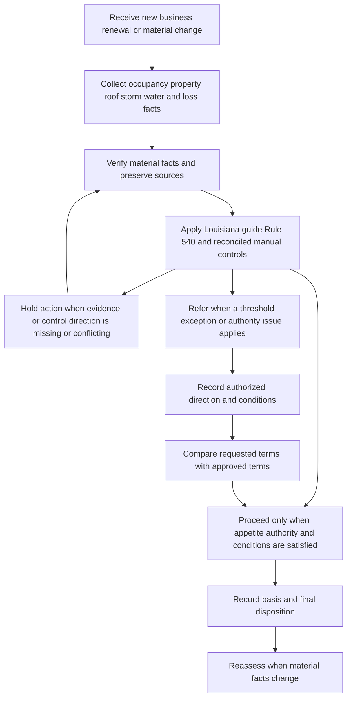

# Louisiana Homeowners Appetite Guidance

> **Internal carrier direction:** This page is internal underwriting guidance. It is not a Louisiana law summary, policy provision, endorsement, bulletin, coverage grant, exclusion, or claim determination. Apply the Louisiana Homeowners Appetite Guide and Rule 540 for carrier risk-selection and referral decisions; apply the issued policy, declarations, attached forms, and applicable bulletins separately for contractual and regulatory effects.

## Scope and source boundaries

**Internal carrier direction:** Use the Louisiana Homeowners Appetite Guide to decide whether a submission fits Louisiana appetite and when it must be referred. Use Rule 540, *Louisiana State Exceptions*, to implement the state-specific binding, roof, storm, water, loss-history, exception, rating, and record controls. The guide itself says that the insuring agreement and declarations establish the insurance offered and that the guide must not be treated as a policy, endorsement, binder, or coverage grant ([Louisiana Homeowners Appetite Guide, H.0.1-H.0.4](repo://guidelines/appetite/la-homeowners.md#L13-L30), [H.0.22](repo://guidelines/appetite/la-homeowners.md#L107-L109)).

**Internal carrier direction:** Keep four layers separate when reviewing a Louisiana account:

1. **Carrier appetite:** the Louisiana guide's eligibility, condition, roof, storm, water, and prior-loss direction.
2. **Carrier authority:** Louisiana guide H.7 and Rule 540 determine who may bind, who must review an exception, and what must be retained.
3. **Contract:** the declarations and attached policy or HO 01 17 endorsement determine coverage, deductible mechanics, named-storm-period operation, claim duties, and payment obligations.
4. **Bulletin controls:** LDI-2012-05 or LDI-2020-07 governs the applicable notice, filing, disclosure, record, and administration requirements for the relevant policy period.

**Internal carrier direction:** Do not turn a guide threshold into a Louisiana-law statement or a policy exclusion. A Louisiana roof-age decline, storm referral, water-backup referral, or prior-loss referral is an internal acceptance decision. It does not by itself establish that a later claim is excluded or that a deductible applies. Resolve coverage questions under the contract and the applicable bulletin regime. The related [Louisiana State Overlay](/openwiki/state-overlays/louisiana.md) and [Windstorm, Hail, and Percentage Deductibles](/openwiki/coverage/perils/wind-hail-deductibles.md) pages provide the date-sensitive contract and bulletin analysis.

### Reconcile the guide with general manual rules

The repository contains general product rules as well as Louisiana-specific guidance. Do not silently merge their different thresholds. For this Louisiana page, apply the Louisiana guide and Rule 540 as the state-specific appetite and authority controls; escalate an implementation conflict through underwriting management before binding rather than selecting whichever threshold is more convenient. The manual requires unclear direction to be escalated and forbids local practice that conflicts with carrier controls ([Manual Rule 100.P](repo://manuals/underwriting/manual.md#L105-L109), [Rule 100.M-100.N](repo://manuals/underwriting/manual.md#L87-L97)).

- **Coverage A floor:** the Louisiana guide states a **$125,000** minimum, while general HO-3 Rule 110 states **$150,000**. This page uses the Louisiana guide's **$125,000-$750,000** state appetite range, Rule 540's **$500,000** line authority, and Rule 540's **$750,000** state ceiling; do not replace those state controls with Rule 110 without recorded reconciliation ([Louisiana guide, H.1.1-H.1.2](repo://guidelines/appetite/la-homeowners.md#L111-L119), [Manual Rule 110.A-110.B](repo://manuals/underwriting/manual.md#L315-L327), [Rule 540.B-540.C](repo://manuals/underwriting/manual.md#L7195-L7205)).
- **Roof age:** general Rule 210 calls for inspection at **15 years** and declines at **25 years**, while Louisiana Rule 540 declines at or above **20 years**. Treat Rule 540's Louisiana disposition as the state control described here; do not blend the general triggers into the Louisiana decision without resolving the conflict ([Manual Rule 210.A-210.C](repo://manuals/underwriting/manual.md#L2213-L2229), [Rule 540.A](repo://manuals/underwriting/manual.md#L7189-L7193)).
- **Wind mitigation:** the Louisiana guide requires an inspection before binding when Coverage A exceeds **$500,000**, while general Rule 200 requires one above **$750,000**. Use the Louisiana guide's lower state trigger for this page and hold or escalate any workflow that can enforce only the general threshold ([Louisiana guide, H.3.3-H.3.4](repo://guidelines/appetite/la-homeowners.md#L620-L631), [Manual Rule 200.F](repo://manuals/underwriting/manual.md#L1995-L1999)).

These are internal control reconciliations, not policy or regulatory coverage statements. Retain the source values and the management direction used when a system, product rule, or delegated authority does not align.

## Operating flow

**Internal carrier direction:** Complete the fact and evidence review before binding, renewing, changing terms, or communicating a final underwriting outcome. Hold the affected action when a material fact is missing, conflicting, or governed by an unresolved source conflict; refer when the guide or authority rules require it; and bind only the approved terms after the record supports the decision.

*This flow shows the internal Louisiana underwriting control path; it does not determine coverage, deductible application, or legal notice compliance.*

## Appetite and authority gates

### Coverage A and binding authority

**Internal carrier direction:** Treat **$125,000** as the Louisiana guide's minimum Coverage A amount and **$750,000** as its maximum. Coverage A below the minimum is not in the guide's bindable range; a requested amount above the maximum is outside Louisiana appetite and requires an authorized disposition rather than an informal limit reduction ([Louisiana guide, H.1.1-H.1.2](repo://guidelines/appetite/la-homeowners.md#L111-L119)).

**Internal carrier direction:** A line underwriter may bind only within the Louisiana line authority of **$500,000**. Refer a request above that authority, and do not write Coverage A above **$750,000**. The Louisiana state exception rules require documentation of the reviewer, approval, declination, or exception; the guide also prohibits reducing a requested limit solely to avoid referral ([Louisiana guide, H.7.1-H.7.10](repo://guidelines/appetite/la-homeowners.md#L1375-L1419), [Manual Rule 540.B-540.C](repo://manuals/underwriting/manual.md#L7195-L7205)).

**Internal carrier direction:** Bind only the coverages, limits, deductibles, endorsements, effective dates, and occupancy that are within delegated authority and supported by the submission. Do not bind with an unresolved condition, waive an eligibility requirement, use another account's approval, or treat silence as approval. A referral becomes actionable only when the recorded approval addresses the requested terms and conditions ([Louisiana guide, H.7.5-H.7.21](repo://guidelines/appetite/la-homeowners.md#L1395-L1465), [H.7.27-H.7.35](repo://guidelines/appetite/la-homeowners.md#L1488-L1524)).

### Occupancy, construction, and general condition

**Internal carrier direction:** Prefer owner-occupied primary residences. Seasonal or secondary residences may be considered only when regular care, maintenance, and protection are demonstrated. Refer or decline vacant, uninhabitable, materially restored, unusual-construction, nonstandard-occupancy, transient-lodging, or commercial-use exposures according to the guide's fact pattern; do not assume that a future correction will occur ([Louisiana guide, H.1.3-H.1.11](repo://guidelines/appetite/la-homeowners.md#L121-L160), [H.1.29-H.1.40](repo://guidelines/appetite/la-homeowners.md#L237-L286), [Manual Rule 540.W-540.AA](repo://manuals/underwriting/manual.md#L7321-L7349)).

**Internal carrier direction:** Evaluate construction, exterior integrity, utilities, heating, electrical systems, access, detached structures, protective features, premises hazards, and insurable interest as part of the same risk picture. Refer unusual construction, unsafe systems, unresolved structural conditions, material discrepancies, and property facts that cannot be verified. Record the evidence, the adverse condition, the action taken, and any approval condition ([Louisiana guide, H.1.17-H.1.28 and H.1.53-H.1.65](repo://guidelines/appetite/la-homeowners.md#L184-L217), [L340-L396](repo://guidelines/appetite/la-homeowners.md#L340-L396), [Manual Rule 540.P-540.R and 540.AS-540.AU](repo://manuals/underwriting/manual.md#L7279-L7295), [L7453-L7469](repo://manuals/underwriting/manual.md#L7453-L7469)).

**Internal carrier direction:** Do not rely on an applicant assertion when the file contains contrary inspection, photograph, claim, or property information. Resolve the conflict or refer it; do not select the favorable version. The manual's general control also requires current reliable information, verification of material characteristics, and pre-bind documentation ([Manual Rule 100.H-100.J](repo://manuals/underwriting/manual.md#L57-L73), [Rule 100.S-100.Y](repo://manuals/underwriting/manual.md#L123-L163)).

## Roof controls

**Internal carrier direction:** Treat roof age **at or above 20 years** as outside Louisiana appetite and decline under Rule 540.A. Establish age from reliable evidence; refer missing or conflicting age information, unsupported replacement statements, unknown material, and repairs that do not establish the age or condition of the complete roof system ([Louisiana guide, H.2.1-H.2.7](repo://guidelines/appetite/la-homeowners.md#L400-L434), [Manual Rule 540.A and 540.E-540.F](repo://manuals/underwriting/manual.md#L7189-L7193), [L7213-L7223](repo://manuals/underwriting/manual.md#L7213-L7223)).

**Internal carrier direction:** Refer or decline on present condition, not on age alone. Do not bind active leakage, missing or damaged covering, temporary or incomplete repairs, impaired drainage, damaged flashing or penetrations, sagging, deck deterioration, exposed underlayment, moisture-related deterioration, or an unassessable roof. Require evidence of completed correction before treating a condition as resolved ([Louisiana guide, H.2.8-H.2.24](repo://guidelines/appetite/la-homeowners.md#L436-L517), [Manual Rule 540.D and 540.G-540.M](repo://manuals/underwriting/manual.md#L7207-L7259), [Manual Rule 210.E-210.P](repo://manuals/underwriting/manual.md#L2237-L2301)).

**Internal carrier direction:** Keep the Louisiana **20-year eligibility rule** separate from any contract settlement or claim question. Do not tell an insured that the guide's age or condition rule excludes a roof claim. The applicable policy and endorsements control coverage and settlement after a loss; the guide itself prohibits using internal guidance to alter filed forms or declarations ([Louisiana guide, H.0.3-H.0.4 and H.2.34-H.2.37](repo://guidelines/appetite/la-homeowners.md#L24-L30), [L564-L582](repo://guidelines/appetite/la-homeowners.md#L564-L582)).

## Wind, hail, and named-storm controls

**Internal carrier direction:** Obtain a wind-mitigation inspection before binding when Coverage A exceeds **$500,000**. An unavailable inspection is not satisfactory mitigation evidence. Refer material roof alterations, conflicting mitigation information, unresolved storm damage, or inconsistent application and inspection facts ([Louisiana guide, H.3.1-H.3.7](repo://guidelines/appetite/la-homeowners.md#L612-L643)). Because general Manual Rule 200.F uses a different **$750,000** trigger, apply the Louisiana guide's lower trigger for this state workflow and escalate any system or authority conflict rather than silently using the higher general threshold ([Manual Rule 200.F](repo://manuals/underwriting/manual.md#L1995-L1999), [Manual Rule 100.P](repo://manuals/underwriting/manual.md#L105-L109)).

**Internal carrier direction:** Apply only the deductible terms available under the issued policy and approved underwriting setup. Do not offer terms below the internal hurricane or windstorm deductible floor, above the maximum permitted named-storm deductible, or with an unapproved waiver or alteration. Rule 540 also requires referral when the maximum windstorm-and-hail percentage is unavailable for selection or when a submission is outside the named-storm window. Provide any required deductible-change communication through the controlled process; these are internal selection and administration controls, not a substitute for the contract or bulletin ([Louisiana guide, H.3.8-H.3.14](repo://guidelines/appetite/la-homeowners.md#L645-L671), [Manual Rule 540.BA-BB](repo://manuals/underwriting/manual.md#L7501-L7511), [HO 01 17, T.1-T.3](repo://forms/HO/LA/HO-01-17/2020-09.md#L59-L67), [LDI-2020-07, B.2.13-B.2.16](repo://bulletins/LA/ldi-2020-07-hurricane-deductible.md#L85-L91)).

**Internal carrier direction:** When a storm claim is reported, preserve the causal facts rather than applying a deductible because a storm was named. HO 01 17, when attached and applicable, makes the contractual windstorm-and-hail deductible apply to covered direct physical loss caused by windstorm or hail, including covered wind-driven rain entering through a storm-created opening; it sets a **2% to 5%** range, applies the deductible before payment, and allocates mixed causes and related occurrences under its own terms ([HO 01 17, T.1-T.20](repo://forms/HO/LA/HO-01-17/2020-09.md#L59-L99)).

**Internal carrier direction:** For a policy in the current bulletin regime, treat LDI-2020-07 as a disclosure and administration control, not as a replacement for the attached contract. The bulletin applies to affected personal residential property business issued, delivered, renewed, or modified on or after **July 15, 2020**, requires consistent contract-based administration, and requires disclosure of the trigger, calculation basis, deductible relationship, and named-storm information ([LDI-2020-07, B.1.21-B.2.16](repo://bulletins/LA/ldi-2020-07-hurricane-deductible.md#L51-L91)).

**Internal carrier direction:** Use the contractual Named Storm Period only when the applicable policy contains the HO 01 17 provision or equivalent language. Under HO 01 17, the period begins when the designation takes effect and continues **72 hours** after it ends; loss timing comes from the facts, not merely the date damage was discovered or the fact that a storm was named ([HO 01 17, T.1-T.6 of T.3](repo://forms/HO/LA/HO-01-17/2020-09.md#L261-L273)). LDI-2020-07 requires the disclosure to state that 72-hour continuation when the policy uses that named-storm provision ([LDI-2020-07, B.3.10-B.3.22](repo://bulletins/LA/ldi-2020-07-hurricane-deductible.md#L199-L223)).

**Internal carrier direction:** Do not import the 2020 72-hour contract or disclosure rule into a policy governed only by the earlier position. LDI-2012-05 is marked superseded for the later policy period but remains relevant to policies written under it; its notice rules required the insurer to identify the trigger and basis and capped the windstorm and hail deductible at **5% of insured value**, without prescribing the later fixed 72-hour named-storm period ([LDI-2012-05, metadata and supersession](repo://bulletins/LA/ldi-2012-05-hurricane-deductible.md#L1-L9), [B.2.1-B.2.12](repo://bulletins/LA/ldi-2012-05-hurricane-deductible.md#L47-L71), [B.2.4-B.2.8](repo://bulletins/LA/ldi-2012-05-hurricane-deductible.md#L55-L65)).

**Internal carrier direction:** Before a windstorm deductible increase is applied, verify the contract, bulletin regime, notice content, delivery record, and effective date. The 2020 bulletin requires at least **30 days** advance written notice before an increased windstorm deductible takes effect; HO 01 17 also requires at least **30 days** and applies a change prospectively to losses occurring on or after its effective date ([LDI-2020-07, B.3.4-B.3.8](repo://bulletins/LA/ldi-2020-07-hurricane-deductible.md#L187-L197), [HO 01 17, T.1-T.10 of T.2](repo://forms/HO/LA/HO-01-17/2020-09.md#L211-L235)).

## Water, plumbing, drainage, and backup controls

**Internal carrier direction:** Refer or decline active water intrusion, wet materials, moisture staining, mold, unresolved below-grade entry, adverse grading, roof runoff toward the foundation, deteriorated plumbing, unsafe water-heater installation, recurring appliance leakage, inaccessible shutoffs, freeze or burst-pipe history without correction, and incomplete or unsupported plumbing restoration. Do not bind while active leakage or another material water condition remains unresolved ([Louisiana guide, H.4.1-H.4.12](repo://guidelines/appetite/la-homeowners.md#L761-L822), [Manual Rule 220.A-220.P](repo://manuals/underwriting/manual.md#L2605-L2699), [Manual Rule 540.M and 540.AW-540.AZ](repo://manuals/underwriting/manual.md#L7261-L7265), [L7477-L7499]).

**Internal carrier direction:** Obtain the water path and repair evidence before deciding. Identify whether the reported exposure is plumbing discharge, sewer or drain backup, sump overflow, roof or exterior entry, surface water, flood, seepage, or another source. Refer recurring similar losses, unexplained staining, unsupported repairs, mixed causes, and any open or unresolved source; document source, affected areas, mitigation, repair status, and disposition ([Louisiana guide, H.4.13-H.4.40](repo://guidelines/appetite/la-homeowners.md#L824-L963), [Manual Rule 220.Q-220.BI](repo://manuals/underwriting/manual.md#L2701-L2969)).

**Internal carrier direction:** Refer a requested water-backup limit above **$25,000** and do not issue that requested limit without authorized approval. Apply the available approved backup deductible and record the authority source. This is an internal Manual threshold, not a Louisiana coverage limit; the attached endorsement and declarations control any actual water-backup grant, limit, and deductible ([Manual Rule 220.V-220.X](repo://manuals/underwriting/manual.md#L2731-L2747), [Manual Rule 100.C-100.D](repo://manuals/underwriting/manual.md#L27-L37)).

**Internal carrier direction:** The Louisiana guide's instruction to report a claimed water-backup loss within **60 days** is an internal handling instruction tied by the guide to its Loss Notice discussion. Do not present that number as a universal policy or Louisiana-law deadline without checking the policy and applicable law ([Louisiana guide, H.4.3-H.4.6](repo://guidelines/appetite/la-homeowners.md#L773-L792)). For HO 01 17, use the form's actual claim duties and deadlines: it requires acknowledgment within **14 days**, acceptance or rejection within **30 business days** after requested items are received, and payment of an accepted claim within **30 business days** ([HO 01 17, T.1-T.6 of T.5](repo://forms/HO/LA/HO-01-17/2020-09.md#L427-L439)).

**Internal carrier direction:** Do not describe a water referral as a water exclusion or treat the deductible as a coverage grant. HO 01 17's seacoast provisions exclude flood, surface water, waves, tidal water, and storm surge under the cited contract terms, while the endorsement otherwise applies only to coverage the policy provides; the contract and attached coverage endorsement—not Rule 540—answer the claim question ([HO 01 17, T.0](repo://forms/HO/LA/HO-01-17/2020-09.md#L13-L31), [T.6.17-T.6.22](repo://forms/HO/LA/HO-01-17/2020-09.md#L561-L575)).

## Prior losses, exceptions, and referral package

**Internal carrier direction:** Obtain available prior-loss information before binding. Refer an account with **2 paid property claims within the prior 5 years**, and do not bind until underwriting records a decision. Review paid, unpaid, open, closed-without-payment, and other reported losses for cause, location, recurrence, severity, repair status, and continuing hazard; the 2-in-5 threshold is an internal referral trigger, not a policy limit or Louisiana law ([Louisiana guide, H.5.1-H.5.10](repo://guidelines/appetite/la-homeowners.md#L967-L990), [Manual Rule 540.AK-540.AQ](repo://manuals/underwriting/manual.md#L7405-L7445)).

**Internal carrier direction:** Refer repeated water, roof, weather, fire, theft, liability, structural, mold, rot, or deterioration losses; open claims; unexplained or undisclosed losses; incomplete repair evidence; conflicting loss information; and losses suggesting changed occupancy, business use, renovation, or structural conditions. Do not treat claim closure or payment by another party as proof that the present property is repaired ([Louisiana guide, H.5.11-H.5.33](repo://guidelines/appetite/la-homeowners.md#L1011-L1109), [Manual Rule 540.AK-540.AQ](repo://manuals/underwriting/manual.md#L7405-L7445)).

**Internal carrier direction:** A usable referral package must state the requested decision, threshold or exception, Coverage A and requested terms, prior-loss dates and causes, payment and claim status, damaged property, repair and mitigation status, source documents, unresolved conflicts, and the authority requested. Retain the referral, supporting facts, approval or decline, conditions, approver, and final disposition. Rule 540.E specifically requires support for every Louisiana exception decision ([Louisiana guide, H.5.37-H.5.43](repo://guidelines/appetite/la-homeowners.md#L1125-L1152), [Manual Rule 540.BD-540.BE](repo://manuals/underwriting/manual.md#L7519-L7529)).

**Internal carrier direction:** Apply a Louisiana state-exception credit only when the required risk information supports it. A requested exception to a Louisiana eligibility criterion must be referred before binding or issuing, and the file must retain the final eligibility, authority, rating, and exception decisions. Rule 540.BC-BE are internal rating, authority, and record controls; they do not amend the policy or bulletin ([Manual Rule 540.BC-540.BE](repo://manuals/underwriting/manual.md#L7513-L7529), [Manual Rule 100.C-100.D](repo://manuals/underwriting/manual.md#L27-L37)).

## Claims-handling boundary

**Internal carrier direction:** Use the guide's handling steps as internal file discipline: open the claim, verify the named insured, mortgagee, and location, document the initial condition, request material evidence, distinguish cause from resulting damage, inspect when necessary, preserve communications, and document payment or denial rationale. The guide's **7-day** mitigation instruction is internal carrier direction and must not be represented as a new policy exclusion or regulatory deadline ([Louisiana guide, H.6.1-H.6.18](repo://guidelines/appetite/la-homeowners.md#L1156-L1227)).

**Internal carrier direction:** For a Louisiana storm or water claim, determine coverage and causation before applying a deductible; identify the policy edition and attached endorsement; document weather, inspection, photographs, repair, and source evidence; and keep covered damage separate from excluded or unrelated damage. LDI-2020-07 requires a reasonable investigation, a named-storm-period determination before applying a period-dependent deductible, a plain-language explanation identifying the policy provision, and no delay to covered damage merely because deductible applicability is disputed ([LDI-2020-07, B.4.1-B.4.20](repo://bulletins/LA/ldi-2020-07-hurricane-deductible.md#L257-L297)).

**Internal carrier direction:** Apply HO 01 17's contractual claim sequence when that endorsement governs: acknowledge within 14 days, decide within 30 business days after receiving requested items, pay an accepted claim within 30 business days, and preserve the policy's information, inspection, cooperation, proof-of-loss, and undisputed-payment provisions. A legal action deadline in the form is **2 years after the date of loss**, subject to applicable law and the form's other conditions ([HO 01 17, T.1-T.16 of T.5](repo://forms/HO/LA/HO-01-17/2020-09.md#L427-L461), [T.31-T.50](repo://forms/HO/LA/HO-01-17/2020-09.md#L489-L527), [T.1-T.8 of T.7](repo://forms/HO/LA/HO-01-17/2020-09.md#L597-L613)).

## Renewal and adverse-action handoff

**Internal carrier direction:** Re-review every Louisiana renewal for changes in eligibility, exposure, valuation, occupancy, loss potential, unresolved conditions, repair completion, roof and water condition, inspection currency, and conflicting information. Rule 700 requires the review and referral of material changes, and its current-term rule refers a renewal with **2 paid property claims**; these are internal renewal controls, not automatic nonrenewal grounds ([Manual Rule 700.A-700.F](repo://manuals/underwriting/manual.md#L9131-L9165), [700.M-700.S](repo://manuals/underwriting/manual.md#L9203-L9243)).

**Internal carrier direction:** Do not issue cancellation or nonrenewal communications from this page's appetite thresholds alone. Classify the action, obtain authority, and calculate the external notice content, delivery, and timing from the applicable Louisiana law, bulletin, policy form, and effective-date position. Use [Renewal and Adverse Action](/openwiki/underwriting/manual/renewal-and-adverse-action.md) for that internal workflow and legal-notice separation.

## Focused control checks

**Internal carrier direction:** Before finalizing a Louisiana account, verify these high-value cases:

- **Coverage A:** $125,000 is the Louisiana guide floor; $500,000 is the Louisiana line-authority ceiling; above $500,000 requires referral; above $750,000 is outside the state appetite ceiling. Do not lower the requested limit merely to avoid referral. If general Rule 110's $150,000 HO-3 floor is surfaced, retain the conflict and management direction rather than silently blending rules.
- **Roof:** age at or above 20 years is a Louisiana decline under Rule 540; missing or conflicting age, active leakage, unresolved damage, or unsupported repair evidence requires referral or hold. Do not reuse the 20-year rule as a claim exclusion.
- **Storm:** above $500,000 Coverage A requires a wind-mitigation inspection under the Louisiana guide; general Rule 200's $750,000 trigger is not a reason to defer the lower Louisiana control. Rule 540 also refers submissions outside the internal named-storm window or without the maximum windstorm-and-hail percentage available for selection. For an HO 01 17 claim, verify covered wind or hail causation and the contractual named-storm period before applying the deductible; a storm name alone is insufficient.
- **Water:** active intrusion is not bindable under Rule 540; recurring or unsupported water loss is referred; a requested water-backup limit above $25,000 requires authority. The guide's 60-day water-backup instruction and 7-day mitigation instruction remain internal controls unless the governing contract or law independently supplies the same deadline.
- **Loss history:** 2 paid property claims in the prior 5 years require referral; open, unexplained, recurring, undisclosed, or unrepaired loss information also requires review.
- **Exceptions:** verify any state-exception credit, route any eligibility exception before binding or issuing, and retain supporting facts, authority, rating basis, conditions, and final disposition under Rule 540.BC-BE.
- **Referral status:** pending referral is not approval. Bind only after the recorded authority matches the requested terms and all conditions are satisfied.

**Internal carrier direction:** Record the facts, source, rule or threshold, authority used, referral reason, approval conditions, final disposition, and any later reassessment. For related interpretation, use [Referral and Authority Guidance](/openwiki/underwriting/guidelines/referral-authority.md), [Property and Water Risk Controls](/openwiki/underwriting/manual/property-and-water-risk.md), [Manual State Exception Controls](/openwiki/underwriting/manual/state-exceptions.md), and [Windstorm, Hail, and Percentage Deductibles](/openwiki/coverage/perils/wind-hail-deductibles.md).
