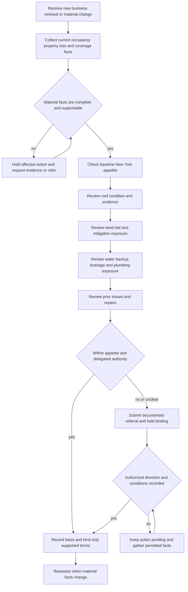

# New York Appetite

## Status, scope, and governing boundary

This page restates the **New York Homeowners Appetite Guide** as operational **internal carrier direction** for new business, renewals, changes to existing risks, and related file handling. It is not New York law, a DFS bulletin, a policy term, a coverage determination, or a promise of acceptance, renewal, pricing, or payment. The applicable declarations, policy, endorsements, New York overlay, and law control the external result. Do not use an appetite decision to create, remove, limit, or interpret coverage ([New York guide H.0.1-H.0.4](repo://guidelines/appetite/ny-homeowners.md#L13-L23), [H.0.18-H.0.22](repo://guidelines/appetite/ny-homeowners.md#L49-L57); [Manual Rules 100.B-100.D](repo://manuals/underwriting/manual.md#L21-L37)).

Use the complete submission rather than one isolated characteristic. Obtain current and reliable facts, verify material representations, request supporting evidence where the file is incomplete, and document the basis for an acceptance, condition, referral, decline, or exception. A missing or conflicting fact is not favorable evidence, and a referral is not approval; do not bind until required underwriting direction is recorded ([New York guide H.0.4-H.0.13](repo://guidelines/appetite/ny-homeowners.md#L21-L39), [H.0.19-H.0.20](repo://guidelines/appetite/ny-homeowners.md#L49-L53); [Manual Rules 100.H-100.J](repo://manuals/underwriting/manual.md#L57-L73)).

### Internal decision path

*This flow shows the internal New York appetite and authority lifecycle; it does not decide coverage or replace external notice requirements.*

## Baseline New York appetite

The internal New York appetite permits Coverage A from **$200,000 through $1,500,000**, permits protection class through **8**, and is aimed at an owner-occupied dwelling used as the applicant’s principal residence. The dwelling should have ordinary residential construction, a supportable replacement-cost estimate, maintained exterior and building systems, reliable water and sanitary service, safe access, and complete occupancy and loss information. These are internal eligibility positions, not policy limits or statements of New York law ([New York guide H.1.1-H.1.15](repo://guidelines/appetite/ny-homeowners.md#L59-L89), [H.1.21-H.1.29](repo://guidelines/appetite/ny-homeowners.md#L101-L117)).

Customary residential amenities, detached structures, ordinary household property, incidental home activity that does not change the residential character, and ordinary recreational features may fit when the condition, use, and safety controls are disclosed and supportable. Unusual features, material renovation, unusual ownership or occupancy, active condemnation, imminent loss, known existing damage, or incomplete material information require internal review rather than an assumption of eligibility ([New York guide H.1.16-H.1.32](repo://guidelines/appetite/ny-homeowners.md#L91-L123), [H.1.43-H.1.55](repo://guidelines/appetite/ny-homeowners.md#L143-L169)).

### Coverage A and authority are separate checks

The appetite ceiling is not delegated binding authority. The guide gives the handler a **$750,000 Coverage A line authority** and requires referral above that amount; it also requires a reliable valuation and prohibits reducing Coverage A merely to force a risk inside authority. Requests above the $750,000 line must be referred before binding, while the broader internal appetite ceiling remains $1,500,000. Record the requested amount, accepted valuation, authority used, referral reason, approving direction, and any conditions ([New York guide H.7.1-H.7.14](repo://guidelines/appetite/ny-homeowners.md#L631-L661)).

Do not split a risk, use an unsupported value, rely only on a prior insurer’s limit, or use a lower limit to evade referral. A material change after approval requires reassessment and, where applicable, renewed direction. The manual’s New York exception rule independently says to bind Coverage A only up to $750,000 and to retain the disposition, so use the manual for this carrier authority control and not as a policy limit ([New York guide H.7.15-H.7.35](repo://guidelines/appetite/ny-homeowners.md#L661-L701); [Manual Rule 530.A](repo://manuals/underwriting/manual.md#L6855-L6861)).

### Manual property overlays and exact referral triggers

The guide’s baseline eligibility position does not eliminate a separate manual referral. Rule 530 requires internal review for vacancy, short-term lodging, business activity or business indicators, agricultural or animal exposure beyond ordinary household use, specified recreational hazards, unrepaired roof or exterior damage, unsafe openings or structures, water intrusion, unverified plumbing repairs, unsafe electrical or heating conditions, waterfront or erosion concerns, structural alterations or renovation, and disputed or nonstandard ownership or occupancy. It also requires referral when mailing, premises, or carrier-record information materially conflicts. Referral means hold the affected action and obtain direction; it is not an automatic coverage result or declination ([Manual Rule 530.E-530.BB](repo://manuals/underwriting/manual.md#L6881-L7179)).

This matters where the two internal layers use different words. The guide permits incidental home activity when it does not change the residential character, but the manual still requires any business activity at the premises to be evaluated before binding. Apply the manual’s referral control without presenting it as a New York legal requirement, and retain the activity, evidence, disposition, and any conditions ([New York guide H.1.16-H.1.18](repo://guidelines/appetite/ny-homeowners.md#L168-L180); [Manual Rule 530.F-530.I](repo://manuals/underwriting/manual.md#L6887-L6909)).

## Roof age, condition, and evidence

Treat roof age as a review signal, not as a substitute for condition evidence. The internal guide requires the roof to be serviceable, weather-tight, and free of material deterioration; it requires clear exterior images when condition cannot otherwise be confirmed and referral when images show missing, lifted, cracked, curled, displaced, repeatedly patched, temporary, incomplete, or otherwise unreliable surfacing. Do not bind an active leak or unresolved water entry, and do not rely only on an applicant’s statement that the roof is sound ([New York guide H.2.1-H.2.9](repo://guidelines/appetite/ny-homeowners.md#L171-L189), [H.2.42-H.2.50](repo://guidelines/appetite/ny-homeowners.md#L255-L271)).

The manual adds an exact internal age control that must not be confused with the guide’s condition analysis or with contract settlement: Rule 900 sends a roof at or beyond **25 years** to declination processing and prohibits binding unless an authorized exception is recorded. Age alone is not a policy exclusion or an actual-cash-value determination; document the age source, condition evidence, and any authorized exception separately ([Manual Rule 900.D](repo://manuals/underwriting/manual.md#L9885-L9889); [New York guide H.2.27](repo://guidelines/appetite/ny-homeowners.md#L445-L448); [HO 01 31 T.57-T.58](repo://forms/HO/NY/HO-01-31/2016-04.md#L171-L175)).

Review the entire roof system, including drainage, flashing, skylights, valleys, edges, roof-mounted equipment, concealed faces, attic evidence, and interior staining. Request additional imagery or contractor documentation when areas cannot be evaluated. Distinguish full replacement from repair, recoating, overlay, or maintenance; recent work does not establish that the entire roof is new. Refer layered surfacing, unknown material, material discrepancies, unsafe access, sagging or uneven decking, ponding, visible deterioration, or evidence of continuing moisture ([New York guide H.2.10-H.2.41](repo://guidelines/appetite/ny-homeowners.md#L191-L253)).

Reliable repair records may support reconsideration only when they identify the completed work and affected areas and are consistent with observed condition. Require evidence of completed correction before removing a roof referral, document the final decision and supporting evidence, and escalate unusual construction or specialized surfacing. These controls govern eligibility; they do not establish a roof exclusion or determine settlement of a roof claim ([New York guide H.2.44-H.2.60](repo://guidelines/appetite/ny-homeowners.md#L257-L291); [HO 01 31 T.14-T.18 and T.43-T.45](repo://forms/HO/NY/HO-01-31/2016-04.md#L41-L57)).

## Wind, hail, and storm controls

For Coverage A above **$1,000,000**, obtain a wind mitigation inspection from an acceptable qualified inspector and retain it in the underwriting file. Review roof-to-wall connections, roof geometry, opening protection, and consistency with the application. Refer incomplete or conflicting mitigation information; do not credit an applicant description over an inspection finding ([New York guide H.3.1-H.3.6](repo://guidelines/appetite/ny-homeowners.md#L293-L305)).

Ordinary wind exposure may fit when the property is maintained and no material roof concern is present. Refer visible roof deterioration, unrepaired storm damage, temporary coverings, exposed sheathing, unusual exterior features, extensive glazing or unprotected openings, hazardous trees, unusual construction, or recurring wind and hail losses that are not reasonably explained. Obtain evidence that repairs and mitigation are complete before relying on a prior storm loss as resolved ([New York guide H.3.7-H.3.26](repo://guidelines/appetite/ny-homeowners.md#L307-L345)).

The internal guide directs the underwriter to apply the deductible shown in the issued policy during claim handling and to refer uncertainty about storm designation, event timing, or deductible applicability to claims leadership. Those are internal handling controls, not a contract amendment or coverage decision ([New York guide H.3.29-H.3.49](repo://guidelines/appetite/ny-homeowners.md#L351-L391)). Under the attached HO 01 31 endorsement, the windstorm and hail deductible applies only to covered direct physical loss caused by windstorm or hail, must be between **1% and 5%**, is applied after coverage limitations, and is generally single per occurrence; the endorsement does not create coverage for excluded water, wear, deterioration, faulty work, or other excluded causes ([HO 01 31 T.1-T.4](repo://forms/HO/NY/HO-01-31/2016-04.md#L59-L75), [T.26-T.35](repo://forms/HO/NY/HO-01-31/2016-04.md#L111-L129), [T.45-T.55](repo://forms/HO/NY/HO-01-31/2016-04.md#L149-L169)).

For a reported storm loss, preserve photographs, weather information, repair records, and damaged property when practical; inspect before disposal or permanent repair where reasonably possible; distinguish direct wind or hail damage from wear, deterioration, maintenance failure, and preexisting damage; and do not infer covered causation merely because a storm occurred nearby. The contract’s named-storm period determination likewise does not by itself establish causation or select a deductible ([New York guide H.3.40-H.3.45](repo://guidelines/appetite/ny-homeowners.md#L371-L383); [HO 01 31 named-storm period T.1-T.10](repo://forms/HO/NY/HO-01-31/2016-04.md#L261-L281)).

## Water, drainage, and backup

Offer water-backup treatment only when premises, plumbing, drainage, and maintenance information support a manageable exposure. Identify the water path and distinguish backup through a drain, sewer, sump, or related system from surface water, flood, seepage, plumbing discharge, roof entry, and other causes. Review lower-level finished areas, drains, sumps, ejector systems, backflow devices, municipal or neighborhood drainage concerns, recurring backups, slow drains, odors, and altered plumbing ([New York guide H.4.1-H.4.13](repo://guidelines/appetite/ny-homeowners.md#L393-L419)).

Refer recurring drainage concerns, unclear source or repair status, poor maintenance, unresolved plumbing conditions, and mixed or competing causes. Request photographs, invoices, repair records, contractor observations, and source determinations where concealed piping or drainage components are involved. A closed prior claim or a backflow device does not by itself establish that the current exposure is resolved or that a later loss is covered ([New York guide H.4.5-H.4.12](repo://guidelines/appetite/ny-homeowners.md#L403-L417), [H.4.17-H.4.19](repo://guidelines/appetite/ny-homeowners.md#L425-L431)).

A separate manual threshold applies to the requested limit: Rule 900 refers water-backup coverage above **$25,000** to underwriting authority and says not to quote the requested limit as available while review is pending. This is an internal limit-referral control; it does not establish that the cause is covered, create a water-backup endorsement, or replace the guide’s source-and-condition review ([Manual Rule 900.E](repo://manuals/underwriting/manual.md#L9891-L9895)).

The guide states an internal **60-day-after-discovery** diary and communication target for a suspected water-backup claim. Treat that as internal carrier direction, not a contractual deadline. The attached HO 01 31 claims provision controls the contract process: it requires prompt notice, reasonable mitigation, preservation of damaged property, and cooperation, and states acknowledgment within **15 days**, acceptance or rejection within **15 business days after requested information is received**, and payment of an accepted claim within **5 business days** ([New York guide H.4.14-H.4.16](repo://guidelines/appetite/ny-homeowners.md#L421-L427); [HO 01 31 claims T.1-T.10](repo://forms/HO/NY/HO-01-31/2016-04.md#L449-L467)).

Do not apply a water-backup sublimit until the reported cause fits the applicable endorsement, and do not describe an internal referral or limit review as a coverage denial. Separate emergency extraction, drying, or stabilization from permanent drainage improvements and betterment; document the facts, evidence, and applicable contract before any coverage position ([New York guide H.4.20-H.4.38](repo://guidelines/appetite/ny-homeowners.md#L433-L469); [HO 01 31 claims T.17-T.27](repo://forms/HO/NY/HO-01-31/2016-04.md#L479-L501)).

## Prior losses and referral handling

Obtain available loss history before binding. The New York guide requires referral when reported history includes **3 paid property claims within the preceding 3 years** and prohibits binding the referred risk until the underwriting decision is documented. This is an internal carrier threshold, not a New York legal rule, policy limit, or automatic coverage result ([New York guide H.5.1-H.5.6](repo://guidelines/appetite/ny-homeowners.md#L471-L483)).

Keep overlapping internal thresholds source-specific. Manual Rule 530.B says to refer any risk with **3 paid property claims** without restating the guide’s three-year lookback; Rule 700.D separately refers a renewal risk with **2 paid property claims during the current policy term**; and Rule 900.C requires three years of loss history and referral when that history is incomplete. Do not silently substitute one threshold for another: record the source and facts that triggered the control, then obtain direction where the rules overlap or the lookback is unclear ([Manual Rule 530.B](repo://manuals/underwriting/manual.md#L6863-L6867), [Manual Rule 700.D](repo://manuals/underwriting/manual.md#L9149-L9153), [Manual Rule 900.C](repo://manuals/underwriting/manual.md#L9879-L9883)).

Review each loss by cause, location, severity, disposition, repair status, recurrence, and relationship to current property condition. Refer unclear water, fire, theft, vandalism, weather, structural, system, liability, open, disputed, unresolved, or repair-unverified loss information. Do not treat a closed claim as proof that the underlying cause was corrected, accept a bare assurance that repairs were made, or select the most favorable interpretation of inconsistent sources ([New York guide H.5.7-H.5.22](repo://guidelines/appetite/ny-homeowners.md#L485-L515), [H.5.28-H.5.42](repo://guidelines/appetite/ny-homeowners.md#L527-L555)).

A usable referral package identifies the requested decision, each loss and its source, applicant explanation, repair or mitigation evidence, current property condition, unresolved conflict, requested authority, and proposed conditions. Retain the referral rationale, response, authority, and final disposition. Reassess before binding when new information arrives; do not clear the referral merely because the applicant intends to correct a condition ([New York guide H.5.23-H.5.30](repo://guidelines/appetite/ny-homeowners.md#L517-L531), [H.5.33-H.5.42](repo://guidelines/appetite/ny-homeowners.md#L537-L555); [Manual Rules 100.V-100.Y](repo://manuals/underwriting/manual.md#L141-L163)).

## Renewal, cancellation, and nonrenewal controls

### Internal renewal workflow

Review every renewal for changed eligibility, exposure, valuation, occupancy, condition, and loss potential. Recheck roof and exterior condition, water intrusion, plumbing, heating, electrical and mechanical systems, repairs from prior losses, current-term claims, inspection evidence, ownership and occupancy, and material changes. Use the current file rather than assuming that prior acceptance requires continued acceptance; refer unresolved material concerns and record the basis for the renewal decision ([New York guide H.0.3-H.0.10](repo://guidelines/appetite/ny-homeowners.md#L19-L37), [H.5.15-H.5.22](repo://guidelines/appetite/ny-homeowners.md#L501-L515); [Manual Rule 700.A-700.C](repo://manuals/underwriting/manual.md#L9129-L9147)).

Rule 700 adds two precise internal renewal controls: refer a renewal risk with **2 paid property claims during the current policy term**, and treat an inspection report as valid for **12 months**, obtaining updated information when it is older or conditions may have changed. It also requires referral for unclear, vacant, tenant, or business-related occupancy and for unresolved roof, exterior, water, or system conditions. These are carrier workflow rules, not New York notice periods, policy limits, or coverage determinations ([Manual Rule 700.D-700.I](repo://manuals/underwriting/manual.md#L9149-L9183), [700.M-700.S](repo://manuals/underwriting/manual.md#L9203-L9243)).

The internal New York exception rule requires a notice of intent not to renew only after underwriting direction is recorded and routes nonpayment through approved servicing. Rule 800 also lists internal task timings of **10 days** for a premium-default notice and **45 days** for a notice of intent not to renew. Those numbers are not the controlling New York notice periods; they must not shorten the applicable DFS or contract requirement. Before any customer-facing action, classify the transaction accurately, verify policy status and the underwriting basis, confirm the approved reason and authority, calculate the external deadline, and retain the action record ([Manual Rule 530.BC](repo://manuals/underwriting/manual.md#L7181-L7185), [Manual Rules 800.A-800.G](repo://manuals/underwriting/manual.md#L9497-L9539)). These are internal carrier procedures; they do not replace DFS or the attached form.

### External New York notice requirements

For the current DFS-2016-02 position represented in this repository, distinguish cancellation, which ends coverage before expiration, from nonrenewal, which declines continuation at expiration. The current minimum periods are **60 days before expiration for nonrenewal**, **20 days before the effective date for cancellation other than nonpayment**, and **15 days before the effective date for cancellation for nonpayment**. The written notice must identify the action, policy, insurer, affected coverage, effective date, and a sufficiently specific and accurate reason; nonpayment notices must identify the unpaid premium and cure method when applicable ([DFS-2016-02 B.1.1-B.1.10](repo://bulletins/NY/dfs-2016-02-nonrenewal.md#L13-L33), [B.3.1-B.3.17](repo://bulletins/NY/dfs-2016-02-nonrenewal.md#L145-L179)).

Maintain the approved notice form, completed fields, delivery evidence, electronic-delivery consent where required, reason support, correction history, and records of inquiries. A producer, administrator, or vendor may assist but does not assume the insurer’s responsibility. Claims-based adverse action requires relevant and accurate claims information, verification, distinction between a claim and an inquiry, correction of erroneous or misattributed records, a specific claims reason, and corrective action when disputed information undermines the notice ([DFS-2016-02 B.3.18-B.3.37](repo://bulletins/NY/dfs-2016-02-nonrenewal.md#L181-L219), [B.4.1-B.4.16](repo://bulletins/NY/dfs-2016-02-nonrenewal.md#L223-L255)).

Do not blend the historical DFS-2010-09 position with the current one. For a notice governed by the historical position, the source states **45 days before expiration for nonrenewal** and **20 days before cancellation for a reason other than nonpayment**; the 2010 source does not supply a numeric nonpayment-cancellation period in the cited provision. Select the policy and notice position applicable to the transaction before calculating a deadline ([DFS-2010-09 metadata and supersession](repo://bulletins/NY/dfs-2010-09-nonrenewal.md#L1-L9), [B.3.1-B.3.18](repo://bulletins/NY/dfs-2010-09-nonrenewal.md#L161-L197)).

### Renewal deductible changes

A change to the windstorm and hail deductible is a contract administration issue, not an appetite decision. HO 01 31 requires written notice identifying the changed deductible, affected coverage, and circumstances; the change applies only as stated and only to a loss after its stated effective date. Verify the attached edition, declarations, and applicable law before communicating or issuing a change ([HO 01 31 deductible-change T.1-T.9](repo://forms/HO/NY/HO-01-31/2016-04.md#L211-L229), [T.14-T.24](repo://forms/HO/NY/HO-01-31/2016-04.md#L239-L259)).

## DFS homeowners data-call handoff

The annual DFS-2018-11 data call is a regulatory reporting boundary, not an appetite rule or coverage amendment. An admitted insurer that writes, renews, services, administers, or maintains in-scope New York homeowners business remains responsible even when an affiliate, managing agent, administrator, vendor, or other service provider performs the work. Report by legal entity unless DFS permits another basis, keep affiliates identifiable, and use the insured-risk location rather than the servicing office to allocate policy data ([DFS-2018-11 B.1.1-B.1.8](repo://bulletins/NY/dfs-2018-11-data-call.md#L13-L29), [B.2.1-B.2.11](repo://bulletins/NY/dfs-2018-11-data-call.md#L47-L69)).

For appetite and claims operations, retain the source records needed to explain reported underwriting actions, property characteristics, deductibles, policy forms, cancellations, claims, causes, reserves, payments, closures, catastrophe indicators, and service-provider-handled activity. Reconcile the submission to policy and claim systems, preserve methodology and material assumptions, certify through an authorized person, correct material errors, and retain supporting records. The data call does not establish a deductible minimum, coverage term, or required appetite ([DFS-2018-11 B.2.22-B.2.43](repo://bulletins/NY/dfs-2018-11-data-call.md#L91-L133), [B.4.1-B.4.27](repo://bulletins/NY/dfs-2018-11-data-call.md#L247-L301), [B.5.1-B.5.16](repo://bulletins/NY/dfs-2018-11-data-call.md#L303-L335)).

## Claims and file controls

The guide’s internal claims procedure is to open or update a file promptly, capture loss date, location, parties, reported cause, receipt-acknowledgment timing, safety concerns, mitigation, photographs, estimates, invoices, inspections, prior damage, causation, subrogation, proof-of-loss requests, communications, and the final disposition. Begin reasonable mitigation within **7 days after discovery** as an internal diary and handling control, not as a replacement for the policy’s duties after loss ([New York guide H.6.1-H.6.18](repo://guidelines/appetite/ny-homeowners.md#L557-L593)).

Separate reported, observed, and unverified damage; distinguish sudden, accidental, gradual, repeated, and maintenance-related conditions; investigate before communicating a coverage position; and do not promise payment, repair, or coverage before the facts and applicable policy support it. Preserve material communications and evidence, refer suspected fraud neutrally, and close only after disposition, payments, communications, and outstanding issues are documented ([New York guide H.6.12-H.6.29](repo://guidelines/appetite/ny-homeowners.md#L581-L615), [H.6.35-H.6.36](repo://guidelines/appetite/ny-homeowners.md#L627-L629)).

Separate claims-authority triggers from coverage rules. Manual Rule 310 requires referral and a hold on binding authority for a reported loss at or above **$100,000**, and prohibits binding, renewal, or broader coverage while a claim is open; a disputed claim suspends underwriting action pending disposition. Rule 900.A separately routes a reported loss **exceeding $25,000** to designated claims authority and prohibits settlement outside delegated authority. These are internal routing thresholds, not deductibles, coverage limits, or claim outcomes ([Manual Rule 310.A-310.C](repo://manuals/underwriting/manual.md#L4413-L4431), [Manual Rule 900.A](repo://manuals/underwriting/manual.md#L9865-L9871)).

The HO 01 31 contract separately requires prompt claim notice and cooperation, permits inspection and requests for records and proof of loss, requires preservation of damaged property when reasonably possible, and preserves the insurer’s right to separate covered damage from wear, deterioration, prior damage, and maintenance conditions. A claim acknowledgment is not acceptance of coverage, and a coverage determination applies to the claim under consideration rather than rewriting the underwriting appetite ([HO 01 31 claims T.1-T.6](repo://forms/HO/NY/HO-01-31/2016-04.md#L449-L461), [T.20-T.27](repo://forms/HO/NY/HO-01-31/2016-04.md#L487-L501); [T.49-T.56](repo://forms/HO/NY/HO-01-31/2016-04.md#L545-L559)).

### File minimums and failure checks

For each material action, retain the source and date of application information, inspection or mitigation report, photographs, loss history, repair records, occupancy and property facts, requested and accepted Coverage A, authority level, referral request, approval and conditions, final disposition, and material communications. For an adverse action, additionally retain the action classification, policy status, verified reason, applicable policy and notice position, approved form version, completed notice, delivery evidence, and correction or withdrawal history ([New York guide H.0.8-H.0.11](repo://guidelines/appetite/ny-homeowners.md#L29-L37), [H.5.14-H.5.19](repo://guidelines/appetite/ny-homeowners.md#L497-L509); [Manual Rule 530.A-530.D](repo://manuals/underwriting/manual.md#L6857-L6879), [Rule 800.P-800.S](repo://manuals/underwriting/manual.md#L9589-L9611)).

Check for these failures before finalizing:

- **Authority bypass:** Coverage A is reduced, split, or bound above the $750,000 internal line without recorded direction. Recalculate the actual requested exposure and refer ([New York guide H.7.1-H.7.8](repo://guidelines/appetite/ny-homeowners.md#L631-L647)).
- **Unverified condition:** roof, repair, occupancy, water, loss, or valuation information is accepted from an unsupported statement. Hold, obtain evidence, and document the resolution ([New York guide H.0.5-H.0.13](repo://guidelines/appetite/ny-homeowners.md#L23-L39), [H.2.27-H.2.33](repo://guidelines/appetite/ny-homeowners.md#L225-L237)).
- **Threshold substitution:** an internal 3-claim referral, $1,000,000 wind inspection trigger, 60-day claim diary, or 7-day mitigation instruction is described as New York law or a policy term. Label each as internal carrier direction and use the form or DFS source for the external obligation ([New York guide H.3.2](repo://guidelines/appetite/ny-homeowners.md#L295-L301), [H.4.14](repo://guidelines/appetite/ny-homeowners.md#L419-L423), [H.5.2](repo://guidelines/appetite/ny-homeowners.md#L473-L477), [H.6.6](repo://guidelines/appetite/ny-homeowners.md#L567-L571)).
- **Storm or water causation shortcut:** a nearby storm, sump, drain, or contractor label is treated as proof of covered cause. Establish the source, path, direct damage, exclusions, and attached endorsement before a coverage position ([New York guide H.3.40-H.3.45](repo://guidelines/appetite/ny-homeowners.md#L371-L383), [H.4.17-H.4.20](repo://guidelines/appetite/ny-homeowners.md#L425-L435)).
- **Notice mismatch:** cancellation and nonrenewal are confused, the notice period is taken from Rule 800’s internal task number, or a claims reason is unsupported. Reclassify, select the applicable DFS position, verify the reason, and retain delivery evidence ([Manual Rules 800.A-800.G](repo://manuals/underwriting/manual.md#L9499-L9539); [DFS-2016-02 B.3.1-B.4.14](repo://bulletins/NY/dfs-2016-02-nonrenewal.md#L145-L251)).

## Related pages

- [New York State Overlay](/openwiki/state-overlays/new-york.md) — contract, DFS notice, data-call, and internal-layer separation.
- [Wind and Hail Deductibles](/openwiki/coverage/perils/wind-hail-deductibles.md) — broader deductible concepts and contract handling.
- [Underwriting Referral and Authority Guidance](/openwiki/underwriting/guidelines/referral-authority.md) — referral package and approval lifecycle.
- [Manual Property, Roof, and Water Risk Controls](/openwiki/underwriting/manual/property-and-water-risk.md) — general property, roof, and water evidence controls.
- [Manual Renewal, Cancellation, and Nonrenewal Procedures](/openwiki/underwriting/manual/renewal-and-adverse-action.md) — internal renewal and adverse-action workflow.
