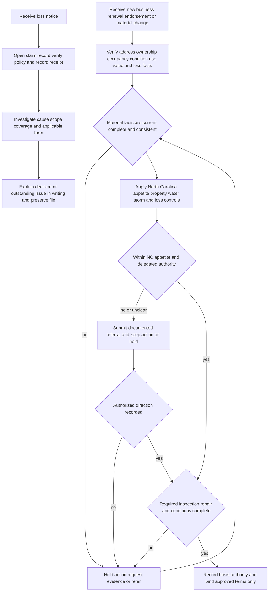

# North Carolina Homeowners Appetite Guidance

## Status, scope, and layer boundary

This page is **internal carrier underwriting guidance** for North Carolina homeowners risks. Use it to decide whether a submission, renewal, endorsement, or material risk change fits the intended appetite, what evidence is needed, when action must stop for referral, and which authority may act. It is not a policy term, coverage conclusion, statement of North Carolina law, or claim payment position. The issued policy, declarations, attached endorsements, applicable North Carolina form, and controlling requirements determine coverage. [North Carolina Guide H.0.1–H.0.20](repo://guidelines/appetite/nc-homeowners.md#L13-L106) [Manual Rule 100.B–100.E](repo://manuals/underwriting/manual.md#L21-L43)

Keep three layers distinct:

1. **Internal guidance:** the North Carolina appetite guide and Manual Rule 550 control risk selection, evidence, holds, referrals, authority, and file documentation. They constrain whether the carrier may bind; they do not create an exclusion, deductible, limit, or coverage grant.
2. **North Carolina bulletin layer:** NCDOI-2018-03 governs fungi-limit disclosure, filing, delivery, and fungi-related claim communication. NCDOI-2021-06 governs claim-handling conduct, communications, investigation, decisions, payment, oversight, and records. A bulletin does not silently amend the policy.
3. **Contract layer:** HO 01 32 (2018-05), when attached to the applicable HO-3 policy, changes only the provisions it states. Its wording controls the covered-loss, deductible, notice, claims, cancellation, nonrenewal, fungi, and seacoast results for that assembled contract. [State Overlay](repo://openwiki/state-overlays/north-carolina.md#L21-L25)

A risk may be acceptable to underwrite while a particular loss is not covered. A referral is not a declination, approval, coverage grant, or settlement position. Never use an application note, producer statement, internal threshold, inspection, claim investigation, or informal approval to change policy language. Route coverage interpretation to the applicable policy-review or claims authority. [North Carolina Guide H.0.2–H.0.4 and H.0.9–H.0.19](repo://guidelines/appetite/nc-homeowners.md#L20-L106) [Manual Rule 100.C–100.D](repo://manuals/underwriting/manual.md#L27-L37)

## NC transaction package and state-specific evidence

Before quoting, binding, renewing, endorsing, or materially changing an NC homeowners risk, pin the transaction to the correct package: North Carolina location, HO-3 line, policy-effective or transaction date, declarations, attached **HO 01 32 (2018-05)** when applicable, other endorsements, and the bulletin position applicable to the work. HO 01 32 is effective **2018-05-01**, applies to the HO-3 line, and changes only the provisions it states; provisions it does not change remain applicable. NCDOI-2018-03 is effective **2018-03-12** and applies prospectively to coverage issued, renewed, amended, or replaced after its effective date. NCDOI-2021-06 is effective **2021-06-01** and applies prospectively to claims-handling conduct after issuance. These date and attachment checks route the underwriting file; they do not make an unattached form or later bulletin part of an earlier contract. [HO 01 32 metadata and scope](repo://forms/HO/NC/HO-01-32/2018-05.md#L1-L31) [NCDOI-2018-03 applicability and effective position](repo://bulletins/NC/ncdoi-2018-03-fungi-disclosure.md#L1-L7) [repo://bulletins/NC/ncdoi-2018-03-fungi-disclosure.md#L13-L29) [repo://bulletins/NC/ncdoi-2018-03-fungi-disclosure.md#L51-L53) [NCDOI-2021-06 applicability and effective position](repo://bulletins/NC/ncdoi-2021-06-claims-handling.md#L1-L7) [repo://bulletins/NC/ncdoi-2021-06-claims-handling.md#L13-L23)

The state-specific evidence pack should let a reviewer reconstruct both the eligibility decision and the package used. Retain the source and receipt or verification status for material facts, the policy and endorsement identifiers, Coverage A and requested terms, inspections and repair evidence, loss history, referral trigger, authority, conditions, communications, and final disposition. For a fungi-limited policy transaction, retain the exact disclosure delivered, delivery evidence, and the matching policy or endorsement language; the disclosure must be updated when the applicable limitation changes, and filings or revisions required by NCDOI-2018-03 must be approved before use. For a claim handoff, preserve the receipt date, claim contact, material communications, investigation, evaluation, payment or denial, and delegated-party oversight. A producer, adjuster, administrator, vendor, or system does not take the insurer’s responsibility away. [Manual Rule 610.A–610.I and 610.N–610.Y](repo://manuals/underwriting/manual.md#L8805-L8953) [NCDOI-2018-03 disclosure and record controls](repo://bulletins/NC/ncdoi-2018-03-fungi-disclosure.md#L91-L109) [repo://bulletins/NC/ncdoi-2018-03-fungi-disclosure.md#L181-L227) [repo://bulletins/NC/ncdoi-2018-03-fungi-disclosure.md#L315-L347) [NCDOI-2021-06 responsibility and claim-file controls](repo://bulletins/NC/ncdoi-2021-06-claims-handling.md#L13-L47) [repo://bulletins/NC/ncdoi-2021-06-claims-handling.md#L49-L73) [repo://bulletins/NC/ncdoi-2021-06-claims-handling.md#L287-L307)

This is an underwriting documentation and routing control, not a state-overlay substitute or claims authority. Do not use a retained disclosure as a coverage grant, a Rule 550 note as a contract term, or a claim file as permission to exceed claims authority. [Manual Rule 100.B–100.D](repo://manuals/underwriting/manual.md#L21-L37) [HO 01 32 scope and precedence](repo://forms/HO/NC/HO-01-32/2018-05.md#L13-L31)

## Gated decision flow

*This flow shows the internal underwriting gate and claims handoff; it does not determine coverage.*

The invariant is **evidence before action, authority before commitment, and contract before coverage communication**. When facts change after quotation or approval, reassess and refer again rather than relying on the earlier decision. [North Carolina Guide H.7.7–H.7.11](repo://guidelines/appetite/nc-homeowners.md#L1499-L1516) [North Carolina Guide H.7.37–H.7.48](repo://guidelines/appetite/nc-homeowners.md#L1616-L1654) [Manual Rule 300.X–300.Z](repo://manuals/underwriting/manual.md#L4131-L4147)

## Baseline North Carolina appetite

The routine risk is a maintained, owner-occupied private residence with customary construction, stable foundation, sound exterior and roof, functioning plumbing, electrical and heating systems, ordinary personal use, reliable access, and an insurable interest that matches the named insured. Review the whole risk rather than treating one favorable characteristic as a cure for an adverse one. [North Carolina Guide H.1.2–H.1.18 and H.1.26–H.1.40](repo://guidelines/appetite/nc-homeowners.md#L115-L320) [North Carolina Guide H.1.53–H.1.65](repo://guidelines/appetite/nc-homeowners.md#L386-L455)

The principal NC internal thresholds are:

| Control | Internal North Carolina position | Required action |
|---|---:|---|
| Coverage A appetite | **$150,000 minimum** and **$1,000,000 maximum** | Do not bind outside the stated appetite. A request within the range still must pass all other controls. [Guide H.1.3–H.1.4](repo://guidelines/appetite/nc-homeowners.md#L120-L128) |
| Roof inspection | Roof age **18 years or greater** | Obtain and review an inspection before binding; hold the action until the inspection supports acceptability. [Guide H.2.1–H.2.3](repo://guidelines/appetite/nc-homeowners.md#L459-L470) [Rule 550.B](repo://manuals/underwriting/manual.md#L7537-L7539) |
| Wind mitigation inspection | Coverage A **over $500,000** | Obtain the required wind-mitigation inspection and retain the findings before accepting the exposure. [Guide H.3.1–H.3.4](repo://guidelines/appetite/nc-homeowners.md#L663-L682) |
| Prior paid property losses | **2 paid property claims** in the preceding **3 years** | Refer; do not bind while the referral or a material discrepancy is unresolved. [Guide H.5.1–H.5.5](repo://guidelines/appetite/nc-homeowners.md#L1077-L1100) |
| NC delegated authority | Coverage A up to **$700,000** | Bind only within active delegation and otherwise eligible appetite. Refer above $700,000 before offering terms. [Guide H.7.1–H.7.6](repo://guidelines/appetite/nc-homeowners.md#L1473-L1495) [Rule 550.A](repo://manuals/underwriting/manual.md#L7531-L7539) |

The $1,000,000 appetite ceiling and $700,000 NC authority ceiling are different controls. Do not reduce, split, or restructure a request to evade a referral, and do not use the generic Rule 300 senior ceiling to bypass the stricter NC Rule 550 state exception. [Manual Rule 300.A–300.D](repo://manuals/underwriting/manual.md#L3991-L4015) [Rule 550.A](repo://manuals/underwriting/manual.md#L7531-L7539)

The manual’s general inspection control can operate earlier than the NC-specific roof gate: Rule 600.B requires a roof survey before binding when roof age reaches **15 years**, while NC Guide H.2.2 and Rule 550.B require a roof inspection at **18 years or greater**. Treat the 15-year survey as an additional manual evidence requirement, not as permission to wait until 18; at 18 or older the NC inspection gate also applies. If the applicable controls or evidence conflict, hold the action and obtain authorized direction. [Manual Rule 600.A–600.B](repo://manuals/underwriting/manual.md#L8501-L8513) [North Carolina Guide H.2.1–H.2.4](repo://guidelines/appetite/nc-homeowners.md#L459-L475) [Rule 550.B](repo://manuals/underwriting/manual.md#L7531-L7539)

Refer, hold, or decline as directed when ownership, insurable interest, occupancy, business or rental use, vacancy, construction, structural condition, access, protection, valuation, environmental exposure, unusual materials, liability hazards, or requested coverage cannot be understood and supported. NC Rule 550 specifically calls out business, care, rental, lodging, vacancy, construction, structural damage, unsafe premises, unusual animals, prior liability, criminal activity, environmental concerns, access disputes, and unusual building features. These are internal eligibility triggers, not policy exclusions. [Rule 550.C–550.O](repo://manuals/underwriting/manual.md#L7541-L7591) [Rule 550.T–550.BH](repo://manuals/underwriting/manual.md#L7609-L7951)

The manual also has a distinct no-clearance outcome: decline a known material condition that cannot be corrected before binding, including unresolved structural, foundation, roof, active-water, or plumbing conditions. A Rule 550 referral is not automatically a decline, but a Rule 320 condition cannot be cleared by an underwriting note or informal exception. [Manual Rule 320.1–320.7](repo://manuals/underwriting/manual.md#L4763-L4805)

## Roof and property-condition controls

Before binding, establish roof age, surfacing, material, visible condition, maintenance, repairs, and remaining serviceability. At age 18 or greater, the inspection is a binding gate, not optional background evidence. Resolve conflicts among application statements, photographs, inspection findings, public records, and repair documents. [North Carolina Guide H.2.1–H.2.10](repo://guidelines/appetite/nc-homeowners.md#L459-L501) [Rule 550.B and 550.BI–550.BK](repo://manuals/underwriting/manual.md#L7537-L7539)

Refer or hold for active leakage, widespread deterioration, missing, lifted, curled, cracked, or damaged surfacing, sagging or structural distress, defective flashing or penetrations, unsafe drainage, widespread or temporary patching, incompatible repairs, obscured or inaccessible roof areas, unresolved storm damage, unexplained interior moisture, or condition that cannot reasonably be determined. Do not treat a claim payment, replacement estimate, aerial image, cosmetic work, or promise of future repair as proof of acceptable present condition. [North Carolina Guide H.2.6–H.2.12 and H.2.16–H.2.25](repo://guidelines/appetite/nc-homeowners.md#L482-L572) [North Carolina Guide H.2.32–H.2.40](repo://guidelines/appetite/nc-homeowners.md#L603-L646)

Apply the same disciplined review to foundations, exterior surfaces, detached structures, utilities, heating, solid-fuel equipment, grounds, access, protective devices, and other property features. A risk with unfinished renovation, unrepaired structural or storm damage, unsafe premises, or unclear condition is not a routine bind. Obtain completion evidence and reassess; do not bind on intention. [North Carolina Guide H.1.7–H.1.18 and H.1.41–H.1.50](repo://guidelines/appetite/nc-homeowners.md#L140-L374) [Rule 550.K–550.R](repo://manuals/underwriting/manual.md#L7573-L7607)

These controls govern eligibility only. Do not convert the 18-year inspection gate, a condition referral, ACV discussion, or an “eighty percent” assessment into a claim exclusion or payment formula. For a claim, identify the issued form and endorsements and determine coverage and settlement under that contract. [North Carolina Guide H.2.29–H.2.31](repo://guidelines/appetite/nc-homeowners.md#L243-L249) [HO 01 32 T.0](repo://forms/HO/NC/HO-01-32/2018-05.md#L13-L57)

### Inspection evidence lifecycle

Rule 600 is a general inspection control that supplements the NC appetite and Rule 550. Order an inspection when material underwriting information is incomplete, inconsistent, or unreliable; do not bind until the issue is resolved or an authorized exception is recorded. Beyond the roof-age gates, representative triggers include vacancy or inadequate security, structural or foundation distress, exterior deterioration, water intrusion or moisture, electrical or heating concerns, plumbing or drainage problems, unstable ground, hazardous vegetation, unsafe access features, construction or incomplete repairs, prior damage, and conflicting third-party or aerial information. These triggers require current evidence and a disposition; they are not contract exclusions. [Manual Rule 600.A and 600.C–600.M](repo://manuals/underwriting/manual.md#L8501-L8579) [Manual Rule 600.N–600.Y](repo://manuals/underwriting/manual.md#L8581-L8651) [Manual Rule 600.Z–600.AM](repo://manuals/underwriting/manual.md#L8653-L8735)

Use an inspection as underwriting evidence, not as professional repair advice. The source must be reliable and sufficiently authoritative for the question presented; unclear, outdated, incomplete, inconsistent, altered, or unverifiable photographs or reports require usable replacement evidence. Review findings promptly, state only material corrective requirements, verify completion with reliable evidence, and close the inspection process only after findings are resolved, referred, or accepted within authority. Protect inspection records and restrict their use to legitimate underwriting purposes. [Manual Rule 600.AN–600.AP](repo://manuals/underwriting/manual.md#L8737-L8753) [Manual Rule 600.AQ–600.AX](repo://manuals/underwriting/manual.md#L8755-L8801)

Manual Rule 610.AA says to treat an inspection report as valid for “18 from its completion” but does not state the unit. Do not invent days, months, or another freshness period from that text: record the completion date, use the other applicable current-evidence controls, and escalate before relying on an interpretation that could change the decision. [Manual Rule 610.AA](repo://manuals/underwriting/manual.md#L8961-L8965) [Manual Rule 100.P](repo://manuals/underwriting/manual.md#L105-L109)

## Water, drainage, and backup risk

Start with the physical water path. Establish whether the exposure involves external surface water, runoff, flood, tidal water, storm surge, groundwater, seepage, roof or envelope entry, plumbing discharge, sewer or drain backup, septic systems, sump overflow, or a shared or utility-owned system. Do not classify a loss or offer related protection from a contractor label alone. [North Carolina Guide H.4.1–H.4.10](repo://guidelines/appetite/nc-homeowners.md#L885-L932) [Rule 550.AP–550.AS](repo://manuals/underwriting/manual.md#L7697-L7711)

Refer or hold when there is active leakage, unresolved moisture, prior water damage without source and repair evidence, recurring water loss, poor grading or drainage, standing water, below-grade entry, deteriorated or modified plumbing, unreliable shutoffs, water-heater or appliance concerns, freeze exposure, unfinished restoration, concealed leakage, repeated drain or fixture backup, or a damaged, absent, disconnected, or unverified backwater or check valve. Record the source, path, affected areas, corrective work, mitigation, and current condition. [North Carolina Guide H.1.30–H.1.33](repo://guidelines/appetite/nc-homeowners.md#L264-L282) [North Carolina Guide H.4.19–H.4.29](repo://guidelines/appetite/nc-homeowners.md#L973-L1025) [Rule 550.M and 550.AQ–550.BC](repo://manuals/underwriting/manual.md#L7581-L7591)

Water-backup eligibility is not a universal water-loss grant. Confirm the requested endorsement, declarations, deductible, covered source, and any required protective device before describing available protection. The internal guide directs investigation of the source and path, distinction between backup and failed plumbing, evidence preservation, and a **60-day internal intake target** for suspected water-backup loss; that target is a carrier workflow control, not a universal policy deadline. [North Carolina Guide H.4.1–H.4.11 and H.4.30–H.4.39](repo://guidelines/appetite/nc-homeowners.md#L885-L946) [North Carolina Guide H.4.30–H.4.39](repo://guidelines/appetite/nc-homeowners.md#L1027-L1073)

Do not use a water referral as a denial, and do not use an endorsement sublimit or deductible as proof that the risk is eligible. The applicable policy and endorsement control whether the source, resulting damage, failed component, remediation, and deductible are covered. [North Carolina Guide H.4.11–H.4.18 and H.4.34–H.4.39](repo://guidelines/appetite/nc-homeowners.md#L934-L971) [Manual Rule 100.D](repo://manuals/underwriting/manual.md#L33-L37)

## Wind, hail, named-storm, and seacoast controls

For underwriting, accept wind and hail exposure only when the roof, dwelling, exterior openings, detached structures, trees, fences, equipment, and surrounding hazards are adequately maintained. For Coverage A over $500,000, obtain a wind-mitigation inspection. Verify claimed shutters, reinforced openings, and other protective features; do not credit unsupported application statements. Refer unrepaired prior wind, hail, roof, or storm damage and retain the basis for any exception. [North Carolina Guide H.3.1–H.3.18](repo://guidelines/appetite/nc-homeowners.md#L663-L745)

Wind-mitigation credit is evidence-controlled: Manual Rule 550.AA requires verification of protective-device information before related treatment is applied and referral when protection claims cannot be supported; conflicting security, fire-protection, or alarm information must also be reconciled. Record the feature, source, verification status, inspection findings, and final treatment rather than treating a checkbox or producer statement as proof. [Rule 550.AA–550.AB](repo://manuals/underwriting/manual.md#L7637-L7643) [Manual Rule 610.M](repo://manuals/underwriting/manual.md#L8877-L8881) [Manual Rule 600.AP–600.AQ](repo://manuals/underwriting/manual.md#L8749-L8759)

The internal guide requires the approved named-storm deductible minimum, prohibits an approved wind deductible above the internal ceiling, and requires any required renewal notice. It does not replace the contract’s deductible provision. When HO 01 32 is attached, its contract layer applies a Windstorm and Hail Deductible of **at least 1% and no more than 5%** to covered loss directly caused by windstorm or hail. The deductible applies after covered loss is established; a nearby storm does not itself establish covered damage. [North Carolina Guide H.3.4–H.3.8](repo://guidelines/appetite/nc-homeowners.md#L680-L700) [HO 01 32 T.1–T.9](repo://forms/HO/NC/HO-01-32/2018-05.md#L59-L77)

If the windstorm deductible increases, HO 01 32 requires written notice at least **30 days before** the increase takes effect. Apply the increased deductible only to a covered loss occurring on or after its effective date, preserve delivery evidence, and do not apply the notice to another policy. This is a contract notice control, not an underwriting permission to change the deductible without authority. [HO 01 32 T.2.1–T.2.15 and T.2.23–T.2.32](repo://forms/HO/NC/HO-01-32/2018-05.md#L211-L275)

For the attached form’s Named Storm Period, use the governmental Weather Authority’s watch or warning for a Named Storm affecting any part of North Carolina. Determine causation from loss facts and reliable weather, inspection, and repair evidence. Do not apply a Named Storm Deductible merely because damage was discovered during the period, and do not treat the period as creating coverage. [HO 01 32 T.3.1–T.3.14](repo://forms/HO/NC/HO-01-32/2018-05.md#L279-L307)

For property in a designated Seacoast Territory, the attached form defines Windstorm to include wind, hail, and wind-driven rain and caps the Windstorm Deductible at **10% of Coverage A**. Location and declarations control; establish covered Windstorm Loss first, then apply the deductible. The internal Rule 550 control requires referral of treatment that would exceed the seacoast ceiling; that referral does not itself create or change the contract ceiling. [HO 01 32 T.6.1–T.6.10 and T.6.21–T.6.33](repo://forms/HO/NC/HO-01-32/2018-05.md#L557-L623) [Rule 550.AN](repo://manuals/underwriting/manual.md#L7689-L7691)

## Prior losses and referral package

Review available property loss information before binding, renewal, or material change. The NC guide requires review of the preceding **3 years** and referral at **2 paid property claims**. Count the event accurately, but do not stop at the count: evaluate cause, location, recurrence, repair quality, mitigation, current condition, open or disputed activity, and whether a withdrawn, denied, or unpaid report still reveals a material hazard. [North Carolina Guide H.5.1–H.5.10](repo://guidelines/appetite/nc-homeowners.md#L1077-L1127) [Rule 550.AF–550.AJ](repo://manuals/underwriting/manual.md#L7657-L7675)

The general manual adds mandatory holds that are separate from the NC paid-claim threshold. Refer a reported loss at or above **$100,000** and hold binding authority pending disposition; refer any open claim and do not bind, renew, or broaden coverage while it is pending; suspend action for a disputed claim; and refer material application inconsistencies, suspected misrepresentation, or unverifiable ownership. Do not merge these routing triggers with the three-year/two-paid-claim test, and do not treat an unresolved claim as cleared merely because it has not paid. [Manual Rule 310.A–310.C](repo://manuals/underwriting/manual.md#L4413-L4431) [Manual Rule 310.M–310.O](repo://manuals/underwriting/manual.md#L4487-L4503) [Manual Rule 300.M–300.O](repo://manuals/underwriting/manual.md#L4065-L4081)

A usable referral package states:

- the requested action, Coverage A, selected coverages, deductibles, endorsements, and effective date;
- each loss date, cause, affected area, payment status, repair status, mitigation, applicant explanation, and source;
- roof, water, fire, liability, theft, vandalism, storm, flood, or other recurring-condition evidence relevant to the risk;
- photographs, inspections, invoices, permits, contractor findings, claim records, and discrepancies, with their receipt and verification status; and
- the specific referral trigger, authority requested, conditions proposed, approval or decline, and final disposition.

Do not minimize, omit, recharacterize, or divide loss information to avoid the threshold. Do not bind until the referral and every condition are resolved and recorded. [North Carolina Guide H.5.15–H.5.30](repo://guidelines/appetite/nc-homeowners.md#L1149-L1231) [Manual Rule 610.A–610.I and 610.N–610.Y](repo://manuals/underwriting/manual.md#L8805-L8953)

## Claims handling handoff

The guide’s H.6 procedures are internal handling direction. On loss notice:

1. Open the claim record promptly and capture the report without editorial conclusions. Verify the named insured, location, policy status, declarations, coverages, and endorsements before communicating a position.
2. Record the receipt date and identify the responsible handler. Give clear preliminary instructions, distinguish investigation from a coverage decision, and protect nonpublic claim information.
3. Advise reasonable protection of property, preserve damaged property when practical, distinguish emergency mitigation from permanent repair, and follow the guide’s internal **7-day-after-discovery mitigation checkpoint** when circumstances allow.
4. Establish cause, source and path of water, weather facts, affected property, pre-existing condition, repair scope, valuation, deductibles, and applicable exclusions or limitations. Request only relevant information and explain why it is needed.
5. Escalate suspected fraud or material misrepresentation, unclear causation, complex coverage, significant dispute, complaint, authority issue, or compliance concern. Obtain supervisory authority before an adverse denial based on an exclusion, condition, or alleged material misrepresentation.
6. Communicate acceptance, partial payment, reservation, limitation, denial, settlement, or unresolved status in clear written language tied to the applicable facts and policy provisions. Reconsider when credible material information arrives and close only after known coverage, payment, and recovery issues are resolved.

These steps come from the internal guide’s H.6 intake, mitigation, investigation, evidence, communication, authority, complaint, reopening, and closure controls. They do not establish that a loss is covered or that an expense is payable. [North Carolina Guide H.6.1–H.6.18](repo://guidelines/appetite/nc-homeowners.md#L1235-L1311) [North Carolina Guide H.6.19–H.6.54](repo://guidelines/appetite/nc-homeowners.md#L1313-L1469)

### North Carolina bulletin and form deadlines

The NC regulatory and contract layers add their own controls; do not relabel them as appetite thresholds:

- **Acknowledgment:** HO 01 32 states acknowledgment within **30 days** after receipt, and NCDOI-2021-06 B.4.2 requires the same. Record the receipt date, claim identifier, and contact information. [HO 01 32 T.5.1–T.5.3](repo://forms/HO/NC/HO-01-32/2018-05.md#L455-L467) [NCDOI-2021-06 B.4.1–B.4.3](repo://bulletins/NC/ncdoi-2021-06-claims-handling.md#L245-L253)
- **Decision:** after receiving the requested items needed to decide, accept or reject within **30 business days** and provide the basis. Do not use irrelevant or repetitive requests to delay a determination. [HO 01 32 T.5.24–T.5.30](repo://forms/HO/NC/HO-01-32/2018-05.md#L503-L515) [NCDOI-2021-06 B.4.4–B.4.10](repo://bulletins/NC/ncdoi-2021-06-claims-handling.md#L253-L265)
- **Payment:** an accepted claim is paid within **30 business days after payment becomes due** under the form. NCDOI-2021-06 also requires prompt payment of undisputed amounts when due; do not withhold an undisputed amount solely because another portion remains under review. [HO 01 32 T.5.31–T.5.37](repo://forms/HO/NC/HO-01-32/2018-05.md#L515-L529) [NCDOI-2021-06 B.2.11–B.2.12](repo://bulletins/NC/ncdoi-2021-06-claims-handling.md#L69-L75)
- **Written explanation:** denials, partial denials, limitations, reservations, valuations, and partial payments must identify the relevant policy provisions and material facts. The 2021 bulletin requires a clear written decision and the form requires notice of the basis for rejection. [NCDOI-2021-06 B.2.7–B.2.16](repo://bulletins/NC/ncdoi-2021-06-claims-handling.md#L63-L81) [NCDOI-2021-06 B.3.9–B.3.18](repo://bulletins/NC/ncdoi-2021-06-claims-handling.md#L185-L203)
- **Suit limitation:** HO 01 32 states that an action against the insurer must be brought within **3 years after the date of loss**, after compliance with policy terms and subject to applicable law. Communicate this contract provision accurately; do not substitute the internal 60-day water-backup intake target. [HO 01 32 T.7.1–T.7.3](repo://forms/HO/NC/HO-01-32/2018-05.md#L625-L633)

NCDOI-2021-06 applies to claim handling by employees, adjusters, producers, administrators, vendors, and other representatives; delegation does not transfer the insurer’s responsibility. Maintain supervision, training, procedures, quality review, complaint escalation, privacy controls, and records sufficient to show the basis for material handling decisions. [NCDOI-2021-06 B.1.1–B.1.17](repo://bulletins/NC/ncdoi-2021-06-claims-handling.md#L13-L47) [NCDOI-2021-06 B.2.2–B.2.4](repo://bulletins/NC/ncdoi-2021-06-claims-handling.md#L49-L57) [NCDOI-2021-06 B.2.39–B.2.50](repo://bulletins/NC/ncdoi-2021-06-claims-handling.md#L127-L149)

## Fungi disclosure boundary and claims handoff

When the applicable North Carolina policy contains a limitation for fungi, wet or dry rot, or bacteria, NCDOI-2018-03 requires a clear, conspicuous, understandable disclosure that matches the policy and attached endorsements. It requires the statement: **“The most we will pay is $5,000 (five thousand dollars).”** The disclosure must identify the affected limitation, remain consistent across policy materials, be delivered with applicable new, renewal, replacement, or changing coverage, and be retained with evidence of delivery. It is not a coverage grant and cannot broaden, narrow, waive, or replace the contract. [NCDOI-2018-03 B.1.1–B.1.17](repo://bulletins/NC/ncdoi-2018-03-fungi-disclosure.md#L13-L49) [NCDOI-2018-03 B.2.1–B.2.15](repo://bulletins/NC/ncdoi-2018-03-fungi-disclosure.md#L59-L89) [NCDOI-2018-03 B.3.1–B.3.23](repo://bulletins/NC/ncdoi-2018-03-fungi-disclosure.md#L181-L227)

For HO 01 32 (2018-05), when attached, the contract states a **$5,000 maximum for all loss caused by fungi, wet or dry rot, or bacteria**, regardless of the number of insureds, claims, properties, or occurrences, and says such loss is not covered unless coverage is expressly provided. The form is the contract source; the bulletin is the disclosure and administration source. Do not describe the disclosure as coverage, and do not import another endorsement’s fungi limit into HO 01 32. [HO 01 32 T.8–T.9](repo://forms/HO/NC/HO-01-32/2018-05.md#L667-L687) [North Carolina Fungi Coverage](repo://openwiki/coverage/perils/fungi-and-bacteria.md#L95-L100)

A fungi allegation or observation is not by itself a basis to deny or limit a claim. Investigate the reported cause, determine whether a covered cause produced the condition, distinguish fungi damage from other covered damage, identify the applicable policy provision, and explain any limitation or partial denial in writing. Preserve inspections, expert or laboratory information, photographs, communications, requested items, and the policy version used. [NCDOI-2018-03 B.4.1–B.4.20](repo://bulletins/NC/ncdoi-2018-03-fungi-disclosure.md#L259-L299) [NCDOI-2021-06 B.2.7–B.2.12](repo://bulletins/NC/ncdoi-2021-06-claims-handling.md#L63-L75)

## Authority, holds, and delegated action

Apply eligibility and evidence controls before authority. Under the NC guide and Rule 550, Coverage A above **$700,000** must be referred before terms are offered; the risk must also fit the $150,000–$1,000,000 appetite and satisfy roof, water, storm, loss, occupancy, and other controls. Rule 300’s general $800,000 line and $1,500,000 senior ceilings do not displace a stricter NC state exception. [North Carolina Guide H.7.1–H.7.10](repo://guidelines/appetite/nc-homeowners.md#L1473-L1512) [Rule 550.A](repo://manuals/underwriting/manual.md#L7531-L7539) [Manual Rule 300.A–300.D](repo://manuals/underwriting/manual.md#L3991-L4015)

The referral lifecycle is:

1. **Identify the trigger:** state the threshold, missing fact, conflict, condition, unusual use, loss pattern, requested exception, or authority issue.
2. **Hold the dependent action:** do not bind, renew, attach, alter, or release terms while a required referral or condition remains unresolved.
3. **Assemble evidence:** provide the requested action, current facts, sources, receipt dates, verification status, inspections, repair or mitigation evidence, discrepancies, and proposed conditions.
4. **Obtain recorded direction:** silence, producer expectation, automated indication, verbal assurance, or approval for another risk is not authority.
5. **Compare and execute:** bind only the expressly approved terms after every condition is satisfied; re-refer if facts or terms change.
6. **Retain the record:** preserve the trigger, authority level, approver, response, conditions, communications, and final disposition.

[North Carolina Guide H.7.19–H.7.48](repo://guidelines/appetite/nc-homeowners.md#L1546-L1654) [Manual Rule 300.X–300.AD](repo://manuals/underwriting/manual.md#L4131-L4171) [Manual Rule 610.F–610.I and 610.AG–610.AI](repo://manuals/underwriting/manual.md#L8835-L8857)

Do not remove a required condition, change the valuation merely to fit authority, split related locations or coverage components, backdate, or use an exception without delegated approval. If a generic manual rule, state exception, current delegation record, and informal instruction point in different directions, stop and escalate; do not choose the more favorable number. [North Carolina Guide H.7.4–H.7.6 and H.7.19–H.7.39](repo://guidelines/appetite/nc-homeowners.md#L1486-L1624) [Manual Rule 100.C–100.F](repo://manuals/underwriting/manual.md#L27-L49)

## Evidence standard and focused control checks

For each material decision, retain the fact and source, receipt and verification dates, current occupancy and ownership, Coverage A and valuation, construction and protection, roof and wind evidence, water path and repair evidence, loss history, requested terms, referral trigger, authority used, conditions, approval, communications, and final disposition. Record adverse facts even when the risk is accepted, distinguish reported from verified information, and do not close a requirement on an unsupported promise. [Manual Rule 610.A–610.E and 610.N–610.Y](repo://manuals/underwriting/manual.md#L8805-L8953) [Manual Rule 610.AG–610.AI](repo://manuals/underwriting/manual.md#L8997-L9013)

For inspection-driven decisions, also record the trigger, requested scope, completion date, source and expertise, verification status, material findings, corrective requirement, authority, and evidence used to close or refer the finding. Manual Rule 600 requires the inspection process to be closed only after material findings are resolved, referred, or accepted within authority; a recommendation is not the same as a binding requirement, and completion cannot rest on an unsupported verbal statement. [Manual Rule 600.AR–600.AX](repo://manuals/underwriting/manual.md#L8761-L8801) [Manual Rule 610.AA–610.AI](repo://manuals/underwriting/manual.md#L8961-L9013)

Before binding or changing the risk, perform these focused checks:

- **Appetite and authority:** Coverage A is within $150,000–$1,000,000; NC authority is confirmed; any amount above $700,000 is referred; no related exposure has been split to evade review. [Guide H.1.3–H.1.4 and H.7.1–H.7.6](repo://guidelines/appetite/nc-homeowners.md#L120-L128) [Guide H.7.1–H.7.6](repo://guidelines/appetite/nc-homeowners.md#L1473-L1495) [Rule 550.A](repo://manuals/underwriting/manual.md#L7531-L7539)
- **Roof:** age source and the Manual Rule 600 survey are recorded at 15 years or more, and the NC Rule 550 inspection is recorded at 18 years or more; condition, repairs, material, photographs, and inaccessible areas are reconciled; planned work is not treated as completed. [Manual Rule 600.B](repo://manuals/underwriting/manual.md#L8509-L8513) [Rule 550.B](repo://manuals/underwriting/manual.md#L7537-L7539)
- **Storm:** Coverage A over $500,000 has wind-mitigation evidence; roof and exterior hazards are evaluated; internal deductible direction is documented separately from the attached form’s contract deductible. [Guide H.3.1–H.3.18](repo://guidelines/appetite/nc-homeowners.md#L663-L745) [Rule 550.AA–550.AB](repo://manuals/underwriting/manual.md#L7637-L7643)
- **Water:** source, path, drainage, plumbing, sump or sewer arrangement, prior losses, protective devices, and remediation are understood; a water-backup request is not treated as coverage without the actual endorsement and declarations. [Guide H.4.1–H.4.39](repo://guidelines/appetite/nc-homeowners.md#L885-L1073) [Rule 550.M and 550.AQ–550.AS](repo://manuals/underwriting/manual.md#L7581-L7591)
- **Losses:** the preceding three years are reviewed; two paid property claims are referred; cause, recurrence, repair, and current condition are documented even when the count alone is not triggered. [Guide H.5.1–H.5.30](repo://guidelines/appetite/nc-homeowners.md#L1077-L1231) [Manual Rule 310.A–310.C](repo://manuals/underwriting/manual.md#L4413-L4431)
- **Referral and change control:** every exception, unresolved fact, approval, condition, material change, and final decision is recorded before action. [Guide H.7.19–H.7.48](repo://guidelines/appetite/nc-homeowners.md#L1546-L1654) [Manual Rule 610.F–610.S and 610.AG–610.AI](repo://manuals/underwriting/manual.md#L8835-L8917) [Manual Rule 610.AG–610.AI](repo://manuals/underwriting/manual.md#L8997-L9013)

For claims, audit the receipt date, acknowledgment, relevant information requests, inspection and cause evidence, mitigation, applicable form and endorsement, written explanation, undisputed payment handling, authority, later information, and closure or reopening decision. These checks test that the workflow is being followed; they do not substitute internal guidance for the contract or bulletins.

## Failure checks

- **Internal rule presented as coverage:** an appetite threshold, roof hold, water referral, seven-day mitigation checkpoint, or 60-day water-backup intake target is communicated as a policy exclusion, coverage limit, or universal deadline.
- **Wrong layer:** NCDOI-2018-03 is treated as a coverage grant, NCDOI-2021-06 is treated as a policy amendment, or HO 01 32 is assumed to apply without confirming attachment and edition.
- **Threshold-only acceptance:** Coverage A or the loss count fits, but ownership, occupancy, roof, water, storm, repair, valuation, or evidence remains unresolved.
- **Storm shortcut:** a named storm, nearby weather report, or storm-period discovery is treated as proof of covered causation or deductible applicability.
- **Fungi shortcut:** fungi is observed and the claim is denied without investigating the covered cause, applicable contract wording, limited coverage, and material facts.
- **Binding on intent:** planned roof, plumbing, drainage, or remediation work is treated as complete without evidence and reassessment.
- **Authority bypass:** a request is split, reduced, backdated, approved verbally, or bound while referral conditions remain open.
- **Claims delay or overreach:** irrelevant documents are repeatedly requested, an undisputed amount is withheld solely because another issue remains open, or a denial is issued without the supporting policy provision and facts.

## Related pages

- [North Carolina State Overlay](/openwiki/state-overlays/north-carolina.md) — contract, bulletin, disclosure, claims, and Rule 550 layer map.
- [Fungi, Wet Rot, Dry Rot, and Bacteria](/openwiki/coverage/perils/fungi-and-bacteria.md) — contract composition and the North Carolina disclosure boundary.
- [Underwriting Referral and Authority Guidance](/openwiki/underwriting/guidelines/referral-authority.md) — general referral lifecycle and delegated-authority controls.
- [Manual Liability, Loss History, and Occupancy Controls](/openwiki/underwriting/manual/liability-losses-and-occupancy.md) — broader occupancy, loss, rental, vacancy, and liability screening.
- [Manual Property, Roof, and Water Risk Controls](/openwiki/underwriting/manual/property-and-water-risk.md) — broader property, roof, drainage, plumbing, and evidence controls.
