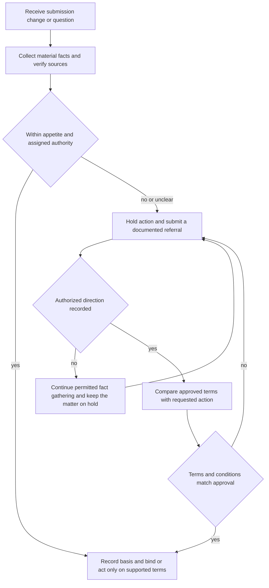

# Referral Authority

## Status and governing boundary

This page translates the **Underwriting Referral and Authority Matrix** into a working decision path. The Matrix is internal underwriting and claims guidance, not an insurance contract. It cannot create, expand, restrict, or waive coverage; the applicable policy, declarations, endorsements, and state requirements control coverage and payment. Use referral to obtain underwriting or handling direction, never to turn an internal decision into a coverage promise. [Matrix H.0.1–H.0.6](repo://guidelines/authority/referral-matrix.md#L13-L25)

The Matrix does not replace judgment or the need for facts. Obtain enough reliable information to decide within delegated authority, raise material inconsistencies, keep the file accurate while a referral is pending, and preserve the communications and supporting material. [Matrix H.0.7–H.0.11](repo://guidelines/authority/referral-matrix.md#L27-L35) [Matrix H.0.18–H.0.22](repo://guidelines/authority/referral-matrix.md#L49-L57)

A referral is a request for direction, not an automatic declination, approval, coverage grant, or transfer of responsibility. Silence, delay, informal discussion, or an incomplete response is not approval. [Matrix H.0.5–H.0.6](repo://guidelines/authority/referral-matrix.md#L23-L25) [Matrix H.0.16–H.0.19](repo://guidelines/authority/referral-matrix.md#L45-L51)

## Four checks before binding or handling

Do not collapse the following checks into one “referral” decision:

| Check | Question it answers | What a positive result means |
|---|---|---|
| **Appetite eligibility** | Does the risk fit the applicable state and product appetite as presented? | Continue only when the property, occupancy, condition, limits, loss history, and other eligibility facts fit. For Texas homeowners, Coverage A must be **$150,000–$1,200,000**; a roof at or above **15 years** requires inspection and a roof at or above **25 years** may not be bound. These are appetite and state operating controls, not delegated authority. [Texas Homeowners Appetite Guide H.1.1 and H.2.3–H.2.6](repo://guidelines/appetite/tx-homeowners.md#L59-L63) [Texas Homeowners Appetite Guide H.2.3–H.2.6](repo://guidelines/appetite/tx-homeowners.md#L155-L165) |
| **Delegated authority** | May this role bind this exact Coverage A amount, transaction, and terms? | Bind only within active, role-specific delegation; otherwise hold the affected action and obtain documented approval. The separate [Binding Authority Guidance](/openwiki/underwriting/guidelines/binding-authority.md) explains the authority and exception control. [Binding Authority and Exceptions H.7.1–H.7.8](repo://guidelines/authority/binding-authority.md#L599-L615) |
| **Referral lifecycle** | Does a matrix, Manual rule, changed fact, or unresolved conflict require routing, and what outcome is permitted? | Assemble the evidence, hold what requires direction, record the response and conditions, and bind or act only within the recorded disposition. The Manual’s Rules 300, 310, 320, and 900 have distinct scopes and outcomes; they are not interchangeable thresholds. [Manual Rule 300.A–300.D and 300.X–300.Y](repo://manuals/underwriting/manual.md#L3991-L4015) [Manual Rule 310.A–310.C](repo://manuals/underwriting/manual.md#L4413-L4431) [Manual Rule 320.1](repo://manuals/underwriting/manual.md#L4763-L4769) [Manual Rule 900.A–900.E](repo://manuals/underwriting/manual.md#L9865-L9895) |
| **Contract coverage** | What do the issued form, declarations, endorsements, and state wording actually provide? | Read the issued policy package separately. An internal referral or approval can constrain carrier action but cannot grant, remove, or reinterpret coverage. [Matrix H.0.1–H.0.6](repo://guidelines/authority/referral-matrix.md#L13-L25) [Policy Assembly: Editions, Endorsements, and State Overlays](/openwiki/policy-assembly/editions-and-state-attachments.md) |

A risk can satisfy appetite and still exceed delegated authority; it can be within both and still require a referral because a Manual or Matrix trigger applies; and an approved underwriting action still does not answer the contract-coverage question. Conversely, a contract provision does not authorize an employee to bind outside delegation. Keep the checks separate in the file and in communications.

## Decision path

*This flow shows the operational referral lifecycle; it does not determine coverage or override the policy.*

## Authority levels and non-bypass rules

The Matrix and the separate [Binding Authority Guidance](/openwiki/underwriting/guidelines/binding-authority.md) state the general delegated ceilings; the Personal Lines Underwriting Manual supplies the numbered operating rules. Read them together without treating one source as a rewrite of another.

- **Line underwriting:** may bind Coverage A when the requested limit does not exceed **$800,000**. A request above that line authority must be referred before terms are offered or binding is accepted. [Matrix H.7.1–H.7.2](repo://guidelines/authority/referral-matrix.md#L697-L701) [Binding Authority and Exceptions H.7.1–H.7.3](repo://guidelines/authority/binding-authority.md#L599-L605) [Manual Rule 300.A and 300.C–300.D](repo://manuals/underwriting/manual.md#L3991-L4015)
- **General senior underwriting:** may bind Coverage A when the requested limit does not exceed **$1,500,000**. A request above senior authority must go to the appropriate authorized decision maker. [Matrix H.7.3–H.7.4](repo://guidelines/authority/referral-matrix.md#L703-L707) [Binding Authority and Exceptions H.7.1–H.7.3](repo://guidelines/authority/binding-authority.md#L599-L605) [Manual Rule 300.B–300.D](repo://manuals/underwriting/manual.md#L3999-L4015)
- **Texas-specific overlay:** the Texas appetite permits Coverage A only from **$150,000 through $1,200,000**, and Manual Rule 510 makes that state position operational: line authority ends at $800,000; requests above $800,000 through $1,200,000 go to senior review; requests above $1,200,000 must be declined or referred. Thus a Texas risk cannot use the general $1,500,000 senior ceiling to bypass the stricter Texas limit. [Texas Homeowners Appetite Guide H.1.1](repo://guidelines/appetite/tx-homeowners.md#L59-L63) [Manual Rule 510.1–510.3](repo://manuals/underwriting/manual.md#L6227-L6245)
- **Texas transaction checks:** verify the Texas risk address before quoting or binding, confirm insurable interest, match occupancy to actual use, and refer conflicting ownership or occupancy information. These are state operating controls that determine whether the Texas rules can be applied; they are not policy coverage limits. [Manual Rule 510.6–510.9](repo://manuals/underwriting/manual.md#L6259-L6279)
- Apply the limit to the Coverage A amount actually requested at binding. Do not reduce the stated limit informally, split related requests, or structure transactions to avoid referral. Endorsements and other changes that affect Coverage A are part of the same authority review, and a revised limit above the handler’s authority must be referred. [Matrix H.7.5–H.7.7](repo://guidelines/authority/referral-matrix.md#L709-L716) [Matrix H.7.27–H.7.29](repo://guidelines/authority/referral-matrix.md#L775-L782) [Binding Authority and Exceptions H.7.4–H.7.8](repo://guidelines/authority/binding-authority.md#L605-L615)
- Approval is file-specific and term-specific. Prior approval on another account is not authority for this submission; material changes require renewed approval; and binding is limited to the coverage and terms expressly approved. Do not backdate approval or binding to cure an authority issue. [Matrix H.7.12–H.7.18](repo://guidelines/authority/referral-matrix.md#L730-L749) [Binding Authority and Exceptions H.7.19–H.7.32](repo://guidelines/authority/binding-authority.md#L637-L663) [Manual Rule 300.Y–300.AD](repo://manuals/underwriting/manual.md#L4137-L4171)
- An automated indication, producer expectation, account relationship, or premium opportunity cannot enlarge authority. Escalate an unresolved authority question before binding. [Matrix H.7.19–H.7.20](repo://guidelines/authority/referral-matrix.md#L751-L755) [Matrix H.7.26 and H.7.33–H.7.34](repo://guidelines/authority/referral-matrix.md#L772-L797) [Binding Authority and Exceptions H.7.18 and H.7.46–H.7.48](repo://guidelines/authority/binding-authority.md#L635-L635) [Binding Authority and Exceptions H.7.46–H.7.48](repo://guidelines/authority/binding-authority.md#L691-L695)

A state appetite ceiling is not delegated authority, and a general delegated ceiling is not permission to ignore a stricter state rule. For Texas, apply appetite eligibility and Rule 510 first, then apply the Matrix and Binding Authority Guidance controls for the exact role, transaction, and terms. [Texas Homeowners Appetite Guide H.1.1](repo://guidelines/appetite/tx-homeowners.md#L59-L63) [Manual Rule 510.1–510.3](repo://manuals/underwriting/manual.md#L6227-L6245) [Matrix H.7.1–H.7.4](repo://guidelines/authority/referral-matrix.md#L697-L707)

## When to refer

### Universal referral conditions

Refer before binding or taking the disputed action when a material fact cannot be reconciled with the operations, premises, loss history, condition, or requested coverage; when unusual occupancy, condition, protection, or loss characteristics affect the decision; or when the available information does not support a confident authority determination. [Matrix H.1.45–H.1.46](repo://guidelines/authority/referral-matrix.md#L193-L197) [Matrix H.7.19 and H.7.22](repo://guidelines/authority/referral-matrix.md#L751-L761)

Do not rely on an applicant’s intent to correct a deficient condition after issuance, favorable premium, account relationship, or anticipated improvements to override a referral. Resolve or document the condition under authorized direction. [Matrix H.2.35–H.2.37](repo://guidelines/authority/referral-matrix.md#L269-L273) [Matrix H.2.55–H.2.58](repo://guidelines/authority/referral-matrix.md#L309-L315)

### Manual routing outcomes

The Manual adds routing outcomes that must remain distinct from a Matrix threshold or an appetite rule:

- **Rule 300 — delegated binding control:** confirm the effective date and material risk information, use active delegation, record the requested limit and authority, and do not bind a referred risk until approval is recorded. A referred risk may be bound only within the approved terms. [Manual Rule 300.A–300.F and 300.X–300.AD](repo://manuals/underwriting/manual.md#L3991-L4027) [Manual Rule 300.X–300.AD](repo://manuals/underwriting/manual.md#L4131-L4171)
- **Rule 310 — mandatory referral and hold:** refer a reported loss at or above **$100,000**, open or disputed claims, liability allegations, litigation, material application inconsistencies, suspected misrepresentation, unverifiable ownership, and similar listed triggers; hold the relevant binding, renewal, or issuance activity pending disposition. [Manual Rule 310.A–310.P](repo://manuals/underwriting/manual.md#L4413-L4509)
- **Rule 320 — no-clearance decline:** decline a known condition that materially increases expected loss and cannot be corrected before binding. Unresolved structural, roof, water, electrical, occupancy, or other listed conditions are not cured by a note or an informal exception; the file must document the condition and decline action. [Manual Rule 320.1–320.7](repo://manuals/underwriting/manual.md#L4763-L4805)
- **Rule 900 — appendix routing:** the appendix separately sends a reported loss exceeding **$25,000** to claims authority, new business above **$1,500,000** to senior underwriting, incomplete **3-year** loss history to referral, roof age at or beyond **25 years** to declination processing, and water-backup coverage above **$25,000** to underwriting authority. These are Manual Rule 900 positions with different functions; do not merge the $25,000 claims threshold with Rule 310’s $100,000 underwriting threshold or with the Matrix’s separate authority and loss-history positions. [Manual Rule 900.A–900.E](repo://manuals/underwriting/manual.md#L9865-L9895) [Matrix H.4.1–H.4.4 and H.5.1–H.5.8](repo://guidelines/authority/referral-matrix.md#L395-L409) [Matrix H.5.1–H.5.8](repo://guidelines/authority/referral-matrix.md#L499-L515)

Use the source that owns the decision: eligibility rules decide whether the risk fits appetite; delegated-authority rules decide who may act; mandatory-referral rules decide when action must pause; no-clearance rules decide when the listed condition cannot be accepted; and contract documents decide coverage. When sources appear to overlap, preserve each source position in the file and obtain authorized direction rather than silently choosing the least restrictive outcome.

### High-value, roof, storm, and water triggers

| Review area | Operational referral rule |
|---|---|
| **Coverage A authority** | General Matrix position: refer above $800,000 for line authority and above $1,500,000 for senior authority before offering terms or binding. For Texas, the stricter Rule 510/appetite ceiling is $1,200,000, with amounts above $800,000 routed to senior review. [Matrix H.7.1–H.7.4](repo://guidelines/authority/referral-matrix.md#L697-L707) [Binding Authority and Exceptions H.7.1–H.7.3](repo://guidelines/authority/binding-authority.md#L599-L605) [Manual Rule 510.1–510.3](repo://manuals/underwriting/manual.md#L6227-L6245) |
| **Roof age and condition** | Refer a roof at or above **25 years**; refer when age, replacement status, condition, roof material, or an 80% condition assessment cannot be reliably established; and refer active leakage, deterioration, unrepaired storm damage, conflicting inspection/application evidence, or unusual construction. [Matrix H.2.3–H.2.7](repo://guidelines/authority/referral-matrix.md#L201-L213) [Matrix H.2.10–H.2.14](repo://guidelines/authority/referral-matrix.md#L219-L227) [Matrix H.2.23–H.2.29](repo://guidelines/authority/referral-matrix.md#L245-L257) [Matrix H.2.32–H.2.39](repo://guidelines/authority/referral-matrix.md#L263-L277) |
| **Wind and hail** | Obtain a wind mitigation inspection when Coverage A exceeds **$1,000,000**. Refer conflicting inspection facts, misaligned photographs and application statements, visible roof deterioration, unprotected or damaged openings, recurring storm losses, unrepaired storm damage, missing mitigation information, or a request to reduce, waive, or alter the applicable deductible. [Matrix H.3.2–H.3.6](repo://guidelines/authority/referral-matrix.md#L325-L333) [Matrix H.3.8–H.3.14](repo://guidelines/authority/referral-matrix.md#L337-L349) [Matrix H.3.18–H.3.20 and H.3.29–H.3.35](repo://guidelines/authority/referral-matrix.md#L357-L391) |
| **Water backup** | Refer a requested water backup limit above **$25,000** and do not bind it until documented approval. Refer requests to alter water-backup terms outside available authority. Confirm the source and distinguish backup from surface water, flood, seepage, and maintenance conditions. [Matrix H.4.1–H.4.4](repo://guidelines/authority/referral-matrix.md#L395-L409) [Matrix H.4.23–H.4.26](repo://guidelines/authority/referral-matrix.md#L483-L497) |
| **Prior losses** | Refer when available loss information shows **2 paid property claims**; review the preceding **3 years**; do not bind until review and authority are documented; and refer incomplete, unexplained, recurring, unresolved, misrepresented, or repair-unverified loss information. [Matrix H.5.1–H.5.8](repo://guidelines/authority/referral-matrix.md#L501-L515) [Matrix H.5.11–H.5.17](repo://guidelines/authority/referral-matrix.md#L521-L535) [Matrix H.5.21–H.5.30](repo://guidelines/authority/referral-matrix.md#L541-L559) [Matrix H.5.37–H.5.42](repo://guidelines/authority/referral-matrix.md#L573-L583) |

The Texas appetite guide and Manual Rule 510 can impose earlier or stricter state controls without enlarging authority: Texas requires a roof inspection at or above **15 years**, says a roof at or above **25 years** may not be bound, and routes water-backup limits above **$25,000** for referral. Apply the applicable state appetite and Rule 510 controls, then apply the Matrix and Binding Authority Guidance controls. [Texas Homeowners Appetite Guide H.2.3–H.2.6](repo://guidelines/appetite/tx-homeowners.md#L155-L165) [Manual Rule 510.4–510.5](repo://manuals/underwriting/manual.md#L6247-L6257) [Matrix H.2.3](repo://guidelines/authority/referral-matrix.md#L201-L205) [Binding Authority and Exceptions H.2.1–H.2.4](repo://guidelines/authority/binding-authority.md#L155-L163)

## Coverage questions: separate contract from referral

The Matrix is not a coverage interpretation. For example, the 2024-03 HO-3 form excludes loss caused by water backing up through sewers, drains, or sump systems unless a water-backup endorsement is attached. That is the contract concept; the Matrix supplies the operational rule to confirm the source, distinguish excluded or differently treated water causes, and refer a requested limit above $25,000. [HO-3 2024-03, X.8–X.9](repo://forms/HO/MS/HO-3/2024-03.md#L593-L597) [Matrix H.4.1–H.4.4](repo://guidelines/authority/referral-matrix.md#L395-L409)

Similarly, the 2024-03 HO-3 form settles covered dwelling damage on the applicable replacement-cost basis when its insured-to-value condition is met, and applies that dwelling basis to roof surfacing unless an actual cash value roof schedule endorsement is attached. The attached HO 23 74 2025-05 endorsement provides ACV treatment when Roof Age is **12 years or greater** and identifies records, inspections, photographs, statements, and other reliable evidence that may establish age. Those are contract settlement rules; they do not change underwriting eligibility. The Matrix requires the handler to apply the applicable settlement terms, not represent that ACV age changes eligibility, and to refer when the age or schedule issue is material to the proposed action. [HO-3 2024-03, A.10–A.13](repo://forms/HO/MS/HO-3/2024-03.md#L117-L123) [HO 23 74 2025-05, W.0](repo://forms/HO/MS/HO-23-74/2025-05.md#L14-L39) [HO 23 74 2025-05, W.1.3–W.1.5](repo://forms/HO/MS/HO-23-74/2025-05.md#L98-L109) [Matrix H.0.15](repo://guidelines/authority/referral-matrix.md#L41-L43) [Matrix H.2.19–H.2.24](repo://guidelines/authority/referral-matrix.md#L237-L247)

When a reported matter may involve covered property, liability, or a referral condition, open the appropriate handling file and record the report without deciding coverage from the label alone. Review declarations before discussing limits, deductibles, endorsements, or insured status; receipt of notice does not confirm coverage, liability, valuation, or payment. [Matrix H.6.1–H.6.6](repo://guidelines/authority/referral-matrix.md#L585-L597)

## Referral package and file requirements

Before requesting approval, make the submission usable to the receiving authority:

1. **State the decision requested.** Identify the proposed binding, endorsement, limit, exception, decline, settlement, or other action and the authority question that requires review. [Matrix H.0.8 and H.0.21](repo://guidelines/authority/referral-matrix.md#L29-L29) [Matrix H.0.21](repo://guidelines/authority/referral-matrix.md#L53-L55) [Matrix H.6.12](repo://guidelines/authority/referral-matrix.md#L609-L609)
2. **Supply the material facts and sources.** Include the requested Coverage A limit, material facts affecting suitability, available policy information, loss and damage information, correspondence, and requested analysis. For prior losses include date, cause, payment status, and repair status; for roof decisions record the source of age, condition, and repair confirmation. [Matrix H.7.9–H.7.11](repo://guidelines/authority/referral-matrix.md#L721-L728) [Matrix H.6.15](repo://guidelines/authority/referral-matrix.md#L613-L615) [Matrix H.5.5–H.5.6](repo://guidelines/authority/referral-matrix.md#L509-L511) [Matrix H.2.55–H.2.56](repo://guidelines/authority/referral-matrix.md#L309-L311)
3. **Identify conflicts and unresolved items.** Do not select the favorable interpretation. State what is inconsistent, what verification was attempted, and why the issue could affect eligibility, terms, pricing, handling, or settlement. [Matrix H.0.9](repo://guidelines/authority/referral-matrix.md#L31-L31) [Matrix H.7.22](repo://guidelines/authority/referral-matrix.md#L760-L761)
4. **Record the response.** Retain the referral request, supporting information, authority response, authorized approver, approval terms, attached conditions, and all material communications. [Matrix H.7.15–H.7.18](repo://guidelines/authority/referral-matrix.md#L739-L749) [Matrix H.7.25 and H.7.32](repo://guidelines/authority/referral-matrix.md#L769-L791)

The underwriting manual reinforces this control: Rule 300 requires the requested limit, authority used, referral reason, and approving authority to be recorded, while Rule 610 requires a referral reason, trigger, information supplied, and resulting direction. [Personal Lines Underwriting Manual, Rule 300.A–300.B](repo://manuals/underwriting/manual.md#L3991-L4003) [Personal Lines Underwriting Manual, Rule 610.F–610.G](repo://manuals/underwriting/manual.md#L8835-L8845) [Personal Lines Underwriting Manual, Rule 610.AG](repo://manuals/underwriting/manual.md#L8997-L9001)

## Pending referrals, decisions, and failures

While a referral is pending, discuss available options only as options and do not represent coverage as bound, approved, or final. Hold the submission when authority information is incomplete or inconsistent. Continue fact gathering unless a handling hold applies, and obtain clarification when the authorized response is incomplete, inconsistent, or unsupported by the file. [Matrix H.7.8 and H.7.22–H.7.24](repo://guidelines/authority/referral-matrix.md#L718-L719) [Matrix H.6.13 and H.6.16](repo://guidelines/authority/referral-matrix.md#L611-L617)

When approval is received, compare the requested transaction with the approval before issuing or releasing anything. Follow every attached condition, do not alter an approved condition without further authorization, and bind only the expressly approved coverage and terms. [Matrix H.7.16–H.7.21](repo://guidelines/authority/referral-matrix.md#L742-L758)

For a claim or other handling question, do not deny, reserve, settle, compromise, pay, or accept a release outside assigned authority. Provide the reviewer the policy information, facts, damage information, correspondence, and analysis available; obtain required authority before payment or settlement; and complete a final file review before closure. [Matrix H.6.12–H.6.18](repo://guidelines/authority/referral-matrix.md#L609-L621) [Matrix H.6.42–H.6.54](repo://guidelines/authority/referral-matrix.md#L669-L693)

If a policy was bound outside authority, promptly advise the authorized decision maker; do not backdate approval or treat later silence as a cure. Preserve the complete record so the scope of any unauthorized action and the corrective direction can be reviewed. [Matrix H.7.30–H.7.32](repo://guidelines/authority/referral-matrix.md#L784-L791)

### Operational reminders

- Referral status is a status of internal review, not a statement about coverage. Use clear language such as “pending underwriting authority review” and identify the action awaiting approval. [Matrix H.0.6 and H.0.21](repo://guidelines/authority/referral-matrix.md#L25-L25) [Matrix H.7.23–H.7.24](repo://guidelines/authority/referral-matrix.md#L763-L767)
- Keep underwriting guidance separate from contract language. If a coverage question remains unresolved, preserve the competing facts and applicable form provisions and route it for the appropriate coverage or claims review; do not use this Matrix to fill a contract gap. [Matrix H.0.1–H.0.3](repo://guidelines/authority/referral-matrix.md#L15-L19) [Matrix H.6.6 and H.6.18](repo://guidelines/authority/referral-matrix.md#L597-L621)
- Apply referral consistently regardless of producer relationship or account preference, and do not treat one exception as authority for another risk. [Matrix H.7.33–H.7.34](repo://guidelines/authority/referral-matrix.md#L793-L797) [Personal Lines Underwriting Manual, Rule 300.BN](repo://manuals/underwriting/manual.md#L4383-L4387)

## Related control pages

- [Binding Authority Guidance](/openwiki/underwriting/guidelines/binding-authority.md) — delegated ceilings, exceptions, approval scope, and binding-file controls.
- [Manual Binding Authority, Referrals, and Unclearable Conditions](/openwiki/underwriting/manual/authority-referrals-and-clearance.md) — Rules 300–320 and 900, including mandatory referral and no-clearance outcomes.
- [Manual Eligibility by Product Line](/openwiki/underwriting/manual/eligibility-and-product-lines.md) — product and appetite eligibility before applying authority ceilings.
- [Policy Assembly: Editions, Endorsements, and State Overlays](/openwiki/policy-assembly/editions-and-state-attachments.md) — issued form, endorsement, state wording, and internal-control boundaries.
