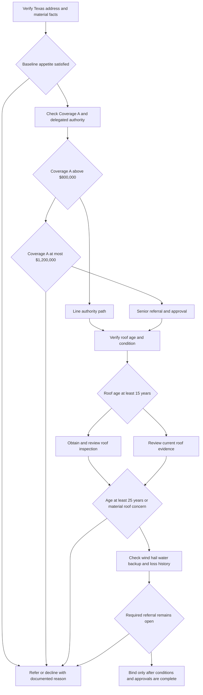

# Texas Homeowners Appetite Guidance

## Status and use

**Internal carrier guidance only.** Use this page to support consistent risk selection and file handling. It is not a policy term, a coverage grant, or a statement of Texas law. Coverage, deductibles, notice duties, and claim obligations come from the assembled policy, declarations, attached forms and endorsements, and applicable law. Do not tell an applicant or insured that an appetite rule changes coverage. This separation is required by the Texas guideline’s purpose and status provisions ([H.0.1-H.0.3](repo://guidelines/appetite/tx-homeowners.md#L13-L21), [H.0.2 and H.0.10](repo://guidelines/appetite/tx-homeowners.md#L15-L17), [H.0.20-H.0.22](repo://guidelines/appetite/tx-homeowners.md#L51-L57)) and by the underwriting manual’s internal-use and no-coverage-alteration rules ([100.B-100.D](repo://manuals/underwriting/manual.md#L21-L37)).

Apply the guidance to new business, renewals, endorsements, and material risk changes. Obtain material facts before binding; verify application statements where appropriate; request photographs, inspections, repair records, and other support; document the decision and any exception; and refer unresolved or unusual facts. Decline, nonrenewal, conditioning, and exception actions remain subject to delegated authority and applicable procedures ([H.0.3-H.0.9](repo://guidelines/appetite/tx-homeowners.md#L19-L31), [H.0.16-H.0.20](repo://guidelines/appetite/tx-homeowners.md#L43-L53)).

### Manual overlay and sequencing

The changed manual supplies a second, internal control layer rather than a coverage rule. Rule 100 requires current, reliable information, pre-bind review, documented authority, and no binding while a required referral is pending ([100.A-100.J](repo://manuals/underwriting/manual.md#L13-L73)). For roofs, Rule 210 requires inspection findings at **15 years**, declines at **25 years**, requires reliable age and replacement evidence, and routes material condition concerns for review ([210.A-210.D](repo://manuals/underwriting/manual.md#L2211-L2235)). Rule 900 routes a roof at or beyond **25 years** for declination processing and requires an authorized exception before binding; it also separately routes incomplete **3-year** loss history and water-backup requests above **$25,000** ([900.C-900.E](repo://manuals/underwriting/manual.md#L9879-L9895)).

Apply the Texas-specific Rule 510 authority and verification controls after the underlying eligibility review: line authority ends at **$800,000**, senior Texas review runs through **$1,200,000**, and amounts above that must be declined or referred ([510.1-510.9](repo://manuals/underwriting/manual.md#L6227-L6281)). Rule 400 separately controls endorsement attachment: current facts, eligibility, matching to the named insured, location, and property, and complete information must be confirmed before attachment ([400.A-400.G](repo://manuals/underwriting/manual.md#L5089-L5129)). None of these manual rules changes an issued policy’s coverage or deductible.

## Binding decision flow

*This flow summarizes the internal intake, authority, roof, peril, loss-history, and bindability sequence in H.1-H.7.*

## At-a-glance controls

| Control | Internal Texas guidance | Operational action |
|---|---|---|
| Coverage A appetite | **$150,000 minimum** and **$1,200,000 maximum** | Verify the requested limit and do not bind outside the stated appetite. ([H.1.1](repo://guidelines/appetite/tx-homeowners.md#L59-L63)) |
| Protection class | Must not exceed **8** | Verify the source and refer a higher class. ([H.1.2](repo://guidelines/appetite/tx-homeowners.md#L61-L64)) |
| Line authority | Up to **$800,000 Coverage A** | A line underwriter may bind only within delegated authority and after all other controls pass. ([H.7.1-H.7.2](repo://guidelines/appetite/tx-homeowners.md#L651-L657); [Rule 510.1](repo://manuals/underwriting/manual.md#L6227-L6233)) |
| Senior authority and ceiling | Senior underwriter up to **$1,200,000 Coverage A**; above **$1,200,000** decline or refer | Refer above line authority. Do not split, reduce, or restructure the exposure to evade review. ([H.7.3-H.7.6](repo://guidelines/appetite/tx-homeowners.md#L655-L663); [Rule 510.2-510.3](repo://manuals/underwriting/manual.md#L6235-L6245)) |
| Roof age | At or above **15 years**: inspection before binding; at or above **25 years**: no bind and declination processing | Verify reliable age, replacement, and condition evidence. An unknown age or inadequate evidence is a referral, not an assumption of acceptability. ([H.2.1-H.2.6](repo://guidelines/appetite/tx-homeowners.md#L153-L167); [210.A-210.D](repo://manuals/underwriting/manual.md#L2211-L2235); [900.D](repo://manuals/underwriting/manual.md#L9885-L9889)) |
| Wind mitigation | Coverage A **over $500,000** | Obtain a qualified inspection, retain it, and refer conflicts with the application or other evidence. ([H.3.1-H.3.5](repo://guidelines/appetite/tx-homeowners.md#L275-L285)) |
| Water backup | A requested water-backup limit **above $25,000** requires underwriting referral before binding | Treat this as an internal escalation threshold. The attached endorsement may impose a lower contractual limit; the form controls that limit. ([H.4.1-H.4.4](repo://guidelines/appetite/tx-homeowners.md#L367-L377); [Rule 510.4](repo://manuals/underwriting/manual.md#L6247-L6251)) |
| Prior property losses | Review the preceding **3 years**; **2 paid property claims** require referral | Include dwelling, other-structure, personal-property, and loss-of-use claims, including claims paid by another insurer. ([H.5.1-H.5.8](repo://guidelines/appetite/tx-homeowners.md#L447-L463)) |
| Internal mitigation checkpoint | Begin reasonable mitigation within **7 days after discovery** of a covered loss condition | Diary and document mitigation. This is an internal handling instruction, not a substitute for the policy’s duties after loss. ([H.6.5-H.6.10](repo://guidelines/appetite/tx-homeowners.md#L579-L589)) |
| Water-backup claim notice in the guideline | **60 days after discovery** | Use the actual policy and attached endorsement for the contractual deadline; do not present the internal period as a policy term. ([H.4.22-H.4.26](repo://guidelines/appetite/tx-homeowners.md#L411-L421); [H.0.2 and H.0.10](repo://guidelines/appetite/tx-homeowners.md#L15-L17)) |

## Baseline Texas homeowners appetite

The dwelling should be principally a private residence of the named insured, with an insurable interest, reliable replacement-cost valuation, sound structure, serviceable roof, maintained exterior, operational plumbing, safe electrical and heating systems, functional water and sanitary systems, stable foundation, and no vacancy or abandonment. Material ownership, occupancy, prior-loss, insurance-history, location, construction, and use information must be disclosed and verifiable ([H.1.3-H.1.18](repo://guidelines/appetite/tx-homeowners.md#L63-L97)).

The following are not routine binds without resolution or referral: commercial, transient lodging, manufacturing, repair, storage, distribution, or materially agricultural use; inaccessible premises; severe brush, wildfire-interface, recurring flood, windborne-debris, earth-movement, condemned, hazardous-material, or unsafe fuel exposures; active construction or poorly managed renovation; unsafe detached structures, pools, recreational equipment, animals, fences, gates, stairs, or walkways; and unresolved inspection or repair findings. Required repairs must be complete or otherwise resolved before issuance, and material unanswered or inconsistent questions support decline or referral ([H.1.19-H.1.46](repo://guidelines/appetite/tx-homeowners.md#L97-L151)).

Do not treat a missing fact as favorable. Verify the Texas address before quoting or binding, match the occupancy description to actual use, verify insurable interest, and refer conflicting ownership or occupancy information. These Texas state-exception controls are separate from coverage terms ([Rule 510.6-510.15](repo://manuals/underwriting/manual.md#L6259-L6317)).

## Roof-age and condition controls

### Required evidence and age gates

Before offering terms, verify roof covering type, visible condition, reported age, and replacement history. Applicant information is usable only when consistent with available property facts. Unknown age, obscured or inaccessible surfacing, outdated or incomplete images, or evidence that does not support a reasonable condition determination requires referral or additional evidence. At **15 years or older**, obtain and review a roof inspection before binding. At **25 years or older**, do not bind. ([H.2.1-H.2.8](repo://guidelines/appetite/tx-homeowners.md#L153-L169), [H.2.38-H.2.40](repo://guidelines/appetite/tx-homeowners.md#L227-L233), [H.2.53-H.2.60](repo://guidelines/appetite/tx-homeowners.md#L257-L273))

### Condition referral triggers

Refer rather than bind when evidence shows active leakage, staining or moisture intrusion, missing/lifted/cracked/curled or deteriorated material, exposed underlayment or fasteners, sagging or deflection, obstructed or ineffective drainage, close or abrasive vegetation contact, temporary or improvised repairs, incomplete or mismatched repairs, partial replacement with deteriorated remaining areas, ponding or membrane problems on flat or low-slope areas, uncertain specialty material, damaged valleys, penetrations, flashings or transitions, or improperly secured or sealed roof-mounted equipment. Cosmetic discoloration must not be accepted when accompanied by material deterioration ([H.2.9-H.2.20](repo://guidelines/appetite/tx-homeowners.md#L169-L193), [H.2.23-H.2.34](repo://guidelines/appetite/tx-homeowners.md#L197-L221)).

Normal weathering may be accepted only when roof function and weather resistance are not compromised. Distinguish ordinary granule variation from widespread surface loss or exposed substrate; consider prior roof repairs and claims; verify any conflict between reported age and visible condition; and refer extensive, unresolved, or replacement-cost-inconsistent deterioration. Complete corrective work and obtain confirmation before removing a roof concern. Apply the same roof controls to the dwelling and relevant attached or detached structures ([H.2.21-H.2.24](repo://guidelines/appetite/tx-homeowners.md#L193-L203), [H.2.35-H.2.52](repo://guidelines/appetite/tx-homeowners.md#L221-L257)).

These roof controls are underwriting requirements, not a rewording of the policy’s roof or property provisions. The manual independently requires reliable age and replacement evidence, inspection at 15 years, and decline/declination processing at 25 years ([Rule 210.A-210.D](repo://manuals/underwriting/manual.md#L2211-L2235); [Rule 900.D](repo://manuals/underwriting/manual.md#L9885-L9889)). It also requires verification of roof material, condition, and visible defects; referral for damage, leakage, temporary repair, or unresolved condition; and correction when underwriting determines it is necessary ([Rule 510.19-510.24](repo://manuals/underwriting/manual.md#L6337-L6371)).

## Wind and hail handling

### Pre-bind controls

Confirm the insured location, roof characteristics, maintenance, surrounding trees, unsecured exterior features, and debris hazards. For Coverage A **over $500,000**, obtain a qualified wind-mitigation inspection and retain the report. Credit only mitigation features that the report identifies clearly; refer conflicts among the inspection, application, photographs, and other underwriting information. Prior wind, hail, roof, and water losses require a satisfactory explanation and evidence that repairs are complete ([H.3.1-H.3.14](repo://guidelines/appetite/tx-homeowners.md#L275-L303)).

### Deductible and storm-period administration

Apply the minimum windstorm-and-hail deductible required by the applicable deductible provision, show it consistently in the application, quote, and policy records, and explain that it may apply to covered damage caused by the named peril. Do not describe it as waived unless the applicable policy provision expressly supports that result. A deductible reduction or other wind-related change must not be processed while binding restrictions apply; review pending weather, refer requests during an active event or restriction, and use the storm-period duration stated by the applicable policy provision ([H.3.15-H.3.26](repo://guidelines/appetite/tx-homeowners.md#L303-L327)).

The assembled contract and the Texas bulletin constrain how these internal controls are operationalized, but they do not change the meaning of the coverage grant:

- **HO 01 45 (2022-01):** the declarations-listed windstorm and hail deductible is **1% to 10%**, applies to covered direct physical loss, and is calculated from the applicable limit for the damaged property ([T.1-T.7](repo://forms/HO/TX/HO-01-45/2022-01.md#L59-L73)). Its windstorm-deductible increase notice is at least **45 days** ([T.1-T.5, Notice of Deductible Change](repo://forms/HO/TX/HO-01-45/2022-01.md#L167-L177)). Its Named Storm Period continues **72 hours after** the governmental designation ends ([T.1-T.5, Named Storm Period](repo://forms/HO/TX/HO-01-45/2022-01.md#L217-L227)).
- **DP 01 45 (2022-01):** the declarations-listed Windstorm or Hail Deductible is **1% to 5%**, calculated from the applicable amount of insurance, and applied to the covered loss from the occurrence ([T.1-T.10](repo://forms/DP/TX/DP-01-45/2022-01.md#L92-L121)). Its increase notice is at least **30 days** ([T.1-T.7, Notice of Deductible Change](repo://forms/DP/TX/DP-01-45/2022-01.md#L378-L385)). Its Named Storm Period continues **72 hours after** the official designation ends ([T.1-T.4, Named Storm Period](repo://forms/DP/TX/DP-01-45/2022-01.md#L485-L501)).
- **Texas Bulletin B-2021-08:** for the regulatory categories addressed there, a named-storm windstorm-and-hail deductible must be at least **1%**, a hurricane deductible must not exceed **5%**, and a seacoast-territory windstorm deductible must not exceed **10%**. The bulletin also requires clear disclosure, a stated trigger and calculation basis, consistency among policy materials, and no duplicative deductible unless the policy permits it ([B.2.1-B.2.21](repo://bulletins/TX/b-2021-08-windstorm-deductibles.md#L47-L89)). It requires at least **30 days’ written notice** before increasing a windstorm deductible and disclosure of a **72-hour** continuation when the policy uses a named-storm period ([B.3.9-B.3.23](repo://bulletins/TX/b-2021-08-windstorm-deductibles.md#L153-L181)). Use the form edition in force for the contract calculation and notice period; the bulletin is an administrative constraint, not a replacement deductible term.

Before attaching, changing, or making an exception to a Texas deductible arrangement, apply the internal attachment and authority gates separately: Rule 400 requires the requested endorsement to be supported by current facts, eligible, and matched to the named insured, location, and insured property ([400.A-400.G](repo://manuals/underwriting/manual.md#L5091-L5129)); Rule 510.52-510.53 requires the requested deductible to be available and supported, and refers exceptions to standard treatment ([510.52-510.53](repo://manuals/underwriting/manual.md#L6535-L6545)). Those controls govern whether the carrier offers or attaches the arrangement; the issued HO or DP form and applicable bulletin govern the contract and regulatory administration.

### Loss-handling boundary

For a reported wind or hail loss, allow reasonable emergency protection, preserve damaged property, photographs, invoices, repair records, and weather information, and distinguish temporary protection from permanent repair. Establish whether wind or hail created a covered opening and whether interior water damage followed it; do not infer covered causation merely from a nearby storm. Separate direct physical loss from wear, deterioration, faulty maintenance, preexisting damage, and prior repair. Escalate suspected misrepresentation, altered documents, inconsistent damage reports, unusual causation, or unresolved coverage issues ([H.3.27-H.3.45](repo://guidelines/appetite/tx-homeowners.md#L327-L365)). The form likewise applies its deductible only after covered loss and causation are determined ([HO 01 45 T.12-T.23](repo://forms/HO/TX/HO-01-45/2022-01.md#L81-L105)).

## Water-backup considerations

### Offer and eligibility screen

Offer water-backup coverage only when the potential discharge from a sewer, drain, or sump system is controllable. Review prior water entry, drain overflow, sump activity, sewer connection, private or public disposal arrangement, below-grade fixtures, finished lower levels, protective devices, and maintenance. Refer unresolved plumbing, drainage, sewer, root-intrusion, repeated-blockage, sump-overflow, or pump-malfunction conditions. Verify a required backwater valve or other protective device is installed and operational, and document the applicant’s response ([H.4.1-H.4.19](repo://guidelines/appetite/tx-homeowners.md#L367-L405)).

A request above **$25,000** is an internal referral trigger before binding. It is not an assurance that such a limit is available, and it is not a contractual sublimit. When water-backup coverage depends on an attached endorsement, read the actual declarations and endorsement for its limit, deductible, conditions, and notice duties; do not import the internal threshold into contract language. Manual Rule 400 separately requires water-related endorsements to be supported by evaluated water and drainage conditions and routes repeated drainage or sewer concerns for review ([400.M-400.N](repo://manuals/underwriting/manual.md#L5163-L5173)).

### Attachment and coverage communication

A water-backup endorsement is contractual only when it is attached, and its terms apply only within the stated scope. Before attaching or offering one, review the current risk facts, eligibility, water sources, and drainage conditions; match the request to the named insured, location, and insured property; and resolve incomplete or conflicting information. Manual Rules 400.A-400.G and 400.M-400.N make those internal attachment and referral controls explicit ([400.A-400.G](repo://manuals/underwriting/manual.md#L5091-L5129); [400.M-400.N](repo://manuals/underwriting/manual.md#L5163-L5173)). Keep that review separate from the attached endorsement's contractual limit, deductible, notice duty, and special requirements; the actual form and declarations control those terms.

### Cause and coverage communication

Explain the applicable sublimit and deductible before binding, and do not describe water backup as protection for every source of water. Distinguish sewer or drain backup and sump discharge or overflow from surface water, flood, groundwater, seepage through building materials, roof or exterior openings, plumbing-fixture or appliance discharge, and maintenance-related conditions. The attached policy and endorsement determine which causes, exclusions, limits, and direct-physical-loss requirements apply; the internal guideline supplies the screening and referral controls ([H.4.1-H.4.19](repo://guidelines/appetite/tx-homeowners.md#L367-L405); [400.M-400.O](repo://manuals/underwriting/manual.md#L5163-L5179)).

Do not assume that a sump pump proves a covered sump event, that water in the dwelling proves backup, or that a closed prior claim proves the condition was repaired. Require a clear source description and, when uncertain, photographs, repair records, contractor findings, failed equipment evidence, and other support. Separate resulting covered property damage from correction, redesign, upgrade, or replacement of the failed drainage or sump equipment under the actual policy and attached endorsement ([H.4.20-H.4.39](repo://guidelines/appetite/tx-homeowners.md#L405-L445); [100.D](repo://manuals/underwriting/manual.md#L33-L37)).

### Water-backup loss procedures

The guideline says to report a claimed water-backup loss within **60 days after discovery**, protect undamaged property, preserve damaged materials unless safety or sanitation requires disposal, and separate emergency extraction and drying from permanent drainage or plumbing improvements ([H.4.24-H.4.38](repo://guidelines/appetite/tx-homeowners.md#L415-L443)). That 60-day period is an internal handling checkpoint. Use the actual policy and attached endorsement for contractual notice, mitigation, preservation, access, records, and inspection duties; the internal period must not be presented as a policy promise ([H.0.2 and H.0.10](repo://guidelines/appetite/tx-homeowners.md#L15-L17); [100.B-100.D](repo://manuals/underwriting/manual.md#L21-L37)).

## Prior losses and referral package

Obtain reliable loss information before deciding eligibility. Review the preceding **3 years** and refer an application when the history shows **2 paid property claims**. Count paid dwelling, other-structure, personal-property, and loss-of-use claims, including claims paid by another insurer. Ask for an explanation of incomplete, inconsistent, or unclear history, but do not disregard a paid claim merely because the applicant says repairs were completed ([H.5.1-H.5.8](repo://guidelines/appetite/tx-homeowners.md#L447-L463)).

For each material loss, record cause, location, disposition, repair status, and whether the cause was sudden, repeated, seepage-related, overflow-related, drainage-related, or weather-related. Refer unresolved water, fire, weather, theft, vandalism, liability, catastrophe, identity, location, or repair concerns; consider an inspection where hidden damage or deferred maintenance is possible ([H.5.9-H.5.42](repo://guidelines/appetite/tx-homeowners.md#L463-L531)). The manual’s Texas rule likewise requires accurate prior-loss disclosure, referral for material discrepancies or unresolved prior losses, and documentation of the discrepancy and disposition ([Rule 510.25-510.30](repo://manuals/underwriting/manual.md#L6373-L6407)).

Do not bind while a required referral is unresolved. Submit loss reports, applicant explanation, repair evidence, mitigation information, and the unresolved concern. Bind only after the referral decision authorizes binding and all conditions are satisfied; communicate those conditions before binding; update the file if new loss information arrives; and record the outcome, authority, follow-up, and any waiver. Use neutral factual language and protect claim information ([H.5.43-H.5.60](repo://guidelines/appetite/tx-homeowners.md#L531-L567)).

## Procedures, evidence, and file controls

For a loss or material underwriting concern:

1. Open or update the file promptly and record the reported facts without editorial conclusions. Confirm named insured, risk location, policy status, coverage parts, and the applicable form or endorsement before communicating a position ([H.6.1-H.6.4](repo://guidelines/appetite/tx-homeowners.md#L569-L579)).
2. Identify immediate threats and arrange reasonable emergency action where appropriate. Begin internal mitigation within **7 days after discovery** of a covered loss condition; document condition before repair or disposal where practical, retain damaged property, and distinguish emergency services from permanent repairs ([H.6.5-H.6.11](repo://guidelines/appetite/tx-homeowners.md#L579-L591)).
3. Determine cause before approving repairs or payment. Review exclusions, limitations, deductibles, endorsements, and special conditions; request only information needed for the decision; monitor proof-of-loss timing; inspect when cause, extent, repairability, or value requires it; and document any inability to inspect ([H.6.12-H.6.22](repo://guidelines/appetite/tx-homeowners.md#L591-L615)).
4. Preserve communications, photographs, estimates, reports, expert work, disputed facts, and the factual and policy basis for any reservation, denial, partial denial, limitation, deductible application, payment, or referral. Obtain appropriate review before an adverse decision and do not close an investigation while material facts remain unresolved ([H.6.23-H.6.33](repo://guidelines/appetite/tx-homeowners.md#L613-L635)).
5. Verify payees and mortgagee interests, refer suspected fraud or material misrepresentation, and diary appraisal or legal-action deadlines when applicable. Escalate unusual coverage issues, significant disputes, regulatory concerns, and potential bad-faith allegations ([H.6.34-H.6.40](repo://guidelines/appetite/tx-homeowners.md#L635-L649)).

These are internal workflow controls. Where a form supplies a different contractual deadline or duty, use the form in force for the assembled policy and document the source used. The Texas bulletin similarly requires claim-specific causation support, clear deductible explanations, and records supporting the deductible decision; it does not authorize a deductible the policy does not permit ([B.1.3-B.1.6](repo://bulletins/TX/b-2021-08-windstorm-deductibles.md#L19-L25), [B.4.2-B.4.18](repo://bulletins/TX/b-2021-08-windstorm-deductibles.md#L217-L247)).

## Authority, exceptions, and bindability

Apply authority before offering terms that depend on discretion. A line underwriter may bind up to **$800,000 Coverage A**; a senior underwriter may bind up to **$1,200,000** when the file supports the action; a request above **$1,200,000** must be declined or referred. Verify the complete insured location, apply the Texas state-exception ceiling before issuing a bindable quotation, and do not divide the risk or alter the requested limit to avoid the ceiling ([H.7.1-H.7.7](repo://guidelines/appetite/tx-homeowners.md#L651-L665); [Rule 510.1-510.3](repo://manuals/underwriting/manual.md#L6229-L6245)).

A referral is required for unusual construction, condition, occupancy, maintenance, valuation, inspection, loss, or other material facts not clearly addressed by the appetite; for any exception to a stated requirement; when material information changes after quotation; when required inspection or verification is missing or conflicts; and whenever the action is outside the reviewer’s authority. Do not imply approval, act on silence, bind subject to an unapproved exception, or use one applicant’s approval for another location. Bind only the coverage in the approved record after every condition is satisfied ([H.7.8-H.7.19](repo://guidelines/appetite/tx-homeowners.md#L665-L689), [H.7.20-H.7.48](repo://guidelines/appetite/tx-homeowners.md#L689-L747)).

Retain the approval, approving person, scope, supporting evidence, communications, conditions, completed inspections, and any authorized waiver. Rule 510 requires Texas exception support in the file before binding or declining and says review must be completed early enough to meet the applicable accept-or-deny deadline ([Rule 510.54-510.58](repo://manuals/underwriting/manual.md#L6547-L6569), [Rule 510.58](repo://manuals/underwriting/manual.md#L6571-L6575)). Authority controls remain internal guidance and do not alter policy coverage ([H.7.49](repo://guidelines/appetite/tx-homeowners.md#L745-L749)).

## Final pre-bind checklist

- Texas risk address, named insured, insurable interest, occupancy, use, construction, and Coverage A are verified.
- Coverage A is within the **$150,000-$1,200,000** appetite; authority is within **$800,000 line** or **$1,200,000 senior** limits, with approval recorded.
- Protection class is **8 or lower**.
- Roof age, material, condition, replacement history, drainage, attachments, and images are documented; the **15-year inspection** gate and **25-year no-bind** gate are applied.
- Coverage A above **$500,000** has a qualified wind-mitigation inspection, with conflicts resolved.
- Wind, hail, storm-period, deductible, and pending-weather restrictions are checked against the correct HO or DP form, declarations, and applicable bulletin administration.
- Water-backup source, drainage, sump, backwater valve, prior events, lower-level exposure, requested limit, and maintenance conditions are documented; requests above **$25,000** are referred, and the attached form’s actual limit is used.
- The preceding **3 years** of property loss history are reviewed; **2 paid property claims** are referred; repairs and explanations are documented.
- No material inspection, repair, occupancy, loss, valuation, or information concern remains unresolved; all conditions and approvals are recorded before binding.

This checklist is a compact internal control summary, not a substitute for the cited guideline, manual, policy, endorsement, declarations, or law.
