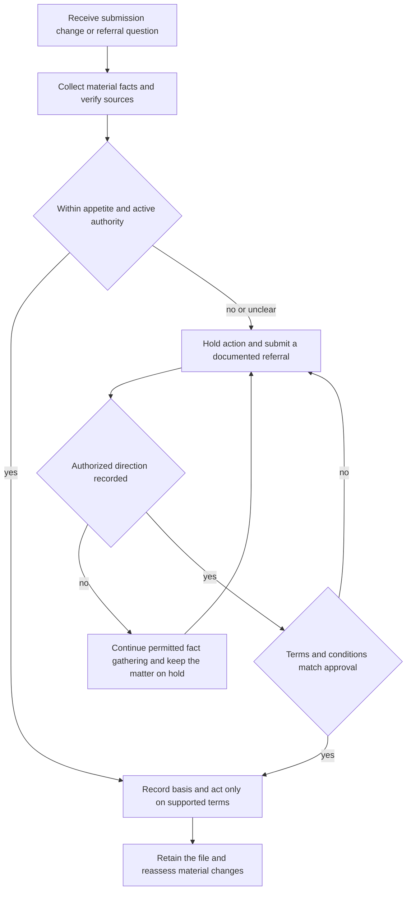

# Manual Binding Authority, Referrals, and Unclearable Conditions

## Scope and governing boundary

This page consolidates the authority and escalation controls in **Personal Lines Underwriting Manual Rules 300–320 and Rule 900**. The Manual is internal carrier direction: it governs who may act, when action must stop for review, what evidence belongs in the file, and when a condition requires decline. It is not a policy term, a coverage grant, a coverage limitation, or state law. The referral matrix is likewise internal underwriting and claims guidance, not an insurance contract. Apply the controlling policy form, declarations, endorsements, and applicable state requirements separately. [Manual Rule 100.A–100.D](repo://manuals/underwriting/manual.md#L13-L37) [Matrix H.0.1–H.0.5](repo://guidelines/authority/referral-matrix.md#L13-L23) [HO-3 2024-03 AGR.1–AGR.3](repo://forms/HO/MS/HO-3/2024-03.md#L13-L19)

A referral is a request for authorized direction, not an automatic approval or declination and not a transfer of responsibility for the accuracy of the file. Do not infer approval from silence, delay, informal discussion, or an incomplete response. Preserve the material facts, requested action, referral reason, response, approver, conditions, and communications. [Matrix H.0.7–H.0.11](repo://guidelines/authority/referral-matrix.md#L27-L35) [Matrix H.0.16–H.0.19](repo://guidelines/authority/referral-matrix.md#L45-L51)

## Decision flow

*This flow shows the underwriting control path; it does not decide coverage or override the policy.*

## Rule 300 — delegated binding authority

Rule 300 establishes the Manual’s binding ceilings and the control sequence around them:

- A line underwriter may bind **Coverage A up to and including $800,000**; a request above that ceiling must be referred. A senior underwriter may bind **Coverage A up to and including $1,500,000**; a request above senior authority must be referred. These are separate authority levels, not a combined allowance. Record the requested limit and the authority used. **Manual Rule 300.A–300.B.** [Rule 300.A–300.B](repo://manuals/underwriting/manual.md#L3991-L4003)
- The risk must fall within the underwriter’s active delegation. A risk requiring authority beyond that delegation goes for independent review; a pending referral is not approval. **Manual Rule 300.C–300.D and 300.X.** [Rule 300.C–300.D](repo://manuals/underwriting/manual.md#L4005-L4015) [Rule 300.X](repo://manuals/underwriting/manual.md#L4131-L4135)
- Before binding, confirm effective date, identity, insurable interest, occupancy, location, territory, material risk information, property condition, valuation, coverage fit, deductible, and material rating information. Unclear or conflicting information is a referral condition rather than a basis for assumption. **Manual Rule 300.E–300.T and 300.AC.** [Rule 300.E–300.T](repo://manuals/underwriting/manual.md#L4017-L4111) [Rule 300.AC](repo://manuals/underwriting/manual.md#L4161-L4165)
- A referred risk may be bound only within the expressly approved terms. Do not change approved conditions, rely on undocumented verbal approval, use inactive authority, backdate coverage, or split or sequence a transaction to evade a ceiling. **Manual Rule 300.Y–300.AD and 300.BC.** [Rule 300.Y–300.AD](repo://manuals/underwriting/manual.md#L4137-L4171) [Rule 300.BC](repo://manuals/underwriting/manual.md#L4317-L4321)
- Do not let an exception for one risk become authority for another. Reassess authority when material information changes before issuance, and escalate a bound risk that may need cancellation, restriction, or another corrective action. **Manual Rule 300.BG–300.BN.** [Rule 300.BG–300.BN](repo://manuals/underwriting/manual.md#L4341-L4387)

### What the authority check owns

The authority check answers **who may bind what terms at what limit**. It does not answer whether a policy covers a loss. For example, the HO-3 form’s base wording excludes sewer, drain, and sump backup unless an endorsement is attached; that contract question remains separate from the Manual’s operational referral for a requested water-backup limit. [HO-3 2024-03 X.7–X.10](repo://forms/HO/MS/HO-3/2024-03.md#L683-L691) [Manual Rule 900.E](repo://manuals/underwriting/manual.md#L9891-L9895)

## Rule 310 — mandatory referral conditions

Rule 310 requires a hold or referral before underwriting action when the trigger is present. The trigger is not cleared merely because the applicant gives an explanation; the explanation and supporting evidence belong in the referral package.

### Loss, claim, liability, and legal triggers

- Refer a reported loss **at or above $100,000** and hold binding authority pending disposition. Refer open or disputed claims, bodily-injury or property-damage liability allegations, negligent-supervision or intentional-conduct allegations, pending litigation, and demands for damages that indicate a potential claim. **Manual Rule 310.A–310.I.** [Rule 310.A–310.I](repo://manuals/underwriting/manual.md#L4413-L4467)
- Refer prior underwriting action for underwriting reasons, hazard-related declines by another carrier, materially inconsistent application information, suspected material misrepresentation, unverifiable ownership, and trust, estate, or similar ownership arrangements. **Manual Rule 310.J–310.P.** [Rule 310.J–310.P](repo://manuals/underwriting/manual.md#L4469-L4509)

### Occupancy, use, property, and systems triggers

- Refer business activity, commercial storage, manufacturing, repair, processing, or regular public access at the location. Also refer vacant or unoccupied premises, ongoing renovation or major repair, unrepaired structural damage, foundation movement or settlement, roof damage or leakage, recurring water intrusion, unresolved plumbing leakage, sewer or drain backup, sanitation concerns, mold, fungi, or rot. **Manual Rule 310.Q–310.AC.** [Rule 310.Q–310.AC](repo://manuals/underwriting/manual.md#L4511-L4587)
- Refer electrical hazards or outdated components, heating concerns, fuel storage or leakage, wood-burning or solid-fuel heating, pools and similar water features, trampolines and climbing structures, aggressive or biting animals, exotic or restricted animals, and nonpersonal firearm activity. **Manual Rule 310.AD–310.AL.** [Rule 310.AD–310.AL](repo://manuals/underwriting/manual.md#L4589-L4641)
- Refer commercial recreational-vehicle use, delivery or passenger carriage, invalid or restricted driving privileges, serious moving violations, alcohol-related driving conduct, vehicle modifications, collector or unusual vehicles, rental or short-term lodging use, undisclosed shared occupancy, organized events, and gatherings. **Manual Rule 310.AM–310.AX.** [Rule 310.AM–310.AX](repo://manuals/underwriting/manual.md#L4643-L4713)
- Refer fraud indicators, identity concerns, materially adverse credit information used in underwriting, prior carrier investigations, adverse inspection findings, unverified protective features, unusual construction, nonstandard materials or design, and any material hazard not addressed by routine underwriting. **Manual Rule 310.AY–310.BF.** [Rule 310.AY–310.BF](repo://manuals/underwriting/manual.md#L4715-L4761)

For each Rule 310 referral, record the trigger, source, relevant facts, verification efforts, requested decision, authority response, imposed conditions, and final action. Do not bind, renew, broaden, or otherwise complete the action when the rule says to hold it pending disposition. This file discipline is consistent with the Manual’s requirement to retain the referral reason and direction and with the Matrix’s requirement that a referral remain an accountable request for direction. [Manual Rule 310.A, 310.B, and 310.BF](repo://manuals/underwriting/manual.md#L4415-L4425) [Matrix H.0.8 and H.0.11](repo://guidelines/authority/referral-matrix.md#L29-L35)

## Rule 320 — conditions that cannot be cleared

Rule 320 is the **no-clearance path**. Its baseline is to decline a known condition that materially increases expected loss and cannot be corrected before binding; underwriting notes do not cure it. The rule then identifies conditions requiring decline, including:

- unrepaired structural damage; compromised foundation, settlement, active movement, or material cracking; unresolved roof damage, deterioration, active leakage, missing covering, unsecured materials, or openings; active water intrusion; and unrepaired plumbing failure. **Manual Rule 320.1–320.7.** [Rule 320.1–320.7](repo://manuals/underwriting/manual.md#L4763-L4805)
- defective wiring, unsafe electrical equipment, recalled panels, unsafe heating or venting, fuel leaks, unsafe solid-fuel appliances, open ignition or combustibles hazards, unsafe fireplaces, chimneys, or flues, and unrepaired fire damage. **Manual Rule 320.8–320.14.** [Rule 320.8–320.14](repo://manuals/underwriting/manual.md#L4807-L4847)
- unresolved mold, fungal growth, rot, or moisture damage; deteriorated siding or unsecured building-envelope components; unsafe decks, porches, balconies, stairs, railings, or elevated surfaces; unsafe pools or water features; unsecured recreational hazards; aggressive or injury-involved animals; and other foreseeable bodily-injury hazards that cannot be corrected before binding. **Manual Rule 320.15–320.21.** [Rule 320.15–320.21](repo://manuals/underwriting/manual.md#L4849-L4889)
- abandoned vehicles or hazardous debris; ongoing construction, demolition, major renovation, or material alteration; vacant, neglected, or materially unoccupied premises; unlawful occupancy, disputed possession, or unresolved ownership conflict; unrepaired prior-loss damage; and recurring loss causes that remain unresolved. **Manual Rule 320.22–320.27.** [Rule 320.22–320.27](repo://manuals/underwriting/manual.md#L4891-L4925)
- evidence of misrepresentation or altered records; refusal of access; material information that cannot be obtained or verified; criminal activity; hazardous materials, unlawful substances, contamination, underground storage, or petroleum release. **Manual Rule 320.28–320.34.** [Rule 320.28–320.34](repo://manuals/underwriting/manual.md#L4927-L4967)
- unresolved flood, drainage, standing-water, retaining-wall, slope, grading, vegetation, or weather damage; and restricted or blocked emergency access. **Manual Rule 320.35–320.41.** [Rule 320.35–320.41](repo://manuals/underwriting/manual.md#L4969-L5009)
- inoperable or impaired protective devices; an unresolvable protection gap; unresolved replacement-cost or coinsurance concerns; and material commercial activity. **Manual Rule 320.42–320.47.** [Rule 320.42–320.47](repo://manuals/underwriting/manual.md#L5011-L5045)
- manufacturing, repair, storage, or service activity creating commercial exposure; unacceptable short-term or unverified tenant use; material neglect; missing evidence of required professional repair; or a disputed material condition that reliable evidence cannot resolve. **Manual Rule 320.48–320.53.** [Rule 320.48–320.53](repo://manuals/underwriting/manual.md#L5047-L5081)

The catch-all is important: a condition outside the listed examples is still referred when it cannot be cleared before binding; it is not silently accepted as a local exception. **Manual Rule 320.54.** [Rule 320.54](repo://manuals/underwriting/manual.md#L5083-L5087)

### Referral versus no clearance

Use the distinction deliberately:

1. **Refer and hold** when Rule 310 makes review mandatory, when Rule 300 places the transaction outside active delegation, or when facts are material but may be resolved or assessed by an authorized reviewer.
2. **Decline under Rule 320** when the known condition materially increases expected loss and cannot be corrected before binding, including the listed structural, roof, water, electrical, occupancy, access, protection, valuation, commercial-use, and information failures.
3. **Do not convert a Rule 320 decline into a documentation-only exception.** If the condition is unlisted and cannot be cleared, Rule 320.54 sends it to referral for an underwriting decision, while the listed Rule 320 conditions state the decline outcome. [Rule 320.1](repo://manuals/underwriting/manual.md#L4765-L4769) [Rule 320.54](repo://manuals/underwriting/manual.md#L5083-L5087)

## Rule 900 — appendix referral matrix

Rule 900 is a compact operational appendix. It repeats high-value and common referral checks rather than replacing Rules 300–320.

### Numeric and timing positions

| Topic | Rule 900 position | Separate related source position |
|---|---|---|
| **Reported loss** | Refer a reported loss **exceeding $25,000** to designated claims authority and do not approve settlement outside delegated authority. **Manual Rule 900.A.** [Rule 900.A](repo://manuals/underwriting/manual.md#L9865-L9871) | Rule 310 separately requires underwriting referral for a reported loss **at or above $100,000** and a hold pending disposition. **Manual Rule 310.A.** [Rule 310.A](repo://manuals/underwriting/manual.md#L4413-L4419) These are different source positions and functions; this page does not collapse them into one threshold. |
| **Coverage A** | Refer new business **above $1,500,000** to senior underwriting and record authority before binding confirmation. **Manual Rule 900.B.** [Rule 900.B](repo://manuals/underwriting/manual.md#L9873-L9877) | Rule 300 gives line authority through **$800,000** and senior authority through **$1,500,000**. **Manual Rule 300.A–300.B.** [Rule 300.A–300.B](repo://manuals/underwriting/manual.md#L3993-L4003) The Texas appetite guide separately permits a Coverage A range of **$150,000–$1,200,000**. [Texas guide H.1.1](repo://guidelines/appetite/tx-homeowners.md#L59-L63) Eligibility, delegated capacity, and escalation are separate checks. |
| **Loss history** | Obtain **3 years** of loss history before eligibility and refer incomplete history. **Manual Rule 900.C.** [Rule 900.C](repo://manuals/underwriting/manual.md#L9879-L9883) | The referral matrix and Texas appetite guide state a separate **2 paid property claims** trigger within the preceding **3 years**. [Matrix H.5.1–H.5.4](repo://guidelines/authority/referral-matrix.md#L499-L507) [Texas guide H.5.1–H.5.4](repo://guidelines/appetite/tx-homeowners.md#L447-L455) The Manual appendix does not state that claim-count threshold. |
| **Roof** | Refer roof age **at or beyond 25 years** for declination processing; do not bind absent an authorized exception recorded in the file. **Manual Rule 900.D.** [Rule 900.D](repo://manuals/underwriting/manual.md#L9885-L9889) | The Texas appetite guide requires inspection at **15 years** and says a roof at or above **25 years may not be bound**. [Texas guide H.2.3–H.2.6](repo://guidelines/appetite/tx-homeowners.md#L155-L165) The matrix also uses a 25-year referral position. [Matrix H.2.1–H.2.7](repo://guidelines/authority/referral-matrix.md#L199-L213) Record these as separate source positions rather than treating the inspection threshold as a binding ceiling. |
| **Water backup** | Refer requested water-backup coverage **above $25,000** and do not quote the requested limit as available pending review. **Manual Rule 900.E.** [Rule 900.E](repo://manuals/underwriting/manual.md#L9891-L9895) | The referral matrix uses the same **above $25,000** underwriting referral trigger and requires documented approval before binding. [Matrix H.4.1–H.4.4](repo://guidelines/authority/referral-matrix.md#L395-L409) The HO-3 base form separately excludes sewer, drain, and sump backup unless an endorsement is attached. [HO-3 2024-03 X.8–X.9](repo://forms/HO/MS/HO-3/2024-03.md#L685-L687) |

### Non-numeric appendix triggers

Rule 900 also requires referral for material application-versus-inspection discrepancies and unrepaired damage. **Manual Rule 900.F–900.G.** [Rule 900.F–900.G](repo://manuals/underwriting/manual.md#L9897-L9907)

It also covers vacancy or unoccupancy; business, rental, or short-term rental indicators. **Manual Rule 900.H–900.L.** [Rule 900.H–900.L](repo://manuals/underwriting/manual.md#L9909-L9937)

It covers valuation conflicts, deferred maintenance, structural movement, unsafe water features, and unclear animal exposures. **Manual Rule 900.M–900.Q.** [Rule 900.M–900.Q](repo://manuals/underwriting/manual.md#L9939-L9967)

The appendix further covers prior cancellation, nonrenewal, or decline; material omissions; conflicting identity; unverifiable prior insurance or unexplained lapse. **Manual Rule 900.R–900.V.** [Rule 900.R–900.V](repo://manuals/underwriting/manual.md#L9969-L9997)

It also covers unclear loss cause; repeated water damage; prior fire, smoke, heat, theft, vandalism, or malicious damage. **Manual Rule 900.W–900.Z.** [Rule 900.W–900.Z](repo://manuals/underwriting/manual.md#L9999-L10021)

It also covers unrepaired electrical, plumbing, heating, or cooling; unsupported protective devices; inactive alarms or monitoring; adverse inspection recommendations; and materially mismatched requested coverage. **Manual Rule 900.AA–900.AE.** [Rule 900.AA–900.AE](repo://manuals/underwriting/manual.md#L10023-L10051)

Finally, it covers unusual construction; unclear detached-structure use; access conditions affecting emergency response; unverifiable mitigation; requested exceptions; material post-bind changes; and any file that does not support a clear eligibility decision. **Manual Rule 900.AF–900.AL.** [Rule 900.AF–900.AL](repo://manuals/underwriting/manual.md#L10053-L10093)

The appendix’s normal control is to document the evidence, hold the affected action, obtain direction, and record the disposition. For example, Rule 900.G requires referral for unrepaired property damage and allows action only when repair status is acceptable or an authorized exception is recorded. That appendix position must be read alongside the stricter Rule 320 no-clearance provisions; neither source is silently rewritten here. [Rule 900.F–900.G](repo://manuals/underwriting/manual.md#L9897-L9907) [Rule 320.1–320.7](repo://manuals/underwriting/manual.md#L4765-L4805)

## Operating the referral record

A usable referral package should contain:

1. **The requested action and authority question:** the limit, endorsement, exception, renewal, decline, settlement-related action, or other decision that needs direction.
2. **The trigger and source:** the applicable Rule 300, 310, 320, or 900 provision; the reported facts; the source record; and the date or status of the information.
3. **Material evidence:** application, inspection, photographs, loss history, claim information, repair records, valuation support, occupancy and ownership information, and relevant communications.
4. **Conflicts and unresolved items:** what differs, what verification was attempted, why the favorable interpretation was not selected, and how the issue could affect eligibility, terms, pricing, authority, or handling.
5. **The response and lifecycle:** authorized decision maker, approval or decline, exact approved terms, conditions, follow-up, and the final binding or file disposition.

Rules 300 and 900 require the authority, requested amount, referral reason, evidence, response, and disposition to be recorded; the Matrix separately requires the referral request, supporting information, approval response, approver, and conditions to remain with the file. [Manual Rule 300.A–300.D and 300.X–300.Z](repo://manuals/underwriting/manual.md#L3993-L4015) [Manual Rule 900.A–900.E](repo://manuals/underwriting/manual.md#L9867-L9895) [Manual Rule 900.AJ–900.AL](repo://manuals/underwriting/manual.md#L10077-L10093) [Matrix H.7.9–H.7.18 and H.7.25](repo://guidelines/authority/referral-matrix.md#L721-L749) [Matrix H.7.25](repo://guidelines/authority/referral-matrix.md#L769-L770)

While a referral is pending, hold the action that requires authority, communicate the status accurately as pending, and continue permitted fact gathering unless a handling hold applies. Once direction is recorded, compare the requested transaction with the approval and satisfy every condition before binding. If the facts or terms change, obtain renewed direction. [Matrix H.7.8 and H.7.12–H.7.24](repo://guidelines/authority/referral-matrix.md#L718-L767) [Manual Rule 300.X–300.Y and 300.BG](repo://manuals/underwriting/manual.md#L4131-L4141) [Manual Rule 300.BG](repo://manuals/underwriting/manual.md#L4341-L4345)

## Related control points

- Use [Underwriting Referral and Authority Guidance](/openwiki/underwriting/guidelines/referral-authority.md) for the broader referral lifecycle and the distinction between appetite, authority, and contract terms.
- Use [Eligibility and Product Lines](/openwiki/underwriting/manual/eligibility-and-product-lines.md) for product and appetite eligibility before applying the Rule 300 authority ceiling.
- Use [Inspection and Records](/openwiki/underwriting/manual/inspection-and-records.md) for evidence currency, inspection findings, and record retention.
- Use [Renewal and Adverse Action](/openwiki/underwriting/manual/renewal-and-adverse-action.md) when a referral or unclearable condition affects continuation, restriction, cancellation, or nonrenewal.
- Use [Water Loss Claim Handling Guidance](/openwiki/claims/guidelines/water-loss-handling.md) when the trigger is a claim or water-loss handling issue. Rule 900.A’s claims-authority trigger is not a substitute for the applicable form, endorsement, declarations, or claims authority process.

When sources use different thresholds or different outcomes for similar facts, preserve the source positions in the file, identify the applicable business function, and obtain authorized direction. This page intentionally does not convert the $25,000, $100,000, $800,000, $1,200,000, or $1,500,000 positions into a single universal rule, and it does not convert roof inspection, roof-age, loss-count, or water-backup referral triggers into policy terms.
0 positions into a single universal rule, and it does not convert roof inspection, roof-age, loss-count, or water-backup referral triggers into policy terms.
single universal rule, and it does not convert roof inspection, roof-age, loss-count, or water-backup referral triggers into policy terms.
