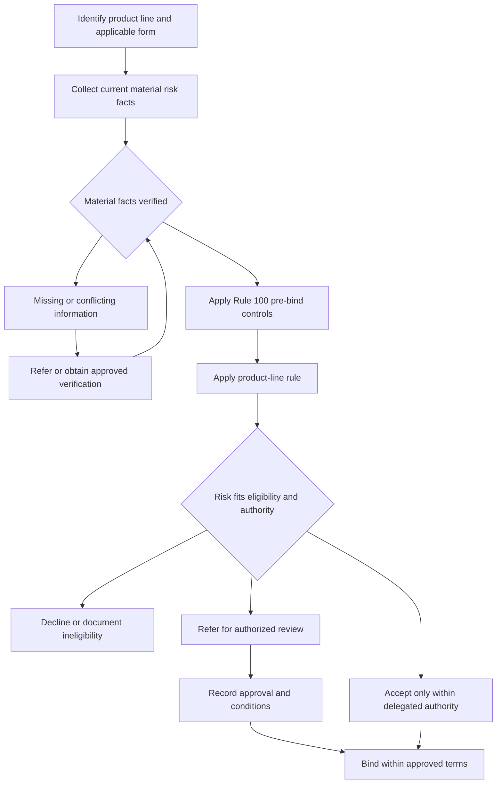

# Manual Eligibility by Product Line

## Scope and authority boundary

This page groups **Rule 100** and product-line **Rules 110–150** of the Personal Lines Underwriting Manual. The Manual is internal carrier direction for acceptance, referral, and file handling; it is not applicant-facing material and is not a standalone policy page ([Rule 100.A–100.B](repo://manuals/underwriting/manual.md#L15-L25)).

The Manual **constrains underwriting action but does not alter form coverage**. Rule 100.D prohibits using Manual guidance as a coverage grant and directs the underwriter back to carrier-issued coverage terms ([Rule 100.D](repo://manuals/underwriting/manual.md#L33-L37)). The applicable base form, attached endorsements, declarations, and state amendatory form remain the contract authority. For example, the HO-4 form expressly provides no Coverage A dwelling insurance while still providing Coverage C contents insurance ([HO-4 A.1–A.5](repo://forms/HO/MS/HO-4/2021-10.md#L71-L81), [HO-4 C.1–C.7](repo://forms/HO/MS/HO-4/2021-10.md#L219-L239)); an underwriting rule cannot add dwelling coverage to it.

The forms also describe materially different insured exposures: HO-3 and HO-5 cover the dwelling and its attached building property ([HO-3 Coverage A](repo://forms/HO/MS/HO-3/2024-03.md#L99-L105), [HO-5 Coverage A](repo://forms/HO/MS/HO-5/2022-06.md#L109-L117)); HO-6 addresses the unit owner's dwelling-unit property and responsibilities ([HO-6 Coverage A](repo://forms/HO/MS/HO-6/2023-02.md#L80-L96)); and DP-3 covers a dwelling used as a private residence and property that services it ([DP-3 Coverage A](repo://forms/DP/MS/DP-3/2026-01.md#L73-L89)). The manual rules decide whether the carrier may accept or bind the presented risk; they do not rewrite those grants, exclusions, limits, or settlement conditions.

## Operating model

### Decision flow

*This flow shows the Manual control path from product identification and fact verification to acceptance, referral, decline, and binding.*

### Controls that apply before binding

1. **Use the right source and role.** Select the applicable form edition and state terms for the policy record, then use the Manual as internal guidance. Frozen forms and bulletins remain authority for their issued text, while manuals and guidelines are living internal guidance ([corpus authority model](repo://README.md#L15-L21), [frozen versus living documents](repo://README.md#L35-L41)).
2. **Stay within delegated authority.** Use the Manual only within assigned authority and refer anything outside it. Do not split or sequence a risk to avoid a referral, and do not make an exception without authorized approval ([Rule 100.C and 100.F](repo://manuals/underwriting/manual.md#L27-L49), [Rule 100.M–100.N](repo://manuals/underwriting/manual.md#L87-L97)).
3. **Verify material facts.** Use current, reliable, carrier-approved information; verify material risk characteristics; and do not assume favorable conditions that the account record does not support. Missing or conflicting material information requires referral or resolution before the decision ([Rule 100.H–100.J](repo://manuals/underwriting/manual.md#L57-L73), [Rule 100.S–100.T](repo://manuals/underwriting/manual.md#L123-L133)).
4. **Apply the product rule before binding.** Rule 100.E requires the Manual direction to be applied before binding and prohibits binding a risk that requires referral ([Rule 100.E](repo://manuals/underwriting/manual.md#L39-L43)). A pending referral is not approval; any approval conditions must be satisfied exactly, and an unrecorded or verbal approval is not a sufficient basis for binding ([Rule 100.X–100.Z](repo://manuals/underwriting/manual.md#L153-L169)).
5. **Document the decision contemporaneously.** Record the facts reviewed, source of verification, Manual rule, authority used, referral reason and disposition, conditions, and final accept or decline action. Rule 100 requires clear records and a reason supported by relevant risk facts ([Rule 100.V and 100.W](repo://manuals/underwriting/manual.md#L141-L151)).
6. **Reassess changed information.** A material change or a conflict with prior account information requires review; an earlier decision is not a continuing authorization when the risk facts change ([Rule 100.Q–100.R](repo://manuals/underwriting/manual.md#L111-L121)).

These controls are operational gates, not coverage determinations. A form provision such as an 80 percent replacement-cost condition remains a contract term; the Manual may require valuation review, but it cannot change the condition ([HO-3 A.19–A.22](repo://forms/HO/MS/HO-3/2024-03.md#L135-L141), [Rule 110.BJ–110.BK](repo://manuals/underwriting/manual.md#L683-L693)).

## Product-line matrix

| Product line | Manual rule | Core eligibility profile | Hard thresholds and mandatory handling |
| --- | --- | --- | --- |
| **HO-3 Special Form** | **Rule 110** | Owner-occupied dwelling used as the insured's residence, with an insurable interest and sound, serviceable condition. | Coverage A at least **$150,000**; refer above **$1,500,000**; refer protection class above **8**. Refer tenant, transient, commercial, unlawful, materially damaged, materially unsafe, or materially unverified risks. |
| **HO-5 Comprehensive Form** | **Rule 120** | Owner-occupied personal residence with a stable, completed, well-maintained dwelling and reliable valuation. | Coverage A at least **$300,000** and no more than **$2,500,000**; refer above the maximum; protection class must not exceed **6**. Refer rental, transient, vacant, construction, major renovation, unrepaired damage, and other listed hazards. |
| **HO-4 Contents Broad Form** | **Rule 130** | Tenant-occupied primary private residence for the tenant's personal contents. | Refer protection class above **9**; decline vacancy; verify a complete address, resident-tenant status, and insurable interest in contents. Refer subletting, undisclosed shared occupancy, material business or care activity, and contents outside ordinary tenant exposure. |
| **HO-6 Unit-Owners Form** | **Rule 140** | Legally established, completed condominium unit used as a private residence by the named insured, with clear unit-owner responsibility and association context. | Coverage A from **$5,000 through $250,000**; verify insurable interest, master coverage, repair responsibility, and unit identification. Refer non-condominium interests, transient use, active construction, unsafe or unrepaired conditions, and uncertain association coverage. |
| **DP-3 Dwelling Property** | **Rule 150** | Lawfully occupied dwelling with an insurable interest, sound construction, supportable replacement-cost valuation, and a use that remains within residential dwelling-property appetite. | Coverage A at least **$75,000**; do not bind above **$750,000** without referral approval; apply the Manual's vandalism handling after **30 consecutive days of vacancy**; refer unoccupied, seasonal, materially damaged, hazardous, nonresidential, or inadequately documented risks. |

The matrix is a routing aid, not a substitute for the numbered rules. A risk can satisfy a dollar threshold and still require referral because of occupancy, condition, use, ownership, loss history, or missing evidence.

## Rule 110 — HO-3 Special Form

### Acceptance profile and thresholds

- Require Coverage A of **$150,000 or more**. Refer a limit **above $1,500,000** for valuation, construction, and exposure review.
- Refer a protection class **above 8**.
- Accept only an owner-occupied dwelling used as the insured's residence. Tenant, roomer, boarder, short-term lodging, commercial, manufacturing, repair, storage, or processing use is a referral condition; unlawful occupancy or unlawful property use is a decline condition.
- Require a sound, maintained dwelling and an insurable interest by the named insured. Material roof, foundation, exterior, storm, fire, water, electrical, heating, plumbing, drainage, mold, rot, or moisture concerns require referral and documented repair status.

These controls and thresholds are Rule 110.A–110.K and 110.L–110.O ([coverage, protection class, occupancy](repo://manuals/underwriting/manual.md#L317-L405)). Rule 110 also treats renovation or reconstruction, unusual fire construction, unsafe systems, fuel storage, water conditions, liability hazards, damaged or hazardous appurtenant structures, access and vegetation hazards, earth movement, adverse losses, and material discrepancies as referral topics ([Rule 110.P–110.AZ](repo://manuals/underwriting/manual.md#L407-L627)).

### Ownership, valuation, and final disposition

Require the named insured's insurable interest; refer estates, trusts, entities, complex ownership, secondary or unattended residences, legal disputes, code violations, and governmental notices. Require support for the selected dwelling limit and apply the **80 percent condition** when valuation support is incomplete. Refer unique, historic, architecturally significant, nonstandard, or energy-equipped dwellings for enhanced review ([Rule 110.BA–110.BO](repo://manuals/underwriting/manual.md#L629-L717)). Decline a risk that does not meet HO-3 eligibility and document the basis ([Rule 110.BP](repo://manuals/underwriting/manual.md#L719-L723)).

## Rule 120 — HO-5 Comprehensive Form

### Acceptance profile and thresholds

- Accept only when Coverage A is **at least $300,000** and **no more than $2,500,000**. Submissions below the floor are declined; submissions above the ceiling are referred.
- Accept only when the protection class is **6 or better**.
- Accept only an owner-occupied dwelling used as the insured location. Rental activity, short-term guest or transient use, vacancy, construction, major renovation, and unrepaired damage are referral conditions.

These are explicit Rule 120.A–120.J requirements ([Rule 120.A–120.J](repo://manuals/underwriting/manual.md#L727-L785)).

### Condition, use, and loss controls

Refer unsafe or uncertain roofs, repeated water intrusion, foundation movement, unsafe electrical or heating systems, solid-fuel heating, fuel-storage concerns, business or agricultural use, livestock, aggressive animals, pools, trampolines, material recreational hazards, and unresolved liability, water, fire, theft, weather, or open-claim history ([Rule 120.K–120.AD](repo://manuals/underwriting/manual.md#L787-L905)).

The underwriter must also resolve prior cancellations, nonrenewals, lapses, carrier concerns, inactive or unverifiable protective devices, poor exterior maintenance, drainage concerns, access problems, catastrophe exposure, unsafe premises, inconsistent construction, unreliable replacement-cost estimates, and contents or valuables that do not align with the dwelling exposure ([Rule 120.AF–120.BE](repo://manuals/underwriting/manual.md#L913-L1067)). Decline a risk that fails comprehensive eligibility and refer borderline risks for authority review ([Rule 120.BF](repo://manuals/underwriting/manual.md#L1069-L1073)).

## Rule 130 — HO-4 Contents Broad Form

### Tenant-contents entry criteria

HO-4 is a contents form: the form itself states that Coverage A is not provided, while Coverage C covers eligible personal property of an insured ([HO-4 A.1–A.2](repo://forms/HO/MS/HO-4/2021-10.md#L71-L75), [HO-4 C.1–C.4](repo://forms/HO/MS/HO-4/2021-10.md#L219-L225)). Rule 130 therefore requires a **tenant-occupied private residence**, a clear insurable interest in the contents, protection class **9 or better**, and a complete, verifiable mailing address ([Rule 130.A–130.D](repo://manuals/underwriting/manual.md#L1077-L1099)).

Decline a vacant premises and refer uncertain occupancy, a primary-residence mismatch, unlawful use, rooming or boarding, subletting, or a named insured who is not the resident tenant or lacks responsibility for the contents ([Rule 130.E–130.I](repo://manuals/underwriting/manual.md#L1101-L1129), [Rule 130.AF](repo://manuals/underwriting/manual.md#L1263-L1267)). Do not add a person merely to make an ineligible occupancy appear eligible.

### Contents and premises controls

Refer material business operations, business visitors, care of unrelated persons, aggressive animals, unusual valuables or collections, property held for sale, storage, repair, or delivery, and a Coverage D relationship that does not fit the residence exposure ([Rule 130.J–130.S](repo://manuals/underwriting/manual.md#L1131-L1189)). Also refer association or condominium arrangements when tenancy is not confirmed, construction or major repair, visible unrepaired damage, water intrusion, mold, unsafe building systems, unusual heating, restricted emergency access, catastrophe or security concerns, and incomplete underwriting information ([Rule 130.T–130.AD](repo://manuals/underwriting/manual.md#L1191-L1255)).

Resolve identity, residence, occupancy, prior insurance, inspection, public-information, and applicant-statement conflicts. Suspected fraud, concealment, or intentional misrepresentation requires controlled referral before final adverse communication; only a risk meeting the overall tenant-contents appetite may bind ([Rule 130.AE–130.AJ](repo://manuals/underwriting/manual.md#L1257-L1291)).

## Rule 140 — HO-6 Unit-Owners Form

### Unit, ownership, and limits

- Accept Coverage A only from **$5,000 through $250,000**.
- Confirm an insurable interest in a **legally established condominium unit** and accept only a unit used as a private residence by the named insured.
- Refer a unit used primarily for business, transient rental, lodging, regular unrelated public access, or nonresident ownership without regular residential use.
- Confirm the structure is complete. Active construction without regular residential occupancy is a decline; substantial renovation, reconstruction, or structural alteration is a referral.

These requirements are Rule 140.A–140.M ([Rule 140.A–140.M](repo://manuals/underwriting/manual.md#L1295-L1371)). The HO-6 form's Coverage A is directed to the unit owner's alterations, fixtures, improvements, attached property, and building property the owner must insure under an agreement ([HO-6 A.2–A.8](repo://forms/HO/MS/HO-6/2023-02.md#L82-L96)). Consequently, Coverage A selection must follow the unit owner's actual repair responsibility, not a generic whole-building replacement cost.

### Association, condition, and use controls

Confirm the condominium association's master property coverage and determine which building items the unit owner must repair or replace. Refer unavailable, disputed, or materially limited master coverage, an unsupported Coverage A amount, unresolved code enforcement, building vacancy or structural repairs, repeated building water loss, impaired fire protection, restricted emergency access, association litigation or financial distress, and assessments tied to known damage ([Rule 140.P–140.AQ](repo://manuals/underwriting/manual.md#L1385-L1551)). Use the condominium dwelling default limit only when reliable evidence does not support another selection, and document why it was used ([Rule 140.S](repo://manuals/underwriting/manual.md#L1403-L1407)).

Confirm that personal property belongs to the unit-owner household. Refer unusual property requiring specialized valuation, hazardous materials, business inventory or supplies, unusual delivery activity, unlawful activity, materially misdescribed locations, or conflicting unit, ownership, and occupancy information ([Rule 140.AR–140.BA](repo://manuals/underwriting/manual.md#L1553-L1611)). Record the final eligibility decision before issuing or changing coverage ([Rule 140.BB](repo://manuals/underwriting/manual.md#L1613-L1617)).

## Rule 150 — DP-3 Dwelling Property

### Dwelling, limit, and condition controls

- Accept only lawful residential occupancy with an applicant insurable interest and a location where lawful placement, access, and residential use are supportable.
- Require sound construction and reasonably serviceable condition. Refer structural distress, incomplete exterior protection, deferred maintenance, roof damage or leakage, foundation or drainage problems, electrical defects, temporary or unreliable heat, active plumbing leakage, deteriorated supply lines, drainage defects, and unresolved water damage.
- Require Coverage A of at least **$75,000**. Do not bind above **$750,000** without referral approval.
- Require a supportable replacement-cost estimate and refer conflicts between the estimate and visible features, condition, or reported updates.

Rule 150.A–150.M establishes these occupancy, interest, condition, threshold, valuation, and system controls ([Rule 150.A–150.M](repo://manuals/underwriting/manual.md#L1621-L1697)).

### Vacancy, use, catastrophe, and ownership controls

Apply the Manual's vandalism handling after **30 consecutive days of vacancy** and refer any risk where vacancy cannot be established. Refer unoccupied dwellings without regular care, seasonal or intermittent occupancy with inadequate oversight, renovation or substantial repair, unrepaired fire or water damage, open or disputed claims, impaired protection, unreliable access or water supply, unmanaged vegetation or wildfire hazard, coastal or tidal exposure, reported flood or drainage concerns, earth movement, erosion, sinkhole, subsidence, mining, excavation, or blasting exposure ([Rule 150.N–150.AD](repo://manuals/underwriting/manual.md#L1699-L1799)). This is an internal eligibility and handling instruction; it does not by itself amend the DP-3 vacancy or vandalism provisions.

Refer business, professional, agricultural, animal, transient lodging, boarder, roomer, or nonresidential use; damaged or hazardous detached structures; commercial or industrial storage; code or ordinance concerns; historic or specialized construction; shared ownership; manufactured or nontraditional construction; land-only applications; and incomplete dwellings ([Rule 150.AE–150.AS](repo://manuals/underwriting/manual.md#L1801-L1889)).

### Evidence, authority, and final action

Refer estates, trusts, title or boundary disputes, pending transfers, foreclosure or repossession, and financial distress when it is tied to a documented property condition or uncertain control. Require inspection when the application does not establish condition, occupancy, or use; require current photographs when exterior condition or construction is material; and resolve discrepancies among application, inspection, valuation, and loss information before binding ([Rule 150.AT–150.AZ](repo://manuals/underwriting/manual.md#L1891-L1931)). Suspected concealment, false statements, altered records, or material omission requires referral and careful documentation ([Rule 150.BA](repo://manuals/underwriting/manual.md#L1933-L1937)).

A risk outside stated eligibility or underwriting authority must be referred before disposition. Requested coverage must align with the dwelling and use; review the 80 percent valuation condition and the additional living expense limit for consistency, and retain the authority decision in the file ([Rule 150.BB–150.BE](repo://manuals/underwriting/manual.md#L1939-L1961)).

## Failure checks

- **Coverage substitution:** an underwriter cites an eligibility rule as though it grants, removes, or changes coverage. Return to the applicable form and attached contract terms; use the Manual only for carrier action ([Rule 100.D](repo://manuals/underwriting/manual.md#L33-L37)).
- **Premature bind:** a product rule requires referral, facts remain missing, or approval is pending. Hold binding until the referral is dispositioned and conditions are recorded ([Rule 100.E and 100.X–100.Y](repo://manuals/underwriting/manual.md#L39-L43), [repo://manuals/underwriting/manual.md#L153-L163)).
- **Authority bypass:** a risk is split, sequenced, or accepted by an underwriter without delegated authority. Refer the complete exposure and record the authority used ([Rule 100.C and 100.F](repo://manuals/underwriting/manual.md#L27-L49)).
- **Threshold-only acceptance:** a limit falls within the numeric range but occupancy, condition, ownership, loss history, or valuation fails the product rule. Apply the whole rule group, not only the dollar threshold.
- **Form/manual confusion:** HO-4 is treated as dwelling coverage, HO-6 Coverage A is treated as the whole condominium building, or DP-3 vacancy handling is presented as a new contract exclusion. Recheck the applicable form and describe Manual direction as internal underwriting control.
- **Stale facts:** the risk changes after initial review or reliable information conflicts with the prior file. Reassess before issuance, renewal, endorsement, or other action ([Rule 100.Q–100.R](repo://manuals/underwriting/manual.md#L111-L121)).

## Related reading

- [Policy assembly: editions, endorsements, and state overlays](/openwiki/policy-assembly/editions-and-state-attachments.md)
- [Texas homeowners appetite](/openwiki/underwriting/guidelines/texas-appetite.md)
- [Authority referrals and clearance](/openwiki/underwriting/manual/authority-referrals-and-clearance.md)
- [Liability, losses, and occupancy](/openwiki/underwriting/manual/liability-losses-and-occupancy.md)
- [Property and water risk](/openwiki/underwriting/manual/property-and-water-risk.md)
