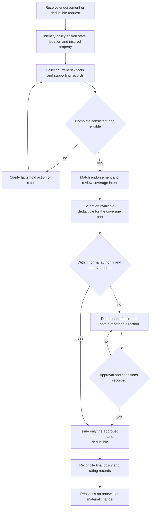

# Manual Endorsement Attachment and Deductible Controls

## Scope and governing boundary

Rules 400 and 410 are internal underwriting controls. They determine whether the carrier may attach, change, retain, or remove an endorsement and which deductible option may be selected for underwriting purposes. They do **not** grant coverage, change a policy deductible, write back an exclusion, or authorize a claim payment. The policy form, Declarations, attached endorsement, applicable edition, and state amendatory form remain the contract authority. The Manual itself says not to use internal direction to alter coverage. [Manual Rule 100.B–100.D](repo://manuals/underwriting/manual.md#L21-L37) [Manual Rule 400.A–400.G](repo://manuals/underwriting/manual.md#L5091-L5131) [Manual Rule 410.A–410.I](repo://manuals/underwriting/manual.md#L5459-L5511)

A useful distinction is:

- **Internal selection:** whether the risk is eligible for the requested endorsement or deductible, whether the request is within normal authority, and whether the file is complete enough to issue.
- **Contractual term:** what the attached form actually covers, excludes, limits, or subtracts from a covered loss after issuance.

The internal decision can be stricter than the contract’s available choices, but it cannot be presented as if it changed those choices. When an endorsement’s terms matter, the Manual **constrains** when the form may be attached; the endorsement still controls the resulting policy position. [Manual Rule 400.A, 400.C, and 400.G](repo://manuals/underwriting/manual.md#L5091-L5131) [Manual Rule 400.BD](repo://manuals/underwriting/manual.md#L5421-L5425) [Manual Rule 410.A, 410.E, and 410.P](repo://manuals/underwriting/manual.md#L5459-L5487) [HO 04 90 2027-01, attachment terms](repo://forms/HO/MS/HO-04-90/2027-01.md#L13-L39)

## Control flow

*This flow shows the Rules 400 and 410 underwriting path; it is not a coverage or claim-payment decision.*

## Refreshed attachment-training checks

The refreshed training makes the attachment entrypoint a wording-and-package review, not a title lookup. Before selecting or attaching a form, read the complete endorsement, identify what it changes and leaves unchanged, compare its grant, restrictions, exclusions, conditions, and deductible treatment with the request, and review the existing endorsement set for overlap or conflict. [Attaching Endorsements Correctly, learning objectives](repo://training/attaching-endorsements.md#L15-L23) [Attaching Endorsements Correctly, key concepts](repo://training/attaching-endorsements.md#L121-L151) [Attaching Endorsements Correctly, interaction and duplication](repo://training/attaching-endorsements.md#L173-L199)

The package check must tie the form to the correct named insured, policy term, location, operation, property, effective date, completed schedule, and all referenced pages. A schedule entry without the form does not supply the operative coverage language; an attached but unlisted form must be reconciled with the policy record. If the schedule is blank or unclear, wording is missing, system text differs from the issued form, or the request and available endorsement do not match, stop and clarify rather than infer. [Attaching Endorsements Correctly, package checks](repo://training/attaching-endorsements.md#L65-L111) [Attaching Endorsements Correctly, schedules and correction](repo://training/attaching-endorsements.md#L193-L215) [Attaching Endorsements Correctly, common attachment mistakes](repo://training/attaching-endorsements.md#L579-L639)

For a deductible request, identify the loss cause and property to which the deductible applies and read any special deductible with the base policy’s deductible provisions. The Declarations show the insured-specific selection when applicable, but a declaration summary alone may not show every condition or restriction; the governing endorsement and policy wording must be reviewed together. The training’s final check is to confirm current risk facts, eligibility, selected wording, schedule details, and effective application before issuance. [Attaching Endorsements Correctly, deductible review](repo://training/attaching-endorsements.md#L133-L139) [Attaching Endorsements Correctly, final review](repo://training/attaching-endorsements.md#L501-L513) [Attaching Endorsements Correctly, issuance checklist](repo://training/attaching-endorsements.md#L539-L577) [Attaching Endorsements Correctly, deductible and effective-date checks](repo://training/attaching-endorsements.md#L920-L934)

After issue, preserve the exact issued wording and use the approved correction process for an error or omission; do not edit an issued endorsement informally or use a verbal explanation to repair contract language. Communicate what changed without promising a broader result than the form supports. These are training process expectations. Rules 400 and 410 still **constrain** whether the attachment or deductible selection may proceed, while the attached form and Declarations remain the contract sources. [Attaching Endorsements Correctly, issued wording and corrective endorsements](repo://training/attaching-endorsements.md#L201-L215) [Attaching Endorsements Correctly, communication and final review](repo://training/attaching-endorsements.md#L329-L359) [Manual Rule 400.B, 400.G, and 400.BG–400.BI](repo://manuals/underwriting/manual.md#L5097-L5107) [Manual Rule 410.C, 410.K, and 410.BI](repo://manuals/underwriting/manual.md#L5471-L5481)

## Rule 400 — when an endorsement may attach

### Required review before attachment

Review every requested endorsement before binding or renewal, resolve unclear instructions, and confirm that the risk facts support the requested coverage and the underwriting decision. Attach only to an eligible risk, and do not use an endorsement to cure an ineligible risk. [Rule 400.B, 400.C, and 400.G](repo://manuals/underwriting/manual.md#L5097-L5131) [Rule 410.B, 410.I, and 410.Q](repo://manuals/underwriting/manual.md#L5465-L5511)

The attachment must match the **named insured, location, and insured property**. Verify ownership, occupancy, use, and location information before attaching property-related or location-specific coverage. Suspend the request and refer it when material information is missing, conflicting, stale, or does not establish insurable interest. [Rule 400.D–400.F and 400.I–400.J](repo://manuals/underwriting/manual.md#L5109-L5149) [Rule 410.C–410.F and 410.K](repo://manuals/underwriting/manual.md#L5471-L5523)

Confirm that the requested wording addresses the actual coverage intent, does not duplicate existing coverage, and does not create an unintended grant. A restriction, expansion, or removal that departs from ordinary practice requires documented authority rather than an informal workaround. [Rule 400.G–400.H and 400.Z–400.AA](repo://manuals/underwriting/manual.md#L5127-L5151) [Rule 410.P, 410.AN, and 410.AO](repo://manuals/underwriting/manual.md#L5549-L5559)

### Risk facts that can trigger a hold or referral

The underwriter must use current risk information and refer when an attachment request cannot be supported. The important attachment checks include:

- **Water and drainage:** evaluate water sources, drainage, plumbing, sewer and drain history, and sump or other discharge exposure before attaching a water-related endorsement or drain-backup sublimit. Unresolved water intrusion, repeated drainage concerns, deteriorated plumbing, or active leakage require referral. [Rule 400.M–400.O](repo://manuals/underwriting/manual.md#L5163-L5179) [Rule 410.L and 410.Q](repo://manuals/underwriting/manual.md#L5525-L5559) [Rule 410.AI](repo://manuals/underwriting/manual.md#L5663-L5667)
- **Weather and property condition:** confirm that roof condition supports a weather-related attachment; refer unresolved deterioration. Review electrical and heating condition before attachments affected by fire, freeze, or related exposure. [Rule 400.P–400.R](repo://manuals/underwriting/manual.md#L5181-L5197) [Rule 410.S–410.T](repo://manuals/underwriting/manual.md#L5567-L5577) [Rule 410.AI](repo://manuals/underwriting/manual.md#L5663-L5667)
- **Use, occupancy, structures, and activity:** confirm personal-lines use, occupancy, accessory structures, construction, renovation, or repair status. Commercial, agricultural, unusual, vacant, unoccupied, or materially changing exposures require the applicable referral or authority review. [Rule 400.S–400.Y](repo://manuals/underwriting/manual.md#L5199-L5239) [Rule 410.R](repo://manuals/underwriting/manual.md#L5561-L5565) [Rule 410.AE–410.AH](repo://manuals/underwriting/manual.md#L5639-L5661)
- **Loss, safeguards, and pending claims:** review adverse prior losses, protection features, pending claims, prior restrictions, inspection findings, and valuation before changing the attachment. Do not rely on an unverified safeguard or treat a paid or pending claim as irrelevant. [Rule 400.K, 400.L, and 400.AC–400.AM](repo://manuals/underwriting/manual.md#L5151-L5161) [Rule 410.AC–410.AD and 410.AZ–410.BA](repo://manuals/underwriting/manual.md#L5627-L5637)

Each trigger is an underwriting control, not a declaration that the related loss is covered or excluded. Record the facts reviewed and the action taken. [Rule 400.BH–400.BI](repo://manuals/underwriting/manual.md#L5445-L5455) [Rule 410.BG–410.BI](repo://manuals/underwriting/manual.md#L5807-L5823)

### Effective date, processing, and renewal

The endorsement’s effective date must align with the underwriting transaction. Do not use an endorsement retroactively to address a known loss circumstance. Review pending claims before a related attachment, use approved processing and servicing controls, and verify after processing that the final endorsement set matches the approved disposition. [Rule 400.AB–400.AC and 400.AX–400.AZ](repo://manuals/underwriting/manual.md#L5253-L5263) [Rule 410.AT–410.AV](repo://manuals/underwriting/manual.md#L5729-L5745)

At renewal, do not automatically continue an attachment when current facts no longer support it. Re-review material changes in occupancy, use, condition, protection, coverage, or location before modifying or removing the endorsement. [Rule 400.BB–400.BF](repo://manuals/underwriting/manual.md#L5409-L5437) [Rule 410.AR–410.AZ](repo://manuals/underwriting/manual.md#L5717-L5769)

## Rule 400 — referral and approval path

Refer a deductible-affecting endorsement request outside normal authority, an endorsement issue not addressed by established guidance, or an attachment that appears intended to avoid risk evaluation. Do not issue while the referral is pending. [Rule 400.BD–400.BE and 400.BI](repo://manuals/underwriting/manual.md#L5421-L5455) [Rule 410.P, 410.BG, and 410.BI](repo://manuals/underwriting/manual.md#L5549-L5553)

The referral package should identify the requested endorsement and deductible, insured and location, coverage intent, material risk facts, missing or conflicting information, supporting records, requested disposition, and any proposed conditions. Record the authorized direction and apply only the terms approved. Do not infer approval from silence, an informal conversation, or a prior decision on another risk. [Rule 400.B, 400.F, 400.H, and 400.BH–400.BI](repo://manuals/underwriting/manual.md#L5097-L5107) [Rule 410.C–410.D, 410.P, 410.BC–410.BE, and 410.BG–410.BI](repo://manuals/underwriting/manual.md#L5471-L5481)

The authority/referral matrix adds a specific water-backup threshold: a requested water-backup limit **above $25,000** must be referred, and the referred request cannot bind until documented approval. That numeric threshold comes from the Matrix, while Rule 400.N requires the drain-backup sublimit to satisfy applicable underwriting requirements and Rule 410.P requires authority for an exception to standard deductible handling. Treat the sources as complementary; do not present the threshold as a contractual water-backup limit. [Rule 400.N and 400.BD](repo://manuals/underwriting/manual.md#L5169-L5173) [Rule 410.P](repo://manuals/underwriting/manual.md#L5549-L5553) [Matrix H.4.3–H.4.6](repo://guidelines/authority/referral-matrix.md#L403-L417)

## Rule 410 — deductible options and floors

### Internal selection floor

Rule 410.A sets the **Section I all-other-perils deductible at no less than $500**. This is an internal selection floor for underwriting; it is not a universal contractual deductible and does not replace the deductible shown in the Declarations or an attached form. Document the selected option and the risk characteristics supporting it. [Rule 410.A–410.B](repo://manuals/underwriting/manual.md#L5459-L5469) [Rule 400.BD](repo://manuals/underwriting/manual.md#L5421-L5425) [Rule 400.BH](repo://manuals/underwriting/manual.md#L5445-L5449)

The governing contract can impose a different floor or special treatment. For example, the HO-3 2024-03 base form requires the Section I deductible to be at least **$1,000** and says the deductible applies unless modified by endorsement. That contractual floor comes from the form, not from Rule 410; the insured-specific amount still must be verified in the issued Declarations and applicable endorsements. [HO-3 2024-03, S.29–S.34](repo://forms/HO/MS/HO-3/2024-03.md#L767-L779)

Apply only an available option for the coverage part being underwritten. The submission must show a clear deductible; do not infer one, combine options from separate proposals, or retain a legacy option that is no longer available without referral. [Rule 410.C–410.H](repo://manuals/underwriting/manual.md#L5471-L5505) [Rule 410.AL](repo://manuals/underwriting/manual.md#L5681-L5685) [Rule 400.D and 400.G](repo://manuals/underwriting/manual.md#L5109-L5131) [Rule 400.BD](repo://manuals/underwriting/manual.md#L5421-L5425)

The named-storm minimum and wind-deductible ceiling in Rules 410.M and 410.N are instructions to apply the available underwriting parameters; those rules do not state a number. The number, calculation basis, trigger, and notice requirements must come from the applicable contract and state overlay. A requested option outside those parameters is a referral, not an invitation to invent a value. [Rule 410.M–410.P](repo://manuals/underwriting/manual.md#L5531-L5553) [Rule 400.BD and 400.BI](repo://manuals/underwriting/manual.md#L5421-L5455)

### Selection checks and referral triggers

Review the deductible with the same care as any other material underwriting term. Confirm that it is consistent across the submission, rating record, issuance instructions, intended cause-of-loss treatment, location, occupancy, construction, protection, and property use. Refer conflicting, ambiguous, manuscript, omitted, unsuitable, or multi-location selections that cannot be resolved. [Rule 410.I–410.O](repo://manuals/underwriting/manual.md#L5507-L5553) [Rule 410.R–410.T](repo://manuals/underwriting/manual.md#L5561-L5577) [Rule 410.AE–410.AM](repo://manuals/underwriting/manual.md#L5639-L5691) [Rule 410.C–410.D, 410.K, 410.V, and 410.AK](repo://manuals/underwriting/manual.md#L5471-L5481)

Do not alter a deductible merely to solve an unrelated underwriting concern, offset an unacceptable property condition, or satisfy premium preference. A deductible is not a substitute for required risk controls. Refer an exception, a request contingent on an unverified feature, or an applicant’s refusal of a deductible required by underwriting. [Rule 410.J, 410.Q, 410.Z, 410.AB, and 410.BA–410.BB](repo://manuals/underwriting/manual.md#L5513-L5517) [Rule 400.BE and 400.BI](repo://manuals/underwriting/manual.md#L5427-L5455)

### Changes and issuance reconciliation

A deductible change requires current risk information and review after underwriting review. It must be effective only as authorized; retroactive requests and post-loss revisions based only on claim information must be referred or rejected under the Manual process. Capture the applicant’s final selection before binding and complete review before releasing the risk for issuance. [Rule 410.X–410.Y and 410.AT–410.AV](repo://manuals/underwriting/manual.md#L5597-L5607) [Rule 410.AU–410.AX](repo://manuals/underwriting/manual.md#L5729-L5757) [Rule 410.BI](repo://manuals/underwriting/manual.md#L5819-L5823) [Rule 400.AB, 400.BF, and 400.BG](repo://manuals/underwriting/manual.md#L5253-L5257)

If a bound risk has an unresolved deductible discrepancy, correct it promptly and preserve the communications, authority, selected terms, and basis for the decision. An authorized exception is limited to its stated scope and cannot be transferred to another risk. [Rule 410.AW–410.BE](repo://manuals/underwriting/manual.md#L5747-L5799) [Rule 400.BH–400.BI](repo://manuals/underwriting/manual.md#L5445-L5455)

## Internal selection versus contract deductible

The Manual selection is a gate before issuance; the contractual deductible is applied under the governing policy after a covered loss is established. A deductible does not create coverage for excluded property or causes, and an internal floor does not authorize the carrier to subtract a different amount from a claim. Read the Declarations for the selected insured-specific value, then read the attached form for the covered cause, property, limit, deductible, trigger, and order of application. The forms below illustrate why the exact attached edition must be checked.

### Water backup: HO 04 90 (2027-01)

HO 04 90 (2027-01) is effective only when attached, forms part of the policy, and preserves policy terms not modified by its wording. The HO-3 2024-03 base form excludes sewer, drain, and sump backup unless the water-backup endorsement is attached; the endorsement then provides its stated direct-physical-loss coverage. It supplies a **$10,000 limit** for the section and its own **$1,000 deductible**. The deductible applies to each covered water-backup loss, including covered damage to dwelling, other structures, and personal property arising from the same covered water backup. [HO-3 2024-03, X.7–X.9](repo://forms/HO/MS/HO-3/2024-03.md#L593-L601) [HO 04 90 2027-01, W.0 attachment and W.1 coverage](repo://forms/HO/MS/HO-04-90/2027-01.md#L13-L39) [HO 04 90 2027-01, W.2 limit](repo://forms/HO/MS/HO-04-90/2027-01.md#L254-L271) [HO 04 90 2027-01, W.3 deductible](repo://forms/HO/MS/HO-04-90/2027-01.md#L391-L435)

Rules 400.M, 400.N, 400.O, and 400.BD **constrain** whether the water-related endorsement or sublimit may attach and whether an unusual deductible treatment needs authority; they do not change HO 04 90’s $1,000 contractual deductible or $10,000 limit. The endorsement’s water path, exclusions, limit, and deductible must be read from the attached form, not inferred from the Manual. [Rule 400.M–400.O and 400.BD](repo://manuals/underwriting/manual.md#L5163-L5179) [Rule 410.O, 410.P, and 410.BA](repo://manuals/underwriting/manual.md#L5543-L5559) [HO 04 90 2027-01, coverage and exclusions](repo://forms/HO/MS/HO-04-90/2027-01.md#L41-L81)

### Roof settlement: HO 23 74 (2025-05)

HO 23 74 (2025-05) is an attached roof-surfacing settlement endorsement. The HO-3 2024-03 base form sends roof-surfacing settlement to the dwelling basis unless an ACV roof-schedule endorsement is attached; HO 23 74 modifies that settlement basis, says the applicable policy deductible remains in force, and applies it to the covered loss after the stated roof-surfacing adjustment. For composition shingle subject to its age-based adjustment, the form states a **20% payable percentage when Roof Age is twelve years or greater**; the adjustment is applied before the deductible. These are contractual settlement mechanics, not Rule 410 selection instructions. [HO-3 2024-03, A.13 and S.29–S.30](repo://forms/HO/MS/HO-3/2024-03.md#L123-L123) [HO-3 2024-03, deductible provisions](repo://forms/HO/MS/HO-3/2024-03.md#L767-L771) [HO 23 74 2025-05, attachment and unchanged deductible](repo://forms/HO/MS/HO-23-74/2025-05.md#L13-L66) [HO 23 74 2025-05, roof age and adjustment](repo://forms/HO/MS/HO-23-74/2025-05.md#L103-L118) [HO 23 74 2025-05, deductible provisions](repo://forms/HO/MS/HO-23-74/2025-05.md#L568-L590)

Rules 400.P, 400.AJ, 400.BD, and 410.O **constrain** attachment and deductible selection for a roof-related risk; they do not replace the policy’s applicable deductible or the endorsement’s settlement sequence. Roof age or condition guidance must likewise not be presented as a claim valuation rule unless the attached contract says so. [Rule 400.P and 400.AJ](repo://manuals/underwriting/manual.md#L5181-L5185) [Rule 400.BD](repo://manuals/underwriting/manual.md#L5421-L5425) [Rule 410.O](repo://manuals/underwriting/manual.md#L5543-L5547) [Rule 410.S and 410.AI](repo://manuals/underwriting/manual.md#L5567-L5577) [Rule 410.AI](repo://manuals/underwriting/manual.md#L5663-L5667) [HO 23 74 2025-05, roof age and deductible order](repo://forms/HO/MS/HO-23-74/2025-05.md#L103-L118) [HO 23 74 2025-05, W.3 deductible mechanics](repo://forms/HO/MS/HO-23-74/2025-05.md#L568-L590)

### Wind or hail: HO 23 77 (2022-07)

HO 23 77 (2022-07) applies only to the HO-3 policy’s otherwise covered windstorm or hail loss. The HO-3 2024-03 base form supplies the covered-peril grant and retains its exclusions; the endorsement changes the deductible mechanics within that scope. Its contractual percentage deductible must be between **2% and 10%**, is calculated by applying the selected percentage to the applicable limit shown for the covered property, and applies before payment under the endorsement. That is an edition-specific contract range, not the Manual’s general deductible floor. [HO-3 2024-03, P.37–P.41](repo://forms/HO/MS/HO-3/2024-03.md#L541-L549) [HO 23 77 2022-07, attachment and scope](repo://forms/HO/MS/HO-23-77/2022-07.md#L13-L53) [HO 23 77 2022-07, percentage deductible](repo://forms/HO/MS/HO-23-77/2022-07.md#L644-L676) [HO 23 77 2022-07, W.3 deductible](repo://forms/HO/MS/HO-23-77/2022-07.md#L655-L670)

Rule 410.N **constrains** internal wind-deductible selection by requiring the applicable underwriting ceiling to be used, while HO 23 77 supplies the cited edition’s 2%–10% contractual range. If a state amendatory form is also attached, its Declarations-based terms must be checked rather than assuming HO 23 77 controls every policy. For example, Texas HO 01 45 requires the Windstorm and Hail Deductible shown in the Declarations to be **1%–10%** and applies it separately from another deductible. Rule 400.P and 400.BD additionally constrain weather-related attachment and unusual deductible requests; neither rule changes the percentage that the attached contract states. [Rule 410.N, 410.P, and 410.BI](repo://manuals/underwriting/manual.md#L5537-L5553) [Rule 400.P, 400.BD, and 400.BI](repo://manuals/underwriting/manual.md#L5181-L5185) [HO 23 77 2022-07, W.3–W.6](repo://forms/HO/MS/HO-23-77/2022-07.md#L655-L676) [HO 01 45 2022-01, T.1–T.7](repo://forms/HO/TX/HO-01-45/2022-01.md#L59-L73)

## Texas separate windstorm and hail controls

Texas Bulletin B-2021-08 is a regulatory administration overlay for residential policies with separate windstorm or hail deductibles. It requires the insurer to identify the deductible and its trigger in the policy and related communications, keep Declarations, endorsements, applications, rating, and other policy materials reasonably consistent, and apply only the deductible permitted by the policy and applicable law. The bulletin constrains how the carrier offers, records, discloses, and administers the deductible; it does not create a payment term absent from the issued contract. [B-2021-08, B.1.1–B.1.15](repo://bulletins/TX/b-2021-08-windstorm-deductibles.md#L13-L43) [B-2021-08, B.5.1–B.5.12](repo://bulletins/TX/b-2021-08-windstorm-deductibles.md#L269-L293)

For the bulletin’s named-storm, hurricane, and seacoast categories, the operational parameters are distinct: a named-storm windstorm and hail deductible may not be below **1%**, a hurricane deductible may not exceed **5%**, and a seacoast-territory windstorm deductible may not exceed **10%**. Identify the territory before applying the seacoast limit, and do not relabel one category to evade another. These are bulletin restrictions on the carrier’s practice, not a substitute for the deductible shown in the Declarations or the attached form. [B-2021-08, B.2.1–B.2.12](repo://bulletins/TX/b-2021-08-windstorm-deductibles.md#L47-L71)

The issuance and renewal file should preserve the applicant or policyholder’s selection, the policy language used, the calculation basis, the policy value or limit used, and the records showing how the deductible was offered or applied. The bulletin requires clear application, issuance, and renewal disclosure; at least **30 days’ written notice** before a windstorm-deductible increase; and a **72-hour continuation** after a named-storm designation ends when the policy uses a named-storm period. It also prohibits more than one deductible for the same covered loss unless the policy clearly permits that result. [B-2021-08, B.2.16–B.2.23](repo://bulletins/TX/b-2021-08-windstorm-deductibles.md#L79-L95) [B-2021-08, B.2.27–B.2.32](repo://bulletins/TX/b-2021-08-windstorm-deductibles.md#L101-L111) [B-2021-08, B.3.1–B.3.23](repo://bulletins/TX/b-2021-08-windstorm-deductibles.md#L135-L181)

The contract must still be checked separately. Texas HO 01 45 (2022-01) requires the Windstorm and Hail Deductible shown in the Declarations to be **1%–10%**, calculates it from the applicable limit for the damaged property, and applies it separately from another deductible. Its own notice provision requires **45 days’ written notice** before a windstorm-deductible increase. Therefore, do not replace the form’s contractual range or notice term with a bulletin label or the bulletin’s 30-day administration minimum; use the attached form, Declarations, applicable edition, and law together. [HO 01 45 2022-01, T.1–T.7](repo://forms/HO/TX/HO-01-45/2022-01.md#L59-L73) [HO 01 45 2022-01, T.2 notice](repo://forms/HO/TX/HO-01-45/2022-01.md#L167-L177) [B-2021-08, B.3.12–B.3.18](repo://bulletins/TX/b-2021-08-windstorm-deductibles.md#L159-L171)

For a windstorm or hail claim, preserve the policy provision, facts supporting the covered-peril determination, inspection or other evidence, allocation between wind or hail and another cause when reasonable, payment calculation, and the explanation given to the policyholder. The bulletin requires claim-specific investigation and documentation; a general weather report alone is not enough, and the bulletin does not permit a deductible beyond the policy terms. These claim controls inform the underwriting file when a deductible selection or endorsement is being changed after a reported loss; they do not turn the bulletin into a contract term. [B-2021-08, B.4.1–B.4.7](repo://bulletins/TX/b-2021-08-windstorm-deductibles.md#L213-L227) [B-2021-08, B.4.11–B.4.20](repo://bulletins/TX/b-2021-08-windstorm-deductibles.md#L235-L253) [Rule 410.AT–410.AV](repo://manuals/underwriting/manual.md#L5729-L5745)

## File checklist and failure checks

Before binding, renewal, or issuance, the file should show:

1. the policy line, edition, state, effective transaction date, named insured, location, and insured property;
2. the requested endorsement, its coverage intent, matching evidence, applicable eligibility facts, and any pending or prior loss concern;
3. the deductible by coverage part, the available option selected, the Section I all-other-perils floor review, and any applicable storm or cause-of-loss parameter;
4. every clarification, referral, approval, approver, condition, and authority limitation;
5. the final endorsement set, deductible in rating and issuance instructions, post-processing reconciliation, and the basis for any revision or removal. [Rule 400.B, 400.D–400.F, 400.BH–400.BI](repo://manuals/underwriting/manual.md#L5097-L5125) [Rule 410.C–410.K and 410.AP–410.BI](repo://manuals/underwriting/manual.md#L5471-L5523)

Common failures are:

- **Manual treated as contract:** a reviewer states that the $500 floor changes a policy deductible or that a Rule 400 referral removes coverage. Recheck the Declarations and attached form; the Manual **constrains** carrier action only. [Manual Rule 100.D](repo://manuals/underwriting/manual.md#L33-L37) [Rule 410.A and 410.BA](repo://manuals/underwriting/manual.md#L5459-L5469)
- **Unattached or mismatched endorsement:** the request is approved but the form is not attached to the correct insured, location, property, or edition. Hold issuance and reconcile the final set. [Rule 400.D, 400.AB, and 400.BG–400.BI](repo://manuals/underwriting/manual.md#L5109-L5113) [HO 04 90 2027-01, attachment](repo://forms/HO/MS/HO-04-90/2027-01.md#L13-L17)
- **Inferred or duplicated deductible:** the submission is unclear, rating differs from issuance, or two proposals are blended. Clarify and use only the authorized selection for the applicable coverage part. [Rule 410.C–410.F, 410.K, 410.U–410.W, and 410.AL](repo://manuals/underwriting/manual.md#L5471-L5493) [Rule 400.BD](repo://manuals/underwriting/manual.md#L5421-L5425)
- **Deductible used as a cure:** an unacceptable roof, drainage, occupancy, or other property condition is accepted only because a larger deductible is selected. Apply the condition review and referral controls; a deductible does not cure the risk. [Rule 400.M–400.P](repo://manuals/underwriting/manual.md#L5163-L5185) [Rule 410.Q, 410.AI, and 410.BA](repo://manuals/underwriting/manual.md#L5555-L5559)
- **Pending referral treated as approval:** the underwriter binds before documented authority or changes the approved terms. Hold action, continue permitted fact gathering, and bind only the recorded approved terms. [Rule 400.BD, 400.BI](repo://manuals/underwriting/manual.md#L5421-L5455) [Rule 410.P, 410.BC–410.BI](repo://manuals/underwriting/manual.md#L5549-L5823)

These controls should be read with [Policy Assembly: Editions, Endorsements, and State Overlays](/openwiki/policy-assembly/editions-and-state-attachments.md), [Water Backup and Sump Discharge](/openwiki/coverage/perils/water-backup.md), [Windstorm, Hail, and Percentage Deductibles](/openwiki/coverage/perils/wind-hail-deductibles.md), [Roof Surfacing Settlement and Roof Claims](/openwiki/coverage/settlement/roof-settlement.md), and [Manual Binding Authority, Referrals, and Unclearable Conditions](/openwiki/underwriting/manual/authority-referrals-and-clearance.md).
