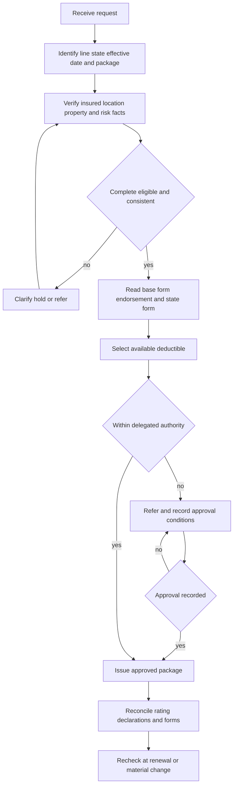

# Endorsements and Deductibles

## Governing boundary

The underwriting manual and binding-authority guidance are **internal carrier guidance**. They control eligibility, authority, referral, documentation, and attachment decisions; they do not grant coverage, change a policy deductible, write back an exclusion, or authorize claim payment. Coverage comes from the applicable base form, Declarations, attached endorsement, edition, and state amendatory form. The manual expressly says not to use internal direction to alter coverage. ([Manual Rules 100.B–100.E](repo://manuals/underwriting/manual.md#L21-L43); [Binding Authority H.0.1–H.0.6](repo://guidelines/authority/binding-authority.md#L13-L25))

Use this distinction throughout the file:

- **Underwriting guidance:** whether the risk is eligible, whether the requested form and deductible are within authority, what evidence is required, and whether a referral or hold is necessary.
- **Contract terms:** what the issued policy and attached endorsement cover, exclude, limit, and subtract after a covered loss.

A carrier may apply stricter internal selection rules than the contract’s available choices, but must not describe those rules as policy language.

## Attachment and deductible workflow

```mermaid
flowchart TD
    A["Receive request"] --> B["Identify line state effective date and package"]
    B --> C["Verify insured location property and risk facts"]
    C --> D{"Complete eligible and consistent"}
    D -->|"no"| E["Clarify hold or refer"]
    E --> C
    D -->|"yes"| F["Read base form endorsement and state form"]
    F --> G["Select available deductible"]
    G --> H{"Within delegated authority"}
    H -->|"no"| I["Refer and record approval conditions"]
    I --> J{"Approval recorded"}
    J -->|"no"| I
    J -->|"yes"| K["Issue approved package"]
    H -->|"yes"| K
    K --> L["Reconcile rating declarations and forms"]
    L --> M["Recheck at renewal or material change"]
```

*This flow describes underwriting operations, not coverage or claim-payment decisions.*

Before binding or renewal, review the complete endorsement, its effective edition, coverage intent, restrictions, exclusions, conditions, limits, deductible treatment, schedules, and interaction with existing forms. Match the attachment to the named insured, policy term, location, and insured property. A schedule or system label is not a substitute for the attached wording; a listed-but-missing form requires a hold and package correction. ([Manual Rule 400](repo://manuals/underwriting/manual.md#L5089-L5131); [Attaching Endorsements Correctly](repo://training/attaching-endorsements.md#L65-L111))

Use current facts for water and drainage, property condition, occupancy, safeguards, prior losses, pending claims, and known circumstances. Refer incomplete, conflicting, unusual, or out-of-authority requests. Do not backdate an attachment or deductible change to address a known loss. Record the requested terms, evidence, authority, conditions, final selection, and post-issuance reconciliation. ([Manual Rule 400](repo://manuals/underwriting/manual.md#L5091-L5151); [Manual Rule 410](repo://manuals/underwriting/manual.md#L5459-L5559))

Rule 410’s Section I all-other-perils minimum of $500 is **underwriting guidance**, not a universal contractual deductible. The selected insured-specific amount remains the amount shown in the Declarations and applicable forms. Likewise, a referral threshold such as the authority matrix’s water-backup limit above $25,000 constrains carrier action; it is not a contractual water-backup limit. ([Manual Rule 410.A–410.B](repo://manuals/underwriting/manual.md#L5459-L5469); [Binding Authority H.1.21–H.1.26](repo://guidelines/authority/binding-authority.md#L101-L111))

## HO 04 90: edition, attachment, limit, and deductible

### Edition selection

<!-- openwiki: broken internal link [../../policy-assembly/editions-and-state-attachments.md#L67-L76] heading anchor "L67-L76" does not exist in "../../policy-assembly/editions-and-state-attachments.md". Fix the href or restore the target, then delete this comment. -->
HO 04 90 2026-01 is a multistate endorsement that attaches to HO-3 and replaces the 2010-10 edition for policies written on or after **2026-01-01**. Select the edition by the policy-effective or applicable transaction date and verify that the form was actually issued and attached; do not apply 2026-01 wording to an earlier policy merely because it is the current repository file. ([HO 04 90 2026-01](repo://forms/HO/MS/HO-04-90/2026-01.md#L1-L4); [Policy assembly: date-sensitive selection](../../policy-assembly/editions-and-state-attachments.md#L67-L76))

<!-- openwiki: broken internal link [../../policy-assembly/editions-and-state-attachments.md#L67-L76] heading anchor "L67-L76" does not exist in "../../policy-assembly/editions-and-state-attachments.md". Fix the href or restore the target, then delete this comment. -->
For policies written on or after **2027-01-01**, the 2027-01 edition supersedes 2026-01 under the repository’s edition routing. The 2026-01 form remains the governing edition for a policy to which it properly applies; later wording does not rewrite that policy. ([HO 04 90 2027-01](repo://forms/HO/MS/HO-04-90/2027-01.md#L1-L7); [Policy assembly: edition routing](../../policy-assembly/editions-and-state-attachments.md#L67-L76))

### 2026-01 contractual terms

When HO 04 90 2026-01 is attached, it covers direct physical loss to Coverage A, B, and C property caused by water backing up through sewers or drains or discharged or overflowing from a sump, sump pump, or related equipment. It retains the form’s stated exclusions, including flood, surface water, tidal water, storm surge, and below-surface water, and adds a maintenance condition for a known failure to maintain the relevant system. ([HO 04 90 2026-01](repo://forms/HO/MS/HO-04-90/2026-01.md#L6-L13); [HO 04 90 2026-01 exclusions and condition](repo://forms/HO/MS/HO-04-90/2026-01.md#L25-L40))

The 2026-01 endorsement provides a **$10,000 maximum for all loss under the endorsement in one policy period**, unless a higher limit is shown for the endorsement in the Declarations. The sublimit is part of, not additional to, the Coverage A, B, and C limits. This is contractual endorsement language, not an internal underwriting threshold. ([HO 04 90 2026-01, W.2](repo://forms/HO/MS/HO-04-90/2026-01.md#L13-L18))

It also provides a **separate $1,000 deductible for each loss under the endorsement**. The Section I deductible shown in the Declarations does not apply to loss covered under this endorsement. The Declarations exception is important: a higher endorsement limit may be selected there, but the 2026-01 wording’s separate-deductible provision remains the operative contract term unless the applicable issued wording says otherwise. ([HO 04 90 2026-01, W.3](repo://forms/HO/MS/HO-04-90/2026-01.md#L20-L23))

The separate $1,000 deductible must not be confused with Rule 410’s internal deductible floor or with a carrier referral condition. Underwriting decides whether attachment is permitted and whether a selected limit or exception needs authority; the attached endorsement and Declarations determine the contractual limit and deductible applied to a covered loss.

The 2026-01 edition also adds a backflow-prevention requirement for finished below-grade areas: a backwater valve or equivalent device must have been installed and operable at the time of loss. This is an endorsement condition, not a statement that every risk must be accepted or rejected under the manual. ([HO 04 90 2026-01, W.6](repo://forms/HO/MS/HO-04-90/2026-01.md#L42-L47))

### Comparison with 2027-01

The 2027-01 endorsement is effective only when attached, forms part of the policy, and controls conflicts only within its stated terms; unmodified policy provisions remain applicable. It likewise states a $10,000 limit and $1,000 deductible, but its detailed wording is not a reason to substitute 2027-01 for a properly applicable 2026-01 form. ([HO 04 90 2027-01 attachment](repo://forms/HO/MS/HO-04-90/2027-01.md#L14-L36); [HO 04 90 2027-01 limit and deductible](repo://forms/HO/MS/HO-04-90/2027-01.md#L254-L271))

## Operational checks and failures

Before issuance, confirm:

1. line, state, policy-effective date, endorsement edition, named insured, location, and insured property;
2. complete attached form, schedules, Declarations, and referenced pages;
3. the requested water-backup coverage and current drainage or sump facts;
4. the contractual endorsement limit and separate deductible, including any Declarations exception;
5. internal deductible selection, delegated authority, referral disposition, and conditions; and
6. agreement among rating, Declarations, issuance instructions, and the final issued package.

<!-- openwiki: broken internal link [../../policy-assembly/editions-and-state-attachments.md#L105-L111] heading anchor "L105-L111" does not exist in "../../policy-assembly/editions-and-state-attachments.md". Fix the href or restore the target, then delete this comment. -->
Hold or refer when the form is missing or mismatched, the edition is wrong, facts are incomplete or conflicting, the request exceeds authority, or the deductible is inferred or inconsistent. Never use a deductible to cure an unacceptable property condition, and never use the manual, a bulletin, or a training explanation as if it changed the attached contract. ([Manual Rules 100.B–100.E](repo://manuals/underwriting/manual.md#L21-L43); [Policy assembly: conflict and package checks](../../policy-assembly/editions-and-state-attachments.md#L105-L111))

For related contract assembly, see [Editions, Endorsements, and State Attachments](../../policy-assembly/editions-and-state-attachments.md). For peril context, see [Water Backup and Sump Discharge](../../coverage/perils/water-backup.md).
