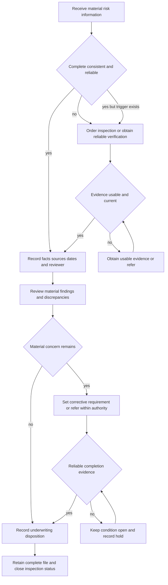

# Inspection and Records

## Scope and boundary

This page groups **Rule 600 — Inspections** and **Rule 610 — Documentation Standards** of the Personal Lines Underwriting Manual. They are internal controls for risk selection, referral, corrective-action follow-up, and the underwriting file. They do not grant, remove, or interpret policy coverage. Rule 100 says the Manual is internal carrier direction and must not be used as a coverage grant; coverage remains governed by the issued policy terms and attached contract documents ([Rule 100.A–100.D](repo://manuals/underwriting/manual.md#L13-L37)).

An inspection is evidence for an underwriting decision, not a rating instruction or a coverage determination. Rule 600 does not state a premium, deductible, settlement, or coverage consequence from an inspection finding. Apply the applicable product, appetite, authority, renewal, and adverse-action controls separately. In particular, use [Binding Authority and Exceptions](/openwiki/underwriting/guidelines/binding-authority.md) and [Manual Binding Authority, Referrals, and Unclearable Conditions](/openwiki/underwriting/manual/authority-referrals-and-clearance.md) when a finding exceeds delegated authority, and [Underwriting Referral and Authority Guidance](/openwiki/underwriting/guidelines/referral-authority.md) for the broader referral lifecycle.

## Operating lifecycle

The control starts when material underwriting information is incomplete, inconsistent, or unreliable, or when an observed condition needs independent verification. It ends only when material findings are resolved, referred, or expressly accepted within authority and the final disposition is recorded. Rule 600.A requires the issue to be resolved or an authorized exception recorded before binding; Rule 600.AX requires a clear final status before the inspection process is closed ([Rule 600.A](repo://manuals/underwriting/manual.md#L8503-L8507) [Rule 600.AX](repo://manuals/underwriting/manual.md#L8797-L8801)).

*This flow shows the Rule 600 inspection lifecycle and Rule 610 record controls; it does not determine coverage or authorize an action outside delegated authority.*

### Entry points and triggers

Order or require inspection evidence when any of these conditions is present:

- **Information quality:** underwriting information is incomplete, inconsistent, or unreliable. Do not bind until the issue is resolved or an authorized exception is recorded (Rule 600.A). [Rule 600.A](repo://manuals/underwriting/manual.md#L8503-L8507)
- **Roof timing:** a roof survey is required before binding when roof age reaches **15 years**, with evidence sufficient to identify condition, materials, installation quality, and visible deterioration (Rule 600.B). Record reported age, request, findings, and action. [Rule 600.B](repo://manuals/underwriting/manual.md#L8509-L8513)
- **Condition and occupancy:** deferred maintenance, apparent vacancy or unoccupancy, inadequate security, structural movement, foundation distress, material cracking, damaged exterior finishes, water intrusion, staining, rot, mold, or moisture damage require the inspection or evidence specified by Rule 600. Refer when the material condition, source, extent, or remediation status remains unresolved (Rules 600.C–600.G). [Rule 600.C–600.G](repo://manuals/underwriting/manual.md#L8515-L8543)
- **Systems and site:** apparent electrical or heating defects, solid-fuel equipment, plumbing or drainage concerns, ponding, erosion, water flow toward the structure, retaining walls, steep slopes, unstable soil, or ground movement require current inspection evidence or referral as directed by Rules 600.H–600.M. [Rule 600.H–600.M](repo://manuals/underwriting/manual.md#L8545-L8579)
- **Premises hazards and use:** vegetation hazards, debris or stored materials, unsafe stairs or elevated structures, pools and other water features, recreational hazards, ineffective barriers, animals, business activity, commercial storage, construction, renovation, demolition, or incomplete repairs are inspection and/or referral triggers under Rules 600.N–600.W. [Rule 600.N–600.W](repo://manuals/underwriting/manual.md#L8581-L8639)
- **Discrepancy, occupancy pattern, and prior loss:** material differences between the structures and the application, unreported improvements or converted areas, seasonal or intermittent occupancy, apparently unrepaired prior damage, recurring property conditions, fire evidence, pest activity, or compromised openings require inspection, verification, or referral under Rules 600.X–600.AE. [Rule 600.X–600.AE](repo://manuals/underwriting/manual.md#L8641-L8687)
- **Roof and utility evidence:** damaged roofing accessories or drainage components, unusual detached structures, fuel storage, exterior utility installations, damaged service connections, code notices, restricted access, conflicting third-party or aerial information, unresolved prior recommendations, and unusable photographs are covered by Rules 600.AF–600.AO. [Rule 600.AF–600.AO](repo://manuals/underwriting/manual.md#L8689-L8747)
- **Specialized technical questions:** use inspection findings as underwriting evidence, not as repair advice; refer questions requiring specialized evaluation under Rule 600.AW. [Rule 600.AW](repo://manuals/underwriting/manual.md#L8791-L8795)

A trigger is not cleared merely because an applicant has supplied an explanation. The explanation, inspection, supporting records, and reconciliation belong in the file. The applicable appetite or product rule may impose an earlier or stricter control.

### State and product overlays

Do not generalize the Manual’s 15-year roof-survey trigger into a universal state threshold. Apply the state and product position that governs the submission alongside Rule 600; an appetite threshold or inspection requirement is an underwriting control, not a coverage determination.

- **California:** Before binding at **20 years or greater**, obtain an acceptable roof inspection that identifies the covering, visible condition, and material defects; review available roof photographs; require documented completion of active-leak repairs; and do not bind incomplete roof work unless underwriting approves after reviewing scope and expected completion. Retain the inspection, photographs, and repair evidence supporting the decision. A wind-mitigation inspection is separately required above **$1,000,000 Coverage A** ([California appetite H.2.1–H.2.5](repo://guidelines/appetite/ca-homeowners.md#L304-L327) [California appetite H.2.31](repo://guidelines/appetite/ca-homeowners.md#L445-L454) [California appetite H.3.3–H.3.4](repo://guidelines/appetite/ca-homeowners.md#L518-L529)).
- **Florida internal appetite:** Obtain credible roof-age information and a roof inspection before binding at **15 years or greater**; do not bind at **20 years or greater**. Use a qualified inspector when condition cannot be established from credible records, review the primary and attached roof areas and visible water-entry indicators, and resolve conflicts rather than relying on an applicant estimate. A wind-mitigation inspection is required above **$500,000 Coverage A** ([Florida appetite H.2.1–H.2.10](repo://guidelines/appetite/fl-homeowners.md#L404-L454) [Florida appetite H.2.21–H.2.23](repo://guidelines/appetite/fl-homeowners.md#L500-L513) [Florida appetite H.3.1–H.3.7](repo://guidelines/appetite/fl-homeowners.md#L601-L630)).
- **North Carolina:** Evaluate roof age, surfacing condition, and maintenance evidence; obtain a roof inspection before binding at **18 years or greater**; clarify conflicts among the application, inspection, photographs, and public records; and refer when condition cannot reasonably be determined or when leakage, widespread deterioration, or unrepaired storm damage remains. Retain the inspection, photographs, and supporting roof records. A wind-mitigation inspection is required above **$500,000 Coverage A** ([North Carolina appetite H.2.1–H.2.6](repo://guidelines/appetite/nc-homeowners.md#L457-L484) [North Carolina appetite H.2.24–H.2.28 and H.2.40–H.2.43](repo://guidelines/appetite/nc-homeowners.md#L564-L586) [North Carolina appetite H.2.40–H.2.43](repo://guidelines/appetite/nc-homeowners.md#L644-L659) [North Carolina appetite H.3.3–H.3.4](repo://guidelines/appetite/nc-homeowners.md#L675-L682)).

- **Florida regulatory overlay:** OIR-2023-04 requires reasonably reliable and relevant roof-age information, identification of covering material and configuration, separate consideration of age and condition, evaluation of credible repair or replacement evidence, and meaningful consideration of information submitted before a final roof-age action. Before binding a roof that is **15 years old**, obtain and retain a roof inspection consistent with filed standards and provide the required inspection disclosure; the inspection is not a guarantee of eligibility. Preserve the roof information, inspection materials, decision record, notices, and delivery evidence for a roof-age-based adverse action ([OIR-2023-04 B.1 and B.2.2–B.2.7](repo://bulletins/FL/oir-2023-04-roof-age-nonrenewal.md#L13-L43) [OIR-2023-04 B.2.12–B.2.20](repo://bulletins/FL/oir-2023-04-roof-age-nonrenewal.md#L81-L103) [OIR-2023-04 B.3.2–B.3.15](repo://bulletins/FL/oir-2023-04-roof-age-nonrenewal.md#L163-L191) [OIR-2023-04 B.3.26–B.3.28](repo://bulletins/FL/oir-2023-04-roof-age-nonrenewal.md#L213-L219)).

These overlays control evidence, appetite, notice, and escalation handling. They do not authorize a claim denial, convert an inspection into a warranty, or replace the policy and attached endorsement governing a loss.

## Evidence validity and reliability

### What makes inspection evidence usable

Rule 600 requires inspection evidence from a reliable source with sufficient authority and relevant expertise. Altered, incomplete, or unverifiable inspection material cannot support acceptance. Rule 600 also requires review of the source, verification performed, evidence reviewed, and action taken (Rule 600.AP). [Rule 600.AP](repo://manuals/underwriting/manual.md#L8749-L8753)

Use these controls before relying on a report or visual record:

1. **Identify the property and scope.** Confirm that the inspection addresses the insured location and the material condition under review. If the report is from an alternate source, record the source and any reliability limitation (Rules 610.AC and 610.Z). [Rule 610.AC](repo://manuals/underwriting/manual.md#L8973-L8977) [Rule 610.Z](repo://manuals/underwriting/manual.md#L8955-L8959)
2. **Check completeness and clarity.** Unclear, outdated, incomplete, or inconsistent photographs require usable replacement evidence before reliance. Record the deficiency and replacement material (Rule 600.AO; Rule 610.AD). [Rule 600.AO](repo://manuals/underwriting/manual.md#L8743-L8747) [Rule 610.AD](repo://manuals/underwriting/manual.md#L8979-L8983)
3. **Separate observation from report and inference.** Record whether a condition was observed, reported, or inferred; do not turn an applicant statement or visual impression into a verified fact (Rules 610.AE and 610.AN). [Rule 610.AE](repo://manuals/underwriting/manual.md#L8985-L8989) [Rule 610.AN](repo://manuals/underwriting/manual.md#L9039-L9043)
4. **Reconcile conflicts.** When inspection, application, aerial imagery, third-party data, loss history, or other sources conflict, record each version, the verification attempted, the resolution, and the responsible reviewer. Resolve a conflict before completing action when it affects eligibility, classification, or terms (Rules 600.AM and 610.E). [Rule 600.AM](repo://manuals/underwriting/manual.md#L8731-L8735) [Rule 610.E](repo://manuals/underwriting/manual.md#L8829-L8833)
5. **Record timing.** Rule 610.C requires both the receipt date and verification date when timing affects the action, including any material gap. Rule 600.AO also treats stale inspection photographs as a reason to obtain usable evidence. [Rule 610.C](repo://manuals/underwriting/manual.md#L8817-L8821) [Rule 600.AO](repo://manuals/underwriting/manual.md#L8743-L8747)

### The report-validity wording needs controlled handling

Rule 610.AA says to record inspection status and to “treat an inspection report as valid for 18 from its completion.” The source text does not specify a unit. Record the inspection completion date and the action taken, but do not silently convert “18” into days, months, or another period. If the missing unit changes whether the report may be used, escalate the unclear Manual direction before acting rather than inventing a validity period (Rule 610.AA; Rule 100.P). [Rule 610.AA](repo://manuals/underwriting/manual.md#L8961-L8965) [Rule 100.P](repo://manuals/underwriting/manual.md#L105-L109)

This controlled treatment is important: a completion date is not the same as a receipt date, a report that is clear is not necessarily current, and a report that is current is not necessarily sufficient to clear a material finding. Continue to record the report’s source, scope, limitations, findings, and underwriting effect under Rules 610.A, 610.D, 610.AB, and 610.AC. [Rule 610.A–610.D](repo://manuals/underwriting/manual.md#L8805-L8827) [Rule 610.AB–610.AC](repo://manuals/underwriting/manual.md#L8967-L8977)

## Review, corrective action, and closure

### Review findings before action

Review inspection findings promptly and determine whether the risk remains acceptable. A material hazard outside normal underwriting authority must be referred; a material condition must not be waived without authorized approval (Rule 600.AQ–600.AT). [Rule 600.AQ–600.AT](repo://manuals/underwriting/manual.md#L8755-L8777)

Record the finding and its effect on eligibility, conditions, restrictions, or referral. Rule 610 requires a clear operational status—acceptable, declined, referred, restricted, or subject to condition—and a recorded basis and follow-up. It also requires material eligibility findings before the decision and the authority level used for material action (Rules 610.F, 610.I, and 610.AG). [Rule 610.F–610.I](repo://manuals/underwriting/manual.md#L8835-L8857) [Rule 610.AG](repo://manuals/underwriting/manual.md#L8997-L9001)

### Corrective requirements

Issue a corrective requirement only when the inspection identifies a material condition affecting acceptability. State the required outcome clearly, avoid speculative repair direction, and document the condition, outcome, due status, and verification method (Rule 600.AR). [Rule 600.AR](repo://manuals/underwriting/manual.md#L8761-L8765)

A condition imposed on an otherwise acceptable risk must be actionable. Record its purpose, the party responsible for follow-up, and whether it was completed or failed (Rule 610.H). Do not present a risk-control recommendation as a mandatory underwriting condition unless it is separately imposed as such (Rule 610.AH). [Rule 610.H](repo://manuals/underwriting/manual.md#L8847-L8851) [Rule 610.AH](repo://manuals/underwriting/manual.md#L9003-L9007)

### Completion evidence and disposition

Confirm completion through reliable evidence. An unsupported verbal statement does not close a corrective requirement. Record the evidence received, reviewer determination, remaining concerns, and closure action (Rule 600.AS). Rule 610.AI separately requires completion evidence and any remaining limitation to be recorded. [Rule 600.AS](repo://manuals/underwriting/manual.md#L8767-L8771) [Rule 610.AI](repo://manuals/underwriting/manual.md#L9009-L9013)

If access, requested evidence, or material information is withheld, document what was requested, the attempts made, the response, and the action taken. Any decline or cancellation consideration must be applied only as permitted by applicable underwriting procedures; withholding does not create an automatic outcome in this page (Rule 600.AU). [Rule 600.AU](repo://manuals/underwriting/manual.md#L8779-L8783)

Close the inspection process only after each material finding is resolved, referred, or accepted within authority. The closure record must state final inspection status, outstanding conditions if any, authority applied, and final underwriting action (Rule 600.AX). [Rule 600.AX](repo://manuals/underwriting/manual.md#L8797-L8801)

## Rule 610 file standard

The case record should let a later reviewer reconstruct what was known, when it was known, where it came from, what conflicted, who acted, and why the final disposition followed. At minimum, preserve the following:

| File element | Required control |
|---|---|
| **Fact and source ledger** | Record facts when received, identify the source, receipt method, reviewer action, and related material. Use approved terminology and record any clarification. **Rules 610.A–610.B.** [Rules 610.A–610.B](repo://manuals/underwriting/manual.md#L8805-L8815) |
| **Timing and attribution** | Record receipt and verification dates, material gaps, source name or type, information supplied, and known source limitations. **Rules 610.C–610.D.** [Rules 610.C–610.D](repo://manuals/underwriting/manual.md#L8817-L8827) |
| **Conflict record** | Record conflicting information, attempted verification, resolution, resolution basis, and responsible reviewer. **Rule 610.E.** [Rule 610.E](repo://manuals/underwriting/manual.md#L8829-L8833) |
| **Decision and referral** | State the operational status, basis, follow-up, referral trigger, information supplied, and resulting direction. **Rules 610.F–610.G.** [Rules 610.F–610.G](repo://manuals/underwriting/manual.md#L8835-L8845) |
| **Conditions and eligibility** | Record every material condition, purpose, responsible party, completion or failure, eligibility facts, and any exception authority. **Rules 610.H–610.I.** [Rules 610.H–610.I](repo://manuals/underwriting/manual.md#L8847-L8857) |
| **Risk profile** | Record verified occupancy, ownership, construction, protection, losses, maintenance, hazards, assumptions, changes, adverse information, and favorable information that materially offsets an adverse fact. **Rules 610.J–610.U.** [Rules 610.J–610.U](repo://manuals/underwriting/manual.md#L8859-L8929) |
| **Inspection package** | Record completion date, status, findings, effect, corrective-action completion, source, limitations, photographs, visual observations, and property-condition basis. **Rules 610.AA–610.AE.** [Rules 610.AA–610.AE](repo://manuals/underwriting/manual.md#L8961-L8989) |
| **Authority and adverse action** | Record prior decisions when relevant, authority level, risk-control recommendations versus requirements, decline or withdrawal rationale, restrictions, cancellation or nonrenewal rationale, and quality-review corrections. **Rules 610.AF–610.BB.** [Rules 610.AF–610.BB](repo://manuals/underwriting/manual.md#L8991-L9127) |

### Recordkeeping invariants and failure checks

- **No unsupported fact:** an applicant statement, informal description, or favorable assumption remains attributed or unverified until supported. Rules 610.A, 610.AN, and 610.Y require source, attribution, attempted verification, and treatment of unavailable verification. [Rule 610.A](repo://manuals/underwriting/manual.md#L8805-L8809) [Rule 610.Y](repo://manuals/underwriting/manual.md#L8949-L8953) [Rule 610.AN](repo://manuals/underwriting/manual.md#L9039-L9043)
- **No silent conflict resolution:** do not choose the favorable version when sources disagree. Record the conflict and resolution before completing action when material. [Rule 610.E](repo://manuals/underwriting/manual.md#L8829-L8833)
- **No implied eligibility:** record the material facts supporting eligibility, along with any exception authority. [Rule 610.I](repo://manuals/underwriting/manual.md#L8853-L8857)
- **No undocumented hold:** a hold must identify the pending matter, information or action required, and release decision. [Rule 610.AP](repo://manuals/underwriting/manual.md#L9051-L9055)
- **No retrospective reconstruction:** record material actions promptly, include the time of entry, and explain a material delay. [Rule 610.AV](repo://manuals/underwriting/manual.md#L9087-L9091)
- **No informal or speculative notes:** underwriting notes must be professional, factual, and limited to the decision or required follow-up. [Rule 610.AU](repo://manuals/underwriting/manual.md#L9081-L9085)
- **No hidden correction:** preserve the prior entry, corrected item, reason, and reviewer for a material data correction. [Rule 610.AS](repo://manuals/underwriting/manual.md#L9069-L9073)
- **No silent departure:** obtain authority before departing from documented direction and record the direction, departure, reason, approver, and disposition. [Rule 610.BB](repo://manuals/underwriting/manual.md#L9123-L9127)

Protect inspection reports, photographs, communications, and related evidence in the underwriting file, restrict access to legitimate underwriting purposes, and record what was retained, its source, review status, and any access limitation (Rule 600.AV). [Rule 600.AV](repo://manuals/underwriting/manual.md#L8785-L8789)

## Underwriting evidence versus policy and state obligations

Do not merge this page’s pre-bind or continuing-underwriting controls with post-loss contract duties or state claim-disclosure obligations. Rule 600 and Rule 610 govern internal risk selection, verification, referral, closure, and file integrity. The policy and applicable state sources govern what must be communicated or preserved when a loss is adjusted. An inspection result is evidence for the applicable decision; it is not, by itself, a coverage determination or claim denial.

### Roof age and condition evidence is not roof settlement wording

The **HO 23 74 2025-05** endorsement is a contract document for attached HO-3 policies, not an underwriting rule. It applies to covered roof surfacing, defines Roof Age as the age of the damaged surfacing at the time of loss, and permits age evidence from installation records, permits, invoices, inspections, photographs, statements, or other reliable evidence. It applies actual-cash-value settlement when Roof Age is **12 years or greater** and determines age from the directly damaged portion; a limited-area replacement does not establish the age of surrounding surfacing without evidence of one installation ([HO 23 74 W.0](repo://forms/HO/MS/HO-23-74/2025-05.md#L15-L43) [HO 23 74 W.1.4–W.1.8](repo://forms/HO/MS/HO-23-74/2025-05.md#L103-L114)). Those provisions may make a reliable age and condition record relevant to a later claim, but they do not change Rule 600’s 15-year pre-bind survey trigger, create a coverage grant, or turn an underwriting finding into a claim result.

The endorsement separately states that its payment is subject to applicable policy terms, limits, exclusions, conditions, and deductibles, and that inspection, estimating, or payment does not change the endorsement terms ([HO 23 74 W.0](repo://forms/HO/MS/HO-23-74/2025-05.md#L61-L80)). Keep the underwriting file’s reported age, source, verification status, condition observations, and disposition separate from the claim file’s policy edition, covered-damage analysis, valuation, and settlement calculation. If a later claim uses the evidence, the claims reviewer must apply the attached contract and facts of loss rather than importing an underwriting threshold.

### State roof obligations are a separate control layer

- **Colorado:** DOI-2022-08 applies to roof-related claim settlement, estimates, payments, and coverage communications. It requires clear explanation of the settlement method, roof age basis, condition or material limitations, depreciation, labor and materials, deductibles, and exclusions; it also requires consideration and documentation of inspections, records, photographs, receipts, and other reliable sources. The bulletin requires retention of the disclosure substance and delivery record and claim records supporting the valuation and payment determination ([Colorado DOI-2022-08 B.1.1–B.1.8](repo://bulletins/CO/doi-2022-08-roof-settlement.md#L16-L45) [Colorado DOI-2022-08 B.2.6–B.2.13 and B.2.25–B.2.27](repo://bulletins/CO/doi-2022-08-roof-settlement.md#L132-L162) [Colorado DOI-2022-08 B.2.25–B.2.34](repo://bulletins/CO/doi-2022-08-roof-settlement.md#L211-L252) [Colorado DOI-2022-08 B.3.33–B.3.34](repo://bulletins/CO/doi-2022-08-roof-settlement.md#L436-L442)). Its **15-year** schedule language and **25%** replacement floor are bulletin obligations for the applicable claim communications and must not be silently substituted for Rule 600’s internal evidence threshold or an attached policy form ([Colorado DOI-2022-08 B.2.6 and B.2.30](repo://bulletins/CO/doi-2022-08-roof-settlement.md#L132-L138) [Colorado DOI-2022-08 B.2.30–B.2.34](repo://bulletins/CO/doi-2022-08-roof-settlement.md#L231-L252)).
- **Florida:** OIR-2023-04 governs roof-age underwriting and nonrenewal practices as well as separate claim handling. It requires a reasonable claim investigation and says roof age alone may not deny, limit, or delay a claim; claim and underwriting determinations must remain distinct ([OIR-2023-04 B.4.1–B.4.8](repo://bulletins/FL/oir-2023-04-roof-age-nonrenewal.md#L239-L255)). Retain the underwriting evidence and adverse-action record required by the bulletin, but do not use the internal 15-year inspection trigger or a roof-age record as a claim outcome. The policy form attached to the loss controls any settlement schedule ([OIR-2023-04 B.4.9–B.4.13](repo://bulletins/FL/oir-2023-04-roof-age-nonrenewal.md#L257-L265) [OIR-2023-04 B.2.8–B.2.11](repo://bulletins/FL/oir-2023-04-roof-age-nonrenewal.md#L75-L81)).

When internal guidance, a state bulletin, an inspection report, and a contract use different age or condition concepts, preserve the competing sources and escalate the unresolved legal, filing, compliance, or authority question. Do not reconcile them by changing a record, assuming a coverage result, or treating a settlement disclosure as an underwriting standard.

## Related control points

- [Binding Authority and Exceptions](/openwiki/underwriting/guidelines/binding-authority.md) — delegated authority, referrals, exceptions, and file controls before binding.
- [Manual Binding Authority, Referrals, and Unclearable Conditions](/openwiki/underwriting/manual/authority-referrals-and-clearance.md) — mandatory referral and conditions that cannot be cleared.
- [Underwriting Referral and Authority Guidance](/openwiki/underwriting/guidelines/referral-authority.md) — referral package, approval status, and pending-action controls.
- [Manual Eligibility by Product Line](/openwiki/underwriting/manual/eligibility-and-product-lines.md) — product-line entry criteria and pre-bind controls.
- [Property and Water Risk](/openwiki/underwriting/manual/property-and-water-risk.md) — property-condition and water-risk review.
- [Renewal and Adverse Action](/openwiki/underwriting/manual/renewal-and-adverse-action.md) — continuation and adverse-action handling when a finding affects an existing policy.
- [Florida Appetite](/openwiki/underwriting/guidelines/florida-appetite.md) — Florida-specific appetite, roof-age, inspection, authority, and adverse-action controls.
- [Roof Settlement](/openwiki/coverage/settlement/roof-settlement.md) — contract settlement methods and state disclosure boundaries, separate from underwriting evidence.
- [Roof Claim Handling Guidance](/openwiki/claims/guidelines/roof-claim-handling.md) — post-loss investigation and claim-file evidence, kept separate from underwriting records.
