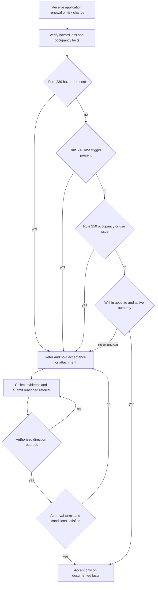

# Liability Losses and Occupancy

## Scope and control boundary

This page groups **Rules 230–250 of the Personal Lines Underwriting Manual**. They are internal carrier guidance for risk selection, referral, evidence, and acceptance. They are not policy language and do not determine whether a liability claim is covered. Rule 100 requires the Manual to be used within delegated authority, applied before binding, and kept separate from the coverage grant ([Manual Rule 100.C–100.E](repo://manuals/underwriting/manual.md#L27-L43)).

The Manual **constrains** when the carrier may accept a risk or attach an endorsement; it does not change the meaning of the applicable form. Do not describe a referral, a required repair, a vacancy classification, or an unapproved business-use endorsement as a policy exclusion or coverage grant. The issued policy, declarations, attached endorsements, and applicable state terms remain the contract authority ([Manual Rule 100.D](repo://manuals/underwriting/manual.md#L33-L37)).

The control applies at new business, renewal, and material risk change. Verify the facts as presented, use reliable sources, document the decision contemporaneously, and reassess when material information changes ([Manual Rule 100.H–100.J and 100.Q–100.T](repo://manuals/underwriting/manual.md#L57-L73) [repo://manuals/underwriting/manual.md#L111-L133]).

## Decision path

*This flow shows the underwriting gate; it does not decide contractual liability coverage.*

A referral is not approval. While a required referral is unresolved, do not bind, continue, or attach the affected treatment. Submit the trigger, facts, source, requested action, mitigation or repair evidence, authority response, conditions, and final disposition. Rule 100 prohibits unrecorded approval and requires exact compliance with approval conditions ([Manual Rule 100.V–100.Z](repo://manuals/underwriting/manual.md#L141-L169)).

## Rule 230 — liability-hazard screening

### Material hazard groups

Rule 230 requires referral when premises features, activities, or controls create foreseeable bodily-injury or property-damage exposure. The rule covers:

- **Water and elevated recreation:** swimming pools, hot tubs and spas, natural swimming ponds, diving features, slides, trampolines, playgrounds, tree houses, platforms, decks, balconies, elevated porches, and accessible roofs. A pool requires a barrier of at least **4 feet**; damaged barriers and gates that do not close and latch securely require correction before acceptance ([Manual Rule 230.A–230.K](repo://manuals/underwriting/manual.md#L2971-L3037)).
- **Premises condition and access:** unsecured construction materials, substantial renovation, open excavations or openings, damaged walks, driveways, stairs, porches, handrails, decks, railings, ladders, fences, walls, lighting, parking or vehicle routes, debris, refuse, unsanitary conditions, and access arrangements the insured cannot explain ([Manual Rule 230.L–230.S and 230.BA–230.BF](repo://manuals/underwriting/manual.md#L3039-L3085) [repo://manuals/underwriting/manual.md#L3285-L3319)).
- **Animals and weapons:** aggressive or poorly controlled animals, animals with an injury or property-damage history, roaming animals, livestock, security dogs, firearm ranges or target practice, explosives, fireworks, and pyrotechnic materials. Review containment, warnings, supervision, public access, and the responsible party ([Manual Rule 230.T–230.Z](repo://manuals/underwriting/manual.md#L3087-L3127)).
- **Business, visitor, and lodging activity:** business operations from the residence, customers or clients, patients or students, daycare, tutoring, elder care, assisted care, rental occupancy, guest lodging, and disclosed rental-day use. Evaluate visitor traffic, supervision, turnover, deliveries, equipment, and whether the activity materially changes the residential exposure ([Manual Rule 230.AA–230.AF](repo://manuals/underwriting/manual.md#L3129-L3163)).
- **Special property and activities:** unstable ground, retaining walls, bridges, docks, piers, boat launches, shoreline recreation, watercraft, recreational vehicles, off-road trails, hazardous repair activity, chemicals, fuel, flammables, wood stoves, fire pits, and open flames ([Manual Rule 230.AK–230.AV](repo://manuals/underwriting/manual.md#L3189-L3259)).
- **Existing allegations and disputes:** prior premises liability claims, complaints or injuries, neighbor disputes, shared access, and unresolved nuisance conditions. A history of an allegation is a reason to examine whether the underlying hazard remains; it is not by itself a coverage determination ([Manual Rule 230.AW–230.AZ](repo://manuals/underwriting/manual.md#L3261-L3283)).

### Required action and evidence

A Rule 230 referral must identify the hazard, location, condition, access or control measure, responsible party, and corrective action. Retain photographs, inspection notes, repair confirmation, and the basis for acceptance, restriction, or decline when available. The Manual repeatedly requires correction or secure control before acceptance for material defects; where the hazard cannot be adequately evaluated, do not bind until the facts and controls are understood ([Manual Rule 230.B, 230.N, 230.O, and 230.BF](repo://manuals/underwriting/manual.md#L2979-L2983) [repo://manuals/underwriting/manual.md#L3051-L3061) [repo://manuals/underwriting/manual.md#L3315-L3319)).

Rule 230 does not state a separate dollar authority level or a numeric clearance period. Its operational gate is referral and no acceptance until acceptable controls or authorized direction are documented. Rule 230.AP refers to an applicable **outboard horsepower exclusion threshold** when watercraft is disclosed, but the Rule 230 text does not supply a horsepower number; obtain the applicable form or authority rather than inventing one ([Manual Rule 230.AP](repo://manuals/underwriting/manual.md#L3219-L3223)).

## Rule 240 — prior loss history

### Review window and count trigger

Obtain prior loss history before accepting, renewing, or changing a risk, using carrier-approved loss sources and applicant disclosures. Review reported, paid, denied, and open property claims for the preceding **3 years**, including claims involving the applicant, household members, or insured location where available. Compare the record with the application and treat missing or materially inconsistent history as an underwriting concern ([Manual Rule 240.A–240.C](repo://manuals/underwriting/manual.md#L3321-L3339)).

Refer a risk with **2 paid property claims** in the applicable loss history and do not bind without underwriting authority. This is a referral threshold, not an automatic statement that the policy would or would not cover a future loss ([Manual Rule 240.D](repo://manuals/underwriting/manual.md#L3341-L3345)). The Manual also refers a prior loss exceeding its large-loss referral threshold, but Rule 240.AR does not state the amount; use the current approved threshold and record its source rather than supplying an unstated number ([Manual Rule 240.AR](repo://manuals/underwriting/manual.md#L3581-L3585)).

The three-year period is the stated review time limit. Rule 240 also requires updated review when information is stale, incomplete, or inconsistent, and it applies the same standard to new business, renewal, and material change. A later-discovered paid loss can reopen a completed review before issuance ([Manual Rule 240.AY–240.AZ](repo://manuals/underwriting/manual.md#L3623-L3633) [repo://guidelines/appetite/tx-homeowners.md#L449-L459]).

### Cause, recurrence, and repair

Count alone is insufficient. Classify each loss and distinguish weather from maintenance, sudden events from seepage or drainage failure, and a completed repair from cosmetic restoration. Review the cause and current condition for at least these patterns:

- **Water, roof, fire, and systems:** identify source, affected area, repair status, origin, and whether the underlying plumbing, roof, electrical, heating, drainage, or structural condition remains. Refer when remediation or cause correction is unclear, including repeated water loss or unresolved roof and electrical concerns ([Manual Rule 240.F–240.N and 240.AL](repo://manuals/underwriting/manual.md#L3353-L3405) [repo://manuals/underwriting/manual.md#L3545-L3549)).
- **Liability and premises:** review allegation, injury severity, location, disposition, animal or pool involvement, and the condition that caused the allegation. No payment or claim closure does not make a liability or premises event irrelevant; verify whether the condition was removed or corrected ([Manual Rule 240.O–240.R](repo://manuals/underwriting/manual.md#L3407-L3429) [repo://guidelines/appetite/tx-homeowners.md#L497-L503)).
- **Occupancy, rental, and business use:** review theft, vandalism, vacancy, seasonal or rented property, short-term rental, hosted occupancy, business activity, storage, construction, and renovation losses for use or supervision that may remain undisclosed ([Manual Rule 240.Y–240.AD](repo://manuals/underwriting/manual.md#L3467-L3501)).
- **Patterns and large or unusual losses:** identify recurring damage to the same component or recurring causes even when amounts or locations differ; review catastrophe losses in the context of present condition and mitigation ([Manual Rule 240.AQ–240.AT](repo://manuals/underwriting/manual.md#L3575-L3597)).

Acceptable evidence can include carrier records, applicant explanations, photographs, invoices, contractor statements, inspection reports, and comparable reliable records. An explanation is not a substitute for supportable evidence. Refer incomplete, altered, or inconsistent repair evidence, consider inspection for hidden or structural damage, and do not bind while the required referral remains unresolved ([Manual Rule 240.AU–240.AX](repo://manuals/underwriting/manual.md#L3599-L3621) [repo://guidelines/appetite/tx-homeowners.md#L513-L541)). Use factual, neutral language and protect loss information for legitimate underwriting purposes ([Manual Rule 240.BA–240.BB](repo://manuals/underwriting/manual.md#L3635-L3645) [repo://guidelines/appetite/tx-homeowners.md#L551-L567)).

## Rule 250 — occupancy, vacancy, and rental

### Occupancy and vacancy classification

Verify stated occupancy before binding or continuing the risk, confirm that a named insured resides at the premises where required, and distinguish continuous residence from seasonal, intermittent, nonprincipal, temporary, or unoccupied use. A change from owner occupancy to nonowner occupancy requires prompt notice and referral when it affects eligibility or rating ([Manual Rule 250.A–250.I](repo://manuals/underwriting/manual.md#L3647-L3701)).

Rule 250 directs the underwriter to apply the vacancy condition when the dwelling lacks the customary presence of occupants and personal property and states that vandalism is excluded after **60 days of vacancy**. The rule does not supply a different numeric deadline for “prompt” notice. Record the facts supporting the classification, including contents, heat, water, electrical service, maintenance, caretaker access, monitoring, and inspection evidence ([Manual Rule 250.F and 250.J–250.O](repo://manuals/underwriting/manual.md#L3679-L3737)).

This 60-day Rule 250 position must not be silently substituted for a product-specific rule. The DP-3 product rule separately states **30 consecutive days of vacancy** for its vandalism handling, and the current HO-3, HO-4, and HO-6 forms supplied for this page also state 30-day vandalism provisions. Apply the form, product rule, and applicable state terms for the actual policy record; do not present an internal Rule 250 handling position as a new contract exclusion ([Manual Rule 150.N](repo://manuals/underwriting/manual.md#L1699-L1703) [openwiki/underwriting/manual/eligibility-and-product-lines.md#L140-L144](repo://openwiki/underwriting/manual/eligibility-and-product-lines.md#L140-L144) [HO-3 X.52](repo://forms/HO/MS/HO-3/2024-03.md#L681-L685) [HO-4 X.53](repo://forms/HO/MS/HO-4/2021-10.md#L749-L753) [HO-6 X.31](repo://forms/HO/MS/HO-6/2023-02.md#L728-L732)).

Refer vacancy or unoccupancy when there is impaired security, abandonment, boarded openings, prior water or fire damage, inadequate weather protection, repeated local vandalism, foreclosure or transfer pressure, or no reliable contact or emergency access. Active construction or repairs that prevent normal habitation are not ordinary resident occupancy ([Manual Rule 250.P–250.T and 250.AL–250.AR](repo://manuals/underwriting/manual.md#L3739-L3767) [repo://manuals/underwriting/manual.md#L3871-L3911)).

### Tenant, rental, and business-use controls

Tenant occupancy, rental use, short-term rental, home-sharing, rooming or boarding, lodging, employee or crew housing, mixed occupancy, detached-structure occupancy, subleasing, unauthorized occupants, and rent paid to someone other than the named insured require the insured's role, interest, possession, access, and maintenance responsibilities to be established. Obtain lease information when material and refer arrangements that are informal, disputed, undisclosed, or outside approved appetite ([Manual Rule 250.U–250.AJ](repo://manuals/underwriting/manual.md#L3769-L3863)).

For rental property, confirm who selects and manages tenants, who can lawfully inspect and maintain the premises, whether the insured retains oversight, who maintains common areas, and who controls keys or access codes. The landlord-contents sublimit is an internal handling reference only when the insured's contents are connected with the rental premises; uncertain ownership is a referral, not a reason to assume coverage ([Manual Rule 250.Y–250.AB](repo://manuals/underwriting/manual.md#L3793-L3815)).

Business lodging, guest accommodation, business-property storage, and revenue activity require review of whether the use remains personal and whether business property or operations alter the residential risk. Rule 250 requires referral when these facts are present or unclear; it does not decide whether an attached liability endorsement would respond to a claim ([Manual Rule 250.AV–250.AW](repo://manuals/underwriting/manual.md#L3931-L3941)).

### Final classification and unresolved facts

At renewal, verify that occupancy information remains current and reconcile application statements with inspection findings and third-party reports. If reasonable inquiry cannot resolve the facts, do not bind or continue without underwriting direction. Record the final occupancy, vacancy, and rental classification before completing the action ([Manual Rule 250.AT–250.AU and 250.BB–250.BE](repo://manuals/underwriting/manual.md#L3919-L3929) [repo://manuals/underwriting/manual.md#L3967-L3989)).

## Authority levels and disposition

Rules 230–250 use referral and hold language but do not replace the Manual's general delegated-authority ceilings. Rule 300 provides that a line underwriter may bind Coverage A through **$800,000**, while a senior underwriter may bind through **$1,500,000**; amounts above the applicable authority must be referred and the authority used must be recorded ([Manual Rule 300.A–300.D](repo://manuals/underwriting/manual.md#L3991-L4015)). These are authority levels, not coverage limits and not permission to ignore a hazard, loss, occupancy, or product rule.

The Texas appetite guide separately states an eligible Coverage A range of **$150,000–$1,200,000** and separately requires referral of unusual occupancy, ownership, construction, or hazard characteristics ([Texas Homeowners Appetite H.1.1 and H.1.3–H.1.16](repo://guidelines/appetite/tx-homeowners.md#L59-L91) [repo://guidelines/appetite/tx-homeowners.md#L143-L151)). Where a state appetite ceiling, product eligibility rule, and delegated authority differ, apply each applicable constraint and obtain clarification through the authorized channel; do not use the higher number to bypass the lower applicable control.

For a Rule 230, 240, or 250 referral, the disposition sequence is:

1. Hold the acceptance, renewal, change, or endorsement attachment that depends on the unresolved fact.
2. Record the specific rule, trigger, source, date or status, requested action, and material evidence.
3. Obtain authorized direction through the recorded referral channel; silence or informal discussion is not approval.
4. Satisfy every repair, inspection, documentation, occupancy, or other condition before binding.
5. Re-refer when the facts or requested terms change, then record the final authority, classification, and action.

That sequence preserves the Manual's control boundary: internal guidance **constrains** carrier action, while the form and attached endorsements continue to define contractual coverage ([Manual Rule 300.X–300.AD and 300.BG–300.BN](repo://manuals/underwriting/manual.md#L4131-L4171) [repo://manuals/underwriting/manual.md#L4341-L4387)).

## Contract coverage boundary

The current HO-3, HO-4, and HO-6 forms are separate contract authorities. Their definitions and Section II provisions show why the underwriting facts must be matched to the issued form rather than treated as coverage decisions:

- **HO-3 (2024-03):** “residence premises” is the property where the insured resides, and “business” includes rental for economic gain ([HO-3 DEF.4–DEF.7](repo://forms/HO/MS/HO-3/2024-03.md#L55-L67)). Coverage E applies to bodily injury or property damage arising at an insured location or from personal activities, while its business exclusion does not apply to activities ordinarily incident to nonbusiness pursuits; Section II separately includes a 15-day residence-premises rental exception and excludes liability involving an animal when the insured knew or should have known of a dangerous condition ([HO-3 E.1–E.8](repo://forms/HO/MS/HO-3/2024-03.md#L933-L949) [HO-3 X.14–X.17](repo://forms/HO/MS/HO-3/2024-03.md#L1051-L1059) [HO-3 X.33–X.35](repo://forms/HO/MS/HO-3/2024-03.md#L1091-L1095)).
- **HO-4 (2021-10):** “residence premises” is the dwelling or unit shown as the place where the insured resides, and a business is an activity engaged in for economic gain ([HO-4 DEF.4–DEF.7](repo://forms/HO/MS/HO-4/2021-10.md#L49-L55)). Coverage E excludes liability arising from a business, and Section II excludes liability arising from a known dangerous animal or an animal used in a business ([HO-4 E.1–E.9](repo://forms/HO/MS/HO-4/2021-10.md#L1007-L1027) [HO-4 X.12–X.13 and X.30–X.31](repo://forms/HO/MS/HO-4/2021-10.md#L1141-L1149) [repo://forms/HO/MS/HO-4/2021-10.md#L1175-L1180)).
- **HO-6 (2023-02):** “residence premises” is the unit where the insured resides and does not include property used solely for rental or business purposes; “business” includes property rented to others for compensation ([HO-6 DEF.4–DEF.7](repo://forms/HO/MS/HO-6/2023-02.md#L46-L55)). Section II excludes liability arising from a business, provides a 14-day occasional-rental exception, and separately excludes animal-related liability and animals used in business ([HO-6 X.1–X.9](repo://forms/HO/MS/HO-6/2023-02.md#L1122-L1138) [HO-6 X.45–X.47](repo://forms/HO/MS/HO-6/2023-02.md#L1210-L1214)).

These grants, exclusions, definitions, vacancy provisions, and notice duties apply only according to the issued policy and applicable state terms. A Rule 230–250 referral does not narrow the form's legal wording, and a form or endorsement does not automatically clear an internal eligibility, hazard, loss, or occupancy referral.

## Failure checks

- **Coverage substitution:** treating the Manual's vacancy, business-use, or liability referral as a policy exclusion, or treating an endorsement attachment as proof that the risk was eligible. Recheck the issued form and declarations.
- **Threshold-only acceptance:** accepting because the loss count, authority amount, or rental-day information appears within a numeric range while a material hazard, unresolved repair, occupancy conflict, or missing source remains.
- **Claim-count-only review:** ignoring cause, recurrence, repair quality, or current condition because a claim was closed or unpaid.
- **Vacancy shortcut:** treating a furnished or intermittently visited dwelling as continuously occupied without evaluating utilities, supervision, maintenance, security, and the applicable 60-day Rule 250 handling.
- **Pending-referral bind:** binding, renewing, or attaching a form before authorized direction is recorded and every condition is satisfied.
- **Unstated threshold:** inventing a dollar amount for Rule 230.AP's watercraft threshold or Rule 240.AR's large-loss threshold. Obtain the controlling current source and record it.

## Related pages

- [Referral authority](/openwiki/underwriting/guidelines/referral-authority.md)
- [Manual Eligibility by Product Line](/openwiki/underwriting/manual/eligibility-and-product-lines.md)
- [Liability claim handling](/openwiki/claims/guidelines/liability-claim-handling.md)
- [Incidental Business and Personal Injury](/openwiki/coverage/liability/incidental-business-and-personal-injury.md)
- [Liability E and F](/openwiki/coverage/parts/liability-e-f.md)
