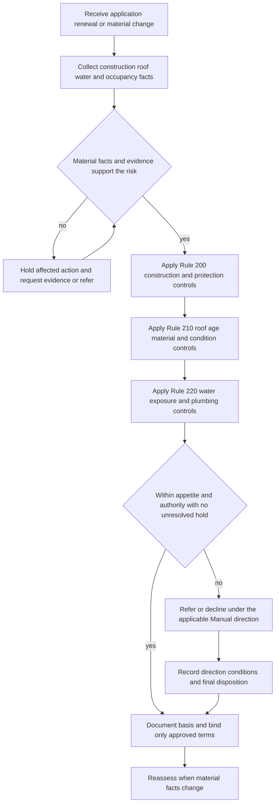

# Property and Water Risk

## Scope and governing boundary

This page groups **Rule 200 — Construction and Protection Class**, **Rule 210 — Roof Condition, Age and Material**, and **Rule 220 — Water Exposure and Plumbing** of the Personal Lines Underwriting Manual. They are internal controls for evaluating, documenting, referring, conditioning, declining, or holding a property risk before binding or renewal. They do not grant, remove, limit, or settle coverage. The Manual expressly requires carrier-issued coverage terms to control and requires Manual direction to be applied before binding ([Manual Rule 100.C–100.E](repo://manuals/underwriting/manual.md#L27-L43)).

Use the applicable base form, declarations, state form, and attached endorsement for a coverage or settlement question. For example, the Manual’s roof-age and condition rules constrain whether the carrier may bind a risk; an attached [HO 23 74 roof settlement endorsement](repo://forms/HO/MS/HO-23-74/2025-05.md) controls the settlement method for covered roof surfacing. Similarly, Rule 220 controls underwriting review of water exposure; it does not turn an underwriting referral threshold into a water-backup limit or create coverage where the base form excludes backup. The [HO 04 90 2027-01 endorsement](repo://forms/HO/MS/HO-04-90/2027-01.md) modifies the HO-3 contract only when attached and only as its wording provides ([HO 04 90 W.0](repo://forms/HO/MS/HO-04-90/2027-01.md#L13-L39)).

### Contract checkpoints for water, flood, and valuation

The current 2024-03 HO-3 base form excludes sewer, drain, and sump backup, flood and surface water, below-ground water, and sump or drainage-system failure in its perils provisions (**P.9–P.12**). It separately addresses repeated seepage, accidental plumbing discharge, and wind-created openings (**P.29–P.30 and P.38**) ([HO-3 2024-03 P.9–P.12](repo://forms/HO/MS/HO-3/2024-03.md#L481-L492) [HO-3 2024-03 P.29–P.30 and P.38](repo://forms/HO/MS/HO-3/2024-03.md#L525-L543)). The 2026-01 DP-3 has its own wording: **P.13–P.14** exclude flood, surface water, backup, and below-ground water, while **P.28–P.30 and P.38** distinguish repeated leakage, sudden accidental discharge, and plumbing discharge through openings ([DP-3 2026-01 P.13–P.14](repo://forms/DP/MS/DP-3/2026-01.md#L1274-L1286) [DP-3 2026-01 P.28–P.30 and P.38](repo://forms/DP/MS/DP-3/2026-01.md#L1342-L1353) [DP-3 2026-01 P.38](repo://forms/DP/MS/DP-3/2026-01.md#L1379-L1386)). Thus Rule 220’s source/path and flood controls are evidence and eligibility controls; they do not decide whether a reported loss is covered.

For valuation, Rule 110 requires a supported dwelling limit and applies the 80% condition when valuation support is incomplete (**Rule 110.BJ–110.BK**); higher Coverage A limits also require referral for valuation, construction, and exposure review (**Rule 110.B**). Record the valuation basis and any referral separately from the roof’s inspection or age result ([Manual Rule 110.B and 110.BJ–110.BK](repo://manuals/underwriting/manual.md#L323-L327) [Manual Rule 110.BJ–110.BK](repo://manuals/underwriting/manual.md#L683-L693)). The DP-3 expressly says its roof-age trigger for an actual-cash-value schedule does not determine whether a peril is covered (**P.49**), which is the same separation required here ([DP-3 2026-01 P.49–P.50](repo://forms/DP/MS/DP-3/2026-01.md#L1426-L1432)).

## Operating model

The controls work as a gated review rather than as a checklist of favorable assumptions:

*This flow shows the underwriting control path; it does not determine policy coverage or claim settlement.*

A pending referral is not approval. Rule 100 requires current and reliable information, verification of material characteristics, referral of unresolved material uncertainty, contemporaneous reasons, and recorded approval conditions ([Manual Rule 100.H–100.J and 100.S–100.Y](repo://manuals/underwriting/manual.md#L57-L73) [Manual Rule 100.V–100.Y](repo://manuals/underwriting/manual.md#L141-L163)). When a material condition changes after review, reassess rather than relying on the earlier decision ([Manual Rule 100.Q–100.R](repo://manuals/underwriting/manual.md#L111-L121)).

## Cross-rule referral and no-clearance gate

Rules 200, 210, and 220 supply the property facts and condition tests; Rules 310 and 320 supply additional disposition controls. Apply the cross-rule controls when a risk also has a mandatory referral or a condition that cannot be cleared:

- **Mandatory referral and hold:** Rule 310 requires referral for an open or disputed claim and bars binding, renewal, or broadened coverage pending disposition. It also requires referral for vacancy or unoccupancy, ongoing renovation, structural damage, roof damage or leakage, recurring water intrusion, unresolved plumbing leakage, sewer or drain backup, and suspected mold, fungi, or rot. The required action varies by condition—hold, suspend processing, or do not complete underwriting—but a pending referral is not approval ([Manual Rule 310.B–310.C](repo://manuals/underwriting/manual.md#L4421-L4431) [Manual Rule 310.U–310.AC](repo://manuals/underwriting/manual.md#L4535-L4587)).
- **No-clearance decline:** Rule 320 requires declining a known condition that materially increases expected loss and cannot be corrected before binding. The listed no-clearance conditions include unresolved roof damage or leakage, missing or unsecured roof covering, active water intrusion, unrepaired plumbing failure, and active mold, fungal growth, rot, or unresolved moisture damage ([Manual Rule 320.1–320.7](repo://manuals/underwriting/manual.md#L4765-L4805) [Manual Rule 320.15](repo://manuals/underwriting/manual.md#L4849-L4853)). Do not convert a Rule 320 condition into an ordinary referral that can be cleared by a note or an unsupported repair promise.

### Fungi, maintenance, and the contract boundary

For prior fungi, mold, bacteria, rot, or moisture claims, Rule 240.S requires review and referral when the moisture source is unresolved or remediation is incomplete; the fungi-and-bacteria aggregate is not an eligibility decision ([Manual Rule 240.S](repo://manuals/underwriting/manual.md#L3431-L3439)). Rule 310.AC separately suspends processing for suspected mold, fungi, or rot, while Rule 320.15 requires decline when active growth, rot, or moisture damage remains unresolved. The underwriting file should therefore identify the source, affected area, remediation status, and evidence of completion rather than rely on a cosmetic repair description.

Those selection controls remain separate from contract treatment. In HO 04 90 (2027-01), W.18 excludes loss caused by mold, fungus, wet rot, dry rot, bacteria, virus, or other microorganisms even when the condition results from water backup or sump discharge; W.19 addresses odor, staining, contamination, testing, monitoring, assessment, and remediation only as its wording allows ([HO 04 90 W.18–W.19](repo://forms/HO/MS/HO-04-90/2027-01.md#L600-L608)). Do not use that form limitation as a new underwriting rule, and do not treat a Rule 220 referral or Rule 320 decline as a coverage determination.

## Rule 200 — Construction and protection class

### Classification and construction evidence

- **Incomplete construction information:** Refer the risk and do not assign an underwriting position until the file supports the reported construction. Classify by predominant exterior-wall construction, not by listing language when inspection material says otherwise (**Rule 200.A–200.B**). Record the source, observed materials, images, inspection notes, discrepancies, and disposition ([Rule 200.A–200.B](repo://manuals/underwriting/manual.md#L1965-L1975)).
- **Combustible or unusual construction:** Refer combustible exterior walls near heavy vegetation; unpermitted or nonstandard construction; log, timber, adobe, rammed-earth, or other atypical walls; and unsupported or incomplete additions, enclosed porches, converted garages, or similar alterations (**Rule 200.C and 200.O–200.R**). The review should establish durability, fire response, weather resistance, occupancy suitability, repair availability, and valuation support ([Rule 200.C](repo://manuals/underwriting/manual.md#L1977-L1981) [Rule 200.O–200.R](repo://manuals/underwriting/manual.md#L2049-L2071)).
- **Attached and detached structures:** Evaluate attached structures for construction, use, and separation. Refer attachments that increase fire, wind, or liability exposure and detached structures used for business, hazardous-material storage, or nonresidential activity (**Rule 200.S–200.T**). Record the structure, use, contents, and supporting evidence ([Rule 200.S–200.T](repo://manuals/underwriting/manual.md#L2073-L2083)).
- **Foundation and below-grade construction:** Evaluate foundation type and visible settlement indicators for every dwelling risk. Refer cracks, displacement, moisture intrusion, structural movement, raised-foundation decay or support damage, recurring basement water entry, flooding, mold, or unresolved moisture (**Rule 200.K–200.M**). Record foundation type, water history, access, and inspection support ([Rule 200.K–200.M](repo://manuals/underwriting/manual.md#L2025-L2041)).
- **Work in progress:** Refer unfinished renovation, active reconstruction, exposed structural components, or alterations that are incomplete or unsuitable for occupancy. Active work is not ordinary maintenance (**Rule 200.N and 200.O**); document scope, status, permits or other support, and any conditions before accepting ([Rule 200.N–200.O](repo://manuals/underwriting/manual.md#L2043-L2053)).

### Roof, systems, and fire-protection interfaces

Rule 200 provides the broad property-classification gate; Rule 210 supplies the detailed roof gate. Under Rule 200, evaluate deteriorated, patched, missing, improperly installed, or materially altered roof covering and refer impaired weather resistance or unsupported replacement claims (**Rule 200.D–200.E**). Plumbing leaks, corroded piping, prior water loss, visible moisture damage, unsafe heating or cooling equipment, electrical defects, and long-term vacancy or deferred maintenance are also referral conditions (**Rule 200.U–200.Z**) ([Rule 200.D–200.E](repo://manuals/underwriting/manual.md#L1983-L1993) [Rule 200.U–200.Z](repo://manuals/underwriting/manual.md#L2085-L2119)).

Protection class must be verified from reliable location and protection information; unsupported protection class, restricted emergency access, unreliable fire-water supply, or uncertain response capability requires referral (**Rule 200.AA–200.AD**). The HO-3 eligibility rule separately refers a protection class above **8**, and the Texas appetite guide permits binding only when the protection class does not exceed **8**. Treat the numeric appetite position and Rule 200’s evidence and access controls as separate checks ([Rule 200.AA–200.AD](repo://manuals/underwriting/manual.md#L2121-L2143) [Manual Rule 110.C](repo://manuals/underwriting/manual.md#L329-L333) [Texas appetite H.1.2](repo://guidelines/appetite/tx-homeowners.md#L59-L67)).

### Wind mitigation inspection and site exposure

When **Coverage A exceeds $750,000**, Rule 200 requires a wind mitigation inspection **before final underwriting action**. Record receipt and review and resolve conflicts with other file information (**Rule 200.F**; [Rule 200.F](repo://manuals/underwriting/manual.md#L1995-L1999)). Review roof shape, attachment, and opening protection when wind exposure is material, and refer incomplete or conflicting information (**Rule 200.G–200.I**) ([Rule 200.G–200.I](repo://manuals/underwriting/manual.md#L2001-L2017)). This Rule 200 threshold is distinct from the Texas appetite guide’s wind-mitigation inspection trigger at **Coverage A above $500,000**; apply the applicable state and product controls rather than collapsing the two positions ([Texas appetite H.3.2–H.3.5](repo://guidelines/appetite/tx-homeowners.md#L275-L285)).

Also evaluate wildfire fuels, topography, defensible space, access, drainage, flood-related construction, retaining walls, slopes, erosion, ponding, grading, blocked gutters, and discharge toward the foundation. Refer unresolved or materially adverse conditions and document the site evidence and corrective action (**Rule 200.AI–200.AM**) ([Rule 200.AI–200.AM](repo://manuals/underwriting/manual.md#L2169-L2197)).

### State overlays, mitigation, and deductible disclosures

The Manual rules are the baseline; state and product sources can impose a stricter or different gate:

- **Florida roof and backup overlays:** Florida requires a roof inspection before binding at **15 years or greater**, prohibits binding at **20 years or greater**, and separately applies an actual-cash-value roof schedule at **15 years or greater**. The age and settlement-schedule positions are separate: the first two are appetite controls under Rule 210, while the schedule affects policy treatment only after the applicable terms are issued ([Florida appetite H.2.1–H.2.6](repo://guidelines/appetite/fl-homeowners.md#L404-L432) [Florida appetite H.2.23–H.2.28](repo://guidelines/appetite/fl-homeowners.md#L511-L535)). Florida also requires referral for a requested water-backup limit above **$10,000**, requires the source to be described, and warns that backup does not insure flood, storm surge, or tidal water ([Florida appetite H.4.5–H.4.8](repo://guidelines/appetite/fl-homeowners.md#L765-L779) [Florida appetite H.4.23–H.4.24](repo://guidelines/appetite/fl-homeowners.md#L845-L851)). Apply those stricter state/product positions alongside Rule 220.V–220.X; do not substitute the Florida threshold for the Manual’s general authority rule.
- **Texas roof and wind mitigation overlays:** Texas confirms the 15-year inspection and 25-year no-bind positions and requires a wind-mitigation inspection when Coverage A exceeds **$500,000**. Rule 200.F’s general Manual trigger is **above $750,000**, so the applicable Texas product trigger is the controlling, stricter check; retain the report and refer conflicts under Rule 200.G–200.I ([Texas appetite H.2.1–H.2.6](repo://guidelines/appetite/tx-homeowners.md#L153-L169) [Texas appetite H.3.1–H.3.5](repo://guidelines/appetite/tx-homeowners.md#L275-L285) [Rule 200.F–200.I](repo://manuals/underwriting/manual.md#L1995-L2017)).
- **Texas windstorm and hail deductible:** Bulletin B-2021-08 governs administration and disclosure, not roof eligibility. A separate deductible must be stated in the policy, distinguish windstorm and hail treatment, be disclosed before binding and at renewal, and be applied only when the issued policy and loss facts support it. The bulletin sets a named-storm minimum of **1%**, a hurricane maximum of **5%**, and a seacoast wind maximum of **10%**; it does not authorize an underwriting note to create or misapply a deductible ([Texas Bulletin B-2021-08 B.1.3–B.1.7 and B.1.13–B.1.15](repo://bulletins/TX/b-2021-08-windstorm-deductibles.md#L19-L43) [Texas Bulletin B-2021-08 B.2.2–B.2.12](repo://bulletins/TX/b-2021-08-windstorm-deductibles.md#L49-L71) [Texas Bulletin B-2021-08 B.3.2–B.3.18](repo://bulletins/TX/b-2021-08-windstorm-deductibles.md#L139-L171)). Keep this policy/state disclosure control separate from Rule 200 wind-mitigation evidence, Rule 210 roof age, and claim causation.

### Rule 200 disposition

Do not accept a prior wind loss that remains unrepaired or inadequately repaired until it is evaluated (**Rule 200.J**). Maintain a clear construction and protection-class record for binding and renewal, including evidence relied upon and any exception approval (**Rule 200.AO**) ([Rule 200.J](repo://manuals/underwriting/manual.md#L2019-L2023) [Rule 200.AO](repo://manuals/underwriting/manual.md#L2205-L2209)).

## Rule 210 — Roof condition, age, and material

### Age thresholds and binding holds

These are underwriting thresholds, not claim-settlement rules:

- At roof age **15 years or greater**, obtain roof inspection findings **before binding** and hold binding authority until the findings support acceptable condition (**Rule 210.A**). Record the age source, findings, hold, and resolution ([Rule 210.A](repo://manuals/underwriting/manual.md#L2213-L2217)).
- At roof age **25 years or greater**, **decline** the risk. Rule 210.B says not to override this appetite limit through discretionary authority; record the age source and declination basis ([Rule 210.B](repo://manuals/underwriting/manual.md#L2219-L2223)).
- Verify age from reliable evidence before relying on an applicant statement. Uncertain age, unsupported replacement statements, or replacement evidence that does not identify the work require review or referral (**Rule 210.C–210.D**) ([Rule 210.C–210.D](repo://manuals/underwriting/manual.md#L2225-L2235)).

The Texas appetite guide states the same operational positions: inspection before binding at **15 years** and no binding at or above **25 years** ([Texas appetite H.2.3–H.2.6](repo://guidelines/appetite/tx-homeowners.md#L159-L167)). Do not confuse either position with the attached roof settlement form. The 2025-05 HO 23 74 endorsement applies ACV treatment to covered roof surfacing when Roof Age is **12 years or greater**, using age evidence such as installation records, permits, invoices, inspections, photographs, and statements ([HO 23 74 2025-05 W.1.4–W.1.6](repo://forms/HO/MS/HO-23-74/2025-05.md#L90-L114)). Rule 210 **constrains** binding; HO 23 74 **controls** the settlement method only when attached and applicable to the policy. A settlement schedule does not cure an unacceptable roof or authorize binding.

Inspection reports also have a general currency control: Rule 100.AJ treats an inspection report as current for **12 months after receipt**, but refers the risk when it cannot support the underwriting decision ([Manual Rule 100.AJ–100.AL](repo://manuals/underwriting/manual.md#L225-L241)). That general currency rule does not displace the subject-specific Rule 200 or Rule 210 requirements for a wind or roof inspection.

### Condition, repairs, and material review

- Refer visible deterioration, missing, lifted, curled, cracked, or damaged covering, active leakage, temporary or incomplete patching, weather or vegetation damage, impaired drainage, damaged flashing, penetrations or seals, sagging or uneven planes, soft or deteriorated decking, mold, rot, moisture damage, inadequate ventilation, brittle or materially worn material, and deferred maintenance (**Rule 210.E–210.R and 210.AC**) ([Rule 210.E–210.R](repo://manuals/underwriting/manual.md#L2237-L2319) [Rule 210.AC](repo://manuals/underwriting/manual.md#L2381-L2385)). Do not rely on planned repairs as present acceptable condition (**Rule 210.G**).
- Identify the roof material. Refer unknown, conflicting, elevated-maintenance, wood, slate, tile, or materially corroded or loose metal roofing unless the required material-specific condition evidence supports serviceability (**Rule 210.S–210.Z**). Mixed materials must be evaluated area by area, and a reported material discrepancy must be resolved before binding ([Rule 210.S–210.Z](repo://manuals/underwriting/manual.md#L2321-L2367)).
- Review prior roof claims and repairs against current appearance. Refer conflicting history, deferred maintenance, excessive debris, moss or algae affecting materials, roof-mounted or solar equipment with unverified mountings or seals, limited or unsafe access, obscured roof areas, and unexplained interior stains or moisture marks near roof lines (**Rule 210.AA–210.AL**) ([Rule 210.AA–210.AL](repo://manuals/underwriting/manual.md#L2369-L2439)).
- Verify the scope of replacement work. Partial replacement, repair, overlay, or a vague invoice does not establish a new age for the entire roof; review the underlying roof where an overlay conceals condition (**Rule 210.AM–210.AO**) ([Rule 210.AM–210.AO](repo://manuals/underwriting/manual.md#L2441-L2457)).
- Review valleys, edges, eaves, rakes, gutters, downspouts, ice indicators, wind or hail indicators, exposed underlayment or deck, loose or missing fasteners, chimney flashing, skylights, additions, low-slope areas, flat roofs, and complex drainage paths (**Rule 210.AP–210.BD**). Refer when these conditions impair weather resistance or condition cannot be established ([Rule 210.AP–210.BD](repo://manuals/underwriting/manual.md#L2459-L2547)).

Where the roof cannot be evaluated from available information, refer rather than infer acceptable condition (**Rule 210.BE–210.BF**). Recent replacement does not override adverse inspection findings (**Rule 210.BG**), and a request for an exception involving age, condition, or material requires documented rationale and final decision (**Rule 210.BJ**) ([Rule 210.BE–210.BG](repo://manuals/underwriting/manual.md#L2549-L2565) [Rule 210.BJ](repo://manuals/underwriting/manual.md#L2579-L2583)).

### Repairs, changes, and roof records

A stated intent to repair is not evidence that the roof is acceptable. Correct material defects before binding when correction is required, obtain evidence of completion, and reassess if condition changes after initial review (**Rule 210.BK–210.BL**) ([Rule 210.BK–210.BL](repo://manuals/underwriting/manual.md#L2585-L2595)). Document all roof age, material, condition, inspection, referral, correction, acceptance, and declination decisions (**Rule 210.BM**) ([Rule 210.BM](repo://manuals/underwriting/manual.md#L2597-L2601)).

For claims, do not use Rule 210’s age thresholds as contract exclusions or use a roof settlement schedule as a coverage determination. The [roof settlement page](/openwiki/coverage/settlement/roof-settlement.md) explains that coverage and cause come before scope and valuation, and that HO 23 74 modifies settlement rather than the underlying covered peril ([HO 23 74 2025-05 W.0](repo://forms/HO/MS/HO-23-74/2025-05.md#L16-L23) [HO 23 74 2025-05 W.1.1–W.1.6](repo://forms/HO/MS/HO-23-74/2025-05.md#L90-L114)).

## Rule 220 — Water exposure and plumbing

### Source, history, and active conditions

Begin with the physical water path. Identify water entering or leaving the location and obtain a complete description of prior water damage, including source, affected areas, repairs, and supporting information (**Rule 220.A–220.B**) ([Rule 220.A–220.B](repo://manuals/underwriting/manual.md#L2605-L2615)). The following conditions require referral, and active leakage or unresolved wet conditions are a binding hold:

- active leakage, moisture staining, mold evidence, wet building materials, or unresolved water entry (**Rule 220.C**); do not bind while the condition remains unresolved ([Rule 220.C](repo://manuals/underwriting/manual.md#L2617-L2621));
- basement, crawlspace, slab, or other below-grade water-entry history; standing water, saturated soil, plumbing leakage, or damaged vapor barriers in crawlspaces (**Rule 220.D and 220.AE**); and
- grading or drainage toward the dwelling, roof runoff near the foundation, recurring ponding, or sump discharge that returns toward the dwelling (**Rule 220.E–220.G**) ([Rule 220.D–220.G](repo://manuals/underwriting/manual.md#L2623-L2645) [Rule 220.AE](repo://manuals/underwriting/manual.md#L2785-L2789)).

### Plumbing systems and water-using equipment

Review plumbing material and repair history after a prior loss; refer deteriorated, recalled, incompatible, corroded, oxidized, or otherwise deteriorated components and unsupported assurances of repair (**Rule 220.H–220.I**) ([Rule 220.H–220.I](repo://manuals/underwriting/manual.md#L2647-L2657)). Review and refer, as applicable:

- leaking, corroded, or unsafely installed water heaters and water heaters above finished living space without adequate containment or drainage (**Rule 220.J–220.K**) ([Rule 220.J–220.K](repo://manuals/underwriting/manual.md#L2659-L2669));
- recurring appliance leakage, unresolved supply-line concerns, and flexible lines showing wear, bulging, corrosion, or leakage; require replacement when imminent failure is indicated (**Rule 220.L–220.M**) ([Rule 220.L–220.M](repo://manuals/underwriting/manual.md#L2671-L2681));
- inaccessible shutoffs after prior leakage or for vacant exposure, freeze or burst-pipe history, and seasonal or intermittently occupied dwellings without reliable heat and water-management practices (**Rule 220.N–220.P**) ([Rule 220.N–220.P](repo://manuals/underwriting/manual.md#L2683-L2699)); and
- unidentified or unqualified plumbing repairs tied to prior water damage, ongoing kitchen, bathroom, laundry, or plumbing renovation, incomplete restoration, unknown-cause staining, warped finishes, or ceiling discoloration (**Rule 220.Q–220.S**) ([Rule 220.Q–220.S](repo://manuals/underwriting/manual.md#L2701-L2717)).

Evaluate prior water claims by cause, location, severity, and corrective action. Recurring damage from a similar source, sewer or drain backup, or sump overflow requires referral and source and mitigation details (**Rule 220.T–220.U**) ([Rule 220.T–220.U](repo://manuals/underwriting/manual.md#L2719-L2729)). A closed claim or cosmetic repair is not, by itself, proof that the underlying risk is resolved.

### Water backup, sump, and drainage controls

Rule 220.V requires the water-backup and sump-overflow sublimit to be applied when the risk is otherwise eligible, while Rule 220.W requires referral for a requested water-backup limit **above $25,000** and prohibits issuing that requested limit without authorized approval ([Rule 220.V–220.W](repo://manuals/underwriting/manual.md#L2731-L2741)). This is an underwriting authority threshold, not a contract limit. For example, HO 04 90 (2027-01) covers the described water-backup and sump-discharge events only when attached and states a **$10,000** limit of liability in W.2 ([HO 04 90 W.0–W.1](repo://forms/HO/MS/HO-04-90/2027-01.md#L16-L36) [HO 04 90 W.1–W.2](repo://forms/HO/MS/HO-04-90/2027-01.md#L256-L276)). Rule 220.W **constrains** the underwriting approval path; the attached form **controls** the available contractual coverage and limit. The [water-backup page](/openwiki/coverage/perils/water-backup.md) compares form-specific editions and limits.

Rule 220.X requires use of the backup endorsement deductible available for and approved by underwriting and prohibits altering it without authorized approval ([Rule 220.X](repo://manuals/underwriting/manual.md#L2743-L2747)). It does not set the contract deductible. HO 04 90 (2027-01) states a **$1,000** deductible for each covered water-backup loss under its W.3 provisions ([HO 04 90 W.1–W.3](repo://forms/HO/MS/HO-04-90/2027-01.md#L391-L412)). Verify the actual attached edition and declarations before communicating a deductible.

Review check valves, backwater valves, private sewer lines, septic systems, sewer laterals, drainage fixtures, and repeated overflow or slow-drain symptoms. Refer absent, damaged, blocked, disconnected, improperly maintained, collapsed, root-intruded, or otherwise unresolved systems (**Rule 220.Y–220.AD**) ([Rule 220.Y–220.AD](repo://manuals/underwriting/manual.md#L2749-L2783)). Finished lower-level living areas with prior water entry, foundation openings, window wells, exterior doors, and utility penetrations require cause and correction review (**Rule 220.AF–220.AH**) ([Rule 220.AF–220.AH](repo://manuals/underwriting/manual.md#L2791-L2807)).

### Vacancy, evidence, and remediation

Review modified plumbing, unoccupied dwellings with active water service and no leak detection, smart detection devices, unknown water causes, and contractor invoices, inspection reports, photographs, or repair records that are conflicting, incomplete, or unreliable (**Rule 220.AI–220.AM**) ([Rule 220.AI–220.AM](repo://manuals/underwriting/manual.md#L2809-L2837)). A leak-detection device is not a substitute for correcting a known defect (**Rule 220.AK**).

Refer concealed leakage behind walls, ceilings, cabinets, or flooring; freeze-vulnerable plumbing; repeated toilet, drain, or fixture backup; water-treatment equipment with prior leakage or improper installation; water-containing property that has caused damage; and unresolved exterior irrigation or pipe leakage (**Rule 220.AN–220.AV**) ([Rule 220.AN–220.AV](repo://manuals/underwriting/manual.md#L2839-L2891)). Mixed or uncertain flood, surface-water, groundwater, plumbing, and backup causes must be separated before offering related coverage (**Rule 220.AW–220.AX**) ([Rule 220.AW–220.AX](repo://manuals/underwriting/manual.md#L2893-L2903)).

Evaluate prior mitigation, foundation waterproofing, sump work, plumbing replacement, damaged drywall, insulation, flooring, cabinetry, and structural material. Refer temporary, undocumented, or unclear remediation, source correction, or completion status (**Rule 220.AY–220.AZ**) ([Rule 220.AY–220.AZ](repo://manuals/underwriting/manual.md#L2905-L2915)). Resolve material discrepancies among inspection, appraisal, claim, and applicant information (**Rule 220.BA**) ([Rule 220.BA](repo://manuals/underwriting/manual.md#L2917-L2921)).

### Water disposition and the contract boundary

If the file lacks enough information to evaluate material water exposure, do not bind until the information is obtained or authorized direction is recorded (**Rule 220.BH**). Record the condition, evidence, referral activity, and final action in a clear underwriting note (**Rule 220.BI**) ([Rule 220.BH–220.BI](repo://manuals/underwriting/manual.md#L2959-L2969)).

The Manual’s water controls do not become contract exclusions. The [water-damage page](/openwiki/coverage/perils/water-damage.md) and the [water-loss claim handling page](/openwiki/claims/guidelines/water-loss-handling.md) apply the policy and endorsement actually in force to the source, path, resulting damage, exclusions, limits, deductibles, and settlement. For example, HO 04 27 (2016-05) provides limited specified water-damage coverage but excludes constant or repeated seepage, sewer or drain backup, below-ground water, flood, and surface water in its cited provisions ([HO 04 27 W.1](repo://forms/HO/MS/HO-04-27/2016-05.md#L41-L77)). That form boundary is not a reason to rewrite Rule 220 as a contract exclusion, and a Rule 220 referral is not a coverage denial.

## Evidence, holds, referrals, and failure checks

### What belongs in the underwriting file

For each material property, roof, water, or fungi decision, retain:

1. **The fact and source:** application statement, inspection or wind-mitigation report, photographs, property data, claim or loss report, contractor invoice, repair record, permit, or other reliable evidence.
2. **The condition and impact:** construction classification, protection class and access, roof age/material/condition, water source and path, affected areas, plumbing or drainage component, fungi or moisture condition, and whether the condition is active, repaired, recurring, or unresolved.
3. **The action and authority:** accepted, corrected, conditioned, referred, held, or declined; the Rule 200, 210, 220, 240, 310, or 320 basis as applicable; the authority used; requested decision; conditions; response; and final disposition.
4. **The change history:** evidence of completed correction and reassessment when the risk changes.

Rule 200 requires a clear record for construction and protection-class decisions, Rule 210 requires a complete roof determination, and Rule 220 requires a clear water-exposure note. For related fungi or no-clearance decisions, record the Rule 240, 310, or 320 basis and final direction as well ([Rule 200.AO](repo://manuals/underwriting/manual.md#L2205-L2209) [Rule 210.BM](repo://manuals/underwriting/manual.md#L2597-L2601) [Rule 220.BI](repo://manuals/underwriting/manual.md#L2965-L2969) [Rule 240.S](repo://manuals/underwriting/manual.md#L3431-L3439) [Rule 310.AC](repo://manuals/underwriting/manual.md#L4583-L4587) [Rule 320.15](repo://manuals/underwriting/manual.md#L4849-L4853)).

### Common control failures

- **Binding on an intention:** planned roof or plumbing work is treated as completed. Obtain completion evidence; Rule 210.BK requires correction before binding where necessary, and Rule 220.BG requires review of whether repairs addressed the source and all affected areas ([Rule 210.BK](repo://manuals/underwriting/manual.md#L2585-L2589) [Rule 220.BG](repo://manuals/underwriting/manual.md#L2953-L2957)).
- **Threshold-only acceptance:** the Coverage A amount, roof age, or water-backup request is considered without construction, condition, loss history, authority, or evidence. Apply the entire applicable rule group and the state or product appetite.
- **Stale or conflicting evidence:** an old inspection, applicant statement, photograph, claim record, or contractor opinion is accepted without reconciling current condition. Reassess and refer unresolved material discrepancies under the applicable Rule 200, 210, or 220 condition.
- **Manual-to-contract substitution:** a Rule 210 age decision is used to deny a roof claim, a Rule 220 water referral is described as a water exclusion, or an endorsement limit is described as automatic coverage. Return to the attached form, declarations, and controlling coverage page.
- **Unrecorded direction:** a verbal exception, deductible change, or approval is treated as binding. Record the authorized response and conditions before action ([Manual Rule 100.X–100.Z](repo://manuals/underwriting/manual.md#L153-L169)).

## Related reading

- [Texas homeowners appetite](/openwiki/underwriting/guidelines/texas-appetite.md) — state appetite positions, including roof age and inspection controls.
- [Inspection and records](/openwiki/underwriting/manual/inspection-and-records.md) — evidence currency, inspection findings, and retention controls.
- [Authority referrals and clearance](/openwiki/underwriting/manual/authority-referrals-and-clearance.md) — referral lifecycle, authority, holds, and disposition.
- [Water Loss Claim Handling Guidance](/openwiki/claims/guidelines/water-loss-handling.md) — claims investigation and mitigation after a water report.
- [Fungi and Mold Claim Handling Guidance](/openwiki/claims/guidelines/mold-claim-handling.md) — claim investigation when microbial conditions are alleged.
- [Water Backup and Sump Discharge](/openwiki/coverage/perils/water-backup.md) — form-specific backup grants, exclusions, limits, and deductibles.
- [Fungi, Mold, Wet Rot, Dry Rot, and Bacteria](/openwiki/coverage/perils/fungi-and-bacteria.md) — coverage-specific microbial limitations and aggregates.
- [Water Damage, Plumbing Discharge, and Seepage](/openwiki/coverage/perils/water-damage.md) — controlling coverage boundary for plumbing and external water.
- [Roof Surfacing Settlement and Roof Claims](/openwiki/coverage/settlement/roof-settlement.md) — coverage, scope, and settlement ordering for roof claims.
