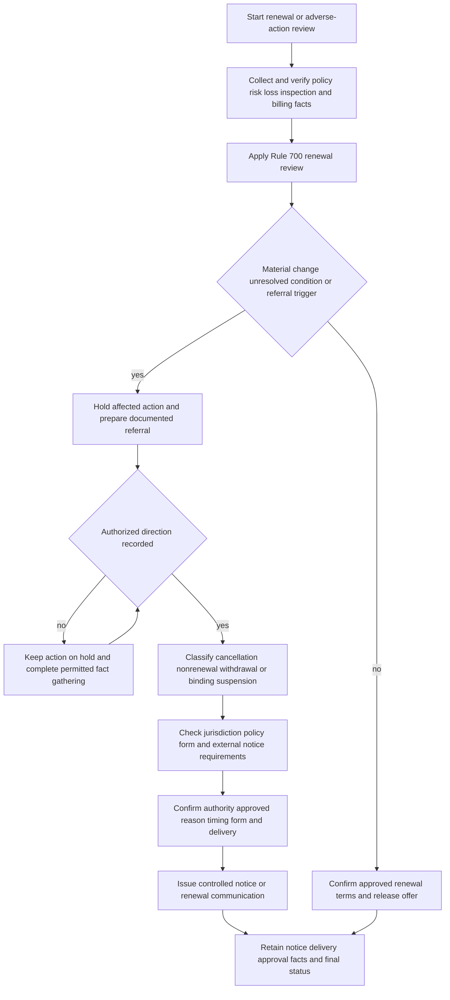

# Manual Renewal, Cancellation, and Nonrenewal Procedures

## Scope and authority boundary

This page groups **Personal Lines Underwriting Manual Rule 700 — Renewal Underwriting** and **Rule 800 — Cancellation and Nonrenewal Procedures**. They are internal carrier procedures for risk review, referral, authority, notice preparation, and file control. They are not policy conditions, coverage terms, or regulator mandates. The issued policy, declarations, endorsements, and applicable state requirements control coverage and legal notice obligations; the manual controls the carrier's internal work sequence and approval discipline ([Manual Rules 100.A–100.D](repo://manuals/underwriting/manual.md#L13-L37), [Referral Matrix H.0.1–H.0.6](repo://guidelines/authority/referral-matrix.md#L13-L25)).

Use this page with [Manual Inspections and Documentation Standards](/openwiki/underwriting/manual/inspection-and-records.md) for evidence quality and records, [Manual Binding Authority, Referrals, and Unclearable Conditions](/openwiki/underwriting/manual/authority-referrals-and-clearance.md) for delegated authority and no-clearance conditions, and [Underwriting Referral and Authority Guidance](/openwiki/underwriting/guidelines/referral-authority.md) for the referral package. A referral is a request for direction, not an automatic decline, approval, cancellation, or nonrenewal; silence or informal discussion is not approval ([Referral Matrix H.0.5–H.0.11 and H.0.16–H.0.19](repo://guidelines/authority/referral-matrix.md#L23-L35)).

## Control flow

*This flow shows the internal Rule 700/800 control path; it does not determine coverage or replace state notice law or the attached policy form.*

## Rule 700: renewal review

Rule 700 requires a review of **every renewal file** for changes affecting eligibility, exposure, valuation, occupancy, or loss potential. Resolve material discrepancies before releasing terms and address unresolved underwriting conditions rather than allowing an automatic renewal to bypass review ([Rule 700.A–700.C](repo://manuals/underwriting/manual.md#L9129-L9147)). The reviewer should work from verified facts and record the source and verification date, not rely on an unconfirmed verbal report ([Rule 700.B](repo://manuals/underwriting/manual.md#L9137-L9141), [Rule 700.BD–700.BF](repo://manuals/underwriting/manual.md#L9461-L9477)).

### Minimum renewal checklist

Review and document the following areas, referring material or unclear issues:

- **Identity and policy data:** named insureds, mailing and risk addresses, contact information, mortgagees, lienholders, additional interests, ownership, trust or estate status, and legal responsibility. Correct known errors and resolve conflicting identity or interest information before renewal ([Rule 700.B and 700.Z–700.AC](repo://manuals/underwriting/manual.md#L9137-L9141), [repo://manuals/underwriting/manual.md#L9281-L9303)).
- **Losses and claims:** review current-term loss activity and cause, severity, recurrence, corrective action, open claims, recovery or litigation developments, and known circumstances that may lead to a claim. A renewal risk with **2 paid property claims** requires underwriting referral under Rule 700.D; the count is an internal referral threshold, not a policy limit or universal legal rule ([Rule 700.D–700.E](repo://manuals/underwriting/manual.md#L9149-L9159), [Rule 700.AZ–700.BB](repo://manuals/underwriting/manual.md#L9437-L9453)).
- **Repair and property condition:** verify completion of prior-loss repairs, roof and exterior condition, water intrusion or repeated leakage, plumbing, heating, electrical and mechanical systems, maintenance, environmental conditions, and any catastrophe damage. Unrepaired roof damage, exterior deterioration, water intrusion, repeated water damage, or unsafe systems require referral and sufficient evidence before a disposition ([Rule 700.F and 700.M–700.P](repo://manuals/underwriting/manual.md#L9161-L9165), [repo://manuals/underwriting/manual.md#L9203-L9225)).
- **Inspection and visual evidence:** review prior inspection findings and relevant photographs. Under Rule 700.R, an inspection report remains valid for **12 months**; obtain updated information when it is older or conditions may have changed. Conflicting inspection, application, claim, policy, third-party, or other reliable information must be resolved before finalizing terms ([Rule 700.Q–700.T](repo://manuals/underwriting/manual.md#L9227-L9243)). This is an internal Rule 700 evidence-validity control, not a promise that an inspection establishes safety, eligibility, or coverage.
- **Occupancy and use:** confirm required owner occupancy and investigate vacancy, unoccupancy, tenant use, business activity, room or short-term rental, hosted rental, public access, or other changed household activity. These conditions can change property and liability exposure and require referral when outside filed eligibility or carrier appetite ([Rule 700.G–700.I](repo://manuals/underwriting/manual.md#L9167-L9183), [Rule 700.AD–700.AE](repo://manuals/underwriting/manual.md#L9305-L9315)).
- **Construction, valuation, and protection:** review renovations, additions, demolition, replacement-cost support, protective devices, fire protection, emergency access, geographic hazards, drainage, foundation or earth movement, attractive nuisances, animals, and recreational exposures. Remove unsupported credits and refer values, devices, or conditions that cannot be verified ([Rule 700.J–700.L and 700.AH–700.AO](repo://manuals/underwriting/manual.md#L9185-L9201), [repo://manuals/underwriting/manual.md#L9329-L9375)).
- **Information integrity and prior decisions:** review prior exceptions, cancellation or nonrenewal history, payment history where relevant, fraud or misrepresentation indicators, returned correspondence, and material information that remains unavailable. Do not assume favorable facts to complete an incomplete file ([Rule 700.V–700.Y and 700.AQ–700.AT](repo://manuals/underwriting/manual.md#L9257-L9279), [repo://manuals/underwriting/manual.md#L9383-L9405)).

A renewal may proceed within authority only when the record supports eligibility and the terms match the approved underwriting disposition. An exception must have current, recorded approval; a prior exception is not automatically reusable ([Rule 700.V and 700.BG–700.BI](repo://manuals/underwriting/manual.md#L9257-L9261), [repo://manuals/underwriting/manual.md#L9479-L9495)).

### Roof-specific separation

Roof age, roof condition, inspection evidence, contract settlement, and claim handling are related but distinct questions. Do not turn a roof-age underwriting referral into a coverage denial or assume that a policy's actual-cash-value roof schedule establishes renewal ineligibility. Florida's OIR-2023-04 requires reliable age and condition information, a specific process for older roofs, and a specific roof-related nonrenewal notice; it also requires claims to be investigated independently of roof age ([Florida State Overlay](repo://openwiki/state-overlays/florida.md#L165-L180), [OIR-2023-04 B.2.1–B.3.29](repo://bulletins/FL/oir-2023-04-roof-age-nonrenewal.md#L59-L219)). Apply the policy edition and state overlay applicable to the policy rather than blending a manual threshold with a form settlement provision.

## Referral and approval mechanics

Refer before completing the affected renewal or adverse action when a Rule 700 trigger is present, facts conflict, information is unavailable, or the proposed terms exceed assigned authority. The referral package should identify the requested decision, Rule 700 or Rule 800 trigger, policy status, verified facts and sources, loss and repair evidence, inspection material, conflicts, proposed reason, and requested authority. Preserve the response, approver, exact terms, conditions, and final disposition ([Rule 700.A, 700.W, and 700.BH–700.BI](repo://manuals/underwriting/manual.md#L9131-L9135), [repo://manuals/underwriting/manual.md#L9263-L9267), [repo://manuals/underwriting/manual.md#L9485-L9495), [Rule 800.C–800.D](repo://manuals/underwriting/manual.md#L9511-L9521)).

While approval is pending, hold the action that requires authority and describe it as pending internal review. Do not issue a renewal offer, cancellation, or nonrenewal notice merely because a referral was submitted. If facts or terms change after approval, obtain renewed direction; do not infer approval from silence or reuse approval from another policy ([Referral Matrix H.7.8 and H.7.12–H.7.24](repo://guidelines/authority/referral-matrix.md#L718-L767)).

## Rule 800: adverse-action workflow

Rule 800 begins by classifying the proposed transaction as **cancellation, nonrenewal, withdrawal, or binding suspension**. Verify policy status and confirm that no prior action controls the result. Then confirm that the underwriting basis is supportable, use verified policy, billing, inspection, claim, and applicant information, and obtain the required internal approval before notice preparation ([Rule 800.A–800.D](repo://manuals/underwriting/manual.md#L9497-L9521)).

The classification matters:

- **Cancellation** ends an active policy before its stated expiration and needs a cancellation process.
- **Nonrenewal** is a decision not to continue at expiration and needs a nonrenewal process.
- **Withdrawal** or rescission of a pending offer or issued notice needs the appropriate authorized handling; it is not a substitute label for cancellation or nonrenewal.
- **Binding suspension** is an internal control on new business, increases, or location additions, including catastrophe controls; it is not an adverse termination of an existing policy ([Rule 800.A and 800.I–800.L](repo://manuals/underwriting/manual.md#L9499-L9503), [repo://manuals/underwriting/manual.md#L9547-L9569)).

Before release, Rule 800 requires the operator to use the approved reason description, identify the policy and insured, validate the address and jurisdiction, use an approved delivery channel, and hold the action if required facts or approval are missing ([Rule 800.P–800.S and 800.AQ–800.AR](repo://manuals/underwriting/manual.md#L9589-L9611), [repo://manuals/underwriting/manual.md#L9751-L9761)). Do not use cancellation correspondence as a substitute for renewal review, and block renewal output while a pending nonrenewal is unresolved ([Rule 700.AU](repo://manuals/underwriting/manual.md#L9407-L9411), [Rule 800.N–800.O](repo://manuals/underwriting/manual.md#L9577-L9587)).

### Internal timing versus legal notice timing

Rule 800 contains internal timing instructions, including a **10-day** premium-default notice and a **45-day** notice of intent not to renew ([Rule 800.E and 800.G](repo://manuals/underwriting/manual.md#L9523-L9539)). These are internal workflow controls and must never be presented as the applicable legal notice periods. Before issuance, calculate the controlling deadline from the policy form, policy-effective position, jurisdiction, action type, and current regulator requirements. If the external requirement is longer or different, use the controlling external requirement and keep the Rule 800 task as an internal control. Do not shorten a legally required period to meet the manual's internal number.

### State-specific legal notice checks

Use the linked state-overlay page and the cited regulator or policy source for legal notice obligations; do not infer them from Rule 800.

- **New York:** for the current DFS-2016-02 position represented in this repository, nonrenewal requires at least **60 days** before expiration, cancellation for a reason other than nonpayment requires at least **20 days**, and nonpayment cancellation requires at least **15 days**. The notice must identify the action, policy, coverage and effective date, and give a specific and accurate reason; claims-based action requires relevant and verified claims information ([New York State Overlay](repo://openwiki/state-overlays/new-york.md#L64-L87), [DFS-2016-02 B.3.1–B.4.14](repo://bulletins/NY/dfs-2016-02-nonrenewal.md#L145-L251), [HO 01 31 2016-04 T.4–T.6](repo://forms/HO/NY/HO-01-31/2016-04.md#L329-L341)). Select the applicable historical position rather than blending the superseded 2010 rule with the current one.
- **Florida:** the applicable form edition and regulatory overlay must both be checked. The Florida HO 01 09 2023-07 form states **10 days** for nonpayment cancellation, **45 days** for another permitted cancellation, and **135 days** for nonrenewal ([Florida State Overlay](repo://openwiki/state-overlays/florida.md#L99-L117), [HO 01 09 2023-07 T.4–T.6](repo://forms/HO/FL/HO-01-09/2023-07.md#L285-L297)). A roof-age or roof-condition nonrenewal under OIR-2023-04 requires at least **120 days** and specific roof-related content; use the bulletin's requirement for that regulatory action and retain its supporting evidence ([OIR-2023-04 B.3.16–B.3.38](repo://bulletins/FL/oir-2023-04-roof-age-nonrenewal.md#L193-L237)). Do not collapse the form's general nonrenewal term and the bulletin's roof-related requirement into a single universal number; confirm the policy, action, and applicable law.

### Notice correction, withdrawal, and delivery controls

Before sending, compare the notice with the approved reason, policy status, named insured, effective date, jurisdiction, and supporting file. Retain the notice image, form version, completed fields, delivery channel, mailing or transmission record, returned-mail handling, approval, and correction history. Rule 800 requires prompt review of returned mail, authorized rescission or withdrawal, nonconflicting replacement notices, and referral of disputed or allegedly inaccurate reasons ([Rule 800.T–800.X](repo://manuals/underwriting/manual.md#L9613-L9641)). A third-party producer, administrator, or vendor may assist with preparation or delivery, but does not assume the carrier's responsibility for correct classification, content, authority, or records ([New York DFS-2016-02 B.1.6–B.1.10](repo://bulletins/NY/dfs-2016-02-nonrenewal.md#L23-L33)).

Claims-based reasons require additional care: distinguish an actual, evaluated claim from an inquiry or unconfirmed report; verify paid status, attribution, cause, and relevance; investigate disputes; and correct the underwriting record or withdraw the action when the reason is unsupported. Rule 800 requires claim relevance review, while New York DFS-2016-02 states the external claims-information controls ([Rule 800.AG](repo://manuals/underwriting/manual.md#L9691-L9695), [DFS-2016-02 B.4.1–B.4.14](repo://bulletins/NY/dfs-2016-02-nonrenewal.md#L223-L251)).

## File standard and failure checks

The file should allow a later reviewer to reconstruct what was known, when it was known, where it came from, what conflicted, who approved the action, what notice was used, and what final status resulted. Retain:

- renewal facts, loss and claim records, repair and mitigation evidence, inspection date and validity review, photographs, occupancy and use information, ownership and interest data, valuation support, and unresolved conditions;
- the referral trigger, requested decision, evidence supplied, authority response, approver, conditions, exception or restriction, and final renewal disposition;
- action classification, policy status, verified reason, applicable jurisdiction and policy edition, legal timing analysis, approved form and reason language, notice image, delivery evidence, returned-mail or correction handling, and final policy status ([Rule 700.BI](repo://manuals/underwriting/manual.md#L9491-L9495), [Rule 800.AM–800.AO](repo://manuals/underwriting/manual.md#L9727-L9743), [Rule 610.AF–610.BB](repo://manuals/underwriting/manual.md#L8991-L9127)).

Failure checks:

- **Wrong action type:** a cancellation before expiration is processed as nonrenewal, or a binding suspension is described as termination. Reclassify before timing or notice generation ([Rule 800.A](repo://manuals/underwriting/manual.md#L9499-L9503)).
- **Unverified adverse fact:** an inquiry, disputed claim, stale inspection, returned address, or unconfirmed occupancy statement is treated as established. Hold, verify, and record the conflict ([Rule 700.S, 700.W, and 700.BD](repo://manuals/underwriting/manual.md#L9239-L9243), [repo://manuals/underwriting/manual.md#L9263-L9267), [repo://manuals/underwriting/manual.md#L9461-L9465)).
- **Internal rule presented as law:** Rule 800's 10-day or 45-day task instruction is placed in customer-facing material without checking state law, regulator guidance, or the policy form ([Rule 800.E and 800.G](repo://manuals/underwriting/manual.md#L9523-L9539)).
- **Roof and claim conflation:** roof age or a nonrenewal decision is used to deny, limit, or delay a claim. Apply the policy in force at loss and investigate the claim independently ([OIR-2023-04 B.4.1–B.4.27](repo://bulletins/FL/oir-2023-04-roof-age-nonrenewal.md#L239-L293)).
- **Notice mismatch:** the approved reason, action, policy identifier, effective date, delivery evidence, or final status is missing or inconsistent. Hold issuance or refer the discrepancy under Rule 800 ([Rule 800.P–800.AR](repo://manuals/underwriting/manual.md#L9589-L9611), [repo://manuals/underwriting/manual.md#L9751-L9761)).
- **Unauthorized continuation or rescission:** renewal output is released while nonrenewal is pending, or an issued notice is withdrawn without approval. Block the conflicting transaction and record authorized direction ([Rule 800.N–800.O and 800.U–800.V](repo://manuals/underwriting/manual.md#L9577-L9587), [repo://manuals/underwriting/manual.md#L9619-L9629)).

## Related pages

- [Florida State Overlay](/openwiki/state-overlays/florida.md) — Florida form editions, OIR roof rules, and contract/regulatory/internal boundaries.
- [New York State Overlay](/openwiki/state-overlays/new-york.md) — New York HO 01 31 and DFS notice positions.
- [Underwriting Referral and Authority Guidance](/openwiki/underwriting/guidelines/referral-authority.md) — referral lifecycle and approval controls.
- [Manual Binding Authority, Referrals, and Unclearable Conditions](/openwiki/underwriting/manual/authority-referrals-and-clearance.md) — delegated authority, mandatory referral, and no-clearance conditions.
- [Manual Inspections and Documentation Standards](/openwiki/underwriting/manual/inspection-and-records.md) — evidence currency, inspection review, and audit-ready records.
