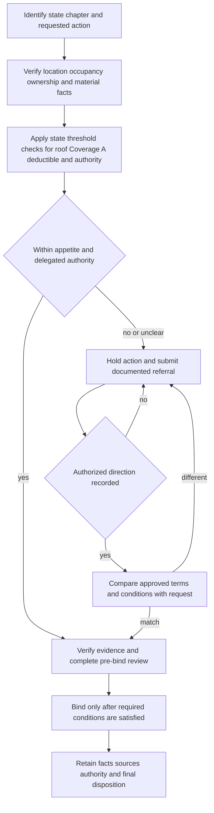

# Manual State Exception Controls

## Scope and authority boundary

Rules **500–570** are internal carrier direction for eight state-exception chapters. They control pre-bind risk selection, delegated authority, referral, exception handling, and file documentation; they are not policy terms, coverage grants, amendatory forms, or regulator bulletins. Apply them within delegated authority and before binding, and do not give the Manual’s language to an applicant or insured ([Manual Rules 100.A–100.G](repo://manuals/underwriting/manual.md#L13-L55), [100.V–100.Z](repo://manuals/underwriting/manual.md#L141-L169)).

The controls below answer **whether and how the carrier may accept, refer, or decline a risk**. They do not answer whether a later loss is covered, what a state form changes, or what a regulator requires for disclosure, notice, filing, or claims. Keep the state overlays, regulator bulletins, and amendatory forms as separate authorities and use the related pages for those questions:

- [Florida State Overlay](/openwiki/state-overlays/florida.md)
- [Texas State Overlay](/openwiki/state-overlays/texas.md) and [Texas Homeowners Appetite Guidance](/openwiki/underwriting/guidelines/texas-appetite.md)
- [California State Overlay](/openwiki/state-overlays/california.md)
- [New York State Overlay](/openwiki/state-overlays/new-york.md)
- [Louisiana State Overlay](/openwiki/state-overlays/louisiana.md)
- [North Carolina State Overlay](/openwiki/state-overlays/north-carolina.md)
- [Colorado State Overlay](/openwiki/state-overlays/colorado.md)
- [Illinois State Overlay](/openwiki/state-overlays/illinois.md)

Where a state chapter points to the state-exception pages of the rating manual, that reference is an internal support condition for applying a credit; it is not a regulator bulletin or policy endorsement. For example, Rule 500.AR and Rule 510.16–510.18 require supported credit handling and referral of disputed credits ([500.AR](repo://manuals/underwriting/manual.md#L6171-L6177), [510.16–510.18](repo://manuals/underwriting/manual.md#L6319-L6335)).

## Common control flow

*This flow shows the internal state-exception path; it does not decide coverage or replace the attached policy, form, or bulletin.*

A referral is a request for authorized direction, not automatic approval. Do not bind while a required referral or condition is unresolved, do not infer approval from silence or informal discussion, and record the trigger, evidence, requested action, response, approver, conditions, and final disposition ([Manual Rules 100.W–100.Y](repo://manuals/underwriting/manual.md#L147-L163), [Rule 100.V](repo://manuals/underwriting/manual.md#L141-L145)). A state-specific “decline” threshold is likewise an internal underwriting outcome; it must not be described as a coverage exclusion or regulatory requirement.

## Threshold summary

| Chapter | Internal thresholds and authority gates | High-value referral or decline triggers |
|---|---|---|
| **500 — Florida** | Coverage A **$200,000 minimum** and **$900,000 maximum**; line authority through **$600,000**; senior authority through **$900,000**; roof inspection at **15 years or older**; roof age **20 years or older is decline**. | Unverified location, roof or systems, unrepaired or repeated water or fire damage, adverse weather history, vacancy or income-producing use, unverified safeguards, and material discrepancies. |
| **510 — Texas** | Line authority through **$800,000 Coverage A**; senior referral through **$1,200,000**; above **$1,200,000 decline or refer**; water backup above **$25,000**; roof inspection at **15 years or older**; seacoast maximum windstorm deductible when required. | Conflicting address, ownership, occupancy, roof, loss, protective-device, or system information; unresolved repairs; seacoast catastrophe exposure; incomplete information or exception requests. |
| **520 — California** | Line-underwriter authority ceiling **$1,000,000**; Coverage A ceiling **$2,000,000**; replacement-cost settlement eligibility requires the internal insured-to-value review to support **100%**; quake deductible changes require authorized direction. | Deferred maintenance, unrepaired roof or fire damage, brush or combustible vegetation, wildfire indicators, open claims, nontraditional occupancy, construction, site instability, and material changes. |
| **530 — New York** | Bind Coverage A through **$750,000**; **3 paid property claims** require referral; supported state-exception credits only. | Unresolved damage, vacancy, lodging, business or agricultural use, unsafe premises or systems, animal or recreational hazards, tenant or shared occupancy, and unexplained ownership or address conflicts. |
| **540 — Louisiana** | Roof age **20 years or older is decline**; line authority through **$500,000**; Coverage A ceiling **$750,000**; maximum windstorm-and-hail deductible must be available; internal named-storm-window referrals apply. | Missing or conflicting roof information, visible deterioration, active water intrusion, unrepaired losses, vacancy or nonpersonal use, unsafe premises, and coastal or drainage concerns. |
| **550 — North Carolina** | Coverage A above **$700,000** requires authority review; roof inspection at **18 years or older**; requests exceeding the seacoast deductible ceiling and changes to the fungi-and-bacteria aggregate require referral. | Ownership, occupancy, rental, care, business, construction, structural, loss, coastal, drainage, hazard-material, protection, inspection, valuation, and material-information concerns. |
| **560 — Colorado** | Roof inspection at **12 years or older**; roof age **22 years or older is decline**; Coverage A above **$850,000** requires appropriate authority; wind deductible ceiling applies. | Wildfire, vegetation, access, fire-protection, winterization, water, vacancy, construction, earth movement, hail or wind damage, solar or storage equipment, and unresolved evidence. |
| **570 — Illinois** | Coverage A above **$700,000** requires review; water backup above **$15,000** requires referral; sewer-backup limit must fit the described premises; material information that cannot be verified is decline. | Water, roof, systems, loss, occupancy, business, security, inspection, consumer-reporting, protected-class, exception, ownership, valuation, hazardous-storage, and litigation concerns. |

The table is a retrieval aid, not a universal rule. The chapter text and current delegated authority control when thresholds overlap or a risk presents more than one trigger.

## Rule 500 — Florida State Exceptions

### Eligibility, roof, and property condition

Florida risks require reliable location, construction, occupancy, and protection information. Before binding, verify the location and refer incomplete or conflicting eligibility information. A roof inspection is required at **15 years or older**; roof age at **20 years or older** is an internal decline point that cannot be overridden through discretionary pricing. Visible deterioration, missing materials, patching, unresolved leakage, staining, moisture damage, unsupported roof statements, active construction, incomplete repairs, and repeated water loss require referral or further evidence ([500.A–500.B](repo://manuals/underwriting/manual.md#L5827-L5841), [500.C–500.E](repo://manuals/underwriting/manual.md#L5843-L5865), [500.G–500.H](repo://manuals/underwriting/manual.md#L5875-L5889)).

The internal Coverage A range is **$200,000 through $900,000**. The line underwriter may bind only through **$600,000**; a senior underwriter may bind through **$900,000**. Unusual architecture, custom construction, specialized materials, unsupported valuation, unverified protective devices, and unresolved electrical, plumbing, heating, or cooling concerns require referral ([500.J–500.M](repo://manuals/underwriting/manual.md#L5899-L5929), [500.N–500.P](repo://manuals/underwriting/manual.md#L5931-L5953)).

### Referral triggers and deductible control

Refer repeated water loss, prior fire or premises-liability loss, vacant, seasonal, unoccupied, or irregular occupancy, rental or short-term lodging, business use, material animal or recreational exposure, pools and similar water features, sinkhole or ground movement, weather loss, and conflicting application, inspection, loss, or public-record information. Florida also requires referral for prior cancellation or nonrenewal, ownership arrangements involving trusts, estates, or entities, open claims, deferred maintenance, unsafe access, detached structures, unusual personal-property exposure, environmental or moisture concerns, and adverse inspection findings ([500.Q–500.U](repo://manuals/underwriting/manual.md#L5955-L5993), [500.W–500.Z](repo://manuals/underwriting/manual.md#L6003-L6033), [500.AA–500.AB](repo://manuals/underwriting/manual.md#L6035-L6049), [500.AD–500.AJ](repo://manuals/underwriting/manual.md#L6059-L6113), [500.AK–500.AL](repo://manuals/underwriting/manual.md#L6115-L6129), [500.AO–500.AP](repo://manuals/underwriting/manual.md#L6147-L6161)).

Apply the maximum named-storm deductible when the accepted risk profile requires it and refer conflicting requests. Apply a state-exception credit only when the rating-manual support is present. Requests for exceptions from Florida eligibility requirements require appropriate authority; the file must retain the final action and material evidence for accepted, declined, and referred risks ([500.AC–500.AD](repo://manuals/underwriting/manual.md#L6051-L6065), [500.AR–500.AS](repo://manuals/underwriting/manual.md#L6171-L6185), [500.AT–500.AX](repo://manuals/underwriting/manual.md#L6187-L6225)). The Florida Overlay remains the cross-linked place for OIR bulletins and HO or DP amendatory forms; those authorities must not be merged into Rule 500.

## Rule 510 — Texas State Exceptions

### Eligibility and authority

Verify the Texas risk address before quoting or binding, confirm insurable interest, match the occupancy description to actual use, and refer conflicting ownership, occupancy, mailing-address, or property-description information. Undisclosed commercial activity, unreviewed incidental business use, vacancy, unoccupancy, or seasonal use requires referral ([510.6–510.10](repo://manuals/underwriting/manual.md#L6259-L6287), [510.11–510.15](repo://manuals/underwriting/manual.md#L6289-L6317)).

A line underwriter may bind Coverage A only through **$800,000**. Requests above line authority and at or below **$1,200,000** go to a senior underwriter; requests above **$1,200,000** are declined or referred. A water-backup limit above **$25,000** requires referral before binding ([510.1–510.4](repo://manuals/underwriting/manual.md#L6229-L6251)). These are internal authority and escalation thresholds; the Texas appetite page and attached policy form may impose separate eligibility or contractual limits.

### Roof, systems, losses, and catastrophe handling

Obtain a roof inspection before binding at **15 years or older**. Verify roof material, condition, and visible defects; refer damage, active leakage, temporary repair, unresolved roof concerns, material deterioration, and any required repair that lacks completion evidence. Verify prior water damage and refer repeated water damage, unresolved moisture or mold, plumbing deterioration, active leaks, discrepancies in disclosed losses, open claims, and unresolved prior losses ([510.5](repo://manuals/underwriting/manual.md#L6253-L6257), [510.19–510.30](repo://manuals/underwriting/manual.md#L6337-L6407)).

Protective devices, electrical service, heating equipment, pools, spas, trampolines, animals, detached structures, renovation, reconstruction, emergency access, and seacoast windstorm exposure must be accurately described and verified. Refer disabled or unreliable safeguards, unsafe wiring or heating, unresolved recreational or animal hazards, undisclosed detached-structure use, restricted emergency access, unusual seacoast exposure, prior unrepaired windstorm damage, unsupported deductible selections, and requests for exceptions to standard deductible treatment ([510.31–510.37](repo://manuals/underwriting/manual.md#L6409-L6449), [510.38–510.39](repo://manuals/underwriting/manual.md#L6451-L6459), [510.49–510.53](repo://manuals/underwriting/manual.md#L6505-L6545)). Complete review early enough to meet the accept-or-deny deadline; do not bind an ineligible risk, and retain all approval, verification, and exception support before binding or declining ([510.54–510.58](repo://manuals/underwriting/manual.md#L6547-L6575)).

Apply Texas rating credits only when required risk information and the rating-manual state-exception support are present. Remove unsupported credits and refer disputed retention requests ([510.16–510.18](repo://manuals/underwriting/manual.md#L6319-L6335)). The Texas Overlay remains the cross-linked authority for HO 01 45, DP 01 45, and Texas windstorm or prompt-payment bulletins; Rule 510 does not alter those contract or regulatory terms.

## Rule 520 — California State Exceptions

### Eligibility, valuation, and authority

Bind California risks only within delegated authority. The line-underwriter ceiling is **$1,000,000**, while Coverage A above **$2,000,000** must not be issued and requires referral. Replacement-cost settlement eligibility is an internal control: the insured-to-value review must support **100%**. Verify the California address, review dwelling condition, and refer material deferred maintenance, unreliable valuation, and unusual construction or specialty materials ([520.A–520.E](repo://manuals/underwriting/manual.md#L6579-L6607), [520.A–520.C](repo://manuals/underwriting/manual.md#L6579-L6595), [520.AK–520.AL](repo://manuals/underwriting/manual.md#L6795-L6805)).

### Roof, wildfire, and referral controls

Refer unrepaired roof damage, prior fire damage without verified completion, open water or liability claims, transient or nontraditional occupancy, pending construction or major renovation, unsafe electrical, plumbing, heating, or roofing systems, foundation, slope, retaining-wall or soil concerns, recurring ponding, seepage, or erosion, unresolved water-feature or recreational hazards, material animal or business exposures, vacancy or uncertain maintenance, and incomplete or inoperative safeguards ([520.F–520.I](repo://manuals/underwriting/manual.md#L6609-L6631), [520.J–520.Q](repo://manuals/underwriting/manual.md#L6633-L6679), [520.R–520.Y](repo://manuals/underwriting/manual.md#L6681-L6727)). Review brush, vegetation, combustible debris, wildfire indicators, access limitations, adjacent damaged or poorly maintained property, and unsupported mitigation. Material discrepancies among application, photographs, inspection, loss, valuation, or public information require resolution rather than assumption ([520.G](repo://manuals/underwriting/manual.md#L6615-L6619), [520.AA–520.AB](repo://manuals/underwriting/manual.md#L6735-L6745), [520.AE–520.AJ](repo://manuals/underwriting/manual.md#L6759-L6793), [520.AK–520.AQ](repo://manuals/underwriting/manual.md#L6795-L6835)).

Do not alter, waive, or negotiate the quake deductible without authorized underwriting direction. Apply a state-exception credit only after applicable conditions are confirmed. A material change before binding or after issuance requires renewed eligibility review, and every referral, exception, and adverse decision must retain facts, sources, analysis, and authority action ([520.AB–520.AJ](repo://manuals/underwriting/manual.md#L6741-L6793), [520.AR–520.AT](repo://manuals/underwriting/manual.md#L6837-L6853)). Use the California Overlay for CDI earthquake-offer bulletins and HO 01 04 or HO 04 54 contract assembly; Rule 520 remains the internal operational gate.

## Rule 530 — New York State Exceptions

### Authority and claim-history threshold

Bind Coverage A through **$750,000** and refer higher requests. A risk with **three paid property claims** must be referred and cannot be cleared without underwriting direction. Apply state-exception credits only after eligibility is confirmed, and remove unsupported credits ([530.A–530.C](repo://manuals/underwriting/manual.md#L6857-L6873)).

### Eligibility and referral controls

Refer unresolved property damage, vacancy or intermittent occupancy, short-term lodging, business activity, commercial indicators, business-use detached structures, agricultural activity, livestock, animal bite or restricted-animal history, pools without visible controls, diving boards, slides, trampolines, unfenced water features, recreational vehicles, unregistered vehicles, neglected grounds, unrepaired roof damage, exterior deterioration, unsafe stairs, porches, decks, railings, unsecured openings, water intrusion, unverified plumbing repairs, electrical or heating hazards, solid-fuel equipment, fuel storage, generators, inactive safeguards, fire-protection uncertainty, restricted access, waterfront or erosion conditions, retaining-wall distress, foundation movement, structural alteration, renovation, stored construction materials, and contractor activity ([530.D–530.G](repo://manuals/underwriting/manual.md#L6875-L6897), [530.U–530.AA](repo://manuals/underwriting/manual.md#L6977-L7017), [530.AU–530.BB](repo://manuals/underwriting/manual.md#L7133-L7179)).

Tenant occupancy, room rental, shared occupancy, disputed ownership, trust or estate ownership, occupants outside the named household, inconsistent mailing and premises information, and conflicts across carrier records also require referral. Handle an intent-not-to-renew notice only after underwriting direction is recorded; route nonpayment through the approved servicing process ([530.AU–530.BB](repo://manuals/underwriting/manual.md#L7133-L7179), [530.BC](repo://manuals/underwriting/manual.md#L7181-L7185)). The New York Overlay remains the separate authority for DFS cancellation, nonrenewal, and data-call requirements and for HO 01 31 contract terms.

## Rule 540 — Louisiana State Exceptions

### Roof, Coverage A, and authority

Decline a Louisiana risk with roof age **20 years or older**. Bind Coverage A only within line-underwriter authority of **$500,000**, and do not write Coverage A above the **$750,000** internal ceiling. Refer missing or conflicting roof age, visible deterioration affecting weather resistance, incomplete repairs, repeated patching, unidentified roof material, wind-susceptible geometry, attached-structure roof deterioration, active water intrusion, and prior water damage without repair support ([540.A–540.C](repo://manuals/underwriting/manual.md#L7189-L7205), [540.D–540.L](repo://manuals/underwriting/manual.md#L7207-L7259)).

### Eligibility, deductible, and referral controls

Refer foundation movement, exterior or opening damage, chimney deterioration, vacancy, seasonal or intermittent occupancy, tenant occupancy that does not fit the policy type, business or short-term rental use, commercial vehicles, elevated recreational hazards, trampolines, diving boards or slides, unsecured or unfenced pools, elevated animal exposure, prior fire, wind, hail, water, liability, or repeated losses, open claims, incomplete claims, undisclosed losses, inspection discrepancies, unsafe electrical or heating equipment, fuel storage, plumbing leaks, damaged drainage, flood or surface-water history, and backwater-valve concerns ([540.M–540.N](repo://manuals/underwriting/manual.md#L7261-L7271), [540.W–540.AA](repo://manuals/underwriting/manual.md#L7321-L7349), [540.AK–540.AN](repo://manuals/underwriting/manual.md#L7405-L7427), [540.AO–540.AS](repo://manuals/underwriting/manual.md#L7429-L7451), [540.AW–540.AZ](repo://manuals/underwriting/manual.md#L7471-L7499)).

Refer when the maximum windstorm-and-hail deductible percentage is unavailable, when the submission is outside the internal named-storm window, or when the requested treatment is an exception. Apply credits from the rating-manual state-exception pages only when the required information supports them. Retain final eligibility, authority, rating, and exception support for every Louisiana decision ([540.BA–540.BB](repo://manuals/underwriting/manual.md#L7501-L7511), [540.BC–540.BE](repo://manuals/underwriting/manual.md#L7513-L7529)). The Louisiana Overlay remains the separate source for LDI bulletins and HO 01 17 terms; Rule 540’s named-storm window is an internal submission-timing control, not a contractual storm period.

## Rule 550 — North Carolina State Exceptions

### Coverage A, roof, and core eligibility

Refer Coverage A above **$700,000** and do not bind pending authority review. Require a roof inspection before binding at **18 years or older**. Refer unresolved ownership or insurable interest, conflicting occupancy, business or care activity, unclear rental or short-term lodging, vacancy or unoccupancy, construction or major repair, unrepaired structural, water, fire, wind, hail, storm, foundation, sinkhole, earth-movement, or settlement concerns ([550.A–550.B](repo://manuals/underwriting/manual.md#L7533-L7539), [550.C–550.K](repo://manuals/underwriting/manual.md#L7541-L7575), [550.L–550.S](repo://manuals/underwriting/manual.md#L7577-L7607)).

### Referral, deductible, and exception controls

Refer detached structures used commercially or agriculturally, animals and restricted animals, premises liability allegations, reported criminal activity, misrepresentation, unsupported protective devices, conflicting fire-protection information, difficult emergency access, limited water-supply information, unexplained prior cancellation or nonrenewal, incomplete or inconsistent loss history, repeated water, prior fire, theft, vandalism, or weather loss, conflicting mortgagee and ownership information, and requests to change the fungi-and-bacteria aggregate ([550.T–550.AB](repo://manuals/underwriting/manual.md#L7609-L7643), [550.AC–550.AK](repo://manuals/underwriting/manual.md#L7645-L7683)).

Apply state-exception credits only when supporting conditions are verified. Refer a request that would exceed the seacoast deductible ceiling, coastal exposure that is not adequately described, flood or tidal-water history, unresolved drainage or sewer or sump discharge, plumbing, electrical, heating, solid-fuel, fuel-storage, water-feature, recreational, hazardous-material, contamination, access, boundary, unusual-construction, historic-property, or roof-repair concerns ([550.AL–550.AN](repo://manuals/underwriting/manual.md#L7681-L7695), [550.AO–550.AR](repo://manuals/underwriting/manual.md#L7697-L7711), [550.BI–550.BJ](repo://manuals/underwriting/manual.md#L7773-L7779)). Requests for exceptions require delegated authority; incomplete material information, unresolved conditions, material changes before binding, conflicting producer or inspection information, inadequate valuation, mismatched coverage, and nonstandard handling require referral. Maintain a clear record of facts, decision, and authority for every North Carolina exception action ([550.BK–550.BN](repo://manuals/underwriting/manual.md#L7781-L7795), [550.BO–550.BX](repo://manuals/underwriting/manual.md#L7797-L7835), [550.BY–550.CC](repo://manuals/underwriting/manual.md#L7837-L7855)). The North Carolina Overlay remains separate for HO 01 32, fungi disclosure, and claims bulletins.

## Rule 560 — Colorado State Exceptions

### Location, roof, and catastrophe eligibility

Confirm the Colorado location, occupancy, insurable interest, and prior loss information before binding. Require a roof inspection at **12 years or older**; decline at **22 years or older**; apply the roof-schedule trigger-age review; and refer visible deterioration, damage, leakage, elevated-weather-susceptibility material, and incomplete or temporary repair. Coverage A above **$850,000** requires appropriate authority, and a wind deductible above approved handling is referred ([560.A–560.D](repo://manuals/underwriting/manual.md#L7859-L7881), [560.E–560.J](repo://manuals/underwriting/manual.md#L7883-L7917), [560.AI–560.AJ](repo://manuals/underwriting/manual.md#L8063-L8073)).

Refer wildfire exposure, unmanaged vegetation, steep or unstable access, private-road or shared-drive responsibility, missing or conflicting fire-protection, hydrant or water-supply information, heating or freeze exposure, prior plumbing leakage or backup, vacancy, seasonal supervision, short-term rental, business use, heightened animal exposure, pools, spas, trampolines, solar equipment, energy storage, solid-fuel heating, unsafe electrical conditions, foundation or earth movement, and preventable claim patterns ([560.K–560.Q](repo://manuals/underwriting/manual.md#L7919-L7959), [560.R–560.W](repo://manuals/underwriting/manual.md#L7961-L7995), [560.X–560.AF](repo://manuals/underwriting/manual.md#L7997-L8049), [560.AK–560.AP](repo://manuals/underwriting/manual.md#L8075-L8109)).

Construction, unfinished or commercially used areas, detached-structure hazards, substantial stored personal property, debris, persistent moisture, burglary or vandalism history, unsupported alarms or protective devices, ownership transfer or dispute, complex ownership, unresolved inspection findings, photograph conflicts, incomplete application responses, material changes, and unusual characteristics require referral. A requested exception cannot bind without approved authority, and the Colorado file must retain facts, sources, conditions, authority, and final disposition ([560.AQ–560.AU](repo://manuals/underwriting/manual.md#L8111-L8139), [560.AV–560.AX](repo://manuals/underwriting/manual.md#L8141-L8157), [560.AY–560.BA](repo://manuals/underwriting/manual.md#L8159-L8175), [560.BB–560.BG](repo://manuals/underwriting/manual.md#L8177-L8211), [560.BH](repo://manuals/underwriting/manual.md#L8213-L8217)). Use the Colorado Overlay for DOI hail-deductible and roof-settlement bulletins and HO 01 05; Rule 560 is the internal pre-bind control.

## Rule 570 — Illinois State Exceptions

### Location, Coverage A, and water-backup limits

Refer incomplete Illinois location data, unverifiable ownership, and inconsistent occupancy information. Do not bind Coverage A above **$700,000** without review. Refer a requested water-backup limit above **$15,000**, and review the sewer-backup limit for consistency with the described premises ([570.A–570.C](repo://manuals/underwriting/manual.md#L8221-L8231), [570.D–570.F](repo://manuals/underwriting/manual.md#L8233-L8243)).

### Property, loss, and eligibility referrals

Refer unrepaired prior water damage, recurring water intrusion, deteriorated plumbing, deteriorated or unrepaired roofs and exteriors, unsafe electrical or heating systems, solid-fuel heating, prior fire or theft with unresolved security, liability loss with an ongoing hazard, conflicting loss information, material misrepresentation, vacant, unoccupied, or seasonal conditions, business, commercial traffic, delivery, short-term occupancy, undisclosed tenants, elevated animal or attractive-hazard exposure, slip or fall hazards, incomplete structural alteration or extensive renovation, construction affecting habitability, foundation movement, unrepaired storm damage, recurring surface water, poor drainage, unreliable sump systems, unclear sewer or drain loss, sewage, waste, mold, rot, persistent moisture, freezing loss, repeated weather loss, vandalism, and unsupported protective-device or fire-protection information ([570.G–570.J](repo://manuals/underwriting/manual.md#L8245-L8259), [570.U–570.AD](repo://manuals/underwriting/manual.md#L8301-L8339), [570.AH–570.AN](repo://manuals/underwriting/manual.md#L8353-L8379), [570.AS–570.AY](repo://manuals/underwriting/manual.md#L8397-L8423)).

Refer cancellation, nonrenewal, or coverage-refusal information that raises eligibility concerns; handle intent not to renew through approved Illinois underwriting controls; and do not use protected-class information in underwriting. Refer actions that may be inconsistent with similarly situated Illinois risks, consumer-reporting errors, requested exceptions without approval, terms inconsistent with the hazard, unreliable replacement-cost information, inadequately described property, unusual construction, hazardous-material or fuel-storage exposure, open or disputed claims, and premises litigation ([570.AZ–570.BE](repo://manuals/underwriting/manual.md#L8425-L8447), [570.BF–570.BM](repo://manuals/underwriting/manual.md#L8449-L8483), [570.BP–570.BQ](repo://manuals/underwriting/manual.md#L8489-L8495)). Decline material application information that cannot be verified, do not bind an exception without recorded approval, and maintain a complete Illinois file with material facts, rationale, and final disposition ([570.S–570.T](repo://manuals/underwriting/manual.md#L8293-L8299), [570.BA–570.BE](repo://manuals/underwriting/manual.md#L8429-L8447), [570.BF–570.BM](repo://manuals/underwriting/manual.md#L8449-L8483), [570.BN–570.BR](repo://manuals/underwriting/manual.md#L8481-L8499)). The Illinois Overlay remains the separate source for IDOI bulletins, HO 01 12, and water-backup disclosure and contract boundaries.

## Operational invariants and failure checks

1. **Thresholds are state-specific.** Do not substitute Florida’s roof or Coverage A thresholds for Colorado’s, or import a Texas water-backup referral amount into Illinois.
2. **Referral is not approval.** Hold the affected action, obtain recorded direction, compare the approved terms with the requested terms, and satisfy every condition before binding ([Manual Rules 100.X–100.Y](repo://manuals/underwriting/manual.md#L153-L163)).
3. **Internal controls are not coverage.** A roof-age inspection or decline point, deductible-selection rule, Coverage A authority ceiling, or state-exception credit condition does not decide a later claim or amend a form.
4. **Evidence must resolve material uncertainty.** Verify location, occupancy, ownership, roof, property condition, losses, valuation, protection, and requested terms; do not select a favorable interpretation merely to avoid referral ([Manual Rules 100.H–100.J](repo://manuals/underwriting/manual.md#L57-L73), [100.Q–100.R](repo://manuals/underwriting/manual.md#L111-L121)).
5. **Documentation is part of the control.** Record the source, facts, inspection or repair evidence, authority, referral response, conditions, credit support, and final acceptance, decline, or referral. A verbal or undocumented exception is not a completed control ([Manual Rules 100.V–100.Z](repo://manuals/underwriting/manual.md#L141-L169)).
6. **Keep external authorities separate.** Use each state overlay to select the applicable regulator bulletin and attached form edition. Where the manual’s internal rule and an external source use similar words or different thresholds, preserve both positions and label the operational effect instead of merging them.

## Related internal controls

- [Manual Binding Authority, Referrals, and Unclearable Conditions](/openwiki/underwriting/manual/authority-referrals-and-clearance.md) — general authority, hold, referral, and no-clearance controls.
- [Eligibility and Product Lines](/openwiki/underwriting/manual/eligibility-and-product-lines.md) — product eligibility before state-specific authority review.
- [Inspection and Records](/openwiki/underwriting/manual/inspection-and-records.md) — inspection evidence and file retention.
- [Endorsements and Deductibles](/openwiki/underwriting/manual/endorsements-and-deductibles.md) — internal deductible handling without collapsing contract terms.
