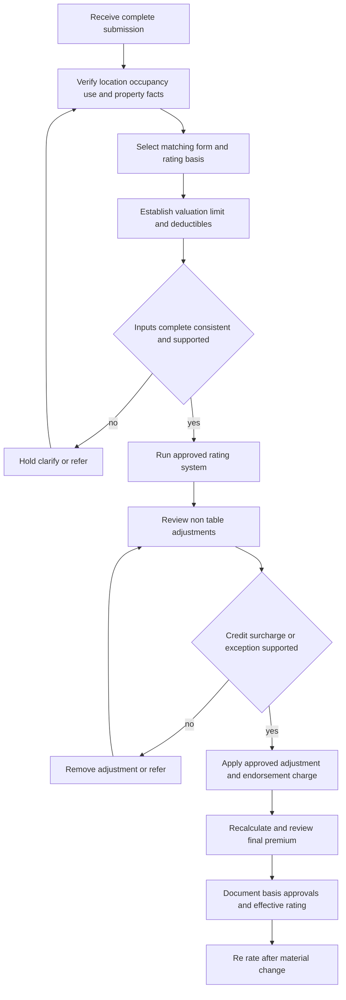

# Rating Inputs and Non-Table Adjustments

## Scope and governing boundary

This page describes the rating workflow and the non-table controls in the Homeowners and Dwelling Rating Manual. It intentionally does **not** reproduce territory, base-rate, factor, or endorsement-premium tables. Use the approved rating system for table lookups and retain the result in the rating file. [Rating Manual 1.A–1.D](repo://manuals/rating/manual.md#L15-L37)

Keep three decisions separate:

- **Rating:** classify the presented exposure, select the approved form and rating inputs, apply supported factors or adjustments, and calculate the premium.
- **Underwriting:** decide whether the risk is acceptable, within delegated authority, or must be held or referred. The Personal Lines Underwriting Manual is internal carrier direction; it cannot be used to change coverage. [Underwriting Manual 100.A–100.F](repo://manuals/underwriting/manual.md#L15-L49)
- **Contract:** the issued form, Declarations, attached endorsements, and applicable state amendatory wording determine the policy’s coverage, limits, exclusions, and contractual deductibles. A rating choice must produce an assembled policy that matches the selected form; it does not create coverage. [HO-3 2024-03 agreement](repo://forms/HO/MS/HO-3/2024-03.md#L13-L39) [DP-3 2026-01 agreement](repo://forms/DP/MS/DP-3/2026-01.md#L13-L39)

A rating exception is not a coverage interpretation. If a requested input is unsupported, unavailable in the system, inconsistent with the package, or outside authority, hold the rating and refer it. Do not make an informal override to reach a preferred premium. [Rating Manual 1.AI–1.AK](repo://manuals/rating/manual.md#L219-L235) [Underwriting Manual 100.M–100.P](repo://manuals/underwriting/manual.md#L87-L109)

## Rating control flow

*This flow shows the rating-input and adjustment path; underwriting authority and policy wording remain separate controls.*

## 1. Build and preserve a complete submission

Do not assign a final rating basis to an incomplete submission. Obtain the source of every material input and retain the submission image or intake record. At minimum, the rating file should support:

- named insured, risk location, mailing address when different, effective transaction, and policy state;
- occupancy and use, including owner-occupied, tenant-occupied, seasonal, vacant, unoccupied, rental, incidental business, shared occupancy, or other nonstandard use;
- construction class, dwelling age, renovations, additions, reconstruction status, and material building-system updates;
- roof covering, roof age, current roof-system condition, and evidence of completed work;
- replacement-cost inputs, Coverage A or applicable dwelling limit, requested coverage package, other structures, and relevant additional limits;
- AOP, peril-specific, named-storm, or wind deductible selections;
- protective devices, fire protection, catastrophe exposure, prior losses, open claims, unrepaired damage, and material changes; and
- requested credits, discounts, endorsements, exceptions, referrals, approvals, and the final system result.

These are rating inputs or rating-file controls, not a list of automatic acceptance requirements. The rating manual requires the facts to be recorded, while underwriting decides whether unresolved facts require referral. [Rating Manual 1.A–1.K](repo://manuals/rating/manual.md#L15-L79) [Rating Manual 1.P–1.X](repo://manuals/rating/manual.md#L105-L157) [Rating Manual 1.Z–1.AP](repo://manuals/rating/manual.md#L165-L265)

Before release, review manually entered fields, resolve conflicts that affect classification, valuation, eligibility, or premium, and perform a reasonableness check against the documented exposure. Record the facts available when the policy was bound or changed; document later corrections separately. A material change requires re-rating rather than silently replacing the original basis. [Rating Manual 1.AJ–1.AQ](repo://manuals/rating/manual.md#L225-L271)

The underwriting manual adds the control boundary: use current, reliable, carrier-approved information; treat unsupported statements as unverified; record decisions contemporaneously; and refer missing or conflicting material information through authorized channels. This is an acceptance and audit control, not an additional rating factor. [Underwriting Manual 100.H–100.T](repo://manuals/underwriting/manual.md#L57-L133) [Underwriting Manual 100.V–100.Z](repo://manuals/underwriting/manual.md#L141-L169)

## 2. Classify occupancy, use, location, and form

### Occupancy and use

Classify occupancy before selecting a rating path. Owner occupancy, tenant occupancy, seasonal use, vacancy, unoccupancy, room rental, leased portions, short-term rental, and business activity are not interchangeable inputs. If the facts cannot be clearly classified, refer rather than selecting the most favorable category. [Rating Manual 1.B and 1.H](repo://manuals/rating/manual.md#L21-L25) [Rating Manual 1.AB–1.AD](repo://manuals/rating/manual.md#L177-L193)

Use is also a coverage-assembly checkpoint. For example, the HO-3 form defines the residence premises around the property where the insured resides and distinguishes business use in its definitions and Coverage A provisions; the DP-3 form describes a dwelling, other structures, and land used principally as a private residence. Those form statements explain why the selected form and rated occupancy must agree, but they do not replace the underwriting eligibility review. [HO-3 2024-03 definitions and Coverage A](repo://forms/HO/MS/HO-3/2024-03.md#L41-L67) [DP-3 2026-01 definitions and Coverage A](repo://forms/DP/MS/DP-3/2026-01.md#L41-L89)

### Location and construction

Confirm the insured location before applying territory or protection treatment, use the territory returned for that location, and never substitute a nearby territory for convenience. Resolve conflicting addresses before rating. Construction must come from reliable underwriting information; mixed, unknown, or materially altered construction is a referral condition. [Rating Manual 1.C–1.E](repo://manuals/rating/manual.md#L27-L43)

Record address normalization, territory result, construction class, protection information, and any approved override. Location is an input to multiple adjustments, so a location correction can require revalidation of deductible, wind, catastrophe, protection, and state treatment. [Rating Manual 1.D, 1.V, and 1.X](repo://manuals/rating/manual.md#L33-L37) [Rating Manual 6.AG–6.AK](repo://manuals/rating/manual.md#L4383-L4409)

### Form selection and package match

Select the applicable form from property type, occupancy, and requested coverage; never select a form merely because it produces a preferred premium. The form identifier and edition are part of the rating record. The current representative source forms identify distinct products: HO-3 is a Homeowners 3 Special Form, HO-5 a Homeowners 5 Comprehensive Form, HO-6 a Unit-Owners Form, and DP-3 a Dwelling Property 3 Special Form. [Rating Manual 1.I](repo://manuals/rating/manual.md#L63-L67) [HO-3 header](repo://forms/HO/MS/HO-3/2024-03.md#L2-L8) [HO-5 header](repo://forms/HO/MS/HO-5/2022-06.md#L2-L8) [HO-6 header](repo://forms/HO/MS/HO-6/2023-02.md#L2-L8) [DP-3 header](repo://forms/DP/MS/DP-3/2026-01.md#L2-L8)

The selected rating basis must reconcile to the assembled policy. HO-6, for example, rates a unit-owner dwelling unit and includes building property the unit owner is required to insure under an agreement; that is materially different from the detached-dwelling exposure described by DP-3. The form is evidence for matching the rated product, not a substitute for an internal eligibility rule. [HO-6 2023-02 Coverage A](repo://forms/HO/MS/HO-6/2023-02.md#L78-L104) [DP-3 2026-01 Coverage A](repo://forms/DP/MS/DP-3/2026-01.md#L71-L89)

## 3. Establish valuation and limits

Use the approved carrier methodology to establish replacement cost. Compare the resulting estimate with the dwelling or Coverage A limit and refer a material unexplained difference. Record valuation inputs, estimate, limit, variance explanation, and any approval. [Rating Manual 1.J–1.K](repo://manuals/rating/manual.md#L69-L79)

Apply the coinsurance threshold for the selected valuation basis and refer uncertain valuation support. Consider detached structures separately when their construction, use, or exposure differs; identify the rating treatment for each material structure. Extended replacement-cost treatment is available only when the risk satisfies the required underwriting conditions, which must be established and documented before rating is released. [Rating Manual 1.N–1.P](repo://manuals/rating/manual.md#L93-L109)

Valuation is not a promise of claim payment. The form controls contractual settlement and limits. For example, the HO-5 form states that the Coverage A limit is the most payable for covered dwelling loss and describes replacement-cost settlement, while the HO-6 form limits Coverage A to the unit-owner property and responsibilities described in that form. Use the applicable edition and attached endorsements rather than importing a valuation rule from another product. [HO-5 2022-06 Coverage A](repo://forms/HO/MS/HO-5/2022-06.md#L107-L125) [HO-6 2023-02 Coverage A](repo://forms/HO/MS/HO-6/2023-02.md#L78-L104)

## 4. Select and validate deductibles

The rating manual sets an internal AOP floor of **$500**. Reject an entry below that floor, use only options available in the rating system for the coverage package and location, and do not create a custom option without underwriting authority. Confirm the deductible before applying its factor; when it changes, recalculate and document the prior and final selections. [Rating Manual 6.A–6.J](repo://manuals/rating/manual.md#L4191-L4249) [Rating Manual 6.M–6.S](repo://manuals/rating/manual.md#L4263-L4303)

Keep deductible types distinct. Apply a peril-specific deductible when it governs that peril rather than substituting the AOP deductible. Review named-storm minimums and the wind deductible ceiling through the approved system and applicable underwriting direction; the rating manual does not authorize inventing a value when the requested option is unsupported. A wind or named-storm selection can be unavailable even when the property has wind exposure. [Rating Manual 6.T–6.AD](repo://manuals/rating/manual.md#L4305-L4365)

The $500 rating floor is not a universal contractual deductible. The assembled form and Declarations must be checked independently. The representative form texts state different minimums: HO-3 and HO-5 state at least **$1,000**, HO-6 states at least **$500**, and DP-3 states at least **$1,500**. These values demonstrate why the rating selection must match the issued form edition, endorsements, and state wording; do not generalize one form’s contractual provision to another. [HO-3 2024-03 conditions](repo://forms/HO/MS/HO-3/2024-03.md#L859-L867) [HO-5 2022-06 conditions](repo://forms/HO/MS/HO-5/2022-06.md#L937-L947) [HO-6 2023-02 conditions](repo://forms/HO/MS/HO-6/2023-02.md#L900-L910) [DP-3 2026-01 conditions](repo://forms/DP/MS/DP-3/2026-01.md#L899-L907)

Do not let a mitigation credit change deductible treatment. The rating manual expressly requires wind percentage deductible minimum review separately from wind-mitigation eligibility. A deductible change also must not be used to offset another rating characteristic or to create an unauthorized exception. [Rating Manual 9.W](repo://manuals/rating/manual.md#L5521-L5525) [Rating Manual 6.BH–6.BJ](repo://manuals/rating/manual.md#L4541-L4557)

## 5. Protective-device credits

Protective-device credits require current, risk-specific, verifiable evidence. The central-station discount is **15%** only after qualifying evidence is validated. Confirm that the device serves the insured location and the rated structure, is installed and operational, is active for the reported occupancy, and is not removed, bypassed, disconnected, impaired, or subject to an unresolved service interruption. [Rating Manual 7.A–7.I](repo://manuals/rating/manual.md#L4649-L4681) [Rating Manual 7.O–7.R](repo://manuals/rating/manual.md#L4703-L4717) [Rating Manual 7.AJ–7.AL](repo://manuals/rating/manual.md#L4787-L4797)

For monitored protection, identify the monitoring arrangement and provider, match the protected address, and confirm that the communication path transmits signals. The presence of alarm hardware, a brand name, a generic certificate, or an applicant assertion is not enough. Evidence must identify the hazard-specific function; fire, burglary, water detection, and automatic shutoff are separate functions and must not be inferred from one another. [Rating Manual 7.J–7.N](repo://manuals/rating/manual.md#L4683-L4701) [Rating Manual 7.T–7.Z](repo://manuals/rating/manual.md#L4723-L4749)

Do not stack overlapping credits unless the rating logic permits it. Verify separate devices for separate functions, resolve conflicts with inspection information, and remove or suspend a credit when present protection is no longer supported. Store the evidence, reviewer action, and final system entry in the rating file. [Rating Manual 7.AM–7.AQ](repo://manuals/rating/manual.md#L4799-L4817) [Rating Manual 7.CA–7.CI](repo://manuals/rating/manual.md#L4959-L4991)

## 6. Roof credits and surcharges

The generic rating rule allows a **20% new-roof premium credit** only when evidence supports completed replacement. Verify the covering type, confirm that the work applies to the insured dwelling rather than an outbuilding, and do not treat a proposal, estimate, contract, product label, localized patch, cleaning, or cosmetic work as completed replacement. [Rating Manual 8.1–8.9](repo://manuals/rating/manual.md#L4997-L5049) [Rating Manual 8.21–8.27](repo://manuals/rating/manual.md#L5117-L5157)

Evaluate the roof as a system: covering, edges, penetrations, valleys, drainage, flashing, fasteners, deck, additions, and areas hidden by equipment or obstructions. Apply a surcharge only for a confirmed material condition that increases roof exposure; examples requiring review include leakage, staining, missing or displaced covering, structural irregularity, unrepaired storm damage, temporary coverings, impaired drainage, and deteriorated components. Do not remove a surcharge until evidence shows that the condition causing it has been corrected. [Rating Manual 8.6–8.7](repo://manuals/rating/manual.md#L5027-L5037) [Rating Manual 8.11–8.19](repo://manuals/rating/manual.md#L5057-L5109) [Rating Manual 8.24–8.29](repo://manuals/rating/manual.md#L5135-L5169)

Resolve differences among inspection findings, satellite imagery, applicant statements, contractor records, photographs, and current observations. Evidence must be attributable to the insured address and current enough to describe the risk being rated. A roof-age valuation or actual-cash-value schedule issue is distinct from a roof condition credit or surcharge; do not describe one as the other. [Rating Manual 8.10, 8.16, and 8.30–8.33](repo://manuals/rating/manual.md#L5051-L5055) [Rating Manual 8.30–8.33](repo://manuals/rating/manual.md#L5171-L5191) [Rating Manual 8.43–8.45](repo://manuals/rating/manual.md#L5249-L5265)

## 7. Windstorm mitigation adjustments

The generic windstorm rule allows a **35% opening-protection credit** only when carrier requirements and complete evidence are satisfied. Verify every material opening relevant to the credit, including exterior doors, windows, glazed garage-door areas, skylights or other roof openings when applicable. Protection must serve the rated structure, be installed rather than merely stored or planned, cover the full opening, remain serviceable and accessible, and be attributable to the rated address. [Rating Manual 9.A–9.G](repo://manuals/rating/manual.md#L5389-L5429) [Rating Manual 9.K–9.R](repo://manuals/rating/manual.md#L5449-L5495)

For removable shutters or panels, verify the complete compatible system, required attachment hardware, matching to the opening, and ability to deploy. Ordinary glazing, decorative shutters, interior barriers, incomplete panels, damaged devices, generic renovation descriptions, or vague contractor statements do not establish mitigation eligibility. [Rating Manual 9.H–9.L](repo://manuals/rating/manual.md#L5431-L5459) [Rating Manual 9.S–9.V](repo://manuals/rating/manual.md#L5497-L5519) [Rating Manual 9.AB–9.AI](repo://manuals/rating/manual.md#L5551-L5595)

Review current photographs, inspections, repair records, and opening alterations for consistency. Do not carry a prior credit automatically to replacement or altered openings. The deductible review remains independent: mitigation evidence cannot lower, replace, or waive an applicable wind percentage deductible. [Rating Manual 9.O–9.P](repo://manuals/rating/manual.md#L5473-L5483) [Rating Manual 9.T and 9.AG–9.AH](repo://manuals/rating/manual.md#L5503-L5507) [Rating Manual 9.W](repo://manuals/rating/manual.md#L5521-L5525)

## 8. Endorsement premiums without reproducing the table

Use the approved endorsement-premium table to select the charge for each eligible endorsement, but do not select a charge from a similar description or a preferred premium outcome. Match the endorsement name and option, risk characteristics, rating basis, and premium basis. The table contains both flat and per-limit-basis entries; apply a per-limit factor to the premium developed before that adjustment when the row requires it. Record the endorsement, option, basis, selected charge, and any underwriting review. [Rating Manual 10.A–10.B](repo://manuals/rating/manual.md#L5869-L5885)

Endorsement rating is downstream of form and eligibility selection. Confirm that the requested endorsement is actually eligible and attached to the matching policy package; do not use a charge-table row to create or interpret coverage. The internal underwriting manual requires authority and documented referral for nonstandard attachment or deductible treatment, while the attached endorsement and base form control the resulting contract. [Underwriting Manual 100.C–100.E](repo://manuals/underwriting/manual.md#L27-L43) [Underwriting Manual 100.M–100.Z](repo://manuals/underwriting/manual.md#L87-L169)

After changing an endorsement option, limit, deductible, form, or other rating input, remove obsolete entries and recalculate the premium. The final rating record and issued policy must agree; a charge retained from an earlier transaction is not evidence that the new selection is valid. [Rating Manual 1.AJ–1.AQ](repo://manuals/rating/manual.md#L225-L271) [Rating Manual 6.R and 6.BD–6.BF](repo://manuals/rating/manual.md#L4293-L4297) [Rating Manual 6.BD–6.BF](repo://manuals/rating/manual.md#L4515-L4535)

## 9. State exceptions and operational handoff

Part 12 of the rating manual supplies state-exception instructions that can change the generic adjustment path. Apply the exception for the applicable state and transaction; do not universalize an exception value. Examples in the exception material include a **45% opening-protection credit** instead of the generic 35%, a **10% new-roof discount** instead of the generic 20%, and a **10% central-station discount** instead of the generic 15%. The applicable state instruction must be verified before the rating result is finalized. [Rating Manual 12.H–12.Y](repo://manuals/rating/manual.md#L8185-L8259)

State exceptions can also impose separate checks or deductible treatment. The exception material requires confirmation of earthquake coverage before setting the earth-movement deductible and states a **15% earth-movement deductible when earthquake coverage applies**; it also calls for location, wind exposure, valuation, protection, roof, catastrophe, and condition review. Treat those entries as state-specific rating or underwriting controls, not as universal form terms. [Rating Manual 12.AA–12.AH](repo://manuals/rating/manual.md#L8261-L8291) [Rating Manual 12.CA–12.CX](repo://manuals/rating/manual.md#L8469-L8563)

A state exception does not eliminate the need to read the issued state amendatory form, declarations, and endorsements. Policy assembly selects the governing edition and applicable state attachment; internal underwriting controls still govern authority and referral. If a state exception, system result, form, and submission conflict, hold the transaction and resolve the conflict through the authorized channel. [Rating Manual 12.A–12.I](repo://manuals/rating/manual.md#L8155-L8191) [Underwriting Manual 100.P–100.Y](repo://manuals/underwriting/manual.md#L105-L163)

## 10. Final file standard and failure handling

Before releasing a quote, binding coverage, or processing a change, the file should allow another reviewer to reconstruct:

1. the submission and effective transaction;
2. the occupancy, use, location, construction, form, and edition selected;
3. the valuation estimate, limit, coinsurance basis, and deductible selections;
4. every credit, surcharge, endorsement charge, or state exception applied;
5. the evidence supporting each adjustment;
6. every conflict, referral, authority decision, condition, and exception; and
7. the final rating-system output and reasonableness review.

Hold or refer when material facts are missing, contradictory, stale, not risk-specific, or outside the approved system. Do not cure an evidence gap with an estimate or a free-text note. If a protective device is disabled, roof work is incomplete, wind protection is partial, a deductible is unresolved, or the selected form no longer matches the exposure, remove the unsupported treatment or re-rate after authorized resolution. [Rating Manual 1.A, 1.AO–1.AQ](repo://manuals/rating/manual.md#L15-L19) [Rating Manual 7.AK–7.AL](repo://manuals/rating/manual.md#L4791-L4797) [Rating Manual 8.9–8.10](repo://manuals/rating/manual.md#L5045-L5055) [Rating Manual 9.D and 9.P](repo://manuals/rating/manual.md#L5407-L5411) [Rating Manual 6.P–6.S](repo://manuals/rating/manual.md#L4281-L4303)

The final review is a rating-control checkpoint, not a coverage opinion. Internal manuals constrain acceptance and pricing operations, while the issued policy package controls contractual coverage. Preserve that boundary in producer and insured communications and route coverage questions to the appropriate policy or claims authority. [Rating Manual 1.AN](repo://manuals/rating/manual.md#L249-L253) [Underwriting Manual 100.B–100.D](repo://manuals/underwriting/manual.md#L21-L37)
