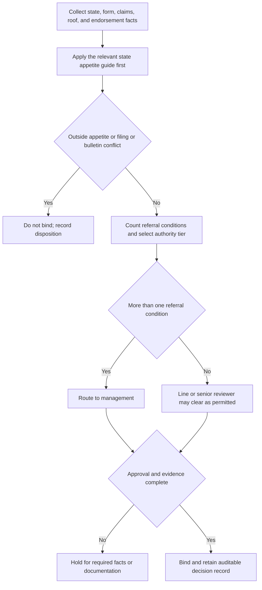

## Purpose and authority boundary

This page is **internal underwriting guidance** for personal residential property. It operationalizes the all-state referral matrix: who may bind a submission, when to route it, what cannot be approved, and what must be retained. It is not policy coverage, contract language, or regulatory authority, and it must not be quoted as any of those. The issued policy, Declarations, and actually attached endorsements remain the source for policy terms; a state bulletin remains the source for its regulatory requirements.

Referral is an internal escalation tool, not a cure for an out-of-appetite result or a filing conflict. A referral can move a risk to a higher authority tier, but it cannot broaden authority beyond the state guide or the enterprise matrix, and it cannot authorize a binding action that would violate a state filing or bulletin requirement.

## Control stack and precedence

Apply the controlling layers in this order:

1. the relevant state appetite guide;
2. the enterprise referral matrix, as constrained by that guide; and
3. the issued policy record and any applicable state bulletin.

State-specific appetite can narrow enterprise authority, but it cannot grant broader authority than the matrix. Florida H.7 narrows the matrix's Coverage A ceilings, and Texas G.7 does the same. The state guide also supplies the more restrictive eligibility and routing gate for that state, while the matrix provides the cross-state referral and hard-stop framework.

When a state guide and the matrix both speak to the same topic, the state guide governs the narrower internal route. When a filing or bulletin requirement conflicts with an underwriting request, referral and management approval cannot create an exception.

## Binding authority tiers

| Internal underwriting tier | Binding authority | Notes |
| --- | --- | --- |
| Line underwriter | Base binding authority within state and matrix limits | May bind only when all eligibility, filing, bulletin, and documentation conditions are met. |
| Senior underwriter | Expanded authority within the applicable state ceiling | May clear no more than one referral condition per risk. |
| Management | Above senior authority, more than one referral condition, or exception routing | Management routing is not automatic approval and cannot override a hard stop. |

The matrix is the cross-state ceiling framework; Florida and Texas each impose tighter Coverage A ceilings than the enterprise ceiling. A dollar amount inside the matrix is not automatically bindable if the state guide is tighter or if a separate filing or bulletin gate fails.

## Mandatory referral triggers

The following are mandatory referrals under internal underwriting guidance, regardless of Coverage A limit or state:

- two or more paid property claims in three years;
- any prior claim involving mold, continuous seepage, or foundation movement;
- a prior liability claim arising from a dog bite, trampoline, or unfenced pool, with a completed liability supplement required before binding;
- planned exclusion of windstorm and hail with placement in a residual market;
- a requested water-backup limit above $25,000, or above $10,000 when there is finished area below grade and no battery-backed sump pump;
- roof surfacing aged 20 years or more; and
- roof surfacing aged 25 years or more regardless of documentation.

A senior underwriter may clear only one referral condition per risk. More than one referral condition requires management approval.

The first route in the flow is escalation, not cure. A referral or management review does not turn an outside-appetite risk into an in-appetite risk.

## Hard stops: conditions that cannot be cleared by referral

The following conditions cannot be cleared by referral under internal underwriting guidance:

- three or more paid water claims of any type in five years;
- known unrepaired structural damage;
- a dwelling under renovation that will be unoccupied for more than 30 consecutive days; and
- any binding action that would violate a state filing or bulletin requirement.

These are non-clearable hard stops. They require either a different operational path or a no-bind disposition; they are not authority exceptions.

## Endorsement routing and authority boundary

Endorsement authority is limited to internal configuration and routing. It does not confirm that an endorsement is attached, and it does not expand coverage beyond the issued policy.

- HO 04 90 water backup: line authority may attach at the base limit; referrals apply above the matrix threshold and when the below-grade/battery-backed-sump conditions are present; senior authority extends only within the matrix ceiling. The selected HO 04 90 edition must be recorded separately from the routing decision.
- HO 04 81 mold: line authority may attach at the base limit; higher limits require referral and the applicable state guide disclosure.
- HO 23 74 ACV roof schedule: line authority may attach only when the state permits it at the roof's age.
- HO 04 16 ordinance or law: line authority may attach without a matrix limit condition.

For HO 04 90, the internal request must be kept separate from the contract terms. The selected edition, policy-written date, and endorsement Declarations determine the issued contractual default and deductible, while the matrix threshold only determines internal routing.

## Texas and Florida state-guide controls

Florida and Texas both narrow the enterprise matrix in different ways:

- Florida H.1-H.7 control eligibility, roof review, water backup, mold, deductible overlap, and management routing.
- Texas G.1-G.7 control occupancy, roof/schedule rules, wind/hail deductible handling, residual-market exclusion routing, water backup, and management routing.

In both states, a referral cannot clear a filing conflict, bulletin conflict, or out-of-appetite condition. State-guide limits come first, then the enterprise matrix, then the issued policy record.

## Documentation and audit standard

Every cleared referral must record:

1. the condition that triggered referral;
2. the authority level that cleared it;
3. the specific facts relied on; and
4. the date.

A referral cleared without a recorded basis is treated as unbound authority in audit and is charged back to the clearing underwriter's file review. Declination notes must state the actual deficiency rather than a generic reason. Where a state bulletin requires a more specific declination basis, that stricter standard controls.

## Focused pre-bind and audit tests

Run these checks before binding and during file review:

1. **Precedence test:** identify the state-guide provision first, then identify the matrix provision it constrains. Fail the file if a state ceiling or eligibility gate was widened by reference to the enterprise matrix.
2. **Hard-stop test:** fail any workflow that presents a referral or management approval as a way to bind a hard-stop risk or a filing/bulletin conflict.
3. **Referral-count test:** count distinct referral conditions. Senior clearance is limited to one condition; management routing occurs for more than one.
4. **Authority-limit test:** compare requested Coverage A with both the state and enterprise tier ceiling; require inspection evidence above the management inspection threshold where applicable.
5. **Endorsement test:** validate the selected form/edition, requested limit, and state-specific gate. For HO 04 90, keep the endorsement edition and its issued-default terms separate from matrix referral thresholds.
6. **Audit-record test:** reject a cleared referral that lacks the condition, authority tier, facts, or date.

For state-specific operational detail, see [Florida Homeowners Appetite](/openwiki/underwriting/florida-appetite.md), [Texas Homeowners Appetite](/openwiki/underwriting/texas-appetite.md), [Florida Roof Age, ACV Schedule, and Nonrenewal Overlay](/openwiki/state-overlays/florida.md), and [Texas Windstorm and Hail Deductible Overlay](/openwiki/state-overlays/texas.md).
