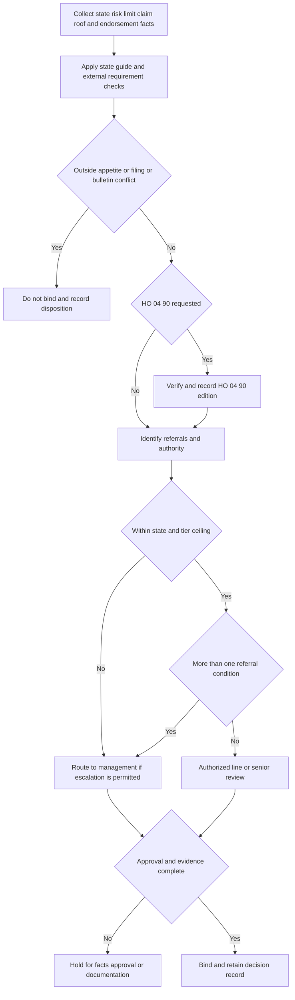

## Purpose and authority boundary

This is **internal underwriting guidance** for personal residential property. It operationalizes the enterprise referral matrix: who may bind, when a submission must be escalated, what cannot be approved, and what evidence the file must retain. It is not policy coverage, contract language, or regulatory authority. The issued policy, Declarations, and verified attached endorsements establish contract terms; a state bulletin establishes its regulatory requirements. In particular, an HO 04 90 requested-limit threshold is a routing control—not a contractual sublimit, deductible, attachment confirmation, coverage grant, or payment amount. [Matrix R.1-R.6](repo://guidelines/authority/referral-matrix.md#L7-L53) · [HO 04 90 2027-01 W.1-W.3](repo://forms/HO/MS/HO-04-90/2027-01.md#L6-L23)

**State-guide-first invariant.** Identify and apply the provision in the submission state's appetite guide first; it constrains the enterprise-matrix provision it addresses. Florida H.7 narrows matrix R.2's line/senior Coverage A ceilings to $600,000/$900,000, and Texas G.7 narrows them to $800,000/$1,200,000. A state guide cannot grant broader authority than the matrix. Separately, matrix R.4 makes a filing or bulletin conflict non-clearable: neither referral nor management approval can create an exception. These are internal controls and do not supersede an issued contract or bulletin. [Florida H.7](repo://guidelines/appetite/fl-homeowners.md#L47-L49) · [Texas G.7](repo://guidelines/appetite/tx-homeowners.md#L47-L49) · [Matrix R.1-R.4](repo://guidelines/authority/referral-matrix.md#L7-L17) [R.4](repo://guidelines/authority/referral-matrix.md#L33-L39)

| Internal outcome | Meaning | Binding result |
| --- | --- | --- |
| **Referral** | An identified condition needs review by the next authorized tier. A senior may clear no more than one referral condition per risk. | Bind only after the required clearance and complete record. |
| **Management approval** | Required above senior authority, for more than one referral condition, or for a filed-rule exception. | It is an escalation, not automatic approval; an underlying hard stop still prevents binding. |
| **Cannot be cleared by referral** | The risk is outside appetite or binding would breach a filing or bulletin. | Do not bind; route only for the permitted operational disposition. |

## Intake and decision flow

Before selecting authority, capture state, policy effective date, **policy-written date**, requested Coverage A, estimated replacement cost, occupancy/renovation/vacancy facts, construction/protection information, prior claims, roof age and evidence, residual-market wind/hail placement, requested endorsements and limits, and applicable form and bulletin versions. For HO 04 90, record the verified attached edition, written-date basis, requested/Declarations limit, and relevant below-grade equipment evidence. Never substitute a matrix threshold for an endorsement term. [Matrix R.3-R.6](repo://guidelines/authority/referral-matrix.md#L19-L53) · [HO 04 90 2027-01](repo://forms/HO/MS/HO-04-90/2027-01.md#L1-L55)

*The flow applies the state guide before the matrix, records rather than determines the verified HO 04 90 edition, and keeps hard stops separate from escalation.* [Matrix R.1-R.6](repo://guidelines/authority/referral-matrix.md#L7-L53) · [HO 04 90 2027-01](repo://forms/HO/MS/HO-04-90/2027-01.md#L1-L4)

### Tiers, referrals, and stops

Matrix R.2 permits line authority through $800,000 and senior authority through $1,500,000; management is required above that and a property inspection is mandatory above $1,500,000. Coverage A below 80% of estimated replacement cost is outside appetite at every tier. The latter is an underwriting eligibility rule that relies on HO-3 A.3's replacement-cost condition, not a claim-payment determination. Apply the lower Florida or Texas ceilings first. [Matrix R.1-R.2](repo://guidelines/authority/referral-matrix.md#L7-L17) · [HO-3 A.3](repo://forms/HO/MS/HO-3/2018-09.md#L25-L33)

Mandatory referral conditions include: two or more paid property claims in three years; any mold, continuous-seepage, or foundation-movement claim; the specified prior liability claims with a completed supplement; residual-market wind/hail exclusion; a water-backup request above $25,000 (or above $10,000 with finished below-grade area and no battery-backed sump pump); and the stated 20- and 25-year roof triggers. Those mold/seepage/foundation references are risk-selection inputs, not coverage conclusions. [Matrix R.3](repo://guidelines/authority/referral-matrix.md#L19-L31) · [HO-3 C.2-C.3](repo://forms/HO/MS/HO-3/2018-09.md#L83-L90)

Do not seek an authority exception for three or more paid water claims in five years, known unrepaired structural damage, renovation vacant more than 30 consecutive days, or a filing/bulletin violation. For Florida, H.4 is applied first: two or more water claims makes the risk outside appetite for HO 04 90, while three or more makes the entire risk outside appetite. [Matrix R.4](repo://guidelines/authority/referral-matrix.md#L33-L39) · [Florida H.4](repo://guidelines/appetite/fl-homeowners.md#L27-L33)

## HO 04 90: edition, authority, and contract separation

### Edition lifecycle

HO 04 90 **2027-01** replaces 2026-01 for policies written on or after 2027-01-01. The 2026-01 form remains in force for policies written under it and adjusts losses under those policies regardless of report date; it had replaced 2010-10 for policies written on or after 2026-01-01. The 2010-10 form likewise remains in force for policies written under it. Therefore select the edition from the written-date rule and verify attachment; neither the state guide nor matrix chooses an issued endorsement. [HO 04 90 2027-01](repo://forms/HO/MS/HO-04-90/2027-01.md#L1-L4) · [HO 04 90 2026-01](repo://forms/HO/MS/HO-04-90/2026-01.md#L3-L8) · [HO 04 90 2010-10](repo://forms/HO/MS/HO-04-90/2010-10.md#L3-L7)

On a verified attachment, each edition attaches to HO-3 and modifies Section I Exclusion A.3. A.3 makes the exception attachment-dependent. The 2010-10 default W.2 policy-period sublimit is $5,000; the 2026-01 and 2027-01 default is $10,000; in each case, a higher limit shown in the endorsement Declarations controls. These limits are part of—not additional to—the applicable Coverage A, B, and C limits. [HO 04 90 2010-10 W.1-W.2](repo://forms/HO/MS/HO-04-90/2010-10.md#L7-L15) · [HO 04 90 2026-01 W.1-W.2](repo://forms/HO/MS/HO-04-90/2026-01.md#L7-L22) · [HO 04 90 2027-01 W.1-W.2](repo://forms/HO/MS/HO-04-90/2027-01.md#L3-L18) · [HO-3 A.3](repo://forms/HO/MS/HO-3/2018-09.md#L69-L77)

For a verified HO 04 90 2027-01 attachment, W.1 supplies the stated sewer/drain-backup and sump-event route, W.3 applies a separate $1,000 deductible rather than the Section I deductible, W.4 retains the flood/surface-water and subsurface-water exclusions, and W.5 excludes the stated known failure-to-maintain loss. W.6 requires an installed, operable backwater valve or equivalent device at time of loss where there is finished area below grade; it was added in 2026-01 and carried unchanged into 2027-01. W.7 settles Coverage C at actual cash value unless the endorsement Declarations say otherwise. These are contract provisions, not underwriting authority. [HO 04 90 2027-01 W.1-W.7](repo://forms/HO/MS/HO-04-90/2027-01.md#L6-L57)

### Internal route versus selected contract terms

Matrix R.5 gives line underwriters base-limit authority to attach HO 04 90, and seniors may bind water-backup limits through $50,000. R.3's $10,000/$25,000 referral thresholds and R.5's $50,000 ceiling are internal routing values only; they do not change W.2, W.3, exclusions, conditions, or the Declarations. Apply a stricter state-guide gate first and retain the requested amount separately from the selected edition's default and any issued Declarations amount. [Matrix R.3 and R.5](repo://guidelines/authority/referral-matrix.md#L19-L30) [R.5](repo://guidelines/authority/referral-matrix.md#L41-L47) · [HO 04 90 2027-01 W.2-W.6](repo://forms/HO/MS/HO-04-90/2027-01.md#L13-L48)

Florida H.4 permits the base W.2 sublimit without referral and requires a battery-backed sump pump for a higher limit with finished area below grade. That eligibility control is distinct from 2027-01 W.6's at-loss backflow-prevention condition. Neither proves attachment or replaces the other. [Florida H.4](repo://guidelines/appetite/fl-homeowners.md#L27-L33) · [HO 04 90 2027-01 W.6](repo://forms/HO/MS/HO-04-90/2027-01.md#L42-L48)

Texas G.3 still calls the W.2 base sublimit $5,000, although both 2026-01 and 2027-01 state a $10,000 default. The supplied Texas guide and matrix contain no version-resolution rule. This mismatch does not amend an issued form or authorize a limit: preserve the selected edition and G.3 in the decision record and obtain applicable configuration or underwriting direction before characterizing a current-policy default or binding outcome. [Texas G.3](repo://guidelines/appetite/tx-homeowners.md#L23-L29) · [HO 04 90 2026-01 W.2](repo://forms/HO/MS/HO-04-90/2026-01.md#L17-L22) · [HO 04 90 2027-01 W.2](repo://forms/HO/MS/HO-04-90/2027-01.md#L13-L18)

Other matrix configuration routes are also not coverage authority: HO 04 81 has base-limit line authority and senior authority through $25,000; HO 04 16 and HO 23 74 have no matrix limit condition. Verified compatible attachment—not the matrix—creates their respective relationships to HO-3 C.2, D.1, and A.4. [Matrix R.5](repo://guidelines/authority/referral-matrix.md#L41-L47) · [HO 04 81](repo://forms/HO/MS/HO-04-81/2018-09.md#L1-L23) · [HO 04 16](repo://forms/HO/MS/HO-04-16/2018-09.md#L1-L13) · [HO 23 74](repo://forms/HO/MS/HO-23-74/2018-09.md#L1-L15) · [HO-3](repo://forms/HO/MS/HO-3/2018-09.md#L25-L34) [C.2](repo://forms/HO/MS/HO-3/2018-09.md#L83-L94)

## Florida roof overlay

For policies within its effective-date scope, OIR-2023-04 F.4 **constrains** the HO 23 74 offer/application path: an insurer must offer a policy without the provision at a filed, approved rate and give written premium-difference disclosure; an ACV roof schedule may not apply to a roof under 10 years old at policy effective date. F.4 is regulatory, not contract language, and does not attach HO 23 74 or modify HO-3 A.4. Florida H.2 also adds the pre-bind 15-year inspection gate and retained comparison quote; H.3/H.7 require Compliance and management routing for roof-condition nonrenewal. [Bulletin F.2-F.5](repo://bulletins/FL/2023-04-roof-age-nonrenewal.md#L9-L29) · [Florida H.2-H.3 and H.7](repo://guidelines/appetite/fl-homeowners.md#L15-L25) [H.7](repo://guidelines/appetite/fl-homeowners.md#L47-L49) · [HO 23 74](repo://forms/HO/MS/HO-23-74/2018-09.md#L1-L15) · [HO-3 A.4](repo://forms/HO/MS/HO-3/2018-09.md#L31-L34)

## Decision record and focused checks

Every cleared referral must record the condition, clearing authority level, specific facts relied on, and date. An undocumented clearance is treated as unbound authority in audit. Declination notes must state the actual deficiency; for Florida roof condition they must meet the bulletin's specific-deficiency standard. [Matrix R.6](repo://guidelines/authority/referral-matrix.md#L49-L53) · [Bulletin F.2](repo://bulletins/FL/2023-04-roof-age-nonrenewal.md#L9-L13)

Use one append-only decision record per submission. Retain the versioned inputs; eligibility and claims/inspection evidence; every referral counted, reviewer tier, action, facts, and date; requested and approved endorsement amounts; verified attachments and issued Declarations when available; and the hard-stop/no-bind or Florida roof notice packet as applicable. These are audit and operational records, not additional policy conditions. [Matrix R.6](repo://guidelines/authority/referral-matrix.md#L49-L53) · [Bulletin F.5 and F.7](repo://bulletins/FL/2023-04-roof-age-nonrenewal.md#L27-L37)

Before binding and in file review, test: (1) state-guide-first precedence and both state/enterprise ceilings; (2) hard stops cannot be escalated into approval; (3) referral count and senior's one-condition limit; (4) the inspection requirement above $1,500,000; (5) selected HO 04 90 edition, attachment, requested limit, W.2/W.3 distinction, and—when 2027-01 is selected—W.6 evidence; (6) the unresolved Texas G.3/$10,000 mismatch is flagged rather than inferred; and (7) Florida's independent roof inspection, offer/disclosure, notice, Compliance, and management controls. [Matrix R.1-R.6](repo://guidelines/authority/referral-matrix.md#L7-L53) · [HO 04 90 2027-01](repo://forms/HO/MS/HO-04-90/2027-01.md#L1-L57) · [Texas G.3](repo://guidelines/appetite/tx-homeowners.md#L23-L29) · [Bulletin F.2-F.5](repo://bulletins/FL/2023-04-roof-age-nonrenewal.md#L9-L29)

For state operational detail, see [Florida Homeowners Appetite](/openwiki/underwriting/florida-appetite.md) and [Texas Homeowners Appetite](/openwiki/underwriting/texas-appetite.md). For issued-form analysis, see [Policy Editions and Governing Forms](/openwiki/coverage/policy-editions-and-governing-forms.md) and [Water Damage Exclusions and Water Backup Write-Back](/openwiki/coverage/property/water-damage-and-backup.md).
