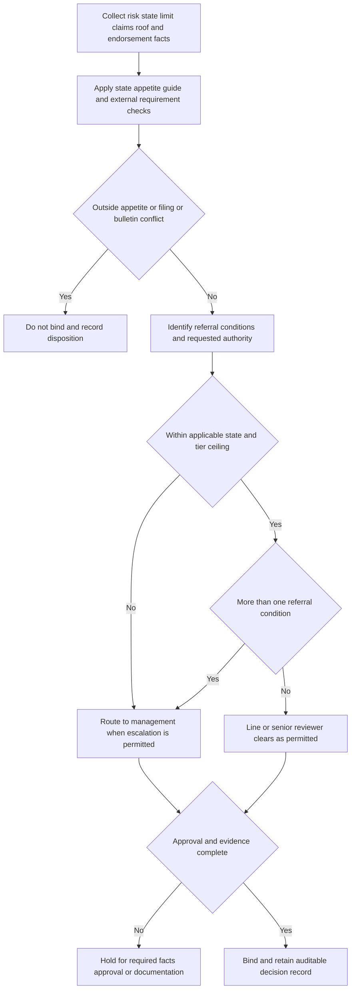

## Purpose and authority boundary

This page is **internal underwriting guidance** for personal residential property. It operationalizes the all-state referral matrix: who may bind a submission, when to route it, what cannot be approved, and what must be retained. It is not policy coverage, contract language, or regulatory authority, and it must not be quoted as any of those. The issued policy, Declarations, and actually attached endorsements remain the source for policy terms; a state bulletin remains the source for its regulatory requirements. [Underwriting Referral and Authority Matrix, R.1-R.6](repo://guidelines/authority/referral-matrix.md#L1-L53) · [HO-3 2018-09, policy agreement and A.3-A.4](repo://forms/HO/MS/HO-3/2018-09.md#L5-L7) [HO-3 2018-09, A.3-A.4](repo://forms/HO/MS/HO-3/2018-09.md#L25-L34) · [OIR-2023-04, purpose](repo://bulletins/FL/2023-04-roof-age-nonrenewal.md#L3-L7)

**Precedence invariant — internal underwriting guidance.** Apply the referral matrix as the maximum enterprise authority. A state appetite guide may tighten an authority ceiling, add an eligibility gate, or require a more restrictive route; it may never expand matrix authority. The Florida and Texas guides expressly provide tighter Coverage A ceilings than the enterprise senior ceiling. A referral or management approval also cannot create an exception to a filed rule or bulletin requirement. [Underwriting Referral and Authority Matrix, R.1 and R.4](repo://guidelines/authority/referral-matrix.md#L1-L11) [Underwriting Referral and Authority Matrix, R.4](repo://guidelines/authority/referral-matrix.md#L33-L39) · [Florida Homeowners Appetite Guide, H.7](repo://guidelines/appetite/fl-homeowners.md#L47-L49) · [Texas Homeowners Appetite Guide, G.7](repo://guidelines/appetite/tx-homeowners.md#L47-L49)

Keep the following outcomes distinct in every file:

| Internal underwriting guidance outcome | Meaning | Binding result |
| --- | --- | --- |
| **Referral** | A listed condition requires review by the authorized next tier. A senior underwriter may clear no more than one referral condition per risk. | Bind only after the required authority clears the condition and the record is complete. |
| **Management approval** | The risk is above senior authority, has more than one referral condition, or is an exception to a filed rule. | Do not treat management routing as automatic approval; an underlying hard stop still prevents binding. |
| **Cannot be cleared by referral** | The risk is outside appetite entirely, or binding would breach a filing or bulletin. | Do not bind. Refer only for the permitted operational disposition, not to seek an authority exception. |

The first two rows are escalation mechanisms; the third is not. The distinction is an internal control that prevents authority tiers from being used to override eligibility or external requirements. [Underwriting Referral and Authority Matrix, R.1 and R.4](repo://guidelines/authority/referral-matrix.md#L7-L10) [Underwriting Referral and Authority Matrix, R.4](repo://guidelines/authority/referral-matrix.md#L33-L39)

## Intake, decision flow, and authority tiers

**Internal underwriting guidance intake record.** Before authority is selected, capture the state, policy effective date, requested Coverage A, estimated replacement cost, occupancy and renovation/vacancy facts, construction/protection information required by the state guide, prior property/liability/water/mold claims, roof age and evidence, any residual-market wind/hail placement, requested endorsements and limits, and the applicable form/bulletin versions. These are decision inputs and audit evidence; collecting them does not determine coverage.

*This internal underwriting guidance flow sequences eligibility, state-guide precedence, referral counting, authority routing, and documentation. It does not decide policy coverage or alter any bulletin requirement.* [Underwriting Referral and Authority Matrix, R.1-R.6](repo://guidelines/authority/referral-matrix.md#L7-L53) · [Florida Homeowners Appetite Guide, H.7](repo://guidelines/appetite/fl-homeowners.md#L47-L49) · [Texas Homeowners Appetite Guide, G.7](repo://guidelines/appetite/tx-homeowners.md#L47-L49)

### Enterprise ceilings, then state ceilings

| Internal underwriting guidance tier | Enterprise Coverage A authority | Additional control |
| --- | ---: | --- |
| Line underwriter | Up to $800,000 | Base authority only; all referral, endorsement, and state-guide controls remain applicable. |
| Senior underwriter | Up to $1,500,000 | May clear **one** referral condition per risk. |
| Management | Above senior authority or more than one referral condition | A property inspection is mandatory for Coverage A above $1,500,000, regardless of construction or protection class. Management cannot cure a hard stop. |

A Coverage A amount below 80% of estimated replacement cost is outside appetite at every tier. This internal eligibility rule depends on the selected HO-3 form's 80% replacement-cost settlement condition; it is not a statement that a particular policy will or will not pay a claim. [Underwriting Referral and Authority Matrix, R.1-R.2](repo://guidelines/authority/referral-matrix.md#L7-L17) · [HO-3 2018-09, A.3](repo://forms/HO/MS/HO-3/2018-09.md#L25-L33)

Apply state ceilings before enterprise ceilings. In Florida, line authority ends at $600,000 and senior authority at $900,000; in Texas, the corresponding ceilings are $800,000 and $1,200,000. The state guides also set state-specific eligibility and management routes, so a dollar amount within the matrix does not itself make a risk bindable. [Florida Homeowners Appetite Guide, H.1 and H.7](repo://guidelines/appetite/fl-homeowners.md#L7-L13) [Florida Homeowners Appetite Guide, H.7](repo://guidelines/appetite/fl-homeowners.md#L47-L49) · [Texas Homeowners Appetite Guide, G.1 and G.7](repo://guidelines/appetite/tx-homeowners.md#L7-L13) [Texas Homeowners Appetite Guide, G.7](repo://guidelines/appetite/tx-homeowners.md#L47-L49)

## Mandatory referrals and non-clearable conditions

### Referral triggers

The following are **mandatory referrals under internal underwriting guidance**, regardless of Coverage A limit or state:

- Two or more paid property claims in three years; or any prior claim involving mold, continuous seepage, or foundation movement.
- A prior liability claim arising from a dog bite, trampoline, or unfenced pool. Obtain the completed liability supplement before binding.
- Planned exclusion of windstorm and hail with placement in a residual market.
- A requested water-backup limit above $25,000, or above $10,000 when there is finished area below grade and no battery-backed sump pump.
- Roof surfacing aged 20 years or more; at 25 years or more, the referral applies regardless of documentation.

The mold/seepage/foundation trigger is internal risk-selection guidance that depends on the HO-3 exclusions identified by the matrix; it is not a coverage determination. Similarly, the residual-market trigger is an underwriting route and does not replace state-specific attachment, acknowledgment, or other external prerequisites. [Underwriting Referral and Authority Matrix, R.3](repo://guidelines/authority/referral-matrix.md#L19-L31) · [HO-3 2018-09, C.2-C.3](repo://forms/HO/MS/HO-3/2018-09.md#L83-L90) · [Texas Homeowners Appetite Guide, G.4](repo://guidelines/appetite/tx-homeowners.md#L31-L35)

### Hard stops: do not seek an authority exception

The following conditions **cannot be cleared by referral under internal underwriting guidance**:

- Three or more paid water claims of any type in five years.
- Known unrepaired structural damage.
- A dwelling under renovation that will be unoccupied for more than 30 consecutive days; use the appropriate builders-risk or vacancy form path instead.
- Any binding action that would violate a state filing or bulletin requirement.

For example, Florida guidance separately makes two or more water claims in five years outside appetite for the water-backup endorsement and three or more outside appetite for the entire risk. The state result is at least as restrictive as the matrix and must govern. [Underwriting Referral and Authority Matrix, R.4](repo://guidelines/authority/referral-matrix.md#L33-L39) · [Florida Homeowners Appetite Guide, H.4](repo://guidelines/appetite/fl-homeowners.md#L27-L33)

## Endorsement authority and source dependencies

Endorsement authority below is **internal underwriting guidance for configuration and routing**, not confirmation that an endorsement is attached or that it provides coverage. Verify the issued form edition and Declarations separately. A higher amount shown in the Declarations is a form-level dependency; it does not enlarge an underwriter's authority.

| Endorsement / request | Internal authority route | Form dependency to record |
| --- | --- | --- |
| **HO 04 90** water backup | Line underwriter may attach at base limits. Referral is mandatory above $25,000; senior authority extends to $50,000. The below-grade/battery-backed-sump trigger above $10,000 still applies. State-guide controls can be stricter. | HO 04 90 is an HO-3 endorsement; its base $5,000 policy-period sublimit applies unless a higher limit appears in the Declarations. [HO 04 90, attachment and W.2](repo://forms/HO/MS/HO-04-90/2010-10.md#L1-L11) |
| **HO 04 81** limited fungi, wet/dry rot, or bacteria | Line underwriter may attach at the base limit. Senior authority extends to a $25,000 mold limit; above-base limits require referral, and Florida additionally requires a plumbing-age disclosure. | The form's $10,000 aggregate applies unless a higher limit is in the Declarations. [HO 04 81, M.3](repo://forms/HO/MS/HO-04-81/2018-09.md#L19-L23) |
| **HO 23 74** ACV roof-surfacing schedule | Line underwriter may attach without a matrix limit condition, subject to every state guide and bulletin gate. | It attaches to HO-3 and modifies A.4, so record the selected HO-3 edition and issued attachment. [HO 23 74, attachment](repo://forms/HO/MS/HO-23-74/2018-09.md#L1-L4) |
| **HO 04 16** ordinance or law | Line underwriter may attach without a matrix limit condition. | It attaches to HO-3; record the selected form and any higher percentage in the Declarations. [HO 04 16, attachment and O.2](repo://forms/HO/MS/HO-04-16/2018-09.md#L1-L13) |

The matrix establishes the routes in the table. Florida's and Texas's separate water-backup instructions may add eligibility gates, base-limit treatment, claims-history thresholds, or sump requirements; do not use the all-state table to relax them. [Underwriting Referral and Authority Matrix, R.3 and R.5](repo://guidelines/authority/referral-matrix.md#L19-L30) [Underwriting Referral and Authority Matrix, R.5](repo://guidelines/authority/referral-matrix.md#L41-L47) · [Florida Homeowners Appetite Guide, H.4 and H.6](repo://guidelines/appetite/fl-homeowners.md#L27-L45) · [Texas Homeowners Appetite Guide, G.3](repo://guidelines/appetite/tx-homeowners.md#L23-L29)

### Florida roof-schedule dependency

For Florida policies in the bulletin's stated effective-date scope, an HO 23 74 request is an internal underwriting review route with a mandatory bulletin-dependency check: an ACV roof schedule may not be applied to a roof under 10 years old at the policy effective date. When offering an ACV roof schedule or separate roof deductible, confirm that the required policy-without-provision offer, filed-and-approved rate, and written premium-difference disclosure are supported; retain the comparison quote as Florida internal guidance directs. The bulletin governs these external constraints, while the matrix supplies the authority route; neither source alone proves issued attachment. [Underwriting Referral and Authority Matrix, R.5](repo://guidelines/authority/referral-matrix.md#L41-L47) · [Florida Homeowners Appetite Guide, H.2](repo://guidelines/appetite/fl-homeowners.md#L15-L21) · [OIR-2023-04, F.4](repo://bulletins/FL/2023-04-roof-age-nonrenewal.md#L21-L25) · [HO 23 74, attachment and R.5](repo://forms/HO/MS/HO-23-74/2018-09.md#L1-L4) [HO 23 74, R.5](repo://forms/HO/MS/HO-23-74/2018-09.md#L31-L35)

A Florida roof aged 15 years or more requires an inspection before binding under the state guide. The matrix's 20-year roof referral therefore adds escalation; it cannot be used to bypass the bulletin's inspection, decision-basis, offer, or nonrenewal controls. For Florida roof-condition nonrenewal, route through management and Compliance before issuance and preserve the notice packet. [Florida Homeowners Appetite Guide, H.2-H.3 and H.7](repo://guidelines/appetite/fl-homeowners.md#L15-L25) [Florida Homeowners Appetite Guide, H.7](repo://guidelines/appetite/fl-homeowners.md#L47-L49) · [Underwriting Referral and Authority Matrix, R.3 and R.6](repo://guidelines/authority/referral-matrix.md#L19-L31) [Underwriting Referral and Authority Matrix, R.6](repo://guidelines/authority/referral-matrix.md#L49-L53) · [OIR-2023-04, F.2-F.5](repo://bulletins/FL/2023-04-roof-age-nonrenewal.md#L9-L29)

## Documentation, audit, and focused controls

**Auditable-decision invariant — internal underwriting guidance.** Every cleared referral must identify the condition, clearing authority level, specific facts relied on, and clearance date. A referral without its recorded basis is treated as unbound authority in audit and is charged back to the clearing underwriter's file review. Declination notes must identify the actual deficiency; where a state bulletin has a more restrictive decision-basis requirement, the state standard controls. [Underwriting Referral and Authority Matrix, R.6](repo://guidelines/authority/referral-matrix.md#L49-L53) · [OIR-2023-04, F.2](repo://bulletins/FL/2023-04-roof-age-nonrenewal.md#L9-L13)

Use one decision record per submission and append evidence rather than overwriting the initial facts. At a minimum, retain:

1. **Inputs and versioning:** policy effective date, state, estimated replacement cost, requested Coverage A and endorsements/limits, state guide version, matrix version, selected form edition, and applicable bulletin identifier.
2. **Eligibility and triggers:** occupancy/renovation facts, claim histories, liability supplement if required, roof-age source, inspection and condition evidence, below-grade/sump evidence, and residual-market acknowledgment path where relevant.
3. **Authority action:** each referral condition counted, the selected tier, reviewer identity/authority level, management or Compliance routing where required, the precise approval/declination/disposition, facts relied on, and date.
4. **Endorsement configuration:** requested and approved amount, base-form and endorsement edition, comparison/offer artifacts where a Florida roof schedule or roof deductible is offered, and issued Declarations/attachment confirmation when available.
5. **Hard-stop or notice record:** the state filing/bulletin conflict or out-of-appetite reason, no-bind disposition, and, for Florida roof-condition nonrenewal, the notice date, specific reason, every relied-on inspection report, management approval, and Compliance completion.

These records support an internal audit trail and state-specific operational checks; they are not extra policy conditions. The Florida nonrenewal fields also support the bulletin's county-disaggregated reporting dependency, while the insured-facing notice standard itself must be checked against the bulletin. [Underwriting Referral and Authority Matrix, R.6](repo://guidelines/authority/referral-matrix.md#L49-L53) · [Florida Homeowners Appetite Guide, H.3](repo://guidelines/appetite/fl-homeowners.md#L23-L25) · [OIR-2023-04, F.5 and F.7](repo://bulletins/FL/2023-04-roof-age-nonrenewal.md#L27-L37)

### Focused pre-bind and audit tests

Run these **internal underwriting guidance** checks before binding and during file review:

1. **Precedence test:** Apply the state guide before selecting a matrix tier. Fail the file if a state ceiling or eligibility gate was widened by reference to the enterprise matrix.
2. **Hard-stop test:** Fail any workflow that presents a referral or management approval as a way to bind a three-water-claim risk, unrepaired structural damage, long vacant renovation, or a filing/bulletin conflict.
3. **Referral-count test:** Count distinct referral conditions. Confirm senior clearance is limited to one condition and management routing occurs for more than one.
4. **Authority-limit test:** Compare requested Coverage A with both the state and enterprise tier ceiling; require inspection evidence above $1,500,000 even where management is the appropriate route.
5. **Endorsement test:** Validate each selected form/edition, requested limit, and state-specific gate. For water backup, test the $25,000 referral threshold and the above-$10,000 finished-below-grade sump evidence. For mold, test the base-versus-higher-limit route and the Florida plumbing-age disclosure.
6. **Florida roof test:** For an in-scope policy, separately test the 15-year inspection route, the 20-year matrix referral, the under-10-years-at-effective-date schedule prohibition, offer/comparison artifacts, and roof-condition nonrenewal management/Compliance packet. Never collapse those distinct checks into a generic roof-age rule.
7. **Audit-record test:** Reject a cleared referral that lacks the condition, authority tier, facts, or date; reject a declination note that lacks a specific deficiency where the Florida bulletin dependency applies.

For state-specific operational detail, see [Florida Homeowners Appetite](/openwiki/underwriting/florida-appetite.md), [Texas Homeowners Appetite](/openwiki/underwriting/texas-appetite.md), [Florida Roof Age, ACV Schedule, and Nonrenewal Overlay](/openwiki/state-overlays/florida.md), and [Texas Windstorm and Hail Deductible Overlay](/openwiki/state-overlays/texas.md). For issued-form analysis rather than underwriting routing, see [Coverage A — Roof Surfacing Settlement](/openwiki/coverage/coverage-a/roof-settlement.md) and [Water Damage Exclusions and Water Backup Write-Back](/openwiki/coverage/property/water-damage-and-backup.md).
