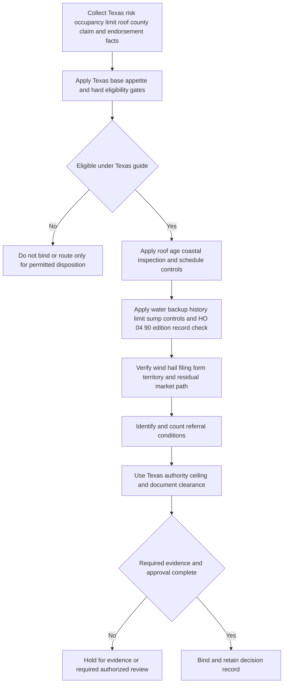

## Purpose, scope, and controlling layers

This page is **internal underwriting guidance** for Texas homeowners submissions. It directs intake, risk selection, endorsement configuration, escalation, and file controls. It is not policy language, does not decide or grant coverage, and must not be quoted to an insured or claimant. The Texas appetite guide is the state-specific operating control; the enterprise referral matrix is a maximum-authority framework, while the issued HO-3, Declarations, and attached endorsements determine policy terms. [Texas Homeowners Appetite Guide, status](repo://guidelines/appetite/tx-homeowners.md#L1-L5) · [Underwriting Referral and Authority Matrix, R.1](repo://guidelines/authority/referral-matrix.md#L1-L11) · [HO-3 2018-09, agreement](repo://forms/HO/MS/HO-3/2018-09.md#L5-L7)

Apply the layers in this order:

| Layer | Controls | Does not control |
| --- | --- | --- |
| **Texas appetite guide** | Texas eligibility, roof and water-backup gates, operational coastal list, and Texas-specific Coverage A authority. | Issued coverage, a deductible amount, or an exception to external requirements. |
| **Referral matrix** | Enterprise escalation, endorsement authority, non-clearable conditions, and audit record standard. A state guide may be tighter but cannot grant broader authority. | Relaxing a Texas state-specific ceiling or condition. |
| **Bulletin B-2021-08 and HO 01 45 (2022-01)** | Texas wind/hail deductible requirements and, when attached, contractual amendment of HO-3. | The decision that a submission is in appetite or proof that a form is attached. |
| **Issued policy record** | Applicable base form, Declarations, attached endorsements, coverage, limits, and deductibles. | Carrier risk appetite or referral authority. |

The bulletin applies to Texas residential property policies delivered or issued for delivery with an effective date on or after **2022-01-01**. HO 01 45 is also effective for policies effective on or after that date, attaches to HO-3, and governs a conflict with the attached form. The effective-date gate does not prove attachment; retain and verify the issued endorsement and Declarations before relying on its contractual result. [Texas Bulletin B-2021-08, applicability](repo://bulletins/TX/2021-08-windstorm-deductible.md#L1-L7) · [HO 01 45, attachment, effective date, and conflict rule](repo://forms/HO/TX/HO-01-45/2022-01.md#L1-L4)

> **Internal control:** A referral or management route is not automatic approval. It cannot authorize a filed-rule or bulletin violation. Likewise, a risk that is outside the Texas guide's stated appetite is not made eligible merely by attaching an endorsement or using a broader enterprise ceiling. [Underwriting Referral and Authority Matrix, R.1 and R.4](repo://guidelines/authority/referral-matrix.md#L7-L11) [Underwriting Referral and Authority Matrix, R.4](repo://guidelines/authority/referral-matrix.md#L33-L39)

For issued-policy form selection and assembly, use [Governing Form Editions and Policy Assembly](/openwiki/coverage/policy-editions-and-governing-forms.md). That analysis is adjacent to, but does not replace, the internal controls here.

## Intake and Texas base appetite

Capture the effective date; owner/occupancy and primary-, seasonal-, or secondary-residence status; Coverage A and replacement-cost estimate; construction and protection class; roof material, age, and replacement evidence; county; prior property, water-backup, and liability claims; below-grade finished area and sump evidence; requested water-backup limit; and proposed wind/hail arrangement. These are underwriting inputs and audit evidence, not policy conditions.

An owner-occupied, one-family **primary residence** is within the stated Texas base appetite when Coverage A is **$150,000 through $1,200,000**, the dwelling is insured to at least **80% of replacement cost**, construction is frame, masonry, or masonry veneer, and protection class is **1 through 8**. The guide's 80% eligibility threshold aligns with the HO-3 2018-09 A.3 replacement-cost condition, but the underwriting rule must not be communicated as a prediction of a particular claim payment. [Texas Homeowners Appetite Guide, G.1](repo://guidelines/appetite/tx-homeowners.md#L7-L13) · [HO-3 2018-09, A.3](repo://forms/HO/MS/HO-3/2018-09.md#L25-L34)

The guide separately permits seasonal and secondary residences only in protection classes **1 through 6** and only when the prior-loss record is clear for **five years**. Apply this stricter residence-specific gate alongside the other submission facts; do not infer that a favorable Coverage A amount or authority tier removes it. [Texas Homeowners Appetite Guide, G.1](repo://guidelines/appetite/tx-homeowners.md#L11-L13)

*This internal sequence applies Texas risk-selection and routing controls before binding. The water-backup checkpoint records the HO 04 90 edition/form check separately from G.3's eligibility controls; it does not establish whether an issued policy covers a loss.* [Texas Homeowners Appetite Guide, G.1-G.7](repo://guidelines/appetite/tx-homeowners.md#L7-L49) · [Underwriting Referral and Authority Matrix, R.1-R.6](repo://guidelines/authority/referral-matrix.md#L7-L53) · [HO 04 90 edition rules](repo://forms/HO/MS/HO-04-90/2010-10.md#L1-L7) · [2026-01 replacement and continuing-force rule](repo://forms/HO/MS/HO-04-90/2026-01.md#L1-L8) · [2027-01 replacement rule](repo://forms/HO/MS/HO-04-90/2027-01.md#L1-L4)

## Coverage A, roof age, and roof-schedule control

### Coverage A authority is Texas-specific

Use Texas's tighter senior ceiling rather than the matrix's general $1,500,000 ceiling. A line underwriter may bind in-appetite Coverage A through **$800,000**. A senior underwriter may bind through **$1,200,000** and may approve **one referral condition per risk**. Coverage A above $1,200,000, or more than one referral condition, requires management approval. Management routing does not negate base appetite, a hard stop, or any regulatory prerequisite. [Texas Homeowners Appetite Guide, G.7](repo://guidelines/appetite/tx-homeowners.md#L47-L49) · [Underwriting Referral and Authority Matrix, R.1-R.2 and R.4](repo://guidelines/authority/referral-matrix.md#L7-L17) [Underwriting Referral and Authority Matrix, R.4](repo://guidelines/authority/referral-matrix.md#L33-L39)

| Texas decision | Required internal route |
| --- | --- |
| Coverage A through $800,000, no unresolved referral | Line underwriter, after all Texas gates are satisfied. |
| Coverage A over $800,000 through $1,200,000 | Senior underwriter. |
| One referral condition within senior authority | Senior underwriter may clear it, with required record. |
| Coverage A over $1,200,000 or more than one referral condition | Management approval required; do not present routing as a waiver. |

### Roof age is both an issuance gate and an attachment control

For roof surfacing aged **15 years or more**, require **HO 23 74 Actual Cash Value Loss Settlement — Roof Surfacing** at new business and renewal. The guide makes this an internal issuance requirement. The form explains why attachment matters: it modifies HO-3 A.4 only for roof surfacing, while other dwelling components remain under A.3; it does not make the schedule automatic. [Texas Homeowners Appetite Guide, G.2](repo://guidelines/appetite/tx-homeowners.md#L15-L21) · [HO-3 2018-09, A.3-A.4](repo://forms/HO/MS/HO-3/2018-09.md#L25-L34) · [HO 23 74, attachment and scope](repo://forms/HO/MS/HO-23-74/2018-09.md#L1-L10)

A roof-surfacing age of **25 years or more** is outside Texas appetite regardless of the roof-schedule endorsement, unless a full roof replacement is documented within **90 days of binding**. Track the replacement commitment, evidence of a full replacement, and the deadline; a partial repair does not establish a new roof age under HO 23 74. This is a Texas eligibility exception, not a claim settlement conclusion. [Texas Homeowners Appetite Guide, G.2](repo://guidelines/appetite/tx-homeowners.md#L17-L21) · [HO 23 74, age determination](repo://forms/HO/MS/HO-23-74/2018-09.md#L31-L35)

The all-state matrix also makes a roof surfacing age of **20 years or more** a mandatory referral. Apply that escalation at 20–24 years in addition to the Texas 15-year schedule requirement, but do not replace Texas's stricter 25-year eligibility rule with the matrix's generic roof referral. [Underwriting Referral and Authority Matrix, R.3](repo://guidelines/authority/referral-matrix.md#L19-L31) · [Texas Homeowners Appetite Guide, G.2](repo://guidelines/appetite/tx-homeowners.md#L15-L21)

Attachment is not a coverage representation. For an issued HO-3 2018-09 policy to which HO 23 74 is attached, windstorm- or hail-caused **roof surfacing** is settled under its actual-cash-value schedule; non-surfacing components remain under the base dwelling settlement and a different covered peril remains replacement cost. Use [Coverage A — Roof Surfacing Settlement](/openwiki/coverage/coverage-a/roof-settlement.md) and [Dwelling](/openwiki/coverage/coverage-a/dwelling.md) for issued-policy analysis. [HO 23 74, R.1-R.2](repo://forms/HO/MS/HO-23-74/2018-09.md#L5-L16) · [HO-3 2018-09, A.3-A.4](repo://forms/HO/MS/HO-3/2018-09.md#L25-L34)

## Coastal-county controls and wind/hail configuration

For the G.2 inspection requirement and the G.4 operational wind/hail route, the guide treats these counties as coastal: **Aransas, Brazoria, Calhoun, Cameron, Chambers, Galveston, Jefferson, Kenedy, Kleberg, Matagorda, Nueces, Refugio, San Patricio, and Willacy**. A **composition shingle** roof in one of these counties requires an inspection report dated within **12 months** of the effective date. This guide list is an operational classification; do not substitute it for the legal seacoast-territory definition used by the form or bulletin. [Texas Homeowners Appetite Guide, G.2 and G.6](repo://guidelines/appetite/tx-homeowners.md#L19-L21) [Texas Homeowners Appetite Guide, G.6](repo://guidelines/appetite/tx-homeowners.md#L43-L45)

The bulletin defines its seacoast territory as first-tier coastal counties and designated portions of Harris County under department territory definitions in effect on the bulletin date. HO 01 45 instead uses the department definitions in effect on the endorsement's effective date. Determine the applicable territory from the governing source and its reference date, not from the guide's county list. [Texas Bulletin B-2021-08, B.6](repo://bulletins/TX/2021-08-windstorm-deductible.md#L31-L33) · [HO 01 45, T.6](repo://forms/HO/TX/HO-01-45/2022-01.md#L29-L31)

### Separate windstorm and hail deductible

The Texas guide does not select the deductible. Underwriters must confirm the amendment in force for the policy effective date rather than reuse prior-year rating output. For a compliant configuration, B-2021-08 allows a percentage deductible of Coverage A from **1% to 5%**, with a maximum of **10%** in its seacoast territories, or a flat-dollar deductible no lower than the all-other-perils deductible. Before application, the applicable amendment and rate rule must be filed and approved or deemed approved. [Texas Homeowners Appetite Guide, G.4](repo://guidelines/appetite/tx-homeowners.md#L31-L35) · [Texas Bulletin B-2021-08, B.2 and B.7](repo://bulletins/TX/2021-08-windstorm-deductible.md#L9-L13) [Texas Bulletin B-2021-08, B.7](repo://bulletins/TX/2021-08-windstorm-deductible.md#L35-L37)

When HO 01 45 is attached and applicable, **T.1 implements Bulletin B-2021-08 and expressly amends HO-3 Section I S.5**. Its separate wind/hail deductible is stated in the Declarations as a percentage of Coverage A, subject to the same 1%–5% range and 10% seacoast maximum. For windstorm/hail loss, T.1 replaces S.5's otherwise broader deductible direction: only the separate wind/hail deductible applies, not the all-other-perils deductible. The bulletin's flat-dollar permission is a regulatory option; it is not language that HO 01 45 automatically adds to a policy. [HO-3 2018-09, S.5](repo://forms/HO/MS/HO-3/2018-09.md#L101-L112) · [HO 01 45, conflict rule and T.1](repo://forms/HO/TX/HO-01-45/2022-01.md#L1-L11) · [Texas Bulletin B-2021-08, B.2](repo://bulletins/TX/2021-08-windstorm-deductible.md#L9-L13)

The Declarations must disclose the separate deductible in type no smaller than the all-other-perils deductible and state both its percentage and the dollar amount produced at the Coverage A limit at issuance. An increase in the percentage requires written notice at least **30 days before renewal**; without it, the increase is ineffective for that renewal and the prior percentage continues. Retain the Declarations, Coverage A value, current and prior percentage, and notice date. [Texas Bulletin B-2021-08, B.4](repo://bulletins/TX/2021-08-windstorm-deductible.md#L21-L25) · [HO 01 45, T.2](repo://forms/HO/TX/HO-01-45/2022-01.md#L13-L15)

Do not make a claim-time coverage or deductible promise from an underwriting file. For an issued and applicable HO 01 45 policy, only the windstorm/hail deductible applies to a windstorm/hail loss. For a mixed covered-peril occurrence, separately determinable damage receives its respective deductible; if it cannot be separately determined, only the larger single deductible applies to the whole loss. [HO 01 45, T.1](repo://forms/HO/TX/HO-01-45/2022-01.md#L5-L11) · [Texas Bulletin B-2021-08, B.3](repo://bulletins/TX/2021-08-windstorm-deductible.md#L15-L19)

### Residual-market wind/hail exclusion

Keep the residual-market exclusion route in three separate layers. **G.4** is the Texas operational constraint: in seacoast territories defined by state law, windstorm/hail may be excluded where the insured obtains that coverage through the residual market, and a signed exclusion acknowledgment is required at binding. **Matrix R.3** separately makes any wind/hail exclusion with residual-market placement a mandatory referral. Neither control establishes a policy exclusion. **HO 01 45 T.7** is the narrower contractual branch: the insured must obtain Texas Windstorm Insurance Association coverage, the applicable exclusion endorsement must be attached, and the signed acknowledgment must be obtained at binding; only then does T.1 not apply. Preserve each required issued/binding artifact rather than treating the referral or the guide's county list as a substitute. [Texas Homeowners Appetite Guide, G.4](repo://guidelines/appetite/tx-homeowners.md#L31-L35) · [Underwriting Referral and Authority Matrix, R.3](repo://guidelines/authority/referral-matrix.md#L19-L31) · [HO 01 45, T.7](repo://forms/HO/TX/HO-01-45/2022-01.md#L33-L37)

For policy and regulatory deductible detail, including named-storm terms and claims routing, see [Texas Windstorm and Hail Deductible Overlay](/openwiki/state-overlays/texas.md). The underwriting decision is separate from whether an issued exclusion or deductible applies to a loss.

## Water-backup endorsement controls

### Keep the binding decision separate from the issued contract

HO 04 90 is optional. **Texas G.3 and the referral matrix control the internal request, eligibility, and authority decision; they do not establish attachment, contract coverage, a payment amount, or a claim condition.** Under G.3, an underwriter may bind up to **$25,000** without referral only when the dwelling has had **no prior water-backup claim in five years**. A request above $25,000 is a matrix referral, and matrix senior endorsement authority reaches $50,000, subject to the Texas claim-history and below-grade controls and the one-referral Texas senior limit. [Texas Homeowners Appetite Guide, G.3](repo://guidelines/appetite/tx-homeowners.md#L23-L29) · [Underwriting Referral and Authority Matrix, R.3 and R.5](repo://guidelines/authority/referral-matrix.md#L19-L30) [Underwriting Referral and Authority Matrix, R.5](repo://guidelines/authority/referral-matrix.md#L41-L47) · [Texas Homeowners Appetite Guide, G.7](repo://guidelines/appetite/tx-homeowners.md#L47-L49)

A dwelling with **two or more water-backup claims in five years** is outside appetite for HO 04 90, although the underlying policy may still be written without it. This Texas endorsement result is distinct from the matrix's separate entire-risk hard stop for three or more paid water claims of any type in five years. Do not treat a referral as permission to attach the endorsement contrary to the Texas threshold. [Texas Homeowners Appetite Guide, G.3](repo://guidelines/appetite/tx-homeowners.md#L25-L29) · [Underwriting Referral and Authority Matrix, R.4](repo://guidelines/authority/referral-matrix.md#L33-L39)

For a finished basement below grade, G.3 requires a sump pump with battery backup before binding HO 04 90 at a requested limit above **$10,000**. It is a pre-bind internal eligibility control, not a claim condition in the endorsement. [Texas Homeowners Appetite Guide, G.3](repo://guidelines/appetite/tx-homeowners.md#L27-L29)

### Verify the issued endorsement edition before stating policy terms

For an issued policy, verify HO 04 90 attachment, the exact attached edition, the policy-written date used for its edition rule, and the endorsement Declarations before stating a limit, deductible, settlement result, or condition. Edition **2010-10** remains in force for policies written under it, including later-reported losses; **2026-01** replaced it for policies written on or after **2026-01-01** and remains in force for policies written under it. Edition **2027-01** replaces 2026-01 for policies written on or after **2027-01-01**. The endorsement edition is selected separately from the HO-3 base-form edition; a requested limit, the base-form edition, a current guide, or the repository form alone does not establish the issued contract terms. [HO 04 90 2010-10, status and continuing force](repo://forms/HO/MS/HO-04-90/2010-10.md#L1-L7) · [HO 04 90 2026-01, replacement and continuing-force rules](repo://forms/HO/MS/HO-04-90/2026-01.md#L1-L8) · [HO 04 90 2027-01, replacement rule](repo://forms/HO/MS/HO-04-90/2027-01.md#L1-L4) · [HO-3 2018-09, A.3 attachment dependency](repo://forms/HO/MS/HO-3/2018-09.md#L69-L77)

The editions have different default payment terms and section numbering. Do not combine their columns.

| Verified attached HO 04 90 edition | Default payment and settlement terms | Finished-below-grade term |
| --- | --- | --- |
| **2010-10** | W.2 provides a **$5,000** per-policy-period sublimit unless its Declarations show a higher limit; it is part of, not additional to, applicable A/B/C limits. W.3 applies a separate **$500** deductible to each covered endorsement loss instead of the Section I Declarations deductible. Under W.6, A/B loss uses the attached policy's settlement basis and Coverage C is actual cash value unless the endorsement Declarations say otherwise. | No backflow-prevention condition appears in this edition. |
| **2026-01** | W.2 provides a **$10,000** per-policy-period sublimit unless its Declarations show a higher limit; it is likewise within A/B/C limits. W.3 applies a separate **$1,000** deductible instead of the Section I Declarations deductible. W.7—not W.6—contains the stated A/B and Coverage C settlement results. | W.6 is a coverage condition whenever the residence premises has a finished area below grade: at the time of loss, the serving sewer line must have an installed and operable backwater valve or equivalent backflow-prevention device. |
| **2027-01** | W.2 provides the same **$10,000** per-policy-period sublimit unless its Declarations show a higher limit, within the applicable A/B/C limits. W.3 provides the same separate **$1,000** deductible, and W.7 contains the stated A/B and Coverage C settlement results. | W.6 carries forward the installed-and-operable backwater-valve or equivalent-device condition for a finished area below grade. |

[HO 04 90 2010-10, W.2-W.6](repo://forms/HO/MS/HO-04-90/2010-10.md#L13-L35) · [HO 04 90 2026-01, W.2-W.7](repo://forms/HO/MS/HO-04-90/2026-01.md#L17-L58) · [HO 04 90 2027-01, W.2-W.7](repo://forms/HO/MS/HO-04-90/2027-01.md#L13-L55)

G.3's still-stated **$5,000** “base sublimit” reference matches the 2010-10 W.2 default, while both 2026-01 and 2027-01 W.2 state a $10,000 default. This is an operational guide/form-version discrepancy, not evidence that G.3 changes an issued 2026-01 or 2027-01 endorsement, that 2010-10 governs a later policy, or that a particular limit is approved. The supplied guide and matrix do not state a resolution for the discrepancy. Preserve the G.3 version, selected endorsement edition, and issued Declarations as separate records; leave the configuration question unresolved rather than inventing a combined default. [Texas Homeowners Appetite Guide, G.3](repo://guidelines/appetite/tx-homeowners.md#L23-L29) · [HO 04 90 2010-10, W.2](repo://forms/HO/MS/HO-04-90/2010-10.md#L13-L15) · [HO 04 90 2026-01, W.2](repo://forms/HO/MS/HO-04-90/2026-01.md#L17-L22) · [HO 04 90 2027-01, W.2](repo://forms/HO/MS/HO-04-90/2027-01.md#L13-L18) · [Underwriting Referral and Authority Matrix, R.3 and R.5](repo://guidelines/authority/referral-matrix.md#L19-L30) [Underwriting Referral and Authority Matrix, R.5](repo://guidelines/authority/referral-matrix.md#L41-L47)

G.3's battery-backed-sump check and the W.6 condition in 2026-01 and 2027-01 are not substitutes. G.3 is a pre-bind test only above the stated $10,000 requested limit for a finished basement below grade; W.6 is an at-loss policy condition for either selected later edition whenever the residence premises has a finished area below grade and specifies a backwater valve or equivalent device on the serving sewer line. The underwriting result neither proves nor satisfies W.6, and W.6 must not be applied to a 2010-10 policy. [Texas Homeowners Appetite Guide, G.3](repo://guidelines/appetite/tx-homeowners.md#L23-L29) · [HO 04 90 2010-10, W.5-W.6](repo://forms/HO/MS/HO-04-90/2010-10.md#L27-L33) · [HO 04 90 2026-01, W.6](repo://forms/HO/MS/HO-04-90/2026-01.md#L46-L51) · [HO 04 90 2027-01, W.6](repo://forms/HO/MS/HO-04-90/2027-01.md#L42-L48)

### Scope shared across the documented editions

For an issued compatible HO-3 policy with 2010-10, 2026-01, or 2027-01 attached, **W.1 writes back the selected Section I A.3 sewer/drain-backup and sump-event exclusion** for its stated direct-physical-loss route. It does not write back A.1 or A.2. **W.4 separately preserves A.1's flood/surface-water category and A.2's subsurface-water category in full.** W.5 also withholds endorsement coverage where the event resulted from a known, unremedied maintenance failure that a reasonable person would have remedied. Never describe an edition as flood coverage. [HO-3 2018-09, A.1-A.3](repo://forms/HO/MS/HO-3/2018-09.md#L69-L77) · [HO 04 90 2010-10, W.1 and W.4-W.5](repo://forms/HO/MS/HO-04-90/2010-10.md#L9-L29) · [HO 04 90 2026-01, W.1 and W.4-W.5](repo://forms/HO/MS/HO-04-90/2026-01.md#L10-L44) · [HO 04 90 2027-01, W.1 and W.4-W.5](repo://forms/HO/MS/HO-04-90/2027-01.md#L6-L40)

For source classification and issued-policy terms, use [Water Damage Exclusions and Water Backup Write-Back](/openwiki/coverage/property/water-damage-and-backup.md). For claim intake and at-loss W.6 evidence handling, use [Water-Loss Handling](/openwiki/operations/claims-water-loss-handling.md).

## Prior losses, referrals, and decision records

Refer to a senior underwriter for **two or more paid property claims in three years**. Also refer any claim involving mold, continuous seepage, or foundation movement regardless of count. The referral is an internal risk-selection control; it relies on the fact that the selected HO-3 form excludes specified deterioration/mold/foundation conditions and continuous or repeated seepage, rather than making a coverage determination about the prior loss. [Texas Homeowners Appetite Guide, G.5](repo://guidelines/appetite/tx-homeowners.md#L37-L41) · [HO-3 2018-09, C.2-C.3](repo://forms/HO/MS/HO-3/2018-09.md#L83-L90)

A prior liability claim arising from a **dog bite, trampoline, or unfenced pool** also requires referral and a completed liability supplement. This is not a new Section II exclusion or a statement of issued liability coverage. [Texas Homeowners Appetite Guide, G.5](repo://guidelines/appetite/tx-homeowners.md#L39-L41) · [Underwriting Referral and Authority Matrix, R.3](repo://guidelines/authority/referral-matrix.md#L19-L25)

Every cleared referral must record the triggering condition, clearing authority level, specific facts relied on, and date. A referral missing its recorded basis is treated as unbound authority in audit. Record each distinct referral rather than collapsing multiple issues into one label, because two conditions require management under the Texas guide. [Underwriting Referral and Authority Matrix, R.6](repo://guidelines/authority/referral-matrix.md#L49-L53) · [Texas Homeowners Appetite Guide, G.7](repo://guidelines/appetite/tx-homeowners.md#L47-L49)

### Focused pre-bind and audit checks

1. **Base eligibility:** Verify occupancy/residence type, Coverage A, 80% replacement-cost support, construction, protection class, and the stricter seasonal/secondary-residence conditions.
2. **Roof:** Preserve roof age evidence; require HO 23 74 at 15+ years, make the 20+ year referral, apply the 25+ Texas rule, and separately obtain a current coastal composition-shingle inspection where required.
3. **Wind/hail:** Select the governing territory definition, validate filing and Declarations disclosure, verify the effective-date and attachment gates for HO 01 45, and retain renewal-increase notice evidence. For a residual-market exclusion, obtain the required endorsement and signed acknowledgment and route the referral.
4. **Water backup:** Test five-year backup claims, requested limit, referral/authority ceiling, and G.3's battery-backed-sump evidence for a finished below-grade basement above $10,000. Separately record verified attachment, policy-written date, exact HO 04 90 edition, and endorsement Declarations. Apply 2010-10's $5,000/$500/W.6-settlement path, or the selected 2026-01 or 2027-01 $10,000/$1,000/W.6-condition/W.7-settlement path, only after selection; for either later edition with finished area below grade, hand off the serving-sewer backflow-device installation and at-loss-operability facts to the claim record. Flag G.3's $5,000 reference against a selected later-edition endorsement without treating it as a contract amendment or inventing a configuration resolution.
5. **Claims and authority:** Count every paid-property, specified-cause, liability, roof, water, and residual-market referral. Use $800,000/$1,200,000 Texas Coverage A ceilings rather than the enterprise senior ceiling; route more than one condition to management.
6. **Decision record:** Retain sources and dates for all material facts, guide/matrix/form/bulletin versions used, authority decision, clearance facts, and issued endorsement/Declarations evidence. Record a no-bind or out-of-appetite disposition instead of characterizing an unresolved condition as approved.

These are internal issuance and audit controls. Coverage questions must be resolved from the issued contract and applicable Texas requirements, not from this guide. For cross-state routing standards, see [Referral and Binding Authority](/openwiki/underwriting/referral-and-binding-authority.md).
